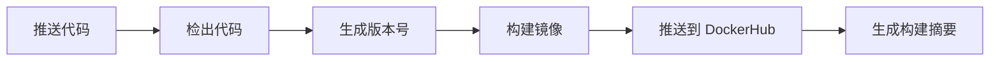

# Docker 自动化部署指南

本文档说明如何使用 GitHub Actions 自动构建和部署 Docker 镜像到 DockerHub。

## 📋 目录

- [前置要求](#前置要求)
- [配置说明](#配置说明)
- [工作流程](#工作流程)
- [使用方法](#使用方法)
- [版本管理](#版本管理)
- [常见问题](#常见问题)

## 前置要求

### 1. DockerHub 账号

确保你有一个 [DockerHub](https://hub.docker.com/) 账号。

### 2. 创建 DockerHub Access Token

1. 登录 DockerHub
2. 进入 [Account Settings > Security](https://hub.docker.com/settings/security)
3. 点击 "New Access Token"
4. 输入描述（如 "GitHub Actions"）
5. 复制生成的 Token（只显示一次）

### 3. 配置 GitHub Secrets

在 GitHub 仓库中配置以下 Secrets：

1. 进入仓库的 `Settings` > `Secrets and variables` > `Actions`
2. 点击 `New repository secret`
3. 添加以下两个 Secrets：

| Name | Value | 说明 |
|------|-------|------|
| `DOCKERHUB_USERNAME` | 你的 DockerHub 用户名 | 例如：`yourname` |
| `DOCKERHUB_TOKEN` | 上一步生成的 Token | 访问令牌 |

## 配置说明

### 文件结构

```
.
├── .github/
│   └── workflows/
│       ├── docker-release.yml      # 自动发布工作流
│       └── docker-pr-check.yml     # PR 检查工作流
├── Dockerfile                       # 开发环境 Dockerfile
├── Dockerfile.prod                  # 生产环境 Dockerfile（多阶段构建）
├── docker-compose.yml              # 开发环境 compose
├── docker-compose.prod.yml         # 生产环境 compose
├── docker-entrypoint.sh            # 开发环境启动脚本
└── docker-entrypoint-prod.sh       # 生产环境启动脚本
```

### 触发条件

自动构建在以下情况下触发：

1. **推送到 `release` 分支**
   ```bash
   git push origin release
   ```

2. **推送版本标签**
   ```bash
   git tag v1.0.0
   git push origin v1.0.0
   ```

3. **PR 到 `release` 分支**（仅构建测试，不推送）

## 工作流程

### 1. 自动版本号生成

版本号生成规则：

- **有 Git Tag**: 使用 Tag 名称（如 `v1.0.0`）
- **无 Git Tag**: 使用日期和短 SHA（如 `v2024.11.28-abc1234`）

### 2. 构建流程



### 3. 镜像标签

每次构建会生成多个标签：

- `latest`: 最新版本
- `v2024.11.28-abc1234`: 自动生成的版本号
- `abc1234`: 短 SHA
- `v1.0.0`: 如果是 Tag 触发

### 4. 平台支持

构建支持以下平台：

- `linux/amd64` (x86_64)

## 使用方法

### 开发环境

1. **构建和运行本地镜像**

```bash
# 使用开发环境 Dockerfile
docker-compose up -d

# 查看日志
docker-compose logs -f

# 停止
docker-compose down
```

### 生产环境

#### 方式 1: 使用 docker-compose（推荐）

1. **配置环境变量**

编辑 `docker-compose.prod.yml`，替换 DockerHub 用户名：

```yaml
image: your-dockerhub-username/react-nnnnzs-cn:latest
```

或使用环境变量：

```bash
export DOCKERHUB_USERNAME=your-dockerhub-username
```

2. **启动服务**

```bash
# 拉取最新镜像并启动
docker-compose -f docker-compose.prod.yml pull
docker-compose -f docker-compose.prod.yml up -d

# 查看日志
docker-compose -f docker-compose.prod.yml logs -f

# 停止服务
docker-compose -f docker-compose.prod.yml down
```

#### 方式 2: 直接使用 docker run

```bash
# 拉取最新镜像
docker pull your-dockerhub-username/react-nnnnzs-cn:latest

# 运行容器
docker run -d \
  --name react-nnnnzs-cn \
  --restart unless-stopped \
  -p 3301:3301 \
  --env-file .env \
  -v $(pwd)/logs:/app/logs \
  your-dockerhub-username/react-nnnnzs-cn:latest

# 查看日志
docker logs -f react-nnnnzs-cn

# 停止容器
docker stop react-nnnnzs-cn
docker rm react-nnnnzs-cn
```

#### 方式 3: 使用指定版本

```bash
# 拉取指定版本
docker pull your-dockerhub-username/react-nnnnzs-cn:v2024.11.28-abc1234

# 运行
docker run -d \
  --name react-nnnnzs-cn \
  -p 3301:3301 \
  --env-file .env \
  your-dockerhub-username/react-nnnnzs-cn:v2024.11.28-abc1234
```

### 更新镜像

```bash
# 拉取最新镜像
docker-compose -f docker-compose.prod.yml pull

# 重新创建容器
docker-compose -f docker-compose.prod.yml up -d

# 清理旧镜像
docker image prune -f
```

## 版本管理

### 创建版本发布

#### 方式 1: 使用语义化版本标签

```bash
# 创建版本标签
git tag -a v1.0.0 -m "Release version 1.0.0"

# 推送标签到远程
git push origin v1.0.0

# 推送到 release 分支
git push origin release
```

#### 方式 2: 自动版本号

```bash
# 直接推送到 release 分支
git push origin release

# 系统会自动生成版本号: v2024.11.28-abc1234
```

### 查看已发布的版本

1. **在 GitHub Actions 中查看**
   - 进入仓库的 `Actions` 标签
   - 查看 `Docker Release` 工作流
   - 每次运行的 Summary 中会显示版本信息

2. **在 DockerHub 中查看**
   - 访问 `https://hub.docker.com/r/your-username/react-nnnnzs-cn/tags`
   - 查看所有可用的镜像标签

3. **使用命令行查看**

```bash
# 查看本地 Git 标签
git tag -l

# 查看远程标签
git ls-remote --tags origin
```

## 常见问题

### 1. 构建失败

**问题**: GitHub Actions 构建失败

**解决方案**:
- 检查 GitHub Secrets 是否正确配置
- 检查 DockerHub Token 是否有效
- 查看 Actions 日志获取详细错误信息

### 2. 推送失败

**问题**: 镜像推送到 DockerHub 失败

**解决方案**:
- 确认 DockerHub 用户名正确
- 确认 Token 有推送权限
- 检查 DockerHub 仓库是否存在（首次会自动创建）

### 3. 健康检查失败

**问题**: 容器启动后健康检查失败

**解决方案**:
- 确保应用在 3301 端口正常运行
- 检查 `/api/health` 端点是否存在
- 查看容器日志: `docker logs react-nnnnzs-cn`

### 4. 环境变量问题

**问题**: 应用无法连接数据库或 Redis

**解决方案**:
- 确保 `.env` 文件存在且配置正确
- 使用 `host.docker.internal` 连接宿主机服务
- 检查网络配置

### 5. 版本号不符合预期

**问题**: 生成的版本号格式不对

**解决方案**:
- 使用标准的语义化版本标签: `v1.0.0`
- 确保 Git 历史完整: `git fetch --unshallow`

## 高级配置

### 自定义构建参数

编辑 `.github/workflows/docker-release.yml`:

```yaml
build-args: |
  VERSION=${{ steps.version.outputs.VERSION }}
  BUILD_DATE=${{ steps.version.outputs.BUILD_DATE }}
  COMMIT_SHA=${{ steps.version.outputs.SHORT_SHA }}
  # 添加自定义参数
  CUSTOM_ARG=value
```

### 添加多个镜像仓库

除了 DockerHub，还可以推送到其他仓库（如 GitHub Container Registry）：

```yaml
- name: 登录 GitHub Container Registry
  uses: docker/login-action@v3
  with:
    registry: ghcr.io
    username: ${{ github.actor }}
    password: ${{ secrets.GITHUB_TOKEN }}

- name: 构建并推送到多个仓库
  uses: docker/build-push-action@v5
  with:
    tags: |
      ${{ env.IMAGE_NAME }}:latest
      ghcr.io/${{ github.repository }}:latest
```

### 构建缓存优化

工作流已配置 Registry 缓存以加速构建：

```yaml
cache-from: type=registry,ref=${{ env.IMAGE_NAME }}:buildcache
cache-to: type=registry,ref=${{ env.IMAGE_NAME }}:buildcache,mode=max
```

## 监控和维护

### 查看镜像信息

```bash
# 查看镜像详细信息
docker inspect your-dockerhub-username/react-nnnnzs-cn:latest

# 查看镜像层
docker history your-dockerhub-username/react-nnnnzs-cn:latest

# 查看镜像大小
docker images your-dockerhub-username/react-nnnnzs-cn
```

### 清理旧版本

```bash
# 删除本地未使用的镜像
docker image prune -a

# 删除特定版本
docker rmi your-dockerhub-username/react-nnnnzs-cn:old-version
```

## 安全建议

1. **定期更新依赖**: 保持基础镜像和依赖包更新
2. **使用非 root 用户**: 生产 Dockerfile 已配置非 root 用户运行
3. **最小权限原则**: DockerHub Token 只授予必要的权限
4. **扫描漏洞**: 定期扫描镜像漏洞
5. **保护 Secrets**: 不要在代码中硬编码敏感信息

## 相关链接

- [DockerHub](https://hub.docker.com/)
- [GitHub Actions 文档](https://docs.github.com/en/actions)
- [Docker 最佳实践](https://docs.docker.com/develop/dev-best-practices/)
- [Next.js Docker 部署](https://nextjs.org/docs/deployment#docker-image)

## 支持

如有问题，请：
1. 查看 GitHub Actions 日志
2. 查看 Docker 容器日志
3. 提交 Issue 到项目仓库
