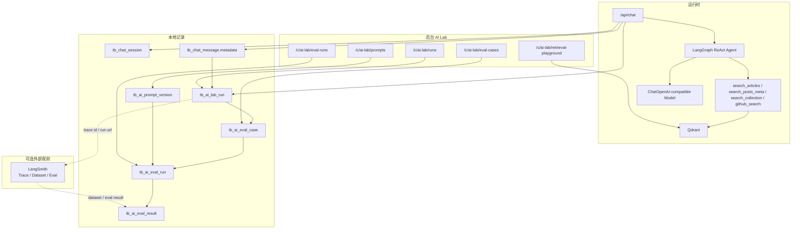
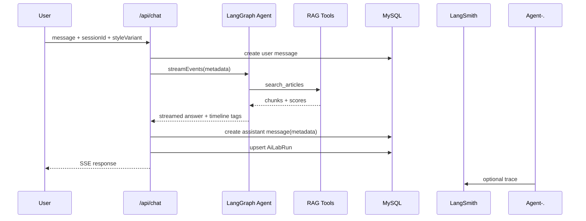
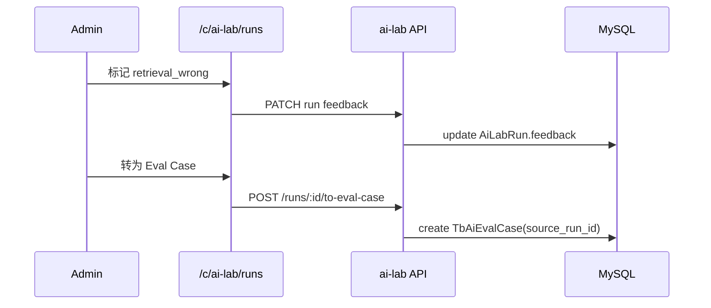
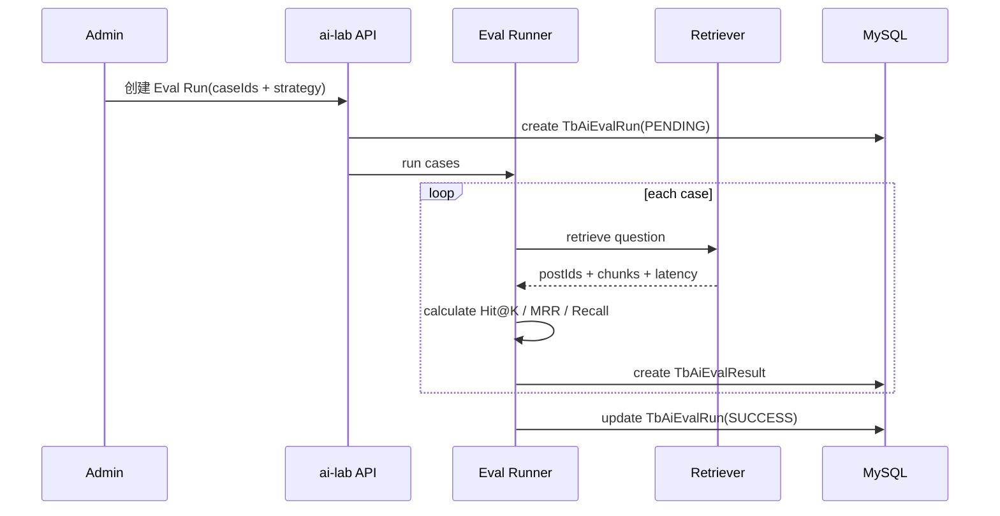

# AI Lab / LLM 学习实验台设计

> **状态**：🚧 执行中
> **创建日期**：2026-07-04
> **最后更新**：2026-07-04
> **相关计划**：[AI Lab / LLM 学习实验台建设计划](../../plans/ai-lab-llm-learning.md)
> **相关文档**：[Agent 聊天系统](chat/rag-chat.md) | [向量化总览](vector/overview.md) | [语义搜索](search/semantic-search.md) | [AI Provider 配置管理](ai-config-profiles.md)

## 概述

AI Lab 是后台中的 LLM 学习实验台，目标是把现有博客 AI 能力从“能问答”升级为“能观测、能评测、能复盘、能迭代”。

现有 `/chat` 已经具备 LangGraph ReAct Agent、RAG 工具、Qdrant 向量检索、聊天记录持久化和工具耗时追踪。AI Lab 不替代这些能力，而是在其上建立实验与评测层：

- Run 观测：记录每次 Agent / LLM / 检索运行的模型、prompt、工具、耗时、错误和反馈。
- RAG 评测：维护 Golden Dataset，自动计算 Hit@K、MRR、Recall、延迟等基础指标。
- 检索实验：对比不同检索策略、topK、过滤条件、聚合方式和后续 rerank 策略。
- Prompt 实验：管理 prompt 版本，支持 diff、replay 和回滚证据。
- LangSmith 集成：作为可选外部 trace / dataset / eval 平台，本地数据库仍是业务视角的主记录。

## 设计原则

1. **本地记录优先**：国内网络环境下不能把核心观测能力强依赖外部平台。LangSmith 是增强，不是单点依赖。
2. **复用现有链路**：优先复用 `/api/chat`、`tb_chat_message.metadata`、`search_articles`、`/c/chat-logs`、`/c/vector-search` 和 AI Provider 场景绑定。
3. **先指标再优化**：先把 Hit@K、MRR、Recall、latency 量化，再做 hybrid search、rerank、query rewrite。
4. **实验配置快照化**：每次 eval run 都保存模型、promptVersion、retrieverVersion、topK、策略等配置，避免事后无法复现。
5. **业务和 trace 分层**：后台看业务摘要和实验结果，LangSmith 看底层执行树。
6. **避免隐式生产变更**：实验页面不自动修改 `/c/config` 的 active binding，也不自动把 prompt 推到线上。

## 架构



## 现有能力映射

| 能力 | 当前位置 | AI Lab 用法 |
|------|----------|-------------|
| 聊天运行入口 | `src/app/api/chat/route.ts` | 生成 Run 记录，写入模型、prompt、工具、耗时 |
| Agent 编排 | `src/services/ai/chat-agent/langgraph-agent.ts` | 注入 LangSmith metadata，捕获事件流 |
| 工具耗时 | `tb_chat_message.metadata.reactTimeline` | Run 详情和慢工具排行 |
| RAG 检索 | `src/services/ai/tools/search-articles.ts` | Eval 和 Retrieval Playground 的核心策略 |
| Qdrant 查询 | `src/services/embedding/vector-store.ts` | 检索实验台返回 chunk/score |
| Embedding 配置 | `getAIConfig('embedding')` | 记录 embeddingModel 和 retrieverVersion |
| Chat 配置 | `getAIConfig('chat')` | 记录 model、baseUrl、provider / binding、scenario |
| 聊天日志后台 | `/c/chat-logs` | 失败样本入口，可转 Eval Case |
| 向量运维后台 | `/c/vector-search` | 与检索实验台互补 |

## 后台信息架构

AI Lab 不作为文章后台里的一个普通工具页，而是后台里的独立实验空间。主后台保留站点内容、配置管理、权限治理和 3D / Three.js 资产检查入口，AI 运行、检索、生成和评测相关能力进入 `/c/ai-lab`；AI Provider 配置统一在 `/c/config`。

### 主后台 `/c`

主侧栏保留：

- 文章管理
- 评论管理
- 合集管理
- 队列监控
- AI Lab
- 单项配置
- 模型检查台
- 用户管理
- 角色管理
- 接口管理
- 权限管理

### AI Lab `/c/ai-lab`

二级导航承接：

| 入口 | 路由 | 当前实现 |
|------|------|----------|
| 总览 | `/c/ai-lab` | AI Lab 板块入口、迁移边界和阶段状态 |
| Runs | `/c/ai-lab/runs` | 使用 `TbAiLabRun`、`/api/admin/ai-lab/runs` 和聊天异步写入链路 |
| 检索实验台 | `/c/ai-lab/retrieval-playground` | 过渡复用 `/c/vector-search` |
| AI 配置管理 | `/c/config` | 统一承载 AI Provider、场景绑定与单项配置 |
| 图片生成 | `/c/ai-lab/image-gen` | 过渡复用 `/c/image-gen` |
| 语音合成 | `/c/ai-lab/tts` | 过渡复用 `/c/tts` |
| Eval Cases | `/c/ai-lab/eval-cases` | 规划占位，后续接入 Golden Dataset |
| Eval Runs | `/c/ai-lab/eval-runs` | 规划占位，后续接入评测运行 |
| Prompts | `/c/ai-lab/prompts` | 系统级 Prompt / Skill 模板、版本、diff 和 `@` 引用管理 |

过渡路由保留旧页面能力，避免一次性搬动业务逻辑。Runs 已进入结构化 Run 表和接口，Prompts 已进入系统级模板表和 AI Lab 管理页；后续继续把 Eval 和检索实验改造成真正的实验台视图。

## 数据模型

命名遵循现有 Prisma `Tb*` 模型风格，物理表使用 `tb_` 前缀。字段名称可在实施时根据 MySQL 类型和 Prisma 生成结果微调。

### `TbAiLabRun`

Run 是 AI Lab 的核心索引表，用于把一次聊天、评测或检索实验结构化。聊天原文仍在 `tb_chat_message`，Run 表保存可分析字段和运行快照。

```prisma
model TbAiLabRun {
  id                  Int       @id @default(autoincrement())
  source              String    @db.VarChar(50)   // chat / eval / retrieval_playground / prompt_replay
  session_id           Int?
  message_id           Int?
  user_id              Int?
  device_id            String?   @db.VarChar(36)
  question             String    @db.Text
  answer               String?   @db.Text
  scenario             String?   @db.VarChar(50)  // chat / ai_text / custom scenario
  style_variant         String?   @db.VarChar(20)  // day / night
  model                String?   @db.VarChar(100)
  embedding_model       String?   @db.VarChar(100)
  prompt_version        String?   @db.VarChar(120)
  retriever_version     String?   @db.VarChar(120)
  commit_sha           String?   @db.VarChar(80)
  latency_ms           Int?
  input_tokens         Int?
  output_tokens        Int?
  cost                 Decimal?  @db.Decimal(12, 6)
  tool_calls           Json?
  retrieval_results     Json?
  langsmith_trace_id    String?   @db.VarChar(120)
  langsmith_run_url     String?   @db.Text
  feedback             String?   @db.VarChar(50)  // good / bad / retrieval_wrong / hallucination / too_slow
  feedback_note         String?   @db.Text
  error                String?   @db.Text
  created_at           DateTime  @default(now())
  updated_at           DateTime? @updatedAt

  @@index([source, created_at], name: "idx_ai_run_source_time")
  @@index([session_id, message_id], name: "idx_ai_run_chat_message")
  @@index([model], name: "idx_ai_run_model")
  @@index([prompt_version], name: "idx_ai_run_prompt")
  @@map("tb_ai_lab_run")
}
```

`tool_calls` 建议结构：

```json
[
  {
    "name": "search_articles",
    "startedAt": "2026-07-04T10:00:00.000Z",
    "endedAt": "2026-07-04T10:00:00.320Z",
    "durationMs": 320,
    "inputSummary": "搜索文章：new-api Ollama 嵌入模型",
    "outputSummary": "找到 5 篇相关文章",
    "success": true
  }
]
```

`retrieval_results` 建议结构：

```json
[
  {
    "postId": 123,
    "title": "new-api 与本地嵌入模型排障",
    "chunkIndex": 4,
    "score": 0.7821,
    "chunkTextPreview": "这里保存截断摘要，完整内容按需读取",
    "strategy": "dense"
  }
]
```

### `TbAiEvalCase`

Golden Dataset 的单条用例。

```prisma
model TbAiEvalCase {
  id                      Int       @id @default(autoincrement())
  question                String    @db.Text
  expected_post_ids        Json?
  expected_chunk_keywords  Json?
  expected_answer          String?   @db.Text
  tags                    Json?
  difficulty              String?   @db.VarChar(20)  // easy / medium / hard
  source                  String    @default("manual") @db.VarChar(50)
  source_run_id            Int?
  status                  String    @default("active") @db.VarChar(20)
  note                    String?   @db.Text
  created_by              Int?
  created_at              DateTime  @default(now())
  updated_at              DateTime? @updatedAt

  @@index([source], name: "idx_ai_eval_case_source")
  @@index([status], name: "idx_ai_eval_case_status")
  @@map("tb_ai_eval_case")
}
```

### `TbAiEvalRun`

一次批量评测运行的配置快照。

```prisma
model TbAiEvalRun {
  id                  Int       @id @default(autoincrement())
  run_name             String    @db.VarChar(200)
  commit_sha           String?   @db.VarChar(80)
  model                String?   @db.VarChar(100)
  embedding_model       String?   @db.VarChar(100)
  prompt_version        String?   @db.VarChar(120)
  retriever_version     String?   @db.VarChar(120)
  top_k                Int       @default(5)
  strategy             String    @default("dense") @db.VarChar(50)
  use_rerank            Boolean   @default(false)
  use_hybrid_search      Boolean   @default(false)
  case_count            Int       @default(0)
  status               String    @default("PENDING") @db.VarChar(20)
  started_at            DateTime?
  finished_at           DateTime?
  created_at            DateTime  @default(now())
  updated_at            DateTime? @updatedAt

  @@index([created_at], name: "idx_ai_eval_run_created")
  @@index([status], name: "idx_ai_eval_run_status")
  @@map("tb_ai_eval_run")
}
```

### `TbAiEvalResult`

单条 case 在某次 eval run 下的结果。

```prisma
model TbAiEvalResult {
  id                  Int       @id @default(autoincrement())
  run_id               Int
  case_id              Int
  ai_run_id            Int?
  hit_at_1             Boolean   @default(false)
  hit_at_3             Boolean   @default(false)
  hit_at_5             Boolean   @default(false)
  recall_at_k          Decimal?  @db.Decimal(8, 4)
  mrr                 Decimal?  @db.Decimal(8, 4)
  latency_ms           Int?
  retrieved_post_ids    Json?
  retrieved_chunks      Json?
  answer               String?   @db.Text
  error                String?   @db.Text
  created_at           DateTime  @default(now())

  @@index([run_id], name: "idx_ai_eval_result_run")
  @@index([case_id], name: "idx_ai_eval_result_case")
  @@map("tb_ai_eval_result")
}
```

### `TbAiTemplate` / `TbAiTemplateVersion`

系统级 Prompt / Skill 模板库。模板主表保存稳定 `slug`、类型、作用域、别名、当前激活版本和 metadata；版本表保存 Markdown 正文、checksum、变更说明和版本 metadata。

模板正文统一使用 LangChain `mustache` 语法，也就是 `{{变量}}`。运行时渲染必须通过 `PromptTemplate.fromTemplate(content, { templateFormat: "mustache" })` 或 LangChain `renderTemplate(..., "mustache", values)`，不要自定义字符串替换。

`@slug` / `@中文别名` 是 prompt 编译前的引用语法。编译阶段只解析引用并注入模板 metadata；真正需要完整风格指南或方法论时，由模型调用 `load_prompt_skill_template` 工具按 slug 加载正文。

```prisma
model TbAiTemplate {
  id              Int      @id @default(autoincrement())
  slug            String   @unique @db.VarChar(120)
  key             String?  @unique @db.VarChar(120)
  name            String   @db.VarChar(200)
  type            String   @default("prompt") @db.VarChar(40)
  scope           String   @default("system") @db.VarChar(40)
  aliases         Json?
  metadata_json   Json?
  current_version Int      @default(1)
  status          String   @default("ACTIVE") @db.VarChar(30)

  versions TbAiTemplateVersion[]
  @@map("tb_ai_template")
}

model TbAiTemplateVersion {
  id            Int      @id @default(autoincrement())
  template_id   Int
  version       Int
  content       String   @db.LongText
  checksum      String?  @db.VarChar(80)
  metadata_json Json?
  change_note   String?  @db.Text

  template TbAiTemplate @relation(fields: [template_id], references: [id], onDelete: Cascade)
  @@unique([template_id, version], name: "uniq_ai_template_version")
  @@map("tb_ai_template_version")
}
```

## 指标设计

第一阶段优先使用可确定、低成本的指标。

| 指标 | 说明 | 计算方式 |
|------|------|----------|
| Hit@1 | 第一条是否命中期望文章 | top1 `postId` 是否在 `expectedPostIds` |
| Hit@3 | 前 3 条是否命中期望文章 | top3 任一 `postId` 是否命中 |
| Hit@5 | 前 5 条是否命中期望文章 | top5 任一 `postId` 是否命中 |
| Recall@K | 期望文章被召回比例 | 命中的期望文章数 / 期望文章总数 |
| MRR | 第一个正确命中的倒数排名 | `1 / rank` |
| Latency | 检索或回答耗时 | `finishedAt - startedAt` |
| Tool Error Rate | 工具失败率 | 失败工具调用数 / 总工具调用数 |

第二阶段再引入需要 LLM-as-judge 的指标：

- Faithfulness
- Answer Relevance
- Context Precision
- Context Recall
- Citation Coverage

LLM 评委类指标必须显示模型和 prompt 版本，不能和可确定指标混成一个不透明总分。

## 检索策略版本

`retrieverVersion` 建议使用可读字符串，便于 Run 和 Eval 对比。

示例：

- `dense-bge-large-zh-v1.5-top5`
- `dense-bge-large-zh-v1.5-top10-article-aggregate`
- `metadata-latest-top10`
- `hybrid-dense-keyword-rrf-top10`
- `dense-rerank-top20-to5`

第一阶段只需要实现：

1. `dense`
2. `metadata`
3. `dense + article aggregation`

Hybrid、sparse、rerank 和 query rewrite 作为后续策略扩展。

## 页面设计

后台页面沿用管理后台固定高度和内层滚动规范。`/c/ai-lab` 使用独立二级导航，不继续把 AI 子功能堆到主后台侧栏。

### `/c/ai-lab`

AI Lab 总览页。

展示：

- 已接入入口数量
- 规划模块数量
- 主后台与 AI Lab 拆分边界
- 最近 24 小时 Run 数量
- 平均延迟和 P95 延迟
- 工具调用次数排行
- 检索为空的问题
- 失败或点踩样本
- 最近 Eval Run 分数趋势

### `/c/ai-lab/runs`

Run 列表和详情页。

筛选：

- 时间范围
- 来源：chat / eval / retrieval playground
- 模型
- promptVersion
- retrieverVersion
- feedback
- 是否有错误
- 是否调用检索工具

详情：

- 用户问题和最终回答
- ReAct timeline
- 工具调用耗时
- 检索 chunk 摘要
- LangSmith 链接
- 一键转 Eval Case

### `/c/ai-lab/retrieval-playground`

检索实验台。

输入：

- query
- topK
- strategy
- filter
- 是否按文章聚合

输出：

- 不同策略的结果表
- `postId`、标题、chunkIndex、score、耗时
- 命中文章高亮
- 可保存为 Eval Case

### `/c/ai-lab/eval-cases`

Golden Dataset 管理。

字段：

- question
- expectedPostIds
- expectedChunkKeywords
- expectedAnswer
- tags
- difficulty
- source
- note

动作：

- 新增/编辑/停用
- 从 Run 导入
- 批量打标签
- 选择用例发起 Eval Run

### `/c/ai-lab/eval-runs`

评测运行记录。

展示：

- runName
- model
- promptVersion
- retrieverVersion
- strategy
- caseCount
- Hit@K / Recall / MRR / latency
- 与上一版本对比

### `/c/ai-lab/prompts`

系统级 Prompt / Skill 模板管理。

第一阶段能力：

- AntD `Mentions` Markdown 编辑器，输入 `@` 从模板列表选择引用。
- LangChain mustache 变量：`{{draftTitle}}`、`{{topic}}` 等。
- 模板 metadata 列表、版本列表、diff、active / archived 状态。
- `list_prompt_skills` 只返回 metadata，`load_prompt_skill_template` 按 slug 加载完整正文。

后续能力：

- 选择版本进行 Eval Replay
- day/night 风格版本分支
- prompt rollback
- prompt 与 LangSmith prompt 对齐

## API 设计

所有后台 API 都应做权限校验，并返回 `Cache-Control: no-store`。

| API | 方法 | 说明 |
|-----|------|------|
| `/api/admin/ai-lab/runs` | GET | Run 列表 |
| `/api/admin/ai-lab/runs/[id]` | GET/PATCH | Run 详情、反馈更新 |
| `/api/admin/ai-lab/runs/[id]/to-eval-case` | POST | 从 Run 创建 Eval Case |
| `/api/admin/ai-lab/retrieval-playground` | POST | 执行检索实验 |
| `/api/admin/ai-lab/eval-cases` | GET/POST | 用例列表和创建 |
| `/api/admin/ai-lab/eval-cases/[id]` | GET/PATCH/DELETE | 用例详情、更新、停用 |
| `/api/admin/ai-lab/eval-runs` | GET/POST | 评测运行列表、创建运行 |
| `/api/admin/ai-lab/eval-runs/[id]` | GET | 评测运行详情 |
| `/api/admin/ai-lab/prompts` | GET/POST | 模板列表、创建模板 |
| `/api/admin/ai-lab/prompts/[slug]` | GET/PATCH | 模板详情、metadata 更新、启用版本 |
| `/api/admin/ai-lab/prompts/[slug]/versions` | POST | 创建模板版本 |
| `/api/admin/ai-lab/prompts/[slug]/diff` | GET | 模板版本 diff |
| `/api/admin/ai-lab/prompts/render` | POST | LangChain mustache 渲染预览 |

## LangSmith 集成

LangSmith 的价值在于补充底层执行树、dataset、offline eval 和线上反馈闭环。本地数据库负责业务侧索引和后台展示。

推荐环境变量：

```env
LANGSMITH_TRACING=true
LANGSMITH_API_KEY=xxx
LANGSMITH_PROJECT=react-nnnnzs-cn-dev
```

Agent run metadata：

```json
{
  "sessionId": 123,
  "messageId": 456,
  "source": "chat",
  "userType": "guest",
  "styleVariant": "night",
  "promptVersion": "chat-agent-system-prompt@2026-07-04",
  "retrieverVersion": "dense-bge-large-zh-v1.5-top5",
  "embeddingModel": "BAAI/bge-large-zh-v1.5",
  "llmModel": "deepseek-chat",
  "commitSha": "unknown",
  "route": "/api/chat"
}
```

接入边界：

- LangSmith 不可用时，聊天和本地 Run 落库不能失败。
- `langsmithTraceId` 和 `langsmithRunUrl` 只作为外链和交叉索引。
- Dataset 同步先做人工动作，避免自动上传敏感或无价值样本。

## 运行流程

### 聊天 Run 写入



### 失败样本转 Eval Case



### Eval Run



## 权限设计

建议新增权限码：

| 权限码 | 动作 |
|--------|------|
| `ai_lab:view` | 查看 AI Lab、Run、Eval 结果 |
| `ai_lab:manage` | 管理 Eval Case、Prompt 版本、反馈 |
| `ai_lab:run` | 执行 Retrieval Playground 和 Eval Run |

权限实现沿用现有 RBAC 和 API permissionCode 机制。

## 安全与成本控制

- 检索实验默认只检索公开文章，继续沿用 `hide='0'` 过滤。
- Run 记录只保存 chunk 摘要或截断内容，避免数据库长期保存过多上下文。
- Eval Run 必须手动触发，默认限制 case 数量。
- LLM-as-judge 指标单独开关，默认不启用。
- Prompt Replay 不自动修改 active prompt 或 active binding。
- LangSmith 上传必须是显式动作，避免误传敏感对话。

## 后续扩展

### Hybrid Search

在 dense 检索基础上增加 keyword / sparse 检索，并使用 RRF 或 Weighted RRF 融合。只有当 Eval Case 指标能证明有效时再上线为默认策略。

### Rerank

先 dense top20，再 rerank 到 top5。重点观察延迟和 Recall/Precision 的权衡。

### 多模态知识库

从博客图片开始：

1. 上传图片时生成 caption。
2. OCR 提取截图文字。
3. caption + OCR 入向量库。
4. RAG 结果返回相关文章和相关图片。

### Agent 工具扩展

围绕博客业务新增工具：

- `recommend_related_posts`
- `draft_post_outline`
- `link_related_posts`
- `analyze_post_gaps`
- `search_codebase`
- `evaluate_answer`

所有新工具都必须进入 Run 观测和 Eval 体系。

### LangGraph 升级实验

当前运行时使用 `createReactAgent`。是否迁移到新的 Agent API 需要以官方文档、本仓库依赖版本和本地验证为准。该实验应通过 AI Lab 对比工具调用稳定性、streaming 事件、LangSmith trace 清晰度和中间件扩展能力。

## 验收标准

第一阶段完成标准：

- 主后台菜单收敛，AI 相关入口进入 `/c/ai-lab` 二级导航。
- `/c/ai-lab` 总览页能展示已迁移入口和规划模块。
- `/api/chat` 能在 assistant 消息落库后写入 `TbAiLabRun`。
- `/api/admin/ai-lab/runs` 能返回 Run 列表、统计摘要和单条详情。
- `/c/ai-lab/runs` 能展示真实聊天 Run、工具耗时和 ReAct timeline。
- 能从失败 Run 创建 Eval Case。
- 能维护至少 30 条 Golden Case。
- 能运行基础检索评测并展示 Hit@K、Recall@K、MRR、latency。
- 能在 Retrieval Playground 中对比至少 dense 和 metadata 两类结果。
- Prompt 版本能登记、查看和参与 eval run 配置。
- LangSmith 字段预留完成，不接入时本地功能不受影响。

## 维护约定

- 新增 AI 运行链路时，必须考虑是否写入 `TbAiLabRun`。
- 修改 RAG 检索策略时，必须更新 `retrieverVersion` 命名。
- 修改系统提示词时，必须创建 Prompt 版本快照或更新版本说明。
- 新增 Agent 工具时，必须确保工具调用能进入 timeline 和 Run 统计。
- 完成计划实施后，清理 `docs/plans/ai-lab-llm-learning.md`，保留本文档作为长期设计依据。
