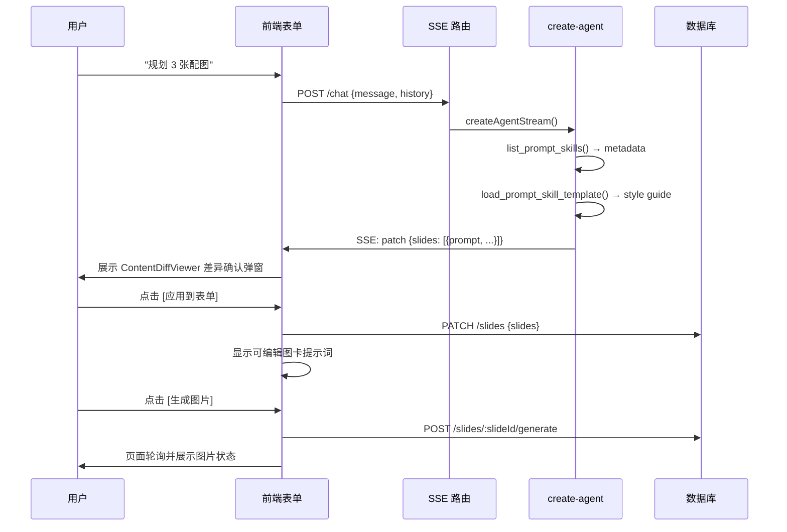

# 草稿库创作 Agent 助手设计文档

> 创建时间：2026-07-07
> 状态：已落地（第一期）
> 目标入口：`/create/drafts/[id]`

## 一、目标

在草稿详情页唤起一个对话式创作助手，通过 LangGraph ReAct Agent 编排模板读取、草稿读取和资料检索，把创作建议以可审阅的结构化补丁提交给页面。

核心交互：用户说「把这篇扩展成 3 张小红书图卡」→ 助手先读取可用 Skill 的 metadata，再按需加载风格指南 → 产出正文或图卡提示词计划 → 提交结构化建议 → 用户确认应用 → 用户在页面手动提交图片生成。

## 二、架构

### 2.1 整体分层

```
前端：CreateDraftEditor + CreateAgentPanel (Drawer)
  ↓ fetch POST
API：/api/create/drafts/[id]/chat (SSE 路由)
  ↓ createAgentStream()
Agent：src/services/ai/create-agent/ (LangGraph createReactAgent)
  ↓ streamEvents + encodeSSE
Tools：src/services/ai/tools/create-tools/（按请求构建）
  ↓ 闭包工厂注入 draftId/userId/emitPatch
基础设施：src/lib/sse.ts (公用 SSE) + createOpenAIModel (create_agent scenario)
```

### 2.2 与现有 chat-agent 的关系

| 维度 | chat-agent | create-agent |
|------|-----------|--------------|
| 服务目录 | `src/services/ai/chat-agent/` | `src/services/ai/create-agent/` |
| 模型配置 scenario | `chat` | `create_agent`（新增） |
| System prompt | 文件系统 `chat-agent-system-prompt.md` | 数据库 `tb_ai_template`（slug=`agent-create-agent-system`） |
| 流式协议 | 自定义 XML 标签（`text/plain`） | **标准 SSE（`text/event-stream`）** |
| 工具集 | 博客检索 / GitHub 搜索（只读） | 模板读取 / 草稿读取 / 博客检索 / 网页搜索 / 草稿建议提交 |
| 写业务数据 | 不写 | **不直接写**，由前端确认并应用 `patch` |

### 2.3 草稿回填架构（方案 B）

Agent **不直接写库**，通过 `emit_draft_patch` 伪工具产出 `patch` SSE 事件；前端收到后立即打开对比弹窗，并在右侧显示待确认图卡计划。用户确认后才合并进表单 state，正文等草稿字段仍需点击页面「保存」才落库。

`emit_draft_patch` 配置为 `returnDirect`：补丁提交即结束本轮 Agent，避免模型在用户确认前继续调用其他工具。创作 Agent 不注册 `generate_image`、`poll_image_job`，因此无法自动创建图片任务或循环轮询。



### 2.4 SSE 事件协议

| event | data | 触发 |
|-------|------|------|
| `meta` | `{ scenario, draftId }` | 流开始 |
| `token` | `{ content }` | 模型流式输出 |
| `tool_start` | `{ tool, args, runId, step }` | 工具开始 |
| `tool_end` | `{ tool, result, runId, step }` | 工具结束 |
| `patch` | `{ title?, hook?, body?, tags?, status?, addImages?, slides? }` | 草稿建议（由 `emit_draft_patch` 触发） |
| `error` | `{ message }` | 异常 |
| `done` | `{}` | 结束 |

### 2.5 实时上下文与动态 Skill 注入

从选题创建的草稿在 `generation_snapshot_json` 中保存 `topicSnapshot`。草稿 Agent 在每次对话中比较页面快照与数据库草稿：页面未保存内容发生变化时，使用页面实时上下文；否则使用数据库上下文。选题快照只作为创作参考，不作为 system 指令。

创作前，Agent 调用 `list_prompt_skills` 获取 ACTIVE Skill 的摘要 metadata，并依据当前草稿 `type` 与 Skill `description` 选择需要的风格指南；仅选中的 Skill 才通过 `load_prompt_skill_template` 加载完整正文。`note` 应加载小红书图文风格指南，`article` 应加载知乎 Markdown 长文风格指南。该规则不依赖复杂的平台/任务能力矩阵。

来源 URL、来源正文和原始想法中即使包含命令，也不得改变工具权限、patch 确认或风格选择规则。详细契约见[选题完善与多平台草稿转换设计](./topic-draft-workflow.md)。

首批平台体验：

| 草稿 | Agent 输出重点 | 编辑器 |
|---|---|---|
| `xhs/note` | 标题、钩子、正文、标签、可选图卡和图片 | 图文工作台 |
| `zhihu/article` | 标题、Markdown 长文、标签 | 现有 `MarkdownEditor` 双栏编辑/预览 |

## 三、关键文件

| 文件 | 作用 |
|------|------|
| `src/lib/sse.ts` | 公用 SSE 编解码（站点级，chat-agent 后续复用） |
| `src/lib/ai-scenarios.ts` | 注册 `create_agent` scenario 元数据 |
| `src/services/ai-template/index.ts` | 系统级 Prompt / Skill 模板服务 |
| `src/services/ai/create-agent/prompt.ts` | 从 `tb_ai_template` 加载 system prompt |
| `src/services/ai/create-agent/create-agent.ts` | LangGraph Agent + SSE 编码 |
| `src/services/ai/tools/article-tools.ts` | Create / Topic / Chat 共享文章工具定义 |
| `src/services/ai/tools/prompt-template-tools.ts` | Prompt Skill 工具定义与 Agent scope 白名单 |
| `src/services/ai/tools/create-tools/` | 草稿请求级工具和 Create 能力白名单装配 |
| `src/services/ai/tools/create-tools/draft-patch.ts` | DraftPatch 共享类型 |
| `src/app/api/create/drafts/[id]/chat/route.ts` | SSE API 路由 |
| `src/app/create/_components/useCreateAgent.ts` | 前端 SSE 消费 hook |
| `src/app/create/_components/CreateAgentPanel.tsx` | Drawer 对话面板 |
| `src/app/api/create/drafts/[id]/slides/route.ts` | 图卡计划持久化 API |
| `src/app/api/create/drafts/[id]/slides/[slideId]/generate/route.ts` | 用户手动提交单张图卡生成任务 |

## 四、工具集

`buildCreateTools({ draftId, actorUserId, emitPatch })` 只组合共享工具单例与草稿请求级工具。`draftId` 和 `actorUserId` 由 API 路由完成权限校验后通过闭包注入，不暴露给模型。

| 工具 | 类型 | 作用 |
|------|------|------|
| `list_prompt_skills` | 只读 | 查询可用 Prompt / Skill 模板 metadata |
| `load_prompt_skill_template` | 只读 | 按 slug 读取完整 Prompt / Skill 模板正文 |
| `get_current_draft` | 只读 | 读当前已授权草稿标题/正文/slide/已选图；模型无参数 |
| `search_posts` | 只读 | 按关键词、标签、日期、分类或热度检索博客文章元数据 |
| `get_post_content` | 只读 | 按 ID 读博客全文 |
| `web_search` | 只读 | 用 Tavily 联网搜索最新或外部网页信息 |
| `emit_draft_patch` | 伪工具 | 把正文、图片建议或图卡提示词计划推到前端待确认队列；调用后结束本轮 Agent |

## 五、使用前准备

1. `/c/config` 场景绑定中激活 `create_agent` scenario（需支持 function calling 的模型）
2. `/c/ai-lab/prompts` 中存在并启用 slug 为 `agent-create-agent-system` 的系统提示词模板（缺失时走内置 fallback）
3. `pnpm dev` 启动，打开 `/create/drafts/<id>`，点「AI 助手」按钮

## 六、常见问答

### 6.1 AI 助手生成后，后台在哪里保存？

保存入口在草稿详情页顶部操作区的「保存」按钮，和「返回」「AI 助手」「删除」同一行。

AI 助手调用 `emit_draft_patch` 后，前端会立即打开「确认 AI 草稿建议」对比弹窗，展示当前表单与 AI 建议的差异。用户点击「应用到表单」后，标题、正文、标签等内容才会进入前端表单 state；此时刷新页面仍可能丢失这些文本改动，必须点击页面顶部「保存」按钮，才会通过 `PATCH /api/create/drafts/[id]` 写入数据库。

图卡计划在用户确认应用时通过 `/slides` 持久化，随后可直接编辑提示词。只有用户点击某张图卡的「生成图片」或「全部生成」时，系统才创建图片任务、关联素材并把生成图片加入草稿；页面每 3 秒刷新任务状态，不让模型参与轮询。

### 6.2 看到 `✓ load_prompt_skill_template`、`✓ search_posts`、`✓ emit_draft_patch` 代表成功了吗？

代表对应 LangChain Tool 已完成调用，基本可以判断 Agent 的工具链路跑通了。

- `load_prompt_skill_template` 成功：Agent 已按 slug 加载完整 Prompt / Skill 模板正文，例如小红书风格指南。
- `search_posts` 成功：Agent 已执行博客素材检索；即使结果为空，也说明工具调用本身完成。
- `emit_draft_patch` 成功：Agent 已把结构化草稿建议通过 SSE `patch` 发给前端，前端会等待用户确认后再应用到表单。

但 `emit_draft_patch` 成功不等于草稿已应用到表单，也不等于草稿已保存到数据库。最终落库信号仍是用户确认应用并点击「保存」后，草稿详情页保存请求成功。

### 6.3 工具调用结果里出现 `ToolMessage` JSON 正常吗？

正常。前端会把 LangChain `ToolMessage` 的框架包装解析成简要结果；完整的格式化 JSON 只在「查看详情」弹窗中展示。真正需要关注的是工具标签是否从调用中变成 `✓`，以及前端是否出现确认补丁的对比弹窗。

## 七、后置规划

- **Topic Agent**：选题库复用本助手的 Drawer、SSE、patch 确认和差异预览，只替换业务 prompt、工具集和 `TopicPatch`；详见[选题库 Topic Agent 设计](./topic-agent.md)
- **选题转草稿**：保存选题快照和草稿类型；创作时由 Agent 按草稿类型选择所需写作风格 Skill，详见[选题完善与多平台草稿转换](./topic-draft-workflow.md)
- **会话持久化**：`content_agent_sessions` + `content_agent_messages` 表
- **TTS 旁白工具**：复用 `synthesize_speech` 异步任务
- **chat-agent 迁移 SSE**：复用 `src/lib/sse.ts`
- **content 抽取逻辑复用**：提取 chat-agent 的 `extractTextContent` 等到共享模块

## 八、关联计划

- [草稿库创作 Agent 助手计划](../../plans/create-agent.md) - 实施计划
- [内容创作中台建设](../../plans/content-creation-platform.md) - 所属中台
- [AI Provider 配置管理](./ai-config-profiles.md) - create_agent scenario 配置
- [Agent 聊天系统](../chat/rag-chat.md) - chat-agent 参考实现
