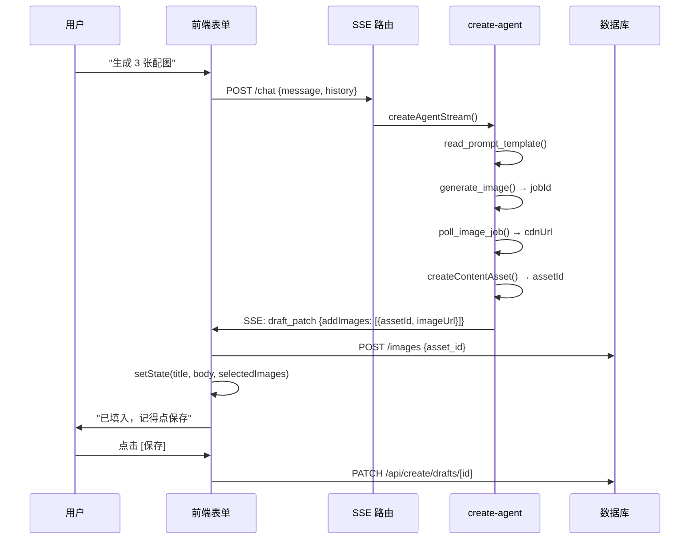

# 草稿库创作 Agent 助手设计文档

> 创建时间：2026-07-07
> 状态：已落地（第一期）
> 目标入口：`/create/drafts/[id]`

## 一、目标

在草稿详情页唤起一个对话式创作助手，通过 LangGraph ReAct Agent 编排模板读取、草稿读写、文生图等工具，把分散的 `content_*` API 和图片生成能力串成可对话、可调用工具、可产出结构化建议的助手。

核心交互：用户说「把这篇扩展成 3 张小红书图卡」→ 助手自动读模板提示词 → 产出文案 → 调文生图 → 把生成的图建议回填到草稿表单。

## 二、架构

### 2.1 整体分层

```
前端：CreateDraftEditor + CreateAgentPanel (Drawer)
  ↓ fetch POST
API：/api/create/drafts/[id]/chat (SSE 路由)
  ↓ createAgentStream()
Agent：src/services/ai/create-agent/ (LangGraph createReactAgent)
  ↓ streamEvents + encodeSSE
Tools：src/services/ai/tools/create-tools/ (7 个工具)
  ↓ 闭包工厂注入 draftId/userId/emitPatch
基础设施：src/lib/sse.ts (公用 SSE) + createOpenAIModel (create_agent scenario)
```

### 2.2 与现有 chat-agent 的关系

| 维度 | chat-agent | create-agent |
|------|-----------|--------------|
| 服务目录 | `src/services/ai/chat-agent/` | `src/services/ai/create-agent/` |
| 模型配置 scenario | `chat` | `create_agent`（新增） |
| System prompt | 文件系统 `chat-agent-system-prompt.md` | 数据库 `content_templates` 表（`scenario=content_agent`） |
| 流式协议 | 自定义 XML 标签（`text/plain`） | **标准 SSE（`text/event-stream`）** |
| 工具集 | 博客检索 / GitHub 搜索（只读） | 模板读取 / 草稿读取 / 文生图+轮询 / 博客检索 |
| 写业务数据 | 不写 | **不直接写**，由前端应用 `draft_patch` |

### 2.3 草稿回填架构（方案 B）

Agent **不直接写库**，通过 `emit_draft_patch` 伪工具产出 `draft_patch` SSE 事件；前端收到后合并进表单 state，**用户点保存才落库**。



### 2.4 SSE 事件协议

| event | data | 触发 |
|-------|------|------|
| `meta` | `{ scenario, draftId }` | 流开始 |
| `token` | `{ content }` | 模型流式输出 |
| `tool_start` | `{ tool, args, runId, step }` | 工具开始 |
| `tool_end` | `{ tool, result, runId, step }` | 工具结束 |
| `draft_patch` | `{ title?, hook?, body?, tags?, status?, addImages? }` | 草稿建议 |
| `error` | `{ message }` | 异常 |
| `done` | `{}` | 结束 |

## 三、关键文件

| 文件 | 作用 |
|------|------|
| `src/lib/sse.ts` | 公用 SSE 编解码（站点级，chat-agent 后续复用） |
| `src/lib/ai-config-profiles.ts` | 注册 `create_agent` scenario |
| `src/services/content-creation.ts` | `content_agent` system prompt seed |
| `src/services/ai/create-agent/prompt.ts` | 从 content_templates 加载 system prompt |
| `src/services/ai/create-agent/create-agent.ts` | LangGraph Agent + SSE 编码 |
| `src/services/ai/tools/create-tools/` | 7 个工具 + `buildCreateTools` 工厂 |
| `src/services/ai/tools/create-tools/draft-patch.ts` | DraftPatch 共享类型 |
| `src/app/api/create/drafts/[id]/chat/route.ts` | SSE API 路由 |
| `src/app/create/_components/useCreateAgent.ts` | 前端 SSE 消费 hook |
| `src/app/create/_components/CreateAgentPanel.tsx` | Drawer 对话面板 |

## 四、工具集

工具用闭包工厂 `buildCreateTools({ draftId, userId, emitPatch })` 按请求构建，避免跨草稿上下文泄漏。

| 工具 | 类型 | 作用 |
|------|------|------|
| `read_prompt_template` | 只读 | 读模板提示词（如 blog_to_xhs_note） |
| `get_draft` | 只读 | 读当前草稿标题/正文/slide/已选图 |
| `search_posts` | 只读 | 关键词检索博客文章（复用 searchPostsMetaTool） |
| `get_post_content` | 只读 | 按 ID 读博客全文 |
| `generate_image` | 后端任务 | 提交文生图异步任务，返回 jobId |
| `poll_image_job` | 只读 | 轮询任务状态，SUCCESS 返回 cdnUrl |
| `emit_draft_patch` | 伪工具 | 把草稿建议推到前端表单（不写库） |

## 五、使用前准备

1. `/c/config` AI 配置面板激活 `create_agent` scenario（需支持 function calling 的模型）
2. `/create/templates` 点「导入 xhs」写入 `content_agent` system prompt 模板（否则走内置 fallback）
3. `pnpm dev` 启动，打开 `/create/drafts/<id>`，点「AI 助手」按钮

## 六、后置规划

- **会话持久化**：`content_agent_sessions` + `content_agent_messages` 表
- **TTS 旁白工具**：复用 `synthesize_speech` 异步任务
- **chat-agent 迁移 SSE**：复用 `src/lib/sse.ts`
- **content 抽取逻辑复用**：提取 chat-agent 的 `extractTextContent` 等到共享模块

## 七、关联计划

- [草稿库创作 Agent 助手计划](../../plans/create-agent.md) - 实施计划
- [内容创作中台建设](../../plans/content-creation-platform.md) - 所属中台
- [AI 配置组管理](./ai-config-profiles.md) - create_agent scenario 配置
- [Agent 聊天系统](../chat/rag-chat.md) - chat-agent 参考实现
