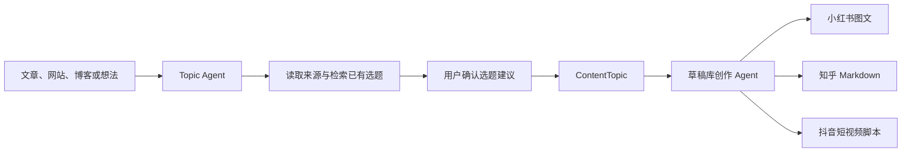

# 选题库 Topic Agent 设计

> 状态：📋 设计中
> 目标入口：`/create/topics`
> 关联：`/create` 内容创作中台、草稿库创作 Agent、`content_topics`

## 一、定位

Topic Agent 是选题库中的对话式选题助手。它接收用户提供的文章、网站、博客文章或一句创作想法，使用博客检索和联网搜索理解上下文，检查已有选题后，生成或修改选题记录。

它负责整理和去重“创作意图”，不负责决定小红书、知乎或抖音的具体产出格式。平台产出由选题转入草稿库后，再由草稿库创作 Agent 根据目标平台和模板完成。



## 二、核心交互

### 2.1 展现形式

Topic Agent 与草稿库创作 Agent 使用同一套前端助手体验：

- 复用 `AgentAssistantPanel` 的 Drawer、消息气泡、滚动、工具调用状态和停止操作。
- 复用 `useAgentStream` 消费 SSE 事件。
- 复用 `useAssistantAgent<TPatch>` 处理业务 endpoint、快捷提示、流状态和 typed patch。
- 复用 `ContentDiffViewer` 展示选题字段变化。
- 只替换标题、空状态、快捷提示、endpoint、工具集合和 patch 应用函数。

选题页可以在两种上下文打开助手：

1. **新建选题**：用户提供来源或想法，Agent 返回一份待确认的选题建议。
2. **编辑已有选题**：Agent 读取当前选题，帮助补充来源、调整标题、重写创作方向或检查重复。

第一期不要求单独设计一套聊天页面，也不要求 Agent 直接写数据库。

### 2.2 推荐快捷提示

- “读取这个链接，整理成一个选题，先检查是否和已有选题重复。”
- “根据这篇博客提炼 3 个不同角度的选题。”
- “检查当前选题是否和库里已有选题重复。”
- “保留我的原始想法，帮我把创作方向描述得更清楚。”
- “把这个选题整理成适合交给草稿 Agent 的创作上下文。”

### 2.3 选题建议确认

Agent 只能提出建议，不直接保存选题。建议通过 `emit_topic_patch` 产生 `patch` SSE 事件，前端显示“查看对比”入口。

用户确认后，patch 只合并到选题表单或页面 state；用户点击选题页面的“保存”按钮后，才调用选题 API 写入数据库。这样可以撤销 AI 建议，也不会把联网搜索或模型误判直接写入选题库。

## 三、架构复用

```text
TopicPage / TopicEditor
  ↓ useTopicAgent
useAssistantAgent<TopicPatch>
  ↓
AgentAssistantPanel
  ↓ POST /api/create/topics/[id]/chat 或 /api/create/topics/chat
topic-agent service
  ↓ LangGraph ReAct + SSE
topic tools
```

与草稿 Agent 的关系：

| 维度 | 草稿库创作 Agent | Topic Agent |
|---|---|---|
| 入口 | `/create/drafts/[id]` | `/create/topics` 或选题详情 |
| 目标 | 生成平台草稿和图片 | 整理、去重和完善选题 |
| 默认提示词 | 内容生成、平台写作、图片生成 | 选题提炼、来源分析、重复判断 |
| 主要输出 | `DraftPatch` | `TopicPatch` |
| 写入方式 | patch 确认后保存草稿 | patch 确认后保存选题 |
| 工具重点 | 模板、草稿、图片生成 | 来源读取、博客检索、联网搜索、选题检索 |
| 前端组件 | 复用 | 复用，仅替换业务配置 |

## 四、工具集

Topic Agent 使用独立的工具工厂，例如 `buildTopicTools({ topicId, userId, emitPatch })`，每次请求注入当前用户和选题上下文，避免跨用户或跨选题读取数据。

| 工具 | 类型 | 作用 |
|---|---|---|
| `search_topics` | 只读 | 按标题、来源、核心角度检索已有选题，用于去重 |
| `get_topic` | 只读 | 读取当前选题及其关联草稿摘要 |
| `search_posts` | 只读 | 检索博客文章 |
| `get_post_content` | 只读 | 读取博客文章正文 |
| `web_search` | 只读 | 搜索用户提供的网站或外部资料 |
| `read_source_url` | 只读 | 读取可访问的文章 URL；不可访问时退回 `web_search` |
| `emit_topic_patch` | 伪工具 | 将选题建议通过 SSE 发给前端，不直接写库 |

第一期不需要图片生成、TTS、发布或草稿正文生成工具。生成平台草稿时，交给草稿库创作 Agent 处理。

## 五、TopicPatch

Topic Agent 的 patch 只描述选题本身，不包含平台产出字段：

```ts
interface TopicPatch {
  title?: string;
  sourceType?: string;
  sourceUrl?: string | null;
  sourcePostId?: number | null;
  originalIdea?: string | null;
  coreAngle?: string | null;
  keyPoints?: string[] | null;
  status?: 'IDEA' | 'USED' | 'ARCHIVED';
}
```

不放入 `TopicPatch` 的内容：

- 小红书卡片数量和图片要求。
- 知乎 Markdown 结构。
- 抖音视频时长和分镜要求。
- 标题、正文、标签等平台草稿正文。

这些内容属于 `ContentTemplate` 和 `ContentDraft`，避免一个选题被某个平台格式绑定。

## 六、SSE 事件

Topic Agent 复用现有 SSE 协议，不新增另一套前端流式协议：

| event | data | 触发 |
|---|---|---|
| `meta` | `{ scenario, topicId? }` | 流开始 |
| `token` / `content_chunk` | `{ content }` | Agent 普通回答 |
| `tool_start` | `{ tool, args, runId, step }` | 工具开始 |
| `tool_end` | `{ tool, result, runId, step }` | 工具结束 |
| `patch` | `TopicPatch` | 选题建议待确认 |
| `done` | `{}` | 流结束 |
| `error` | `{ message }` | 运行失败 |

`patch` 的成功只代表前端收到待确认建议，不代表选题已应用或已经保存。

## 七、提示词与场景配置

Topic Agent 使用独立的 AI scenario 和默认提示词，不复用草稿 Agent 的生成规则：

- scenario 建议为 `topic_agent`。
- system prompt 可以继续由 `content_templates` 管理，使用 `scenario = 'topic_agent'`。
- 默认提示词强调：尊重用户原始想法、先检查重复、区分事实与推测、保留来源、只输出选题 patch 或解释。
- 需要创作方法论时，可以读取选题专用模板；不读取小红书图文或图片生成模板。

Agent 必须遵守：

1. 用户没有提供来源或想法时，先询问缺少的上下文，不凭空生成大量选题。
2. 发现相似选题时先展示候选重复项，不自动覆盖旧记录。
3. 只有在用户确认后才提交 `emit_topic_patch`，前端仍需二次确认并保存。
4. 保留用户原始想法，不用 AI 的改写结果替换原始记录。

## 八、选题转草稿

选题详情或选题卡片提供“创建平台草稿”入口：

```text
选择选题
  ↓
选择平台：小红书 / 知乎 / 抖音 / 博客
  ↓
选择或自动匹配 ContentTemplate
  ↓
创建 ContentDraft(topic_id, platform, type, template_id)
  ↓
进入草稿详情并打开草稿库创作 Agent
```

同一 `ContentTopic` 可以关联多个 `ContentDraft`。每个草稿保存选题内容快照、模板版本和模型输入快照，后续修改选题不会改变已经生成的历史草稿。

## 九、实施顺序

1. 抽取草稿 Agent 的通用助手配置类型，确认 `AgentAssistantPanel`、`useAgentStream`、`useAssistantAgent` 的复用边界。
2. 新增 `TopicPatch` 和 `emit_topic_patch` 类型，不修改 `DraftPatch`。
3. 新增 `topic_agent` prompt 和工具工厂，第一期接入博客检索、网页搜索、选题检索和 patch。
4. 新增 `/api/create/topics/chat`；已有选题详情场景再增加 `/api/create/topics/[id]/chat`。
5. 在选题页接入 `useTopicAgent` 和 `AgentAssistantPanel`，复用差异确认。
6. 增加选题到多平台草稿的入口，再由草稿 Agent 负责具体创作。

## 十、非目标

- Topic Agent 不直接生成最终平台正文和图片。
- Topic Agent 不直接创建或修改数据库记录。
- Topic Agent 不负责发布排期、平台发布和数据复盘。
- 第一阶段不做复杂的向量去重；先用标准化标题、来源和已有选题检索，后续再增加语义相似度。
