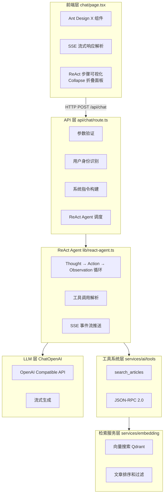
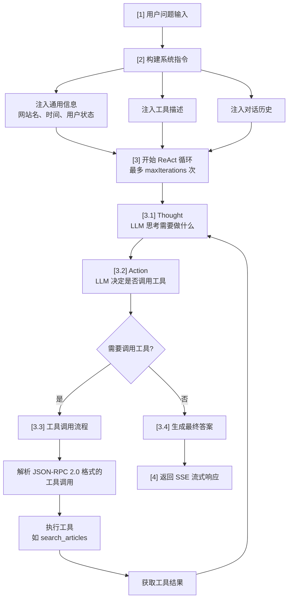

# RAG 聊天系统

> **状态**: ✅ 已实施
> **创建日期**: 2026-01-17
> **相关文档**: [语义搜索](../search/semantic-search.md) | [向量化总览](../vector/overview.md)

## 概述

本项目实现了一个基于 **ReAct（Reasoning and Acting）Agent** 的 RAG 聊天机器人，通过向量检索增强 LLM 的回答能力，提供基于博客知识库的智能问答服务。

### 核心特性

- **ReAct Agent**：使用 Thought-Action-Observation 循环进行多步推理
- **向量检索**：基于 Qdrant 的语义搜索，检索相关文章
- **流式响应**：使用 SSE（Server-Sent Events）实现实时流式输出
- **工具调用**：支持可扩展的工具系统（当前实现 `search_articles` 工具）
- **对话历史**：支持多轮对话上下文管理

## 架构设计

### 整体架构



### 核心组件

| 组件 | 路径 | 职责 |
|------|------|------|
| **聊天页面** | `src/app/chat/page.tsx` | 用户界面、SSE 解析、ReAct 步骤展示 |
| **聊天 API** | `src/app/api/chat/route.ts` | 请求处理、Agent 调度、系统指令构建 |
| **ReAct Agent** | `src/lib/react-agent.ts` | Thought-Action-Observation 循环实现 |
| **工具系统** | `src/services/ai/tools/` | 工具注册、调用解析、结果格式化 |
| **搜索工具** | `src/services/ai/tools/search-articles.ts` | 文章检索工具实现 |
| **SSE 工具** | `src/lib/sse.ts` | SSE 流式响应创建和事件发送 |

## 数据结构

### ReAct 步骤类型

```typescript
// SSE 事件类型
type SSEEventType =
  | 'thought'        // 思考过程
  | 'action'         // 工具调用
  | 'observation'    // 工具结果
  | 'answer'         // 最终答案
  | 'error'          // 错误信息
  | 'done';          // 完成标记

// SSE 事件数据
interface SSEEvent {
  type: SSEEventType;
  data: unknown;
}

// ReAct 步骤（前端展示）
interface ReactStep {
  type: 'thought' | 'action' | 'observation';
  content: string;
  toolCall?: {
    method: string;
    params: Record<string, unknown>;
    id: string | number;
  };
  toolResult?: {
    jsonrpc: string;
    result?: unknown;
    error?: { code: number; message: string };
    id: string | number;
  };
}
```

### 工具定义

```typescript
// 工具接口
interface Tool {
  name: string;
  description: string;
  parameters: {
    type: string;
    properties: Record<string, ToolParameter>;
    required?: string[];
  };
  executor: (params: unknown) => Promise<unknown>;
}

// 工具注册表
class ToolRegistry {
  private tools: Map<string, Tool> = new Map();

  register(tool: Tool): void;
  get(name: string): Tool | undefined;
  getToolsDescription(): string;
  callTool(name: string, params: unknown): Promise<unknown>;
}
```

## 关键流程

### ReAct 循环流程



### SSE 流式响应

```typescript
// API 路由中的 SSE 创建
const stream = createSSEStream(async (send) => {
  await agent.run({
    input: message,
    history,
    onEvent: send,  // 每个事件立即推送到前端
  });
});

return createSSEResponse(stream);
```

**SSE 事件示例**：

```
event: thought
data: {"content": "用户询问关于 Next.js 的文章..."}

event: action
data: {"method": "search_articles", "params": {"query": "Next.js"}, "id": 1}

event: observation
data: {"jsonrpc": "2.0", "result": {"articles": [...]}, "id": 1}

event: answer
data: {"content": "根据知识库，找到了以下文章..."}

event: done
data: null
```

## 使用指南

### 对话 API

**端点**：`POST /api/chat`

**请求体**：

```json
{
  "message": "Next.js 有哪些新特性？",
  "history": [
    {
      "role": "user",
      "content": "你好"
    },
    {
      "role": "assistant",
      "content": "你好！有什么可以帮助你的吗？"
    }
  ]
}
```

**响应**：SSE 流式响应

**事件类型**：

| 事件 | 说明 | 数据格式 |
|------|------|----------|
| `thought` | 思考过程 | `{ content: string }` |
| `action` | 工具调用 | `{ method, params, id }` |
| `observation` | 工具结果 | `{ jsonrpc, result?, error?, id }` |
| `answer` | 最终答案 | `{ content: string }` |
| `error` | 错误信息 | `{ message: string }` |
| `done` | 完成标记 | `null` |

### 扩展工具

**步骤**：

1. **定义工具**（`src/services/ai/tools/my-tool.ts`）：

```typescript
import type { Tool } from './types';

export const myTool: Tool = {
  name: 'my_tool',
  description: '工具描述',
  parameters: {
    type: 'object',
    properties: {
      param1: { type: 'string', description: '参数说明' },
    },
    required: ['param1'],
  },
  executor: async (params) => {
    // 执行逻辑
    return { result: '...' };
  },
};
```

2. **注册工具**（`src/app/api/chat/route.ts`）：

```typescript
import { toolRegistry } from '@/services/ai/tools';
import { myTool } from '@/services/ai/tools/my-tool';

toolRegistry.register(myTool);
```

3. **更新系统指令**：工具描述会自动添加到系统指令中。

## 性能考虑

### 优化策略

1. **向量检索优化**
   - 限制 Top-K 结果（默认 5）
   - 添加相似度阈值过滤（> 0.7）
   - 按文章 ID 去重

2. **LLM 调用优化**
   - 使用流式响应减少首字延迟
   - 限制最大 Token 数（2000）
   - 调整 Temperature 参数（0.7）

3. **前端优化**
   - SSE 事件解析使用流式 API
   - Markdown 渲染使用 `@ant-design/x-markdown`
   - ReAct 步骤折叠减少视觉干扰

### 潜在瓶颈

| 瓶颈 | 影响 | 缓解措施 |
|------|------|----------|
| LLM 响应时间 | 每轮迭代 ~2-3 秒 | 限制迭代次数（5） |
| 向量检索 | ~500ms | 使用缓存、优化索引 |
| 网络延迟 | SSE 事件延迟 | 使用 CDN、压缩 |

### 监控指标

- 平均响应时间（目标 < 10 秒）
- LLM 调用次数（每轮对话）
- 工具调用成功率
- SSE 事件丢失率

## 安全考虑

### 安全措施

1. **权限验证**
   - API 路由验证用户身份（可选，游客模式）
   - 工具执行时检查用户权限
   - 敏感操作仅管理员可执行

2. **输入验证**
   - 限制消息长度（防止 Token 注入）
   - 过滤恶意输入（SQL 注入、XSS）
   - 验证工具调用参数

3. **输出过滤**
   - 移除系统指令泄露
   - 过滤敏感信息（密码、Token）
   - 限制文章内容长度

### 潜在风险

| 风险 | 影响 | 缓解措施 |
|------|------|----------|
| Prompt 注入 | 系统指令被覆盖 | 输入过滤、指令隔离 |
| 工具调用攻击 | 未授权操作 | 权限检查、参数验证 |
| API 密钥泄露 | LLM 服务被滥用 | 环境变量隔离、定期轮换 |

## 扩展性

### 未来改进方向

1. **多工具协作**
   - 实现 Tool chaining（工具链）
   - 支持并行工具调用
   - 工具调用缓存

2. **智能路由**
   - 根据问题复杂度选择策略
   - 简单问题：直接 RAG
   - 复杂问题：ReAct Agent

3. **多模态支持**
   - 图片检索（CLIP）
   - 语音问答（STT + TTS）

4. **个性化**
   - 基于用户历史的个性化检索
   - 用户反馈学习（点赞/点踩）

### 可扩展点

- **工具系统**：轻松添加新工具（搜索、计算、API 调用）
- **LLM 切换**：支持 OpenAI、Anthropic、本地模型
- **检索策略**：向量检索、关键词检索、混合检索
- **前端组件**：可定制化 UI 主题

## 参考资料

### ReAct Agent 论文

1. **ReAct: Synergizing Reasoning and Acting in Language Models**
   - Yao et al., 2022
   - https://arxiv.org/abs/2210.03629

### 相关技术

- **LangChain**: https://js.langchain.com/
- **SSE 标准**: https://html.spec.whatwg.org/multipage/server-sent-events.html
- **JSON-RPC 2.0**: https://www.jsonrpc.org/specification

### 项目相关

- [语义搜索](../search/semantic-search.md)
- [向量化总览](../vector/overview.md)
- [前端开发规范](../../.cursor/rules/frontend.mdc)
- [后端开发规范](../../.cursor/rules/backend.mdc)

---

**文档版本**：v2.0
**创建日期**：2026-01-17
**最后更新**：2026-03-12
**状态**：✅ 已实现
