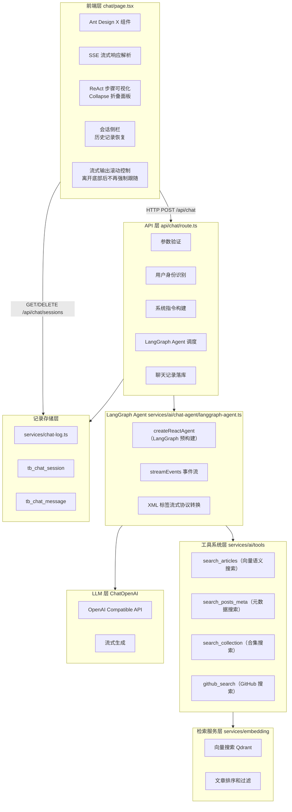
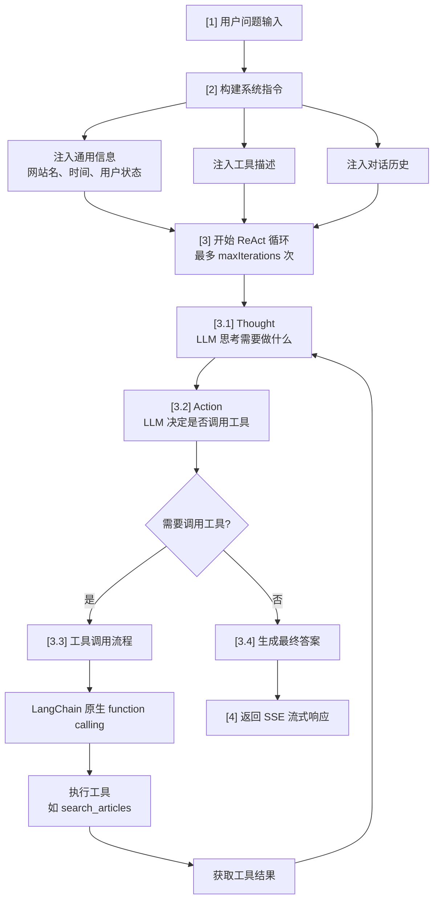

# Agent 聊天系统

> **状态**: ✅ 已实施（已迁移至 LangGraph ReAct Agent）
> **创建日期**: 2026-01-17
> **最后更新**: 2026-06-29
> **相关文档**: [语义搜索](../search/semantic-search.md) | [向量化总览](../vector/overview.md) | [站点级昼夜风格语义系统](../day-night-style-system.md) | [赛博朋克风格元素资料库](../../reference/cyberpunk-style-elements.md)

## 概述

本项目实现了一个基于 **LangGraph ReAct Agent** 的聊天机器人。Agent 作为核心编排层，负责判断问题意图并按需调用工具；RAG/向量检索是其中最重要的一类知识检索工具，而不是固定前置流程。

### 核心特性

- **LangGraph ReAct Agent**：使用 `createReactAgent` 进行多步推理（替代原手写 ReAct 循环）
- **原生 Function Calling**：使用 LangChain `tool()` + zod schema 定义工具（替代 JSON-RPC）
- **RAG 检索工具**：基于 Qdrant 的语义搜索，作为 `search_articles` 工具由 Agent 按需调用
- **流式响应**：使用 SSE（Server-Sent Events）+ XML 标签协议实现实时流式输出
- **DeepSeek think 展示**：从模型原生 `reasoning_content` 提取推理内容，映射到 `<think>...</think>` 并由前端 `Think` 组件展示
- **工具调用**：支持可扩展的工具系统（当前实现 4 个工具）
- **工具耗时追踪**：工具调用的名称、开始时间、结束时间和耗时写入消息 `metadata`
- **对话历史**：支持多轮对话上下文管理
- **聊天记录**：支持登录用户和游客会话持久化、历史恢复和后台查看
- **标题总结**：第一轮对话结束后异步总结会话标题，不再直接使用用户首问作为标题
- **昼夜风格语义**：日间保持温和文艺，夜间注入赛博朋克、终端、记忆芯片和城市边缘感的回答语气

## 昼夜风格与回答语气

`/chat` 是站点双重风格最重要的文本出口。日间/夜间不应只改变页面外壳颜色，也要改变系统提示词里的回答语气。

现状：

- 当前运行时提示词模板位于 `docs/reference/chat-agent-system-prompt.md`。
- `src/services/ai/chat-agent/prompt.ts` 读取该模板，并注入站点、用户、知识库和合集变量。
- 当前模板默认是第一人称、文艺、哲学感的日间主语气。

当前实现：

1. 前端 `/chat` 请求携带 `styleVariant: 'day' | 'night'`。
2. `ChatAgentPromptParams` 增加 `styleVariant`。
3. 后端根据 `styleVariant` 注入 `styleVoiceInstruction`。
4. 日间语气继续是“人生之书”的温和回答。
5. 夜间语气转为“雨夜终端、记忆芯片、人格回声、档案扫描”的赛博朋克回答。

夜间模式必须保留现有约束：基于检索结果、引用文章链接、准确简洁、中文回答。赛博朋克风格只能增强表达质感，不能替代事实和来源。

## 架构设计

### 整体架构



### 核心组件

| 组件 | 路径 | 职责 |
|------|------|------|
| **聊天页面** | `src/app/chat/page.tsx` | 用户界面、SSE 解析、ReAct 步骤展示 |
| **聊天 API** | `src/app/api/chat/route.ts` | 请求处理、Agent 调度、系统指令构建 |
| **会话 API** | `src/app/api/chat/sessions/route.ts` | 当前用户/游客会话列表、新建会话 |
| **会话详情 API** | `src/app/api/chat/sessions/[id]/route.ts` | 会话详情读取、逻辑删除 |
| **后台记录 API** | `src/app/api/admin/chat-logs/route.ts` | 管理后台聊天记录查询和批量删除 |
| **后台记录页面** | `src/app/c/chat-logs/page.tsx` | 聊天记录管理、筛选、查看详情、删除 |
| **聊天记录服务** | `src/services/chat-log.ts` | 会话和消息 CRUD、后台查询 |
| **游客设备标识** | `src/lib/device-id.ts` | localStorage 持久化游客设备 ID |
| **LangGraph Agent** | `src/services/ai/chat-agent/langgraph-agent.ts` | LangGraph `createReactAgent` 实现 |
| **系统提示词模板** | `docs/reference/chat-agent-system-prompt.md` | Chat Agent 系统提示词，使用 LangChain `PromptTemplate` 注入变量 |
| **提示词注入服务** | `src/services/ai/chat-agent/prompt.ts` | 读取提示词模板并注入站点、用户、知识库和合集变量 |
| **会话标题生成** | `src/services/ai/chat-agent/title.ts` | 第一轮对话完成后根据用户首问和 assistant 回复生成短标题 |
| **旧版兼容入口** | `src/services/ai/rag/index.ts` | 兼容导出，主入口已迁移到 `src/services/ai/chat-agent` |
| **LangChain 工具** | `src/services/ai/tools/langchain-tools.ts` | LangChain `tool()` + zod schema 定义 |
| **RAG 检索工具** | `src/services/ai/tools/search-articles.ts` | 向量语义搜索工具，供 Agent 按需调用 |
| **元数据搜索** | `src/services/ai/tools/search-posts-meta.ts` | 按时间/热度/分类搜索 |
| **合集搜索** | `src/services/ai/tools/search-collection.ts` | 合集内文章搜索 |
| **GitHub 搜索** | `src/services/ai/tools/github-search.ts` | GitHub 仓库、Issue/PR、用户仓库和 Star 列表搜索 |
| **流式标签** | `src/lib/stream-tags.ts` | XML 标签流式协议（前后端通信） |
| **SSE 工具** | `src/lib/sse.ts` | SSE 流式响应创建和事件发送 |

## 数据结构

### 聊天记录表

聊天记录使用会话表和消息表分离存储。登录用户按 `user_id` 归属，游客按 `device_id` 归属。

```prisma
model TbChatSession {
  id            Int      @id @default(autoincrement())
  user_id       Int?
  device_id     String?  @db.VarChar(36)
  title         String?  @db.VarChar(255)
  message_count Int      @default(0)
  ip_address    String?  @db.VarChar(45)
  user_agent    String?  @db.Text
  is_delete     Int      @default(0)
  created_at    DateTime @default(now())
  updated_at    DateTime @updatedAt

  user     TbUser?         @relation(fields: [user_id], references: [id])
  messages TbChatMessage[]
}

model TbChatMessage {
  id         Int      @id @default(autoincrement())
  session_id Int
  role       String   @db.VarChar(20)
  content    String   @db.Text
  metadata   Json?
  created_at DateTime @default(now())

  session TbChatSession @relation(fields: [session_id], references: [id], onDelete: Cascade)
}
```

`metadata` 用于存储 ReAct 过程数据，目前结构如下：

```typescript
interface MessageMetadata {
  thoughts?: string[];
  reactLoops?: Array<{
    index: number;
    steps: Array<{
      type: 'thought' | 'action' | 'observation';
      content: string;
      toolName?: string;
      startedAt?: string;
      endedAt?: string;
      durationMs?: number;
    }>;
  }>;
  reactTimeline?: Array<
    | {
        type: 'think';
        content: string;
      }
    | {
        type: 'loop';
        index: number;
        steps: Array<{
          type: 'thought' | 'action' | 'observation';
          content: string;
          toolName?: string;
          startedAt?: string;
          endedAt?: string;
          durationMs?: number;
        }>;
      }
  >;
}
```

工具调用耗时写入 `action` / `observation` step：

- `toolName`：LangChain 工具名，例如 `search_articles`
- `startedAt` / `endedAt`：ISO 时间字符串
- `durationMs`：工具执行耗时，毫秒

该信息用于排查检索慢、外部 API 超时、向量数据库异常等问题。

### ReAct 步骤类型

```typescript
// SSE 事件类型
type SSEEventType =
  | 'thought'        // 思考过程
  | 'action'         // 工具调用
  | 'observation'    // 工具结果
  | 'answer'         // 最终答案
  | 'error'          // 错误信息
  | 'done';          // 完成标记

// SSE 事件数据
interface SSEEvent {
  type: SSEEventType;
  data: unknown;
}

// ReAct 步骤（前端展示）
interface ReactStep {
  type: 'thought' | 'action' | 'observation';
  content: string;
  toolCall?: {
    method: string;
    params: Record<string, unknown>;
    id: string | number;
  };
  toolResult?: {
    jsonrpc: string;
    result?: unknown;
    error?: { code: number; message: string };
    id: string | number;
  };
}
```

### 工具定义

```typescript
// 业务工具接口
interface Tool {
  name: string;
  description: string;
  parameters: {
    [key: string]: {
      type: string;
      description: string;
      required?: boolean;
    };
  };
  execute: (args: Record<string, unknown>) => Promise<ToolResult>;
}

// LangChain wrapper 位于 langchain-tools.ts，使用 tool() + zod schema 暴露给 Agent。
```

当前工具：

| 工具 | 说明 | 超时策略 |
|------|------|----------|
| `search_articles` | embedding + Qdrant 向量语义搜索 | embedding 8 秒，Qdrant 搜索 8 秒 |
| `search_posts_meta` | 文章列表结构化查询 | 内部 HTTP 查询 8 秒 |
| `search_collection` | 合集内文章搜索 | 数据库查询 |
| `github_search` | GitHub 仓库、Issue/PR、用户仓库、Star 列表 | GitHub API 10 秒 |

## 关键流程

### ReAct 循环流程



### SSE 流式响应

```typescript
// API 路由中的 SSE 创建
const stream = createSSEStream(async (send) => {
  await agent.run({
    input: message,
    history,
    onEvent: send,  // 每个事件立即推送到前端
  });
});

return createSSEResponse(stream);
```

**SSE 事件示例**：

```
event: thought
data: {"content": "用户询问关于 Next.js 的文章..."}

event: action
data: {"method": "search_articles", "params": {"query": "Next.js"}, "id": 1}

event: observation
data: {"jsonrpc": "2.0", "result": {"articles": [...]}, "id": 1}

event: answer
data: {"content": "根据知识库，找到了以下文章..."}

event: done
data: null
```

## 使用指南

### 对话 API

**端点**：`POST /api/chat`

**请求体**：

```json
{
  "message": "Next.js 有哪些新特性？",
  "sessionId": 123,
  "history": [
    {
      "role": "user",
      "content": "你好"
    },
    {
      "role": "assistant",
      "content": "你好！有什么可以帮助你的吗？"
    }
  ]
}
```

`sessionId` 可选。不传时后端自动创建会话，并在响应头 `X-Session-Id` 中返回新会话 ID。登录用户的会话绑定 `user_id`，游客会话绑定请求头 `X-Device-Id`。

**响应**：流式响应，内容使用 XML 标签协议。工具 step 可携带元数据属性：

```xml
<think>模型推理片段</think>
<step type="action" index="1" tool_name="search_articles" started_at="2026-06-15T14:00:00.000Z">搜索文章：...</step>
<step type="observation" index="1" tool_name="search_articles" started_at="..." ended_at="..." duration_ms="812">找到相关文章...</step>
<content>最终回答...</content>
```

### 会话 API

#### 获取当前用户或游客会话列表

```
GET /api/chat/sessions?pageNum=1&pageSize=20
```

游客请求需要携带 `X-Device-Id` 请求头。登录用户优先按 `user_id` 查询，不叠加设备 ID。

#### 获取会话详情

```
GET /api/chat/sessions/:id
```

非后台用户只能读取自己的会话。拥有 `chat:log:view` 权限的后台用户可读取所有会话详情。

#### 删除会话

```
DELETE /api/chat/sessions/:id
```

普通登录用户和游客只能删除自己的会话。后台删除所有会话需要 `chat:log:delete` 权限。

### 后台聊天记录 API

#### 查询聊天记录

```
GET /api/admin/chat-logs?pageNum=1&pageSize=20&keyword=xxx&userId=1&startDate=2026-06-01&endDate=2026-06-10
```

需要 `chat:log:view` 权限。支持按用户 ID、关键词、时间范围筛选，关键词匹配会话标题、用户昵称、账号和消息内容。

#### 批量删除聊天记录

```
DELETE /api/admin/chat-logs
```

请求体：

```json
{
  "ids": [1, 2, 3]
}
```

需要 `chat:log:delete` 权限，删除采用逻辑删除。

## 权限与安全

- 前台聊天接口允许匿名访问，但会对已有 `sessionId` 做归属校验。
- 登录用户会话按服务端 Token 解析出的 `user_id` 归属，客户端提交的用户身份不可信。
- 游客会话通过 `X-Device-Id` 归属，设备 ID 由前端保存在 localStorage。
- 后台记录列表和详情查看需要 `chat:log:view`。
- 后台删除需要 `chat:log:delete`。
- 聊天消息写入失败不应影响流式回答，但已有会话归属校验失败必须拒绝请求。

### 扩展工具

**步骤**：

1. **定义工具**（`src/services/ai/tools/my-tool.ts`）：

```typescript
import type { Tool } from './index';

export const myTool: Tool = {
  name: 'my_tool',
  description: '工具描述',
  parameters: {
    param1: {
      type: 'string',
      description: '参数说明',
      required: true,
    },
  },
  execute: async (args) => {
    // 执行逻辑
    return {
      success: true,
      data: { result: args.param1 },
    };
  },
};
```

2. **包装为 LangChain tool**（`src/services/ai/tools/langchain-tools.ts`）：

```typescript
import { tool } from '@langchain/core/tools';
import { z } from 'zod';
import { myTool } from '@/services/ai/tools/my-tool';

export const lcMyTool = tool(
  async ({ param1 }) => {
    const result = await myTool.execute({ param1 });
    if (!result.success) return JSON.stringify({ error: result.error });
    return JSON.stringify(result.data);
  },
  {
    name: 'my_tool',
    description: '工具描述',
    schema: z.object({
      param1: z.string().describe('参数说明'),
    }),
  },
);
```

3. **加入 `chatTools` 数组**：Agent 会通过 LangChain 原生 function calling 按需调用。

## 性能考虑

### 优化策略

1. **向量检索优化**
   - 限制 Top-K 结果（默认 5）
   - 添加相似度阈值过滤（> 0.7）
   - 按文章 ID 去重

2. **LLM 调用优化**
   - 使用流式响应减少首字延迟
   - 限制最大 Token 数（2000）
   - 调整 Temperature 参数（0.7）

3. **前端优化**
   - SSE 事件解析使用流式 API
   - Markdown 渲染使用 `@ant-design/x-markdown`
   - ReAct 步骤折叠减少视觉干扰
   - 流式输出仅在消息区贴近底部时自动跟随；用户手动滚离底部后不再强制滚动

4. **工具超时和降级**
   - 外部 API、embedding、Qdrant 和内部 HTTP 查询都应设置业务级超时
   - Agent 异常时输出错误内容并正常关闭流，避免前端永久 loading
   - 工具耗时写入消息 metadata，便于按会话排查慢工具

### 潜在瓶颈

| 瓶颈 | 影响 | 缓解措施 |
|------|------|----------|
| LLM 响应时间 | 每轮迭代 ~2-3 秒 | 限制迭代次数（5） |
| embedding 服务 | RAG 首步可能超时 | `search_articles` embedding 8 秒超时，必要时切换稳定服务 |
| Qdrant 云库 | 向量搜索可能超时 | Qdrant 搜索 8 秒超时，记录 `durationMs` |
| GitHub API | 外部网络和代理不稳定 | `github_search` 10 秒超时，支持代理 |
| 网络延迟 | SSE 事件延迟 | 使用 CDN、压缩 |

### 监控指标

- 平均响应时间（目标 < 10 秒）
- LLM 调用次数（每轮对话）
- 工具调用成功率
- 工具调用耗时（`metadata.reactLoops[].steps[].durationMs`）
- SSE 事件丢失率

## 安全考虑

## 配置管理

### AI 模型配置
聊天系统的 AI 模型配置从 `/c/config` 的 `chat` 场景绑定读取，包括 Provider 的 API Key、Base URL、绑定模型、温度和最大 Token 数。

配置通过 `src/lib/ai-config.ts` 读取，内存缓存 5 分钟 TTL。

### 安全措施

1. **权限验证**
   - API 路由验证用户身份（可选，游客模式）
   - 工具执行时检查用户权限
   - 敏感操作仅管理员可执行

2. **输入验证**
   - 限制消息长度（防止 Token 注入）
   - 过滤恶意输入（SQL 注入、XSS）
   - 验证工具调用参数

3. **输出过滤**
   - 移除系统指令泄露
   - 过滤敏感信息（密码、Token）
   - 限制文章内容长度

### 潜在风险

| 风险 | 影响 | 缓解措施 |
|------|------|----------|
| Prompt 注入 | 系统指令被覆盖 | 输入过滤、指令隔离 |
| 工具调用攻击 | 未授权操作 | 权限检查、参数验证 |
| API 密钥泄露 | LLM 服务被滥用 | 数据库存储、环境变量隔离、定期轮换 |

## 扩展性

### 未来改进方向

1. **多工具协作**
   - 实现 Tool chaining（工具链）
   - 支持并行工具调用
   - 工具调用缓存

2. **智能路由**
   - 根据问题复杂度选择策略
- 简单知识库问题：可直接调用 RAG 检索工具
   - 复杂问题：ReAct Agent

3. **多模态支持**
   - 图片检索（CLIP）
   - 语音问答（STT + TTS）

4. **个性化**
   - 基于用户历史的个性化检索
   - 用户反馈学习（点赞/点踩）

### 可扩展点

- **工具系统**：轻松添加新工具（搜索、计算、API 调用）
- **LLM 切换**：支持 OpenAI、Anthropic、本地模型
- **检索策略**：向量检索、关键词检索、混合检索
- **前端组件**：可定制化 UI 主题

## 参考资料

### ReAct Agent 论文

1. **ReAct: Synergizing Reasoning and Acting in Language Models**
   - Yao et al., 2022
   - https://arxiv.org/abs/2210.03629

### 相关技术

- **LangChain**: https://js.langchain.com/
- **SSE 标准**: https://html.spec.whatwg.org/multipage/server-sent-events.html

### 项目相关

- [语义搜索](../search/semantic-search.md)
- [向量化总览](../vector/overview.md)
- [前端开发规范](../../rules/frontend.md)
- [后端开发规范](../../rules/backend.md)

---

**文档版本**：v2.0
**创建日期**：2026-01-17
**最后更新**：2026-03-12
**状态**：✅ 已实现
