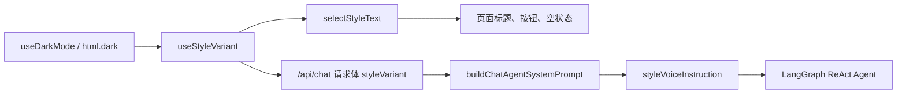

# 站点级昼夜风格语义系统

> **状态**: 🔄 进行中（基础工具定义已落地）
> **创建日期**: 2026-06-29
> **最后更新**: 2026-06-29
> **相关文档**: [首页 3D 昼夜双主题](./homepage-3d-day-night.md) | [赛博朋克风格元素资料库](../reference/cyberpunk-style-elements.md) | [Agent 聊天系统](./chat/rag-chat.md)

## 定位

`NNNNzs` 的日间/夜间不只是 `light/dark` 皮肤，而是站点级的**双重风格语义系统**。

它更接近 `i18n`，区别是 `i18n` 面向语言切换，这里面向**同一内容在日间与夜间的叙事状态切换**：

- 日间：温和、明亮、文艺、适合阅读、像一间有人生活和写作的房间。
- 夜间：赛博朋克、霓虹、雨夜、终端、记忆芯片、城市边缘、像同一空间进入深夜网络层。

后续所有承载人格和氛围的模块，都应该优先判断是否需要接入该语义层，而不是只写一份固定文案再靠 CSS 变色。

## 设计权重

昼夜风格语义是高于单页面、单组件、单样式文件的整体体验约束：

1. 视觉层要切换：颜色、灯光、材质、动效、信息密度。
2. 文案层要切换：标题、副标题、按钮、空状态、模块名、状态描述。
3. AI 层要切换：`/chat` 的系统提示词需要根据当前模式注入不同回答风格。
4. 数据和事实不切换：文章、权限、搜索结果、引用来源、会话记录保持同一真实数据。
5. 可访问性不让位：夜间可以有赛博朋克语气，但不能牺牲可读性和可理解性。

## 语义边界

| 层级 | 日间 | 夜间 | 是否必须接入 |
|------|------|------|--------------|
| 全局色彩 | 暖白、木色、纸张、阳光 | 深蓝黑、霓虹青、霓虹粉、雨夜反光 | 必须 |
| 页面标题 | 书页、档案、阅读、回想 | 终端、日志、Relic、神龛、数据流 | 高优先级 |
| 操作按钮 | 继续阅读、展开更多、回到顶部 | 同步日志、接入终端、返回全景 | 高优先级 |
| 空状态 | 温和说明、留白、等待书写 | 断线、无信号、空白分区 | 中优先级 |
| `/chat` 回答 | 第一人称、文艺、哲学、清晰 | 第一人称、赛博黑色、终端感、仍然准确 | 必须 |
| SEO metadata | 稳定、清楚、面向搜索 | 不建议随客户端主题变动 | 不接入 |
| 管理后台 | 工具化、克制 | 可轻量跟随主题，但不做强叙事 | 低优先级 |

## 命名模型

现有技术状态是 `light/dark`，但产品语义应使用 `day/night`：

```ts
export type ThemeMode = 'light' | 'dark';
export type SiteStyleVariant = 'day' | 'night';

export function getStyleVariantFromThemeMode(mode: ThemeMode): SiteStyleVariant {
  return mode === 'dark' ? 'night' : 'day';
}
```

原因：

- `light/dark` 是技术状态，适合 CSS class、系统偏好和可访问性。
- `day/night` 是叙事状态，适合文案、AI prompt、模块名称和场景 preset。
- 后续如果出现 `high-contrast dark`、`sepia` 等技术主题，站点人格仍可以保持 `day/night` 两套主叙事。

## 文案工具设计

建议新增类似 `i18n` 的轻量工具，而不是在组件里散落三元表达式。

建议目录：

```txt
src/lib/site-style/
├── variant.ts       # day/night 类型、技术主题到语义主题的转换
├── copy.ts          # defineStyleCopy / selectStyleText
└── useStyleVariant.ts

src/config/site-copy/
├── home.ts          # 首页和文章列表文案
├── chat.ts          # /chat 文案、回想模块文案
└── common.ts        # 通用按钮、空状态、状态词
```

核心类型：

```ts
export type SiteStyleVariant = 'day' | 'night';

export type StyleText =
  | string
  | {
      day: string;
      night: string;
    };

export function selectStyleText(
  text: StyleText,
  variant: SiteStyleVariant,
): string {
  return typeof text === 'string' ? text : text[variant];
}

export function defineStyleCopy<T extends Record<string, StyleText>>(copy: T): T {
  return copy;
}
```

组件使用方式：

```tsx
const variant = useStyleVariant();
const copy = chatCopy;

return (
  <section>
    <h2>{selectStyleText(copy.recallPanelTitle, variant)}</h2>
    <p>{selectStyleText(copy.recallPanelDescription, variant)}</p>
  </section>
);
```

文案注册示例：

```ts
export const chatCopy = defineStyleCopy({
  recallPanelTitle: {
    day: '回想',
    night: 'Relic 回响',
  },
  recallPanelDescription: {
    day: '在旧问题和旧答案之间，翻回那些曾经写下的页边注。',
    night: '从记忆芯片里调取旧回声，把曾经的对话重新接入当前终端。',
  },
  emptySessionTitle: {
    day: '这一页还没有写下问题',
    night: '终端暂无会话信号',
  },
});
```

`Relic`、`Mikoshi`、`Afterlife` 等专名适合先作为设计稿和内部文档里的强灵感词。正式 UI 如果担心 IP 边界，可以替换为更本土化的原创词，例如“记忆芯片”“灵魂神龛”“回声神龛”“旧梦终端”。

## 运行时链路



前端可以继续以 `useDarkMode()` 作为当前事实来源，但不要让每个组件自己理解 `dark = cyberpunk`。应该先转换为 `SiteStyleVariant`，再由文案工具和主题 preset 消费。

## `/chat` 回答风格设计

`/chat` 不能只在页面外壳上变成夜间风格，回答本身也要接入 `day/night` 语义。

建议给 `buildChatAgentSystemPrompt()` 增加参数：

```ts
export interface ChatAgentPromptParams {
  userInfo: string;
  siteName: string;
  currentTime: string;
  baseUrl: string;
  styleVariant: SiteStyleVariant;
}
```

再派生一段 `styleVoiceInstruction` 注入 prompt：

```ts
export const CHAT_STYLE_VOICE: Record<SiteStyleVariant, string> = {
  day: [
    '回答保持温和、文艺、清晰，像在书房里翻阅人生之书。',
    '可以有哲学感和文学质地，但不要牺牲准确性。',
  ].join('\n'),
  night: [
    '回答进入夜间赛博朋克状态：更像雨夜终端、记忆芯片和城市边缘的独白。',
    '可以使用终端、日志、回声、芯片、神龛、霓虹等意象，但必须保持事实准确、引用完整、语义清楚。',
    '不要把赛博朋克语气变成乱码、过度英文或无意义黑话。',
  ].join('\n'),
};
```

夜间回答不是“把每句话都改成黑话”，而是在不损失信息密度的前提下，让句式、比喻和模块名更像深夜终端里保存的一段人格回声。

## 模块命名候选

| 模块 | 日间名称 | 夜间名称候选 | 说明 |
|------|----------|--------------|------|
| `/chat` 主入口 | 问问站长 | 夜间终端 / Neon Terminal | 可保留主导航稳定，页内标题切换 |
| 回想模块 | 回想 / 旧问答 | Relic 回响 / 记忆芯片 / 回声神龛 | 用户明确提到的重点模块 |
| 会话历史 | 对话记录 | 终端日志 / 会话日志 | 夜间偏系统记录 |
| 新会话 | 写下一个问题 | 新建接入 / 开启链路 | 不要过度复杂 |
| 文章列表 | 阅读档案 | 文章终端日志流 | 已在首页计划中采用 |
| 合集 | 书架 / 主题书架 | 数据书架 / 归档矩阵 | 对应 3D 房间书架 |
| 标签 | 标签 | 频道 / 信标 | 可轻量切换 |
| 搜索 | 搜索文章 | 扫描档案 / 检索日志 | 保持用户能懂 |

## 渐进实施计划

1. **文档提权**：把昼夜双风格从首页设计提升为站点级体验原则。
2. **基础工具**：新增 `SiteStyleVariant`、文案选择工具、`useStyleVariant()`。
3. **首页迁移**：把首页首屏、文章列表、加载按钮、空状态迁入 `site-copy/home.ts`。
4. **Chat UI 迁移**：把 `/chat` 页面标题、会话历史、回想模块、空状态迁入 `site-copy/chat.ts`。
5. **Chat Prompt 迁移**：前端请求带 `styleVariant`，后端 prompt 注入 `styleVoiceInstruction`。
6. **复核边界**：检查夜间文案是否过度晦涩，日间文案是否被赛博朋克污染。

## 当前代码落点

2026-06-29 已完成第一批工具定义和首页样板接入：

| 文件 | 职责 |
|------|------|
| `src/lib/site-style/variant.ts` | `ThemeMode`、`SiteStyleVariant`、`light/dark` 到 `day/night` 的转换 |
| `src/lib/site-style/copy.ts` | `defineStyleCopy()`、`selectStyleText()`、`selectStyleTextList()` |
| `src/lib/site-style/useStyleVariant.ts` | 客户端 hook，基于 `useDarkMode()` 输出站点语义风格 |
| `src/config/site-copy/common.ts` | 通用按钮、空状态、操作词文案 |
| `src/config/site-copy/home.ts` | 首页文章列表文案 |
| `src/config/site-copy/chat.ts` | `/chat` UI 文案和后续 prompt 语气文案 |
| `src/config/site-copy/header.ts` | Header 导航、搜索、菜单、主题切换文案 |
| `src/components/Header.tsx` | 全局导航已接入 `headerCopy`，`/chat` 导航夜间显示为 `Relic` |
| `src/components/HomePageClient.tsx` | 首页文章列表已接入 `homeFeedCopy`，作为后续迁移样板 |
| `src/app/chat/page.tsx` | `/chat` 页面标题、会话记录、空状态、输入占位和请求体已接入 `SiteStyleVariant` |
| `src/app/api/chat/route.ts` | `POST /api/chat` 接收并校验 `styleVariant` |
| `src/services/ai/chat-agent/prompt.ts` | Chat Agent prompt 注入 `styleVoiceInstruction` |
| `docs/reference/chat-agent-system-prompt.md` | 系统提示词模板新增当前风格语气变量 |

## 验收清单

- [x] 任一前台模块新增人格化文案时，先判断是否需要 `day/night` 两份文案。
- [x] 页面组件不直接写 `isDark ? '夜间文案' : '日间文案'`，优先使用文案工具。
- [x] `/chat` 请求能把当前 `SiteStyleVariant` 传到后端。
- [x] Chat Agent prompt 有明确的日间/夜间回答风格注入段。
- [x] 夜间模式文案有赛博朋克气质，但仍然中文清晰、可读、可搜索。
- [ ] 日间模式保持温和文艺，不是夜间模式的浅色版。
