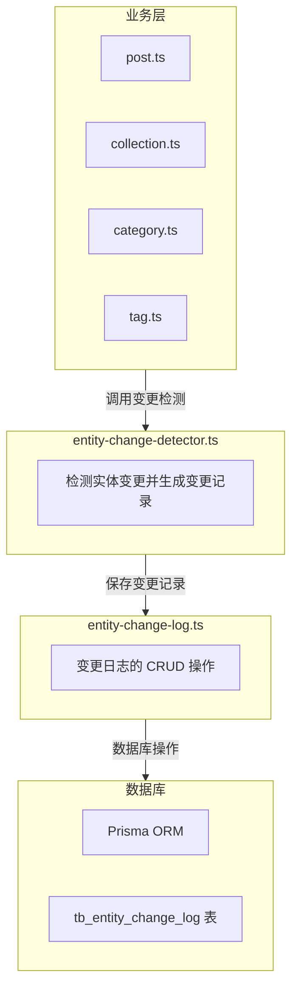

# 实体变更日志系统设计

> **本文档定位**: 技术设计文档 - 说明实体变更追踪系统的设计原理和实现方案
>
> **开发实施规范**详见:
> - [后端开发规范](../rules/backend.md) - API 路由和服务层实现
> - [数据库开发规范](../rules/database.md) - 数据模型设计和触发器

## 概述

实体变更日志系统用于记录和追踪项目中关键实体（文章、合集、分类、标签等）的字段变更历史。该系统提供了完整的变更追踪能力，支持审计、回滚和数据恢复等场景。

## 功能特性

### 核心功能

1. **自动变更检测** - 在实体更新时自动检测变更的字段
2. **变更记录存储** - 记录字段变更前后的值
3. **多实体类型支持** - 支持文章、合集、分类、标签等多种实体
4. **操作人追踪** - 记录谁进行了修改
5. **时间戳记录** - 记录变更发生的精确时间
6. **类型安全** - 支持多种值类型（string、number、boolean、array、object）

### 扩展功能

1. **变更历史查询** - 按实体、时间、操作人查询变更记录
2. **变更对比** - 可视化展示字段变更前后的差异
3. **批量变更记录** - 支持批量操作时的变更记录
4. **UI 组件** - 提供变更历史弹窗组件

## 数据模型

### 数据表结构

```prisma
model TbEntityChangeLog {
  id          Int      @id @default(autoincrement())
  entity_id   Int      // 实体ID（文章ID、合集ID等）
  entity_type String   @db.VarChar(50)  // POST, COLLECTION, CATEGORY, TAG 等
  field_name  String   @db.VarChar(100) // 变更的字段名
  old_value   String?  @db.Text        // 变更前的值（JSON字符串）
  new_value   String?  @db.Text        // 变更后的值（JSON字符串）
  value_type  String   @db.VarChar(20)  // 值类型：string, number, boolean, array, object
  created_at  DateTime @default(now())
  created_by  Int?     // 操作人ID（可能为null，如系统操作）

  // 关联用户表
  creator TbUser? @relation("EntityChangeLogCreator", fields: [created_by], references: [id])

  // 索引优化
  @@index([entity_id, entity_type], name: "idx_entity")
  @@index([entity_type, created_at], name: "idx_type_time")
  @@index([created_by, created_at], name: "idx_user_time")
  @@index([created_at], name: "idx_created_at")
  @@map("tb_entity_change_log")
}
```

### 索引说明

- `idx_entity` - 按实体ID和类型查询，用于获取特定实体的变更历史
- `idx_type_time` - 按实体类型和时间查询，用于统计和分析
- `idx_user_time` - 按操作人查询，用于审计用户操作
- `idx_created_at` - 按时间查询，用于时间范围筛选

## 架构设计

### 服务层架构



### 核心服务

#### 1. entity-change-detector.ts

变更检测服务，负责检测实体变更并生成变更记录。

**核心函数：**

```typescript
/**
 * 检测实体变更
 * @param entityType 实体类型（POST, COLLECTION 等）
 * @param entityId 实体ID
 * @param oldData 变更前的数据
 * @param newData 变更后的数据
 * @param userId 操作人ID
 * @returns 变更记录数组
 */
export async function detectChanges<T extends Record<string, unknown>>(
  entityType: string,
  entityId: number,
  oldData: T,
  newData: Partial<T>,
  userId?: number
): Promise<EntityChangeLogInput[]>
```

**支持的值类型检测：**

| 值类型 | 检测方式 | 示例 |
|--------|----------|------|
| `string` | 直接比较字符串 | title, description |
| `number` | 比较数值 | visitors, likes |
| `boolean` | 比较布尔值 | hide, is_delete |
| `array` | JSON 序列化后比较 | tags (数组) |
| `object` | JSON 序列化后比较 | 复杂对象 |

#### 2. entity-change-log.ts

变更日志服务，负责变更记录的 CRUD 操作。

**核心函数：**

```typescript
/**
 * 批量创建变更记录
 */
export async function createChangeLogs(
  logs: EntityChangeLogInput[]
): Promise<void>

/**
 * 获取实体的变更历史
 */
export async function getEntityChangeHistory(
  entityType: string,
  entityId: number
): Promise<EntityChangeLog[]>

/**
 * 获取用户的操作历史
 */
export async function getUserChangeHistory(
  userId: number,
  options?: { limit?: number; offset?: number }
): Promise<EntityChangeLog[]>

/**
 * 按时间范围查询变更记录
 */
export async function getChangesByTimeRange(
  startTime: Date,
  endTime: Date,
  entityType?: string
): Promise<EntityChangeLog[]>
```

### 集成方式

#### 在文章更新服务中集成

```typescript
// src/services/post.ts

export async function updatePost(
  id: number,
  data: Partial<Post>,
  userId?: number
) {
  const prisma = await getPrisma()

  // 1. 获取原始数据
  const oldPost = await prisma.tbPost.findUnique({
    where: { id }
  })

  if (!oldPost) {
    throw new Error('文章不存在')
  }

  // 2. 更新文章
  const updatedPost = await prisma.tbPost.update({
    where: { id },
    data: {
      ...data,
      updated: new Date()
    }
  })

  // 3. 检测并记录变更
  const changes = detectChanges(
    'POST',
    id,
    oldPost,
    data,
    userId
  )

  // 4. 保存变更记录
  if (changes.length > 0) {
    await createChangeLogs(changes)
  }

  return updatedPost
}
```

## UI 组件

### EntityChangeHistoryModal

变更历史弹窗组件，用于展示实体的变更历史。

**Props：**

```typescript
interface EntityChangeHistoryModalProps {
  visible: boolean
  onClose: () => void
  entityType: string // POST, COLLECTION 等
  entityId: number
  title?: string // 弹窗标题
}
```

**功能特性：**

1. 时间线展示变更历史
2. 高亮显示变更的字段
3. 展示变更前后的值
4. 支持按字段筛选
5. 显示操作人和时间

**使用示例：**

```tsx
import { EntityChangeHistoryModal } from '@/components/EntityChangeHistoryModal'

function PostDetail({ post }) {
  const [showHistory, setShowHistory] = useState(false)

  return (
    <div>
      <h1>{post.title}</h1>
      <Button onClick={() => setShowHistory(true)}>
        查看变更历史
      </Button>

      <EntityChangeHistoryModal
        visible={showHistory}
        onClose={() => setShowHistory(false)}
        entityType="POST"
        entityId={post.id}
        title="文章变更历史"
      />
    </div>
  )
}
```

## API 端点

### GET /api/entity-change

获取实体的变更历史。

**请求参数：**

| 参数 | 类型 | 必填 | 说明 |
|------|------|------|------|
| entityType | string | 是 | 实体类型（POST, COLLECTION 等） |
| entityId | number | 是 | 实体ID |
| limit | number | 否 | 返回数量限制，默认 50 |
| offset | number | 否 | 偏移量，默认 0 |

**响应示例：**

```json
{
  "status": true,
  "data": [
    {
      "id": 1,
      "entityId": 123,
      "entityType": "POST",
      "fieldName": "title",
      "oldValue": "旧标题",
      "newValue": "新标题",
      "valueType": "string",
      "createdAt": "2024-01-15T10:30:00Z",
      "createdBy": 1,
      "creator": {
        "nickname": "张三",
        "avatar": "https://..."
      }
    }
  ]
}
```

## 支持的实体类型

### 当前支持的实体

| 实体类型 | entity_type 值 | 说明 | 状态 |
|----------|----------------|------|------|
| 文章 | POST | 博客文章 | ✅ 已实现 |
| 合集 | COLLECTION | 文章合集 | ✅ 已实现 |
| 分类 | CATEGORY | 文章分类 | 🔄 计划中 |
| 标签 | TAG | 文章标签 | 🔄 计划中 |
| 用户 | USER | 用户信息 | 🔄 计划中 |

### 添加新实体类型

要添加新的实体类型支持，需要：

1. 在对应的 service 文件中集成变更检测
2. 更新 `detectChanges` 函数支持新实体的字段类型
3. 在 UI 中添加查看变更历史的入口

## 性能优化

### 批量插入

变更记录使用批量插入，减少数据库操作次数：

```typescript
await prisma.tbEntityChangeLog.createMany({
  data: changes,
  skipDuplicates: true
})
```

### 索引优化

根据查询场景设计复合索引：

- `idx_entity` - 加速实体变更历史查询
- `idx_type_time` - 加速按类型和时间统计
- `idx_user_time` - 加速用户操作历史查询

### 数据清理

建议定期清理旧的变更记录（如保留最近 1 年）：

```typescript
// 清理 1 年前的变更记录
export async function cleanupOldChangeLogs() {
  const oneYearAgo = dayjs().subtract(1, 'year').toDate()

  await prisma.tbEntityChangeLog.deleteMany({
    where: {
      created_at: {
        lt: oneYearAgo
      }
    }
  })
}
```

## 安全考虑

### 权限控制

变更历史属于敏感信息，需要严格的权限控制：

1. **普通用户** - 只能查看自己创建的实体的变更历史
2. **管理员** - 可以查看所有实体的变更历史

### 敏感字段处理

某些字段可能包含敏感信息，不应记录变更历史：

```typescript
// 不记录变更的字段
const EXCLUDED_FIELDS = [
  'password',           // 密码
  'github_access_token', // GitHub Token
  'wechat_secret'        // 微信密钥
]
```

## 使用场景

### 1. 审计追踪

查看谁在什么时间修改了哪些字段：

```typescript
const changes = await getEntityChangeHistory('POST', 123)

changes.forEach(change => {
  console.log(`${change.creator.nickname} 修改了 ${change.fieldName}`)
  console.log(`从: ${change.oldValue}`)
  console.log(`到: ${change.newValue}`)
  console.log(`时间: ${change.createdAt}`)
})
```

### 2. 数据恢复

根据变更历史恢复到指定状态：

```typescript
// 获取文章在指定时间点的状态
export async function restorePostToTime(
  postId: number,
  targetTime: Date
) {
  const changes = await getChangesByTimeRange(
    targetTime,
    new Date(),
    'POST'
  )

  // 反向应用变更
  let restoredData = {}
  for (const change of changes.reverse()) {
    if (change.entityId === postId) {
      restoredData[change.fieldName] = change.oldValue
    }
  }

  return restoredData
}
```

### 3. 统计分析

统计用户的活跃度：

```typescript
// 统计用户最近 7 天的操作次数
const userActivity = await prisma.tbEntityChangeLog.groupBy({
  by: ['created_by'],
  where: {
    created_at: {
      gte: dayjs().subtract(7, 'day').toDate()
    }
  },
  _count: {
    id: true
  }
})
```

## 未来规划

### 短期计划

1. **变更对比视图** - 使用 diff 算法可视化展示差异
2. **回滚功能** - 一键回滚到历史版本
3. **导出功能** - 导出变更历史为 CSV/Excel

### 长期计划

1. **AI 分析** - 使用 AI 分析变更模式，检测异常操作
2. **实时通知** - 实体变更时发送通知给关注者
3. **可视化图表** - 统计图表展示变更趋势

## 相关文档

- [数据库规范](../rules/database.md)
- [目录结构](../rules/directory-structure.md)
- [评论系统设计](./comment-system-design.md)

## 更新日志

- **2024-01-15** - 初始设计，支持文章和合集的变更追踪
- 待更新...
