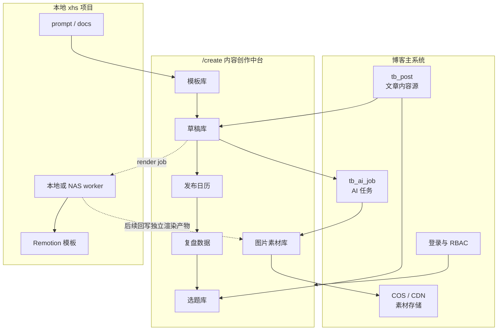
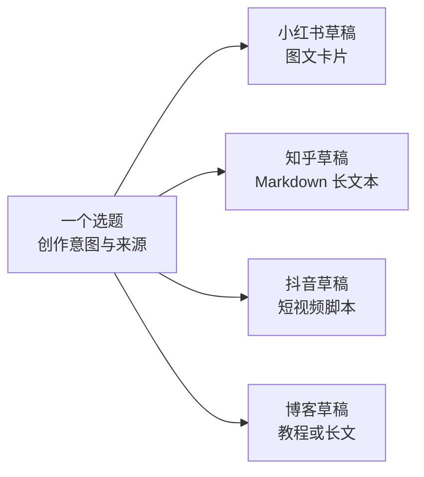
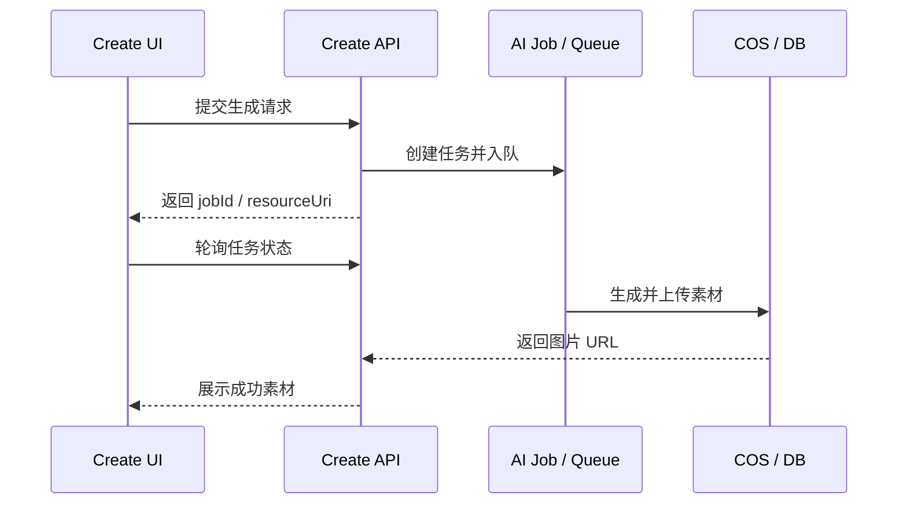

# 内容创作中台设计

> **状态**：🔄 进行中
> **创建时间**：2026-07-07
> **关联计划**：[内容创作中台建设计划](../../plans/content-creation-platform.md)
> **目标入口**：`/create`
> **本地协作项目**：`/Users/nnnnzs/project/xhs`

---

## 1. 定位

内容创作中台是博客项目内的独立创作后台，用于把用户主动发现的文章、网站、博客和项目经验，经过 AI Agent 整理为可去重、可记录、可再次创作的选题，并进一步生成不同平台的内容草稿。

它不是博客 CMS 的一个菜单项，而是与 `/c` 平级的独立后台：

- `/c`：博客管理系统，面向文章、合集、评论、配置、用户、接口和运维。
- `/create`：内容创作系统，面向选题、平台草稿、图片素材、发布和复盘。

第一阶段只做内容准备和素材生产，不做小红书自动发布。

## 2. 设计目标

核心目标：

1. 用 `/create` 承载独立的信息架构和创作工作台。
2. 把 `xhs` 的选题池、提示词、草稿目录、发布清单迁移为结构化数据。
3. 复用博客已有的登录、AI 配置、联网搜索、图片生成、图片编辑、TTS、队列和 COS 上传能力；内容中台 RBAC 权限按当前代码接入。
4. 保留 `xhs` 作为本地 Remotion worker 和模板实验区。
5. Prisma schema 使用目录化拆分，内容中台模型放入独立的 `content.prisma`。

当前产品优先级：

1. 选题库：记录用户创作意图并负责去重。
2. 草稿库：按平台将一个选题加工成不同内容形态。
3. 素材库：管理图片、母图和生成结果。
4. 发布日历、复盘数据、模板管理。
5. Remotion、视频和音频能力优先级很低，不进入当前素材库主流程。

非目标：

- 不把 `xhs` 仓库直接合进博客仓库。
- 不在第一阶段做平台自动发布。
- 不为内容中台单独引入第二套 Prisma Client。
- 不把 `/create` 设计成营销首页。

## 3. 系统边界



## 4. 路由设计

`/create` 使用独立 layout、独立导航和独立登录守卫。当前 layout 和 API 已使用 `CONTENT_VIEW` / `CONTENT_CREATE` 等内容权限；更细的内容中台权限仍可按多人协作需要继续拆分。

| 路由 | 页面 | 职责 |
|------|------|------|
| `/create` | 工作台 | 本周选题、待生成素材、待发布、复盘提醒 |
| `/create/drafts` | 草稿库 | 管理草稿列表、简化新建、状态筛选和删除 |
| `/create/assets` | 素材库 | 管理图片素材：生成图、上传图、收藏、分组、删除和参考图复用 |

素材库的生成区复用 AI 图片工作台的 `ImageGenerationComposer`；素材库只通过 `ImageAssetAddModal` 执行入库。参考图上传属于图片工作台的通用能力，走 `ImageReferenceAddModal` 并只返回 URL，不得隐式创建素材记录。
| `/create/topics` | 选题库 | 记录用户想法、来源、创作方向和使用状态；支持 AI 从文章、网站和博客整理选题并去重 |
| `/create/drafts/[id]` | 草稿详情 | 编辑标题、正文、类型、状态、草稿选用图片、图片备注、图片排序和打包下载 |
| `/create/calendar` | 发布日历 | 管理平台、计划发布时间和发布状态 |
| `/create/review` | 复盘数据 | 录入和查看收藏、评论、私信、博客回流 |
| `/create/templates` | 模板管理 | 管理 prompt、视觉模板、TTS 风格、上下文模板和 checklist；支持导入 `xhs/prompts` |

## 5. 页面体验

### 5.1 工作台

工作台第一屏展示真实待办，不做欢迎页或营销 hero。

推荐模块：

- 本周计划：按平台和状态展示待写、待生成、待发布。
- 最近草稿：展示草稿状态、素材状态和下一步动作。
- 素材任务：展示图片生成任务的排队、处理中、失败。
- 复盘提醒：展示待录入数据和表现异常内容。

### 5.2 草稿详情

草稿库列表只负责创建最小草稿、筛选、进入编辑和删除。新建草稿只填写标题、类型和状态，不再要求选题 ID、来源博客、正文、标签等字段。

草稿详情采用编辑工作台布局：

| 区域 | 内容 |
|------|------|
| 主栏 | 标题、正文、类型、状态 |
| 右栏 | 草稿已选图片；TTS/Remotion 后续扩展 |

草稿编辑必须支持人工覆盖 AI 结果。AI 生成只负责起草，不覆盖人工确认后的内容。

草稿选用图片保存在 `ContentDraft.generation_snapshot_json.draftImages`，不回写 `ContentAsset.draft_id`。因此一张图片素材可以被多个草稿重复添加，也可以在同一草稿中按需要重复使用。

`draftImages` 是草稿内的图片使用快照，包含素材 ID、图片 URL、标题、分组、添加时间、`sortOrder` 和 `remark`。`sortOrder` 用于保存前端拖拽后的展示顺序，旧数据读取时按数组顺序补齐；`remark` 用于记录封面图或单张图片备注。备注和排序只影响草稿内这次使用，不修改素材库中的素材名称或 CDN URL。

草稿详情右栏支持把当前草稿图片按保存顺序一键打包下载。下载包包含图片文件和 `manifest.json`，manifest 记录每张图片的素材 ID、原始 URL、分组、顺序和备注，便于后续发布或交给本地工作流处理。

### 5.3 选题库

选题库不是内容排期表，也不负责定义小红书、知乎或抖音的产出格式。它保存的是用户建立选题时的原始想法、核心方向和来源，作为后续草稿 Agent 的创作上下文。

一个选题可以生成多个平台草稿：



选题入库流程：

1. 用户提供文章、网站、博客文章或一句想法。
2. AI Agent 读取来源或联网搜索相关内容。
3. AI Agent 按固定格式提取标题、原始想法、核心角度和来源。
4. 入库前检查已有选题，提示标题、来源或语义上的重复。
5. 用户确认后保存，后续从选题选择平台并创建草稿。

选题记录建议只保留：

- `title`：选题标题。
- `source_type`、`source_url`、`source_post_id`：来源信息。
- `original_idea`：用户最初为什么想做这个选题。
- `core_angle`：准备从什么角度讲。
- `key_points`：希望覆盖的核心信息，可为 Markdown 或 JSON。
- `dedup_key`：标题和来源标准化后的去重依据。
- `status`：`IDEA`、`USED`、`ARCHIVED`。
- `created_by`、`created_at`、`updated_at`。

栏目、内容支柱和优先级可以保留为可选标签，但不能成为选题入库的必填条件。平台产出要求、图片生成要求和文章结构属于模板及草稿生成配置，不写入选题记录。

当前实现已提供手动创建、编辑、删除、标题加来源的标准化去重，以及从选题创建小红书、知乎、抖音或博客草稿的入口。创建草稿时会将选题内容写入草稿的 `generation_snapshot_json.topicSnapshot`，因此后续调整选题不会改写历史草稿。AI 从博客生成的入口已按这组字段输出；链接和网站的联网读取、对话式 Topic Agent 仍以 [Topic Agent 设计](../ai/topic-agent.md) 为后续工作。

### 5.4 素材库

素材库当前只管理图片，不承担选题提示词或平台输出模板。选题创作意图保存在 `ContentTopic`，平台输出要求保存在 `ContentTemplate`，图片素材库只保存生产过程中产生或上传的图片。

图片来源分为：

- 生成图片：复用现有 `image-gen` / `image edit` 队列接口，提交后立即创建素材卡片，使用预分配 CDN URL 等待任务完成。
- 上传图片：上传到 COS 后创建素材卡片。

素材卡片支持：

- 改名，但不修改 `cdn_url`。
- 收藏，用于后续筛选常用图。
- 分组，当前复用 `content_assets.usage` 字段保存分组名。
- 作为母图，图文编辑时把已完成的素材图传入同一图片编辑接口。
- 添加到草稿：只能选择 `DRAFT` 状态草稿，追加到草稿图片列表，不改变素材本身归属。

## 6. 权限设计

当前实现已在 `/create` layout 和内容 API 使用内容权限检查。页面访问由 `CONTENT_VIEW` 控制，创建选题和 AI 生成选题由 `CONTENT_CREATE` 控制。更细的选题、草稿、素材和模板权限仍可后续拆分。

后续如果需要多人协作、创作者角色或更细的素材生成控制，再新增内容中台权限模块，避免复用 `/c` 的工具权限造成边界混乱。

后续权限码草案：

| 权限码 | 名称 | 用途 |
|--------|------|------|
| `content:view` | 查看内容中台 | 访问 `/create` |
| `content:topic:manage` | 管理选题 | 新增、编辑、归档选题 |
| `content:draft:edit` | 编辑草稿 | 编辑草稿和 slides |
| `content:asset:generate` | 生成素材 | 提交图片生成和图片编辑任务 |
| `content:publish:manage` | 管理发布 | 维护发布清单和发布状态 |
| `content:review:manage` | 管理复盘 | 录入和编辑复盘数据 |
| `content:template:manage` | 管理模板 | 维护 prompt 和 checklist |

角色策略：

- 当前阶段：拥有 `CONTENT_VIEW` 的用户可访问 `/create`，拥有 `CONTENT_CREATE` 的用户可创建选题并调用 AI 生成选题。
- 后续阶段：管理员默认拥有全部内容中台权限，创作者角色按选题、草稿、素材和复盘能力单独授权。

## 7. Prisma 组织

### 7.1 schema 文件夹

内容中台使用 schema 文件夹拆分，但仍生成一个 Prisma Client。

```text
prisma/schema/
├── base.prisma
├── blog.prisma
├── rbac.prisma
├── ai.prisma
└── content.prisma
```

`content.prisma` 只放 `content_*` 模型。内容模型第一阶段尽量用 id 弱关联博客文章和用户，减少对主模型的反向 relation 污染。

开发环境注意：新增 `content_*` 模型后，需要同时完成 `prisma generate` 和数据库结构同步。由于项目会在 `global.prisma` 缓存 Prisma Client，dev server 运行期间可能继续持有旧 client，导致 `prisma.contentDraft` 等新 delegate 为 `undefined`。`src/lib/prisma.ts` 已对内容中台 delegate 做自检并自动创建新 client；如果后续新增模型仍遇到类似错误，优先检查 client 生成、delegate 自检和 dev server 缓存。

### 7.2 内容模型

| 模型 | 表名 | 职责 |
|------|------|------|
| `ContentTopic` | `content_topics` | 选题 |
| `ContentDraft` | `content_drafts` | 草稿主体 |
| `ContentDraftSlide` | `content_draft_slides` | 图文卡片 |
| `ContentAsset` | `content_assets` | 图片素材 |
| `ContentTemplate` | `content_templates` | 平台输出模板、prompt、视觉模板、TTS 风格、上下文模板 |
| `ContentPublishRecord` | `content_publish_records` | 发布记录 |
| `ContentMetric` | `content_metrics` | 复盘指标 |

### 7.3 与现有表关系

第一阶段建议弱关联：

- `source_post_id` 指向 `tb_post.id`，不声明 Prisma relation。
- `created_by` 指向 `tb_user.id`，不声明 Prisma relation。
- `ai_job_id` 指向 `tb_ai_job.id`，不声明 Prisma relation。

弱关联的好处是 `content.prisma` 可以独立演进，不需要在 `TbPost`、`TbUser`、`TbAiJob` 上添加大量反向字段。业务层在需要时手动查询关联对象。

## 8. 与 xhs 的迁移映射

| 本地资产 | 线上对象 | 迁移方式 |
|----------|----------|----------|
| `content/topic-bank.md` | `ContentTopic` | 脚本导入或手动初始化 |
| `content/calendar/*.md` | `ContentPublishRecord` | 后续导入历史计划 |
| `content/drafts/*/README.md` | `ContentDraft` + `ContentDraftSlide` | 可选历史导入 |
| `prompts/blog-to-xhs-note.md` | `ContentTemplate` | 初始化为图文生成模板 |
| `prompts/blog-to-short-video.md` | `ContentTemplate` | 初始化为短视频模板 |
| `prompts/mimo-tts-style.md` | `ContentTemplate` | 初始化为 TTS 风格模板 |
| `docs/brand-positioning.md` | 模板/配置 | 抽出账号定位和视觉资产 |
| Remotion 模板 | 本地 worker | 第一阶段不迁入线上构建链路 |

迁移后，线上模板是生产主版本；`xhs` 中的 prompt 用于实验和 worker，不再作为唯一 source of truth。

`content_templates` 当前字段包括 `name`、`type`、`scenario`、`content`、`variables_json`、`output_schema_json`、`version`、`status`、`source_path`、`created_by`、`created_at` 和 `updated_at`。其中 `source_path` 用于记录从 `xhs/prompts` 导入的来源路径；重复同步时按来源路径更新模板并递增版本。

## 9. 生成任务设计

内容创作中台不新增重复队列，继续复用现有 AI 任务和队列能力。草稿生成必须以“选题 + 目标平台 + 模板”为输入，同一个选题可以创建多个平台草稿。

| 任务 | 第一阶段实现 |
|------|--------------|
| 多平台草稿生成 | 根据选题、平台和模板生成小红书图文、知乎 Markdown、抖音短视频脚本等草稿 |
| 图片生成 | 复用 `generate_image` / `edit_image` 和 `tb_ai_job`，结果进入图片素材库 |
| 图片上传 | 复用 COS 上传能力，结果进入图片素材库 |
| TTS 生成 | 后续按草稿详情需要接入，不进入当前图片素材库 |
| Remotion 渲染 | 后续独立设计 worker 协议，不进入当前图片素材库 |

任务返回模式延续现有异步模式：



## 10. 发布与复盘

小红书、抖音等平台第一阶段都走手动发布。

系统负责：

- 生成标题、正文、标签和素材。
- 生成发布 checklist。
- 记录计划发布时间。
- 手动标记发布完成。
- 手动录入表现数据。
- 根据复盘数据反哺选题。

系统不负责：

- 自动登录平台。
- 自动发布。
- 自动绕过验证码或风控。

## 11. 实施顺序

1. schema 文件夹化。
2. `/create` 独立后台壳和用户菜单入口。
3. 草稿库、素材库、选题库 MVP。
4. AI 从文章、网站和博客生成去重后的选题。
5. 从一个选题按平台生成不同草稿。
6. 素材任务关联。
7. 发布清单和复盘数据。
8. 后续按需要接入内容中台 RBAC 权限。
9. Remotion worker 协议。

## 12. 验收标准

第一阶段完成时应满足：

- `/create` 与 `/c` 是两个独立后台入口。
- `/create` 页面和内容 API 使用内容权限检查。
- 内容中台模型不继续堆在单一 `schema.prisma` 中。
- 可以让 AI 基于文章、网站或博客创建并去重选题。
- 选题保存原始想法、核心角度和来源，作为草稿 Agent 的上下文。
- 一个选题可以分别生成小红书图文、知乎 Markdown、抖音短视频脚本等多个草稿。
- 每个平台草稿使用独立的模板和输出结构。
- 草稿包含与平台匹配的标题、正文、标签、slides 或脚本结构。
- 可以生成或上传图片素材。
- 已生成/上传的图片可以收藏、分组并作为图文编辑母图。
- 可以生成发布清单，但不自动发布。
