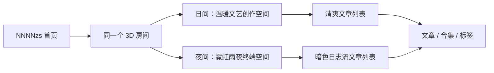

# 首页 3D 昼夜双主题设计

## 背景

`NNNNzs` 的首页已经具备程序化 3D 房间雏形，但早期方案偏向单一夜间赛博朋克视觉。新的方向是让日间与夜间共享同一个空间布局：日间温馨、明亮、文艺，夜间霓虹、雨夜、赛博朋克。

品牌解释：

```txt
NNNNzs = Neon Nomad Navigating Night Zones
```

这个解释更适合成为夜间主题的精神内核，但不应该让日间模式也变成强霓虹风格。日间应该像一个真实、温暖、适合阅读和创作的房间；夜间则像同一房间进入了城市边缘的深夜状态。

## 设计目标

1. 首页日间和夜间都使用 3D 房间作为首屏。
2. 日间和夜间保持同一布局、同一空间物件和同一信息结构。
3. 主题差异只体现在灯光、材质、窗外、天气、后处理和覆盖层。
4. 日间模式避免赛博朋克化，回归清爽、温暖、文艺、低干扰。
5. 夜间模式保留赛博朋克，但控制性能、滚动体验和信息可读性。
6. 3D 只是氛围入口，文章列表仍负责高效阅读、SEO 和可访问性。

## 体验叙事



日间不是夜间赛博朋克的浅色版，而是同一个人白天创作、阅读、整理资料的房间。

夜间不是单纯变暗，而是同一个空间进入 `Neon Nomad Navigating Night Zones` 的状态。

## 视觉规范

### 日间主题

关键词：

```txt
温暖
明亮
文艺
安静
木质
纸张
阳光
植物
适合阅读
```

日间视觉要点：

- 光源以窗外自然光为主，辅以暖色台灯。
- 窗外是柔和天空、远处城市、轻薄窗帘。
- 地板和家具偏木质、布料、纸张、暖灰和白色。
- 屏幕发光要克制，不能成为主视觉。
- 覆盖层只保留站名、副标语和轻量状态，不使用强 HUD。
- 文章区保持常规博客卡片体验。

建议颜色：

| 用途 | 色值 |
|------|------|
| 背景 | `#f8fafc` |
| 暖光 | `#ffd9a3` |
| 天空蓝 | `#bae6fd` |
| 木色 | `#8b6f4e` |
| 文本 | `#1e293b` |
| 次文本 | `#64748b` |

### 夜间主题

关键词：

```txt
霓虹
雨夜
赛博朋克
终端
深色
城市边缘
孤独
锋利
```

夜间视觉要点：

- 光源以窗外城市霓虹、显示器、服务器和招牌为主。
- 窗外是雨夜城市，允许飞行器光轨和远处广告牌。
- 使用 Bloom 和 Vignette，但移动端需要降级。
- HUD 可以更明显，但不能遮挡房间主体和滚动入口。
- 文章区可以是暗色日志流，但布局与日间一致。

建议颜色：

| 用途 | 色值 |
|------|------|
| 背景 | `#050611` |
| 深蓝 | `#080b17` |
| 霓虹青 | `#00f0ff` |
| 霓虹粉 | `#ff0066` |
| 霓虹绿 | `#00ff88` |
| 文本 | `#f8fbff` |

## 技术设计

### 组件命名

当前组件在 `src/components/cyberpunk/` 下，后续建议逐步迁移到更中性的命名，避免日间主题被 `cyberpunk` 语义绑定。

| 当前组件 | 建议组件 | 说明 |
|---------|----------|------|
| `CyberpunkBanner` | `Homepage3DBanner` | 首页 3D 首屏容器 |
| `CyberpunkLights` | `SceneLights` | 根据主题切换灯光 |
| `Room` | `Room` | 房间结构，接收主题 preset |
| `Furniture` | `Furniture` | 家具与物件，接收主题 preset |
| `RainEffect` | `WeatherEffect` | 夜间雨，日间可改为空气尘埃 |
| `useSceneStore` | `useHomepageSceneStore` | 调试与主题参数 |

### 主题 preset

```ts
export type HomepageSceneVariant = 'day' | 'night';

export interface HomepageThemePreset {
  variant: HomepageSceneVariant;
  background: string;
  overlay: 'minimal' | 'hud';
  weather: 'clear' | 'rain';
  postProcessing: {
    bloomIntensity: number;
    vignetteDarkness: number;
  };
  lights: {
    ambientColor: string;
    ambientIntensity: number;
    windowColor: string;
    windowIntensity: number;
    monitorIntensity: number;
    accentColor: string;
  };
  materials: {
    wallColor: string;
    floorColor: string;
    fabricColor: string;
    emissiveScale: number;
    metalnessScale: number;
  };
}
```

日间 preset：

```ts
export const DAY_PRESET: HomepageThemePreset = {
  variant: 'day',
  background: '#f8fafc',
  overlay: 'minimal',
  weather: 'clear',
  postProcessing: {
    bloomIntensity: 0.15,
    vignetteDarkness: 0.18,
  },
  lights: {
    ambientColor: '#fff7ed',
    ambientIntensity: 0.65,
    windowColor: '#ffe8bf',
    windowIntensity: 2.2,
    monitorIntensity: 0.35,
    accentColor: '#38bdf8',
  },
  materials: {
    wallColor: '#e8edf3',
    floorColor: '#8b6f4e',
    fabricColor: '#d8dee8',
    emissiveScale: 0.15,
    metalnessScale: 0.45,
  },
};
```

夜间 preset：

```ts
export const NIGHT_PRESET: HomepageThemePreset = {
  variant: 'night',
  background: '#050611',
  overlay: 'hud',
  weather: 'rain',
  postProcessing: {
    bloomIntensity: 1.5,
    vignetteDarkness: 0.8,
  },
  lights: {
    ambientColor: '#ffffff',
    ambientIntensity: 0.08,
    windowColor: '#4466aa',
    windowIntensity: 3.5,
    monitorIntensity: 2.5,
    accentColor: '#00f0ff',
  },
  materials: {
    wallColor: '#0d0d1a',
    floorColor: '#121218',
    fabricColor: '#1a1a30',
    emissiveScale: 1,
    metalnessScale: 1,
  },
};
```

### 主题来源

首页主题应跟随站点现有 `.dark` class。

```ts
const variant = document.documentElement.classList.contains('dark')
  ? 'night'
  : 'day';
```

后续可以把这个判断封装为 `useThemeVariant()`，避免组件里重复监听 `documentElement.classList`。

### 性能约束

- 任何时刻只挂载一个 Canvas。
- 日夜切换只切换 preset，不同时渲染两套场景。
- 日间关闭雨滴粒子或替换为极少量空气尘埃。
- 日间 Bloom 保持很低，避免移动端过载和视觉违和。
- 首屏不使用 `snap-y snap-mandatory`，避免滚动卡顿和浏览器滚动冲突。
- 移动端可降低粒子数量、后处理和 DPR。

## 信息结构

日间和夜间文章区保持同一 HTML 结构：

```txt
3D Banner
最近文章标题区
文章列表
加载更多
Footer
```

主题只改变表现：

| 区域 | 日间 | 夜间 |
|------|------|------|
| Banner | 温暖 3D 房间、轻文案 | 霓虹 3D 房间、HUD |
| 标题区 | 常规博客文案 | 数据日志文案 |
| 文章卡片 | 白色卡片、圆角、轻阴影 | 暗色边框、扫描质感、霓虹细节 |
| 加载更多 | 常规按钮 | 终端按钮 |

## 渐进实施步骤

1. 保留当前夜间 3D 场景，把容器重命名为 `Homepage3DBanner`。
2. 抽出 `HomepageSceneVariant` 和 `HomepageThemePreset`。
3. 让 `CyberpunkLights` 先支持日间/夜间两套灯光。
4. 让 `Room` 支持日间窗外纹理、墙面和地板材质。
5. 让 `Furniture` 支持日间低发光和温暖材质。
6. 日间先关闭 `RainEffect`，后续替换为空气尘埃。
7. Overlay 按主题拆成 `DayOverlay` 和 `NightOverlay`。
8. 文章区保持同一结构，使用 CSS `.dark` 切换视觉。
9. 使用 Playwright 或浏览器手工检查桌面/移动端首屏、滚动和切换。

## 验证清单

- [ ] 日间首页首屏是 3D 房间，而不是普通图片 Banner。
- [ ] 夜间首页首屏保留赛博朋克 3D 房间。
- [ ] 日间没有强霓虹、扫描线、HUD 堆叠和暗色数据日志感。
- [ ] 夜间不影响滚动，文章列表可顺畅浏览。
- [ ] 切换日夜不会同时挂载两个 Canvas。
- [ ] WebGL 不可用时有日间/夜间对应 fallback。
- [ ] 移动端首屏文字不遮挡主体空间。
- [ ] 文章标题、标签、摘要在日夜模式下都可读。

## 风险

1. **性能风险**：R3F + 后处理在移动端负担较高，需要日间低 Bloom、夜间降级。
2. **语义风险**：组件命名若继续绑定 cyberpunk，会让日间设计和代码语义冲突。
3. **视觉风险**：日间不能只是夜间调亮，否则会显得廉价和违和。
4. **维护风险**：如果日夜分成两套完全独立场景，后续内容映射会重复实现。
5. **SEO 风险**：Canvas 仍不可索引，站名、副标语和文章入口必须保留 HTML。
## 当前实现状态

当前 3D 首页已经按“装配层 + 子组件层 + 数据层”拆开，不再把整个场景堆在单个大文件里。

### 组件拆分

- `CyberpunkBanner` 负责首页 3D 容器和整体挂载。
- `CyberpunkLights` 负责场景灯光、可见灯具和主题光照逻辑。
- `Room` 只负责房间结构装配。
- `Furniture` 只负责家具与物件装配。
- `room/` 目录下拆分了地板、墙面、管线、窗景、房间细节和纹理生成。
- `furniture/` 目录下拆分了显示器、工作区、储物墙、睡眠区、衣柜、霓虹牌和共享小组件。
- `sceneLayout.ts` 保留场景布局数据，统一管理灯带、家具和结构的空间坐标。

### 代码约定

- 模型、材质、灯具和光源尽量封装成同一个组件或同一个子目录文件。
- 功能性灯具必须在单个组件中同时包含可见灯体、发光材质和实际光源，禁止把模型和光源拆到两个彼此无关的文件里。
- 灯条、吊灯、台灯、招牌灯这类“会照亮空间”的元素，默认采用 `Fixture` 封装模式；只有纯装饰 emissive 片、状态点、HUD 光点才允许只保留 mesh。
- 每个灯具组件应对外表现为一个完整单元，便于后续统一调位置、亮度、颜色和日夜主题参数。
- 装配层只负责编排，不承载大段几何实现。
- 共享尺寸、纹理生成和材质常量优先收敛到 `shared` 文件。
- 日夜主题差异优先通过 `variant`、`theme.ts` 和 `sceneLayout.ts` 统一驱动，避免在多个文件里重复分叉。

### 文档同步

- 当 3D 首页新增子目录或拆分结构时，需要同步更新 `docs/rules/directory-structure.md`。
- 当 3D 首页的组件职责发生变化时，需要同步更新本设计文档的实现状态说明。
