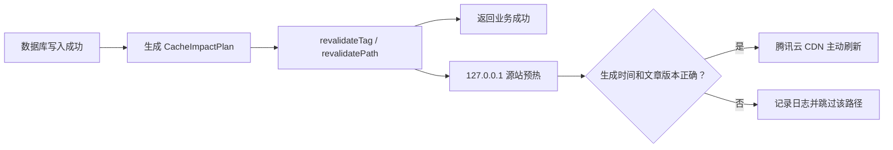

# Next.js 与腾讯云 CDN 缓存失效

## 总体流程

文章、合集和部署变更统一生成 `CacheImpactPlan`。运行时写操作在数据库成功后立即标记 Next.js tag/path 失效，业务接口不等待后续流程；单实例进程内的 Promise 链依次执行源站预热、版本验证和腾讯云 CDN 刷新。



缓存辅助流程不建立数据库任务、Redis 队列或任务 ID，不轮询、不重试。Next.js 失效、源站预热或 CDN 刷新失败均不回滚业务数据。

## 影响范围

代码级影响映射位于 `src/lib/cache-impact.ts`：

- 文章正文类变更：详情、RSS、所属合集。
- 标题、日期、路径、公开状态：旧/新详情、首页、归档、RSS、sitemap、标签、分类和合集。
- 标签、分类、合集关系：使用变更前后集合的并集。
- 合集创建、编辑、删除、文章加入/移出/排序：合集详情、合集列表、首页书架和相关文章详情。
- 点赞、访问量及 RAG 内部字段：不触发公开页面和 CDN 刷新。
- `/timeline` 不读取文章数据，不属于文章影响范围。

## 页面诊断

所有完整 HTML 页面包含：

```html
<meta
  name="next-rendered-at"
  content="2026-07-31 16:20:30"
  data-cache-scope="full-route"
/>
```

文章详情额外包含 `data-post-id` 和 `data-post-updated-at`。两个诊断时间字段都使用 `Asia/Shanghai` 的 `YYYY-MM-DD HH:mm:ss` 格式；`next-rendered-at` 表示 HTML 生成时间，`data-post-updated-at` 表示文章更新时间，两者语义不同，数值不要求相同。

排查时分别请求源站和公网：

```bash
curl -sS http://127.0.0.1:3000/文章路径 | grep -o 'name="next-rendered-at"[^>]*'
curl -sS https://www.nnnnzs.cn/文章路径 | grep -o 'name="next-rendered-at"[^>]*'
```

- 源站标记仍旧：Next.js Full Route/Data Cache 尚未得到新版本。
- 源站标记已更新、公网标记仍旧：CDN 仍在返回旧对象。
- 公网 `cache_miss` 但源站标记仍旧：CDN 已回源，问题仍位于 Next.js。

应使用完整浏览器刷新或直接获取 HTML。客户端 `<Link>` 导航可能复用 Router Cache 中的共享布局，不能单独用于判断服务端页面是否重新生成。

## 部署清单

`scripts/purge-cdn.mjs` 只生成 `.cdn-purge/pending.json`，不直接创建腾讯云客户端。服务器部署脚本从旧容器镜像 label 读取上次成功 commit，从新镜像 label 读取目标 commit，计算完整 `oldCommit..newCommit` 文件差异；无法解析基线时写入全站刷新清单。

`.cdn-purge` 挂载到容器 `/app/.cdn-purge`。新容器健康后，部署脚本通过 `127.0.0.1` 和独立 Bearer 密钥调用内部消费接口。接口先把清单原子重命名为处理中状态，尝试结束后删除，因此普通容器重启不会重复提交刷新。

## CDN 目标类型

- 首页、RSS、sitemap 和 `public/**`：`PurgeUrlsCache` 精确 URL。
- 一般页面路由：`PurgePathCache`，`FlushType: "delete"`。
- 根布局、全局样式或无法映射的公共渲染组件：根目录全站刷新。
- 页面域名由 `CDN_SITE_URL` 控制；COS 资源应使用完整的 `static.nnnnzs.cn` URL，避免与页面 CDN 混淆。
