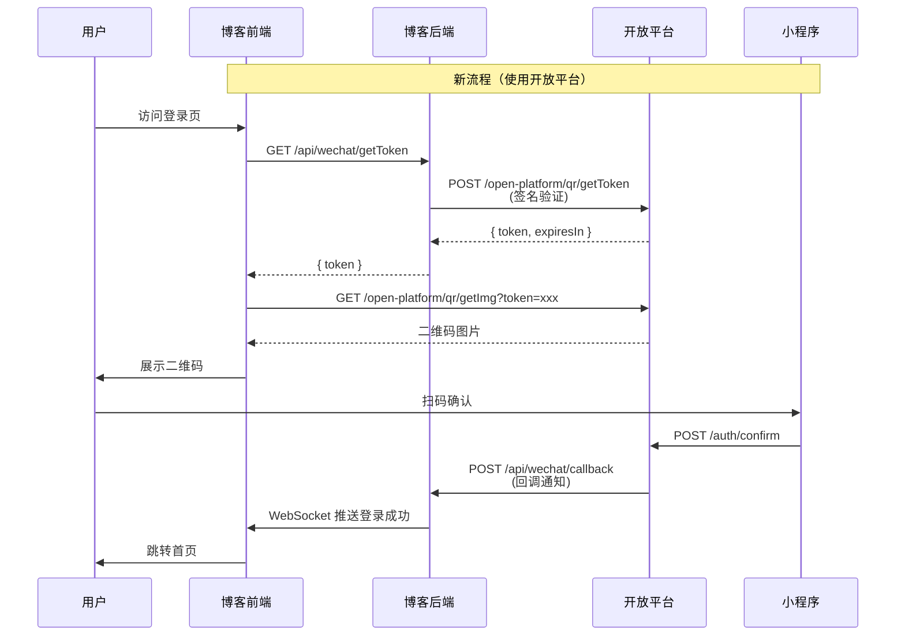

# 开放平台 OAuth 接入设计

## 📋 概述

将博客系统改造为开放平台的第三方应用，使用开放平台提供的扫码登录能力，支持**扫码登录**和**绑定微信**两个功能。

**设计目标：**
- 统一扫码登录能力，降低维护成本
- 利用开放平台的成熟架构和功能
- 支持扫码登录和微信绑定双场景
- 直接升级，不保留旧逻辑

**涉及系统：**
- 博客前端：`react.nnnnzs.cn`
- 博客后端：`api.nnnnzs.cn`
- 开放平台：`https://api.nnnnzs.cn/open-platform`

**应用注册：**
需要在开放平台注册应用并配置以下信息到博客系统的配置管理中：
- AppKey: 开放平台分配的应用密钥
- AppSecret: 开放平台分配的应用秘钥
- API URL: 开放平台 API 地址（默认: https://api.nnnnzs.cn）

## 🔄 现状分析

### 现有扫码登录流程

```
用户 → 博客前端 → 博客后端 (/api/wechat/*)
                  ↓
              微信小程序 API
                  ↓
              小程序确认 → Redis 存储 → 前端轮询
```

**现有接口：**
- `GET /api/wechat/getToken` - 生成登录 token
- `GET /api/wechat/getImg` - 获取小程序码
- `GET /api/wechat/status` - 查询扫码状态
- `POST /api/wechat/confirm` - 小程序确认授权
- `GET /api/wechat/info` - 获取 token 信息

### 开放平台能力

```
第三方应用 → 开放平台 API (/open-platform/*)
             ↓
         签名验证 → 限流控制
             ↓
         微信小程序 → 回调通知
```

**开放平台接口：**
- `POST /open-platform/register` - 注册应用
- `POST /open-platform/qr/getToken` - 创建扫码会话
- `GET /open-platform/qr/getImg` - 获取二维码
- `GET /open-platform/qr/status` - 查询扫码状态
- 应用管理接口（info/update/regenerate-secret）

## 🏗️ 技术方案

### 整体架构



### 双场景支持设计

通过 `getToken` 的 `params` 参数区分场景：

| 场景 | action 参数 | 说明 |
|------|-------------|------|
| 扫码登录 | `login` | 用户扫码后直接登录或自动注册 |
| 绑定微信 | `bind:userId` | 用户扫码后绑定微信到指定账号 |

**params 参数结构：**
```typescript
interface WechatParams {
  action: 'login' | 'bind';
  userId?: number; // 绑定场景下的用户ID
  redirectUrl?: string; // 登录成功后跳转地址
}
```

### 配置存储设计

使用现有的 `TbConfig` 表存储开放平台配置：

| 配置键 | 说明 | 示例值 |
|--------|------|--------|
| `OPEN_PLATFORM_APP_KEY` | 应用密钥 | `opk_891ea85a90314319` |
| `OPEN_PLATFORM_APP_SECRET` | 应用秘钥（加密存储） | `ops_2d79309b39320587196b1c3c1db039c0` |
| `OPEN_PLATFORM_API_URL` | 开放平台 API 地址 | `https://api.nnnnzs.cn` |

**配置管理页面：**
在 `/c/config` 添加开放平台配置分组，支持：
- 查看 appKey 和 appSecret
- 查看回调地址配置
- 查看应用注册信息

### 后端接口设计

#### 1. 签名工具函数

创建 `src/lib/open-platform.ts`：

```typescript
import crypto from 'crypto';
import type { WechatScanData } from '@/types/wechat';

/**
 * 生成请求签名
 * 签名字符串 = HTTP方法 + "\n" + 请求路径 + "\n" + 时间戳 + "\n" + 请求体JSON
 * 签名值 = HMAC-SHA256(签名字符串, appSecret)
 */
export function generateSignature(
  method: string,
  path: string,
  timestamp: string,
  body: any,
  appSecret: string
): string {
  const bodyStr = body ? JSON.stringify(body) : '';
  const signString = `${method}\n${path}\n${timestamp}\n${bodyStr}`;
  return crypto
    .createHmac('sha256', appSecret)
    .update(signString)
    .digest('hex');
}

/**
 * 验证回调签名
 */
export function verifyCallback(
  bodyStr: string,
  appSecret: string,
  signature: string
): boolean {
  const expected = crypto
    .createHmac('sha256', appSecret)
    .update(bodyStr)
    .digest('hex');
  return expected === signature;
}

/**
 * 获取开放平台配置
 */
export async function getOpenPlatformConfig() {
  const prisma = await getPrisma();
  const configs = await prisma.tbConfig.findMany({
    where: {
      key: {
        in: [
          'OPEN_PLATFORM_ENABLED',
          'OPEN_PLATFORM_APP_KEY',
          'OPEN_PLATFORM_APP_SECRET',
        ],
      },
    },
  });

  const configMap = Object.fromEntries(
    configs.map((c) => [c.key, c.value])
  );

  return {
    enabled: configMap.OPEN_PLATFORM_ENABLED === 'true',
    appKey: configMap.OPEN_PLATFORM_APP_KEY || '',
    appSecret: configMap.OPEN_PLATFORM_APP_SECRET || '',
  };
}

/**
 * 调用开放平台 API
 */
export async function callOpenPlatformAPI<T = any>(
  path: string,
  method: string = 'POST',
  body?: any
): Promise<T> {
  const { appKey, appSecret, apiUrl } = await getOpenPlatformConfig();
  const timestamp = Math.floor(Date.now() / 1000).toString();
  const signature = generateSignature(method, path, timestamp, body, appSecret);

  const url = `${apiUrl}/open-platform${path}`;

  const response = await fetch(url, {
    method,
    headers: {
      'Content-Type': 'application/json',
      'X-App-Key': appKey,
      'X-Timestamp': timestamp,
      'X-Signature': signature,
    },
    body: body ? JSON.stringify(body) : undefined,
  });

  if (!response.ok) {
    throw new Error(`开放平台 API 调用失败: ${response.statusText}`);
  }

  const result = await response.json();
  if (!result.status) {
    throw new Error(result.msg || '开放平台 API 调用失败');
  }

  return result.data;
}

#### 2. 回调接口

创建 `src/app/api/wechat/callback/route.ts`：

```typescript
import { NextRequest, NextResponse } from 'next/server';
import { verifyCallback, getOpenPlatformConfig } from '@/lib/open-platform';
import { successResponse, errorResponse } from '@/dto/response.dto';
import { getPrisma } from '@/lib/prisma';
import { generateToken, storeToken } from '@/lib/auth';
import redisService from '@/lib/redis';

/**
 * 回调参数类型
 */
interface CallbackParams {
  action: 'login' | 'bind';
  userId?: number;
  redirectUrl?: string;
}

/**
 * 开放平台回调请求体
 */
interface CallbackBody {
  token: string;
  appKey: string;
  status: number;
  openId: string;
  scanData: {
    nickName: string;
    avatarUrl: string;
  };
  params: CallbackParams;
  timestamp: number;
}

/**
 * POST /api/wechat/callback
 * 开放平台回调接口
 *
 * 功能：
 * 1. 验证回调签名
 * 2. 根据 action 参数处理登录或绑定逻辑
 * 3. 更新 Redis 状态供前端轮询
 */
export async function POST(request: NextRequest) {
  try {
    const body = await request.json() as CallbackBody;
    const {
      token,
      appKey,
      status,
      openId,
      scanData,
      params,
    } = body;

    // 验证签名
    const { appSecret } = await getOpenPlatformConfig();
    const signature = request.headers.get('X-Signature');
    if (!signature || !verifyCallback(JSON.stringify(body), appSecret, signature)) {
      return NextResponse.json(
        errorResponse('签名验证失败'),
        { status: 401 }
      );
    }

    // 验证 appKey
    const { appKey: expectedAppKey } = await getOpenPlatformConfig();
    if (appKey !== expectedAppKey) {
      return NextResponse.json(
        errorResponse('appKey 不匹配'),
        { status: 403 }
      );
    }

    const prisma = await getPrisma();

    // 根据 action 处理不同逻辑
    if (params?.action === 'bind') {
      // 绑定微信场景
      const userId = params.userId;
      if (!userId) {
        return NextResponse.json(
          errorResponse('绑定场景缺少 userId'),
          { status: 400 }
        );
      }

      // 检查该 openid 是否已被其他用户绑定
      const existingUser = await prisma.tbUser.findFirst({
        where: { wx_open_id: openId },
      });

      if (existingUser && existingUser.id !== userId) {
        return NextResponse.json(
          errorResponse('该微信已被其他账号绑定'),
          { status: 400 }
        );
      }

      // 绑定微信到当前用户
      await prisma.tbUser.update({
        where: { id: userId },
        data: {
          wx_open_id: openId,
          avatar: scanData?.avatarUrl || existingUser?.avatar,
        },
      });

      // 更新 Redis 状态
      await redisService.set(
        `wechat_screen_key/${token}`,
        JSON.stringify({
          status: 1,
          action: 'bind',
          openId,
          scanData,
          message: '绑定成功',
        }),
        'EX',
        3600
      );

      return NextResponse.json(successResponse({
        action: 'bind',
        message: '绑定成功',
      }));
    } else {
      // 登录场景（默认）
      // 查找是否已有该 openid 的用户
      let user = await prisma.tbUser.findFirst({
        where: { wx_open_id: openId },
      });

      // 如果没有找到用户，创建新用户（自动注册）
      if (!user) {
        const { v4: uuidv4 } = await import('uuid');
        const account = `wx_${uuidv4().substring(0, 8)}`;

        user = await prisma.tbUser.create({
          data: {
            account,
            password: uuidv4(),
            nickname: scanData?.nickName || '微信用户',
            avatar: scanData?.avatarUrl || '',
            wx_open_id: openId,
            role: 'user',
            status: 1,
            registered_time: new Date(),
          },
        });
      }

      // 生成登录 token
      const loginToken = generateToken();
      await storeToken(loginToken, user);

      // 更新 Redis 状态
      await redisService.set(
        `wechat_screen_key/${token}`,
        JSON.stringify({
          status: 1,
          action: 'login',
          openId,
          userId: user.id,
          loginToken,
          scanData,
          message: '登录成功',
        }),
        'EX',
        3600
      );

      return NextResponse.json(successResponse({
        action: 'login',
        userId: user.id,
        loginToken,
      }));
    }
  } catch (error) {
    console.error('开放平台回调处理失败:', error);
    return NextResponse.json(
      errorResponse('回调处理失败'),
      { status: 500 }
    );
  }
}
```

#### 3. 改造现有接口

**getToken - 创建扫码会话：**

```typescript
// src/app/api/wechat/getToken/route.ts
import { NextRequest, NextResponse } from 'next/server';
import { callOpenPlatformAPI } from '@/lib/open-platform';
import { successResponse, errorResponse } from '@/dto/response.dto';

interface GetTokenQuery {
  action?: 'login' | 'bind';
  userId?: string;
  redirectUrl?: string;
}

/**
 * GET /api/wechat/getToken?action=login&userId=123
 * 创建扫码会话
 *
 * 参数：
 * - action: 场景类型，login（登录）或 bind（绑定）
 * - userId: 绑定场景下的用户ID
 * - redirectUrl: 登录成功后跳转地址
 */
export async function GET(request: NextRequest) {
  try {
    const searchParams = request.nextUrl.searchParams;
    const action = (searchParams.get('action') || 'login') as 'login' | 'bind';
    const userId = searchParams.get('userId');
    const redirectUrl = searchParams.get('redirectUrl');

    // 构建传递给开放平台的参数
    const params: Record<string, any> = {
      action,
    };

    if (action === 'bind' && userId) {
      params.userId = parseInt(userId, 10);
    }

    if (redirectUrl) {
      params.redirectUrl = redirectUrl;
    }

    // 调用开放平台创建会话
    const data = await callOpenPlatformAPI('/qr/getToken', 'POST', {
      params,
    });

    return NextResponse.json(successResponse(data));
  } catch (error) {
    console.error('获取 token 失败:', error);
    return NextResponse.json(
      errorResponse('获取 token 失败'),
      { status: 500 }
    );
  }
}
```

**getImg - 获取二维码：**

```typescript
// src/app/api/wechat/getImg/route.ts
import { NextRequest, NextResponse } from 'next/server';

/**
 * GET /api/wechat/getImg?token=xxx&env=release
 * 获取二维码图片
 *
 * 直接代理开放平台的二维码图片
 */
export async function GET(request: NextRequest) {
  try {
    const searchParams = request.nextUrl.searchParams;
    const token = searchParams.get('token');
    const env = (searchParams.get('env') || 'release') as 'release' | 'trial' | 'develop';

    if (!token) {
      return NextResponse.json(
        { status: false, msg: '缺少 token 参数' },
        { status: 400 }
      );
    }

    // 代理开放平台的二维码图片
    const apiUrl = `https://api.nnnnzs.cn/open-platform/qr/getImg?token=${token}&env_version=${env}`;
    const response = await fetch(apiUrl);

    if (!response.ok) {
      return NextResponse.json(
        { status: false, msg: '获取二维码失败' },
        { status: response.status }
      );
    }

    const imageBuffer = await response.arrayBuffer();

    return new NextResponse(new Uint8Array(imageBuffer), {
      headers: {
        'Content-Type': 'image/png',
        'Cache-Control': 'no-cache',
      },
    });
  } catch (error) {
    console.error('获取二维码失败:', error);
    return NextResponse.json(
      { status: false, msg: '获取二维码失败' },
      { status: 500 }
    );
  }
}
```

**status - 查询扫码状态：**

```typescript
// src/app/api/wechat/status/route.ts
import { NextRequest, NextResponse } from 'next/server';
import { callOpenPlatformAPI } from '@/lib/open-platform';
import { successResponse, errorResponse } from '@/dto/response.dto';
import redisService from '@/lib/redis';

/**
 * GET /api/wechat/status?token=xxx
 * 查询扫码状态
 *
 * 优先从 Redis 获取登录/绑定完成后的状态
 * 否则调用开放平台 API 查询扫码状态
 */
export async function GET(request: NextRequest) {
  try {
    const searchParams = request.nextUrl.searchParams;
    const token = searchParams.get('token');

    if (!token) {
      return NextResponse.json(
        errorResponse('缺少 token 参数'),
        { status: 400 }
      );
    }

    // 先检查 Redis 中是否有完成状态
    const cachedStatus = await redisService.get(`wechat_screen_key/${token}`);
    if (cachedStatus) {
      const status = JSON.parse(cachedStatus);
      if (status.status === 1) {
        // 登录/绑定已完成
        return NextResponse.json(successResponse(status));
      }
    }

    // 调用开放平台 API 查询状态
    const data = await callOpenPlatformAPI(`/qr/status?token=${token}`, 'GET');

    return NextResponse.json(successResponse(data));
  } catch (error) {
    console.error('查询状态失败:', error);
    return NextResponse.json(
      errorResponse('查询状态失败'),
      { status: 500 }
    );
  }
}
```

### 前端改造

#### 登录页面改造

```typescript
// src/app/login/page.tsx
'use client';

import { useState, useEffect } from 'react';
import { useRouter } from 'next/navigation';
import { Button, message } from 'antd';
import { WechatOutlined } from '@ant-design/icons';

export default function LoginPage() {
  const router = useRouter();
  const [token, setToken] = useState('');
  const [qrUrl, setQrUrl] = useState('');
  const [loading, setLoading] = useState(false);
  const [scanned, setScanned] = useState(false);

  // 启动扫码登录
  const startQrLogin = async () => {
    try {
      setLoading(true);
      setScanned(false);

      // 获取 token（默认登录场景）
      const res = await fetch('/api/wechat/getToken?action=login');
      const result = await res.json();

      if (!result.status) {
        throw new Error(result.msg || '获取 token 失败');
      }

      setToken(result.data.token);

      // 设置二维码 URL
      setQrUrl(`/api/wechat/getImg?token=${result.data.token}&env=release`);

      // 开始轮询状态
      pollStatus(result.data.token);
    } catch (error) {
      console.error('启动扫码登录失败:', error);
      message.error('启动扫码登录失败，请重试');
      setLoading(false);
    }
  };

  // 轮询扫码状态
  const pollStatus = async (token: string) => {
    const timer = setInterval(async () => {
      try {
        const res = await fetch(`/api/wechat/status?token=${token}`);
        const result = await res.json();

        if (!result.status) {
          throw new Error(result.msg || '查询状态失败');
        }

        const { data } = result;

        if (data.scanStatus === 0 && !scanned) {
          // 已扫码，等待确认
          setScanned(true);
          message.info('已扫码，请在小程序上确认');
        }

        if (data.status === 1 || data.scanStatus === 1) {
          clearInterval(timer);
          setLoading(false);

          // 登录成功
          if (data.action === 'login' && data.loginToken) {
            await handleLoginSuccess(data);
          }
        }
      } catch (error) {
        console.error('查询状态失败:', error);
      }
    }, 2000);

    // 5分钟后停止轮询
    setTimeout(() => {
      clearInterval(timer);
      if (loading) {
        setLoading(false);
        message.warning('二维码已过期，请重新扫码');
      }
    }, 5 * 60 * 1000);
  };

  // 处理登录成功
  const handleLoginSuccess = async (data: any) => {
    try {
      // 存储登录 token
      localStorage.setItem('token', data.loginToken);

      message.success('登录成功');

      // 跳转到首页或之前访问的页面
      const redirectUrl = data.params?.redirectUrl || '/';
      router.push(redirectUrl);
    } catch (error) {
      console.error('处理登录成功失败:', error);
      message.error('登录处理失败');
    }
  };

  useEffect(() => {
    startQrLogin();
  }, []);

  return (
    <div className="min-h-screen flex items-center justify-center bg-gray-50">
      <div className="bg-white p-8 rounded-lg shadow-md w-96">
        <h1 className="text-2xl font-bold text-center mb-6">扫码登录</h1>

        {qrUrl ? (
          <div className="flex flex-col items-center">
            
            <p className="text-gray-500 text-sm">
              {scanned ? '已扫码，请在小程序上确认' : '请使用微信小程序扫码登录'}
            </p>
            {loading && (
              <div className="mt-4">
                <div className="animate-spin rounded-full h-8 w-8 border-b-2 border-blue-500 mx-auto" />
              </div>
            )}
            <Button
              type="link"
              onClick={startQrLogin}
              className="mt-4"
            >
              刷新二维码
            </Button>
          </div>
        ) : (
          <div className="text-center">
            <div className="animate-spin rounded-full h-12 w-12 border-b-2 border-blue-500 mx-auto mb-4" />
            <p className="text-gray-500">正在生成二维码...</p>
          </div>
        )}

        <div className="mt-6 text-center">
          <p className="text-gray-400 text-xs">
            登录即表示同意《用户协议》和《隐私政策》
          </p>
        </div>
      </div>
    </div>
  );
}
```

#### 绑定微信页面

```typescript
// src/app/bind-wechat/page.tsx
'use client';

import { useState, useEffect } from 'react';
import { useRouter, useSearchParams } from 'next/navigation';
import { Button, message } from 'antd';
import { WechatOutlined } from '@ant-design/icons';
import { useAuth } from '@/contexts/AuthContext';

export default function BindWechatPage() {
  const router = useRouter();
  const searchParams = useSearchParams();
  const { user } = useAuth();

  const [token, setToken] = useState('');
  const [qrUrl, setQrUrl] = useState('');
  const [loading, setLoading] = useState(false);
  const [scanned, setScanned] = useState(false);

  // 启动绑定流程
  const startBind = async () => {
    if (!user?.id) {
      message.error('请先登录');
      router.push('/login');
      return;
    }

    try {
      setLoading(true);
      setScanned(false);

      // 获取 token（绑定场景，传递 userId）
      const res = await fetch(`/api/wechat/getToken?action=bind&userId=${user.id}`);
      const result = await res.json();

      if (!result.status) {
        throw new Error(result.msg || '获取 token 失败');
      }

      setToken(result.data.token);

      // 设置二维码 URL
      setQrUrl(`/api/wechat/getImg?token=${result.data.token}&env=release`);

      // 开始轮询状态
      pollStatus(result.data.token);
    } catch (error) {
      console.error('启动绑定失败:', error);
      message.error('启动绑定失败，请重试');
      setLoading(false);
    }
  };

  // 轮询绑定状态
  const pollStatus = async (token: string) => {
    const timer = setInterval(async () => {
      try {
        const res = await fetch(`/api/wechat/status?token=${token}`);
        const result = await res.json();

        if (!result.status) {
          throw new Error(result.msg || '查询状态失败');
        }

        const { data } = result;

        if (data.scanStatus === 0 && !scanned) {
          // 已扫码，等待确认
          setScanned(true);
          message.info('已扫码，请在小程序上确认');
        }

        if (data.status === 1 || data.scanStatus === 1) {
          clearInterval(timer);
          setLoading(false);

          // 绑定成功
          if (data.action === 'bind') {
            message.success('微信绑定成功');
            router.push('/c/profile');
          }
        }
      } catch (error) {
        console.error('查询状态失败:', error);
      }
    }, 2000);

    // 5分钟后停止轮询
    setTimeout(() => {
      clearInterval(timer);
      if (loading) {
        setLoading(false);
        message.warning('二维码已过期，请重新扫码');
      }
    }, 5 * 60 * 1000);
  };

  useEffect(() => {
    startBind();
  }, []);

  return (
    <div className="min-h-screen flex items-center justify-center bg-gray-50">
      <div className="bg-white p-8 rounded-lg shadow-md w-96">
        <h1 className="text-2xl font-bold text-center mb-6">绑定微信</h1>

        {qrUrl ? (
          <div className="flex flex-col items-center">
            
            <p className="text-gray-500 text-sm">
              {scanned ? '已扫码，请在小程序上确认' : '请使用微信小程序扫码绑定'}
            </p>
            {loading && (
              <div className="mt-4">
                <div className="animate-spin rounded-full h-8 w-8 border-b-2 border-blue-500 mx-auto" />
              </div>
            )}
            <Button
              type="link"
              onClick={startBind}
              className="mt-4"
            >
              刷新二维码
            </Button>
          </div>
        ) : (
          <div className="text-center">
            <div className="animate-spin rounded-full h-12 w-12 border-b-2 border-blue-500 mx-auto mb-4" />
            <p className="text-gray-500">正在生成二维码...</p>
          </div>
        )}
      </div>
    </div>
  );
}
```

### 配置管理页面改造

在 `src/app/c/config/page.tsx` 添加开放平台配置分组：

```typescript
// 添加配置项（只读，不可修改）
const openPlatformConfigs = [
  {
    key: 'OPEN_PLATFORM_APP_KEY',
    title: '开放平台 AppKey',
    type: 'input',
    description: '开放平台分配的应用密钥（已注册：opk_891ea85a90314319）',
    readonly: true,
  },
  {
    key: 'OPEN_PLATFORM_API_URL',
    title: '开放平台 API 地址',
    type: 'input',
    description: '开放平台 API 地址',
    readonly: true,
  },
];
```

**注意：** AppSecret 不在前端展示，仅存储在数据库中供后端使用。

## 📝 实施步骤

### 阶段 1：准备工作

1. **注册开放平台应用**
   - 调用开放平台注册接口
   - 获取 AppKey 和 AppSecret
   - 记录回调地址：`https://react.nnnnzs.cn/api/wechat/callback`

2. **添加配置到数据库**
   在配置管理页面（`/c/config`）中添加以下配置：
   - `OPEN_PLATFORM_APP_KEY`: 开放平台应用密钥
   - `OPEN_PLATFORM_APP_SECRET`: 开放平台应用秘钥
   - `OPEN_PLATFORM_API_URL`: 开放平台 API 地址

### 阶段 2：后端开发

1. **创建签名工具函数**
   - 创建 `src/lib/open-platform.ts`
   - 实现签名生成和验证逻辑
   - 实现配置读取函数

2. **实现回调接口**
   - 创建 `src/app/api/wechat/callback/route.ts`
   - 验证签名和 appKey
   - 处理登录和绑定两种场景

3. **改造现有接口**
   - 修改 `getToken` 支持传入 action/params 参数
   - 修改 `getImg` 代理开放平台二维码
   - 修改 `status` 支持查询开放平台状态

4. **删除旧逻辑**
   - 删除原有的微信小程序 API 调用代码
   - 删除原有的 Redis 存储逻辑（保留回调完成后的状态存储）
   - 删除 `confirm` 接口（由开放平台处理）

### 阶段 3：前端开发

1. **登录页面改造**
   - 重写 `/app/login/page.tsx`
   - 调用新的 `/api/wechat/getToken?action=login`
   - 优化状态轮询机制

2. **创建绑定页面**
   - 创建 `/app/bind-wechat/page.tsx`
   - 调用 `/api/wechat/getToken?action=bind&userId=xxx`
   - 处理绑定成功后的跳转

3. **配置管理页面**
   - 添加开放平台配置展示
   - AppKey 和 API 地址只读展示
   - 不展示 AppSecret

### 阶段 4：测试验证

1. **功能测试**
   - 测试扫码登录完整流程
   - 测试新用户自动注册
   - 测试老用户直接登录
   - 测试绑定微信流程
   - 测试微信已绑定的处理

2. **安全测试**
   - 测试签名验证
   - 测试 appKey 错误处理
   - 测试回调签名验证

### 阶段 5：上线部署

1. **部署后端**
   - 部署新的接口代码
   - 添加数据库配置

2. **部署前端**
   - 部署新的登录页面
   - 部署绑定页面

3. **验证**
   - 测试完整登录流程
   - 测试绑定流程

## 🔒 安全考虑

### 签名验证

所有开放平台 API 调用和回调都必须验证签名：

```typescript
// 签名字符串格式
const signString = `${method}\n${path}\n${timestamp}\n${bodyStr}`;

// HMAC-SHA256 签名
const signature = crypto
  .createHmac('sha256', appSecret)
  .update(signString)
  .digest('hex');
```

### 配置安全

- appSecret 存储在数据库中，考虑使用 AES 加密
- 前端不暴露 appSecret
- 配置管理页面需要管理员权限

### 回调安全

- 验证回调签名
- 验证 appKey 是否匹配
- 防止重放攻击（检查时间戳）

## 🎯 注意事项

1. **直接升级**
   - 不保留旧逻辑，完全迁移到开放平台
   - 删除原有的微信小程序 API 调用代码
   - 删除 `confirm`、`bind`、`code2Session`、`info` 接口

2. **双场景支持**
   - 登录场景：`action=login`，自动注册或直接登录
   - 绑定场景：`action=bind&userId=xxx`，绑定微信到已登录账号
   - 回调接口根据 `params.action` 处理不同逻辑

3. **签名验证注意事项**
   - **签名时路径不包含 query 参数**：使用 `/open-platform/qr/status` 而不是 `/open-platform/qr/status?token=xxx`
   - 前端签名时去掉 query 参数：`const pathForSignature = fullPath.split('?')[0]`
   - 后端验证使用 `request.path`（不包含 query 参数）

4. **数据流程**
   - **前端轮询 React 后端** 的 `/api/wechat/status`
   - **React 后端调用开放平台** 的 `/open-platform/qr/status`
   - **扫码成功时**，React 后端执行登录/注册逻辑，生成 `loginToken`
   - **前端拿到 `loginToken`** 后自动登录

5. **安全考虑**
   - AppSecret 不在前端展示
   - 所有 API 调用都需要签名验证
   - 回调必须验证签名和 appKey

## 🐛 踩坑记录

### 1. 签名验证失败 (401 Unauthorized)

**问题：** 前端签名时路径包含 query 参数，导致签名验证失败

**原因：** 
- 前端签名时使用：`/open-platform/qr/status?token=xxx`
- 后端验证时使用：`request.path` → `/open-platform/qr/status`
- 两者不匹配导致签名验证失败

**解决方案：**
```typescript
// 前端签名时去掉 query 参数
const fullPath = `/open-platform${path}`;
const pathForSignature = fullPath.split('?')[0]; // 去掉 query 参数
const signature = generateSignature(method, pathForSignature, timestamp, body, appSecret);
```

### 2. 配置键名长度限制

**问题：** 配置管理页面的 `key` 字段限制为 20 字符，导致 `OPEN_PLATFORM_APP_SECRET` (23 字符) 无法保存

**原因：** 前端表单设置了 `maxLength={20}`

**解决方案：** 将 `key` 字段的 `maxLength` 改为 100

### 3. Token 传递错误

**问题：** 前端传递的 token 变成 `[object Object]`

**原因：** 前端返回整个对象而不是 token 字符串
```typescript
// 错误
return response.data.data;
// 正确
return response.data.data.token;
```

**解决方案：** 修改 `getToken` 函数返回 `response.data.data.token`

### 4. 图片接口 401

**问题：** getImg 接口需要签名验证，但前端直接请求图片无法添加签名

**解决方案：** React 后端代理图片请求，添加签名后返回图片流

### 5. 回调接口的定位

**问题：** 最初设计了回调接口处理登录逻辑，但前端通过轮询获取结果

**理解：** 
- 回调接口是可选的，用于开放平台主动通知
- 主要流程通过轮询实现：前端 → React 后端 → 开放平台
- 扫码有两次状态：`scanStatus: 0` (已扫码) 和 `scanStatus: 1` (已确认)
- 回调只在确认时触发一次

**最终方案：** 删除回调接口依赖，通过 status 接口轮询并在扫码成功时处理登录逻辑

## 📚 参考资料

- [开放平台扫码登录文档](https://nnnnzs.cn/2026/05/18/%E8%B0%88%E8%B0%88%E5%BC%80%E6%94%BE%E5%B9%B3%E5%8F%B0%E6%89%AB%E7%A0%81%E7%99%BB%E5%BD%95%E7%9A%84%E6%8E%A5%E5%85%A5%E8%AE%BE%E8%AE%A1/)
- [开放平台 API 文档](https://api.nnnnzs.cn/open-platform/docs)
- [HMAC-SHA26 签名算法](https://en.wikipedia.org/wiki/HMAC)

## 📅 变更记录

| 日期 | 版本 | 变更内容 | 作者 |
|------|------|----------|------|
| 2026-05-18 | 1.0.0 | 初始版本 | Claude |
| 2026-05-18 | 2.0.0 | 移除兼容性考虑，直接升级；支持扫码登录和绑定微信双场景；完成应用注册 | Claude |

## 📝 附录

### 配置项说明

需要在配置管理（`/c/config`）中添加以下配置项：

| 配置键 | 说明 | 示例值 |
|--------|------|--------|
| `OPEN_PLATFORM_APP_KEY` | 开放平台应用密钥 | `opk_xxxxxxxxxxxx` |
| `OPEN_PLATFORM_APP_SECRET` | 开放平台应用秘钥 | `ops_xxxxxxxxxxxxxxxxxxxxxxxxxxxxxxxx` |
| `OPEN_PLATFORM_API_URL` | 开放平台 API 地址 | `https://api.nnnnzs.cn` |

### 场景参数示例

**登录场景：**
```json
{
  "action": "login",
  "redirectUrl": "/c/dashboard"
}
```

**绑定场景：**
```json
{
  "action": "bind",
  "userId": 123
}
```
