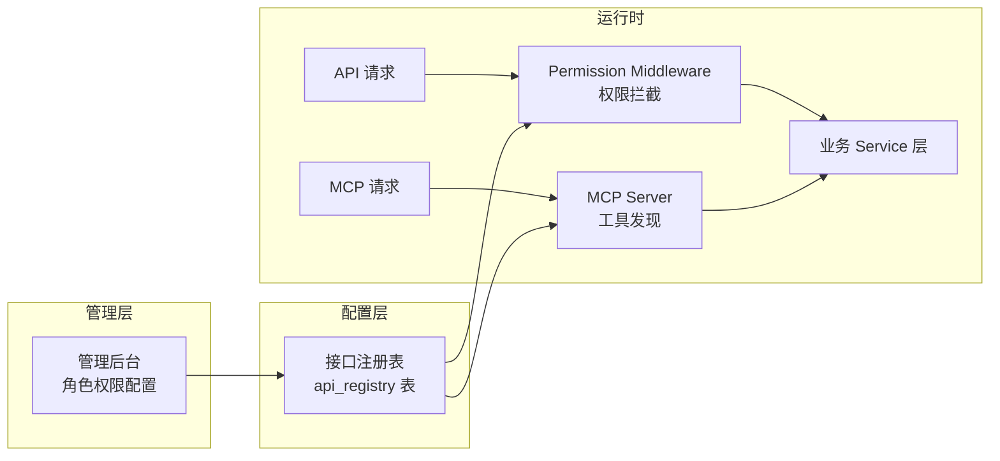
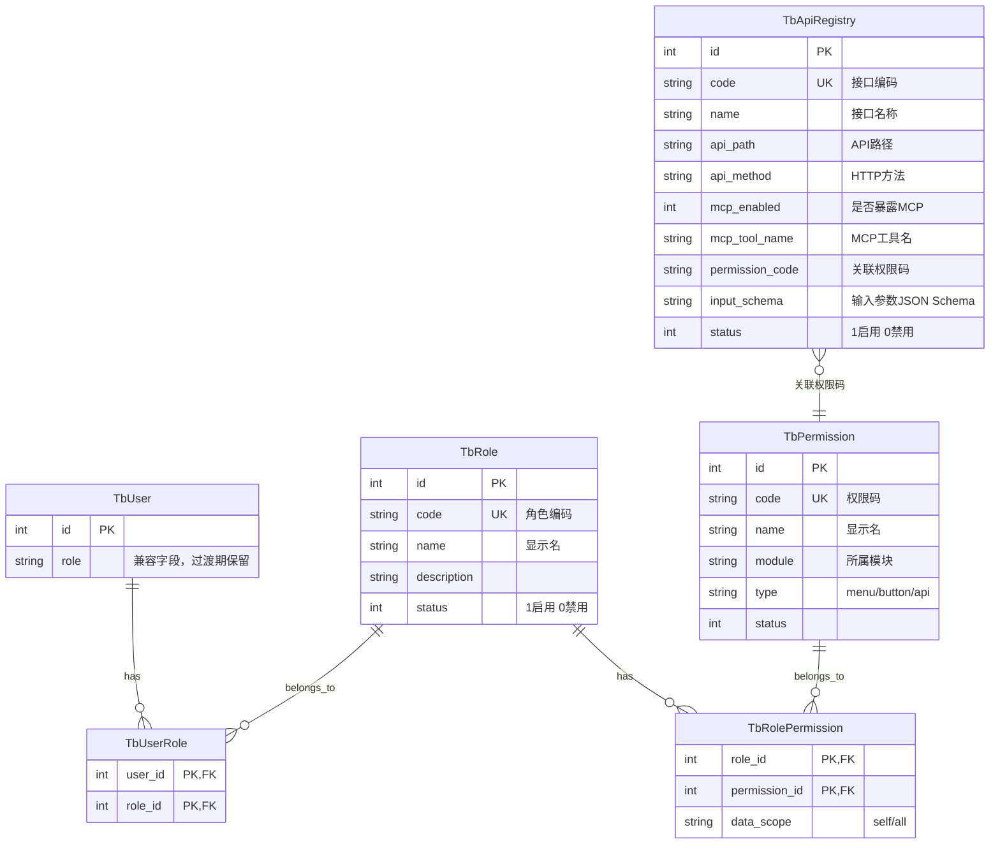
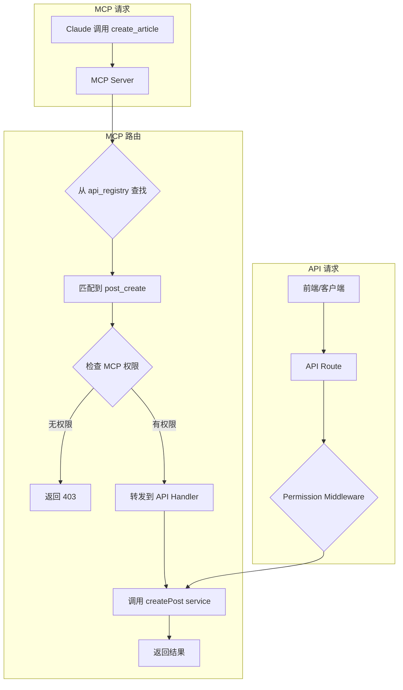
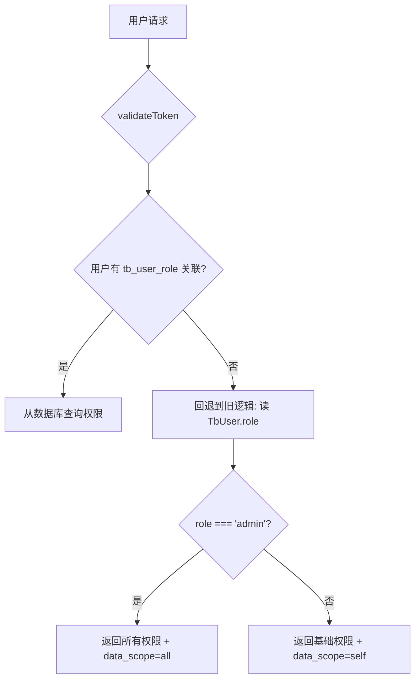

# 配置化 RBAC 权限系统设计

> **状态**: ✅ 已实施
>
> **前置文档**: [权限系统设计](permission-design.md)（当前硬编码实现）
>
> **目标**: 将角色和权限从代码硬编码改为数据库配置，支持动态管理角色、权限码和数据权限。通过 `ApiDescriptor` 自描述 + `sync:api-registry` 脚本自动同步接口元数据到数据库，同时驱动 **API 权限控制** 和 **MCP 工具自动注册**。
>
> **实施完成**: 2026-05-15，共 21 个权限码、2 个内置角色（admin/user）、7 个阶段全部完成。

## 目录

- [背景与现状](#背景与现状)
- [设计目标](#设计目标)
- [接口自描述与同步](#接口自描述与同步)
- [数据库设计](#数据库设计)
- [权限码体系](#权限码体系)
- [数据权限](#数据权限)
- [后端改造](#后端改造)
- [MCP 工具自动注册](#mcp-工具自动注册)
- [前端改造](#前端改造)
- [管理接口](#管理接口)
- [迁移方案](#迁移方案)
- [实施路线](#实施路线)

---

## 背景与现状

### 当前实现

项目当前使用**硬编码 RBAC**，核心组件：

| 组件 | 位置 | 说明 |
|------|------|------|
| 角色枚举 | `src/types/role.ts` → `UserRole` | 固定 `admin/user/guest` 三种角色 |
| 权限接口 | `src/types/role.ts` → `RolePermissions` | 固定 6 个布尔权限字段 |
| 权限映射 | `src/types/role.ts` → `RolePermissionsMap` | 静态配置，改权限需要改代码 |
| 数据库 | `TbUser.role` (String) | 直接存角色名字符串，无关联表 |
| API 检查 | 各路由散落 `isAdmin()` | 数据权限逻辑混在业务代码中 |

### 存在的问题

1. **扩展困难** — 新增角色或权限需要改代码、重新部署
2. **数据权限不可配** — "只能操作自己的数据" vs "可操作所有数据" 是代码写死的
3. **API 中权限逻辑散落** — `isAdmin()` 散布在各路由，难以统一维护
4. **用户只能有一个角色** — `TbUser.role` 是单值字段，无法支持多角色

---

## 设计目标

1. **角色可配置** — 支持在管理后台动态创建、编辑、删除角色
2. **权限可配置** — 权限码体系，通过数据库关联到角色
3. **数据权限可配置** — 每个角色-权限组合可配置数据范围（本人/全部）
4. **多角色支持** — 一个用户可以拥有多个角色
5. **接口自描述同步** — 每个 route.ts 导出 `ApiDescriptor`，通过 `sync:api-registry` 脚本自动同步到数据库
6. **MCP 工具自动注册** — 将管理后台配置的接口自动暴露为 MCP 工具，无需手动 `registerTool`
7. **向后兼容** — 现有 `TbUser.role` 字段保留，过渡期兼容
8. **前端自适应** — 登录时获取权限列表，菜单和按钮根据权限动态渲染

---

## 接口自描述与同步

### 核心思路

> 每个 `route.ts` 导出 `ApiDescriptor` 接口自描述，通过 `pnpm sync:api-registry` 自动同步到数据库，同时产出三样东西：
> 1. **API 权限检查** — middleware / 路由内检查调用者是否有该权限
> 2. **MCP 工具注册** — 自动将接口注册为 MCP tool，供 Claude 等 AI 客户端调用
> 3. **权限管理界面** — 管理后台可配置哪些角色可以访问该接口

### 架构总览



### 数据库表结构

新增 `TbApiRegistry` 表，作为接口的统一声明：

```prisma
// 接口注册表 — API 和 MCP 的统一声明
model TbApiRegistry {
  id            Int       @id @default(autoincrement())
  code          String    @unique @db.VarChar(100)    // 接口编码：post_create, post_update
  name          String    @db.VarChar(100)            // 接口名称：创建文章
  description   String?   @db.Text                   // 详细描述（同时作为 MCP 工具描述）
  module        String    @db.VarChar(50)             // 所属模块：post, collection, config
  api_path      String?   @db.VarChar(255)            // API 路径模式：/api/post/create
  api_method    String?   @db.VarChar(10)             // HTTP 方法：POST, GET, PUT, DELETE
  mcp_enabled   Int       @default(0)                 // 是否暴露为 MCP 工具：1-是 0-否
  mcp_tool_name String?   @db.VarChar(100)            // MCP 工具名：create_article（为空则自动生成）
  permission_code String? @db.VarChar(100)            // 关联权限码：post:create
  input_schema  String?   @db.Text                    // 输入参数 JSON Schema（用于 MCP inputSchema）
  cache_tags    String?   @db.VarChar(500)            // 缓存失效标签，逗号分隔
  sort_order    Int       @default(0)
  status        Int       @default(1)                 // 1-启用 0-禁用
  created_at    DateTime  @default(now())
  updated_at    DateTime  @updatedAt

  // API 路径唯一约束（同一路径+方法不能重复注册）
  @@unique([api_path, api_method])
  @@index([module])
  @@index([mcp_enabled])
  @@map("tb_api_registry")
}
```

### 接口注册表配置示例

| code | name | api_path | api_method | mcp_enabled | permission_code | mcp_tool_name |
|------|------|----------|------------|-------------|-----------------|---------------|
| `post_create` | 创建文章 | `/api/post/create` | POST | 1 | `post:create` | `create_article` |
| `post_update` | 更新文章 | `/api/post/[id]` | PUT | 1 | `post:edit` | `update_article` |
| `post_delete` | 删除文章 | `/api/post/[id]` | DELETE | 1 | `post:delete` | `delete_article` |
| `post_get` | 获取文章 | `/api/post/[id]` | GET | 1 | `post:view` | `get_article` |
| `post_list` | 文章列表 | `/api/post/list` | GET | 1 | `post:view` | `list_articles` |
| `collection_create` | 创建合集 | `/api/collection/create` | POST | 0 | `collection:create` | - |
| `collection_update` | 编辑合集 | `/api/collection/[id]` | PUT | 0 | `collection:edit` | - |
| `config_update` | 修改配置 | `/api/config/[key]` | PUT | 0 | `config:edit` | - |

### input_schema 示例

以 `create_article` 为例，`input_schema` 字段存储 JSON Schema：

```json
{
  "type": "object",
  "properties": {
    "title": { "type": "string", "description": "文章标题" },
    "content": { "type": "string", "description": "文章内容（Markdown）" },
    "category": { "type": "string", "description": "分类" },
    "tags": { "type": "string", "description": "逗号分隔的标签" },
    "collections": { "type": "string", "description": "逗号分隔的合集ID或slug" },
    "description": { "type": "string", "description": "简短描述" },
    "cover": { "type": "string", "description": "封面图URL" },
    "hide": { "type": "string", "description": "1隐藏 0显示" }
  },
  "required": ["title", "content"]
}
```

### 接口自描述（Source of Truth）

每个 `route.ts` 文件导出 `ApiDescriptor` 常量作为接口元数据的 **Source of Truth**，通过 `pnpm sync:api-registry` 脚本自动扫描同步到数据库。

**自描述类型**（`src/types/api-descriptor.ts`）：

```typescript
export interface ApiDescriptor {
  code: string;          // 接口编码（唯一标识），如 post_create
  name: string;          // 接口名称（中文）
  description?: string;  // 详细描述（同时作为 MCP 工具描述）
  module: string;        // 所属模块：post, collection, config 等
  method: HttpMethod;    // HTTP 方法
  permissionCode?: string; // 关联权限码
  inputSchema?: Record<string, unknown>; // 输入参数 JSON Schema（用于 MCP inputSchema）
  cacheTags?: string[];  // 缓存失效标签
}
```

**使用方式**：

```typescript
// 单接口文件：export descriptor
export const descriptor: ApiDescriptor = {
  code: 'post_create',
  name: '创建文章',
  module: 'post',
  method: 'POST',
  permissionCode: POST_CREATE,
  inputSchema: { /* ... */ },
};

// 多接口文件：export xxxDescriptor
export const getDescriptor: ApiDescriptor = { /* GET */ };
export const updateDescriptor: ApiDescriptor = { /* PUT */ };
export const deleteDescriptor: ApiDescriptor = { /* DELETE */ };
```

### 运行时层（MCP handler 注册）

`src/lib/api-registry.ts` 中的 `API_REGISTRY` 数组仅用于存放 **MCP handler** 和运行时路由匹配索引，不再重复声明接口元数据。

MCP handler 只对有 `handler` 函数的接口生效，当前已实现的 handler：

| code | MCP 工具名 | 说明 |
|------|-----------|------|
| `post_create` | `create_article` | 创建文章 |
| `post_update` | `update_article` | 更新文章 |
| `post_delete` | `delete_article` | 删除文章 |
| `post_get` | `get_article` | 获取文章 |
| `post_list` | `list_articles` | 文章列表 |

新增 MCP handler 时，需要同步更新 `scripts/db/sync-api-registry.ts` 中的 `handlerCodes` 列表。

### 代码 vs 数据库的分工

| 维度 | 代码侧（`route.ts` 的 `ApiDescriptor`） | 数据库 (`tb_api_registry`) |
|------|------|------|
| **定位** | **Source of Truth** — 接口元数据声明 | **运行时存储** — 同步自代码扫描 |
| **变更时机** | 开发时随代码提交 | 运行 `pnpm sync:api-registry` 后 |
| **可覆盖字段** | — | `mcp_enabled`、`mcp_tool_name`、`description` |
| **同步方式** | `pnpm sync:api-registry`：扫描 route.ts → 写入数据库（增量同步） | 管理界面修改后独立生效 |

### 同步策略

**核心原则**：`ApiDescriptor` 是唯一的 Source of Truth，数据库通过扫描脚本自动同步。

```
开发流程：
1. 在 route.ts 中添加/修改 ApiDescriptor
2. 运行 pnpm sync:api-registry → 自动同步到数据库
3. 管理后台可调整 mcp_enabled 等开关
```

> `mcp_enabled` 字段不会被脚本覆盖，保留管理后台的运行时设置。这是唯一允许数据库覆盖代码的字段。

---

## 数据库设计

### ER 关系



### 新增表 Schema

```prisma
// 角色表
model TbRole {
  id          Int       @id @default(autoincrement())
  code        String    @unique @db.VarChar(50)   // 角色编码：admin, editor, reviewer
  name        String    @db.VarChar(50)           // 显示名：管理员、编辑、审核员
  description String?   @db.VarChar(255)
  status      Int       @default(1)               // 1-启用 0-禁用
  sort_order  Int       @default(0)               // 排序序号
  created_at  DateTime  @default(now())
  updated_at  DateTime  @updatedAt

  permissions TbRolePermission[]
  users       TbUserRole[]

  @@map("tb_role")
}

// 权限码表
model TbPermission {
  id          Int       @id @default(autoincrement())
  code        String    @unique @db.VarChar(100)  // 权限码：post:create, post:delete
  name        String    @db.VarChar(100)           // 显示名：创建文章
  module      String    @db.VarChar(50)            // 模块：post, comment, config, user
  type        String    @db.VarChar(20) @default("api") // menu/button/api
  description String?   @db.VarChar(255)
  status      Int       @default(1)
  sort_order  Int       @default(0)

  roles       TbRolePermission[]

  @@map("tb_permission")
}

// 角色-权限关联表
model TbRolePermission {
  role_id       Int
  permission_id Int
  data_scope    String  @default("self") @db.VarChar(20) // 数据权限范围：self-仅本人 / all-全部

  role       TbRole       @relation(fields: [role_id], references: [id], onDelete: Cascade)
  permission TbPermission @relation(fields: [permission_id], references: [id], onDelete: Cascade)

  @@id([role_id, permission_id])
  @@map("tb_role_permission")
}

// 用户-角色关联表
model TbUserRole {
  user_id Int
  role_id Int

  user TbUser @relation(fields: [user_id], references: [id], onDelete: Cascade)
  role TbRole @relation(fields: [role_id], references: [id], onDelete: Cascade)

  @@id([user_id, role_id])
  @@map("tb_user_role")
}

// 接口注册表
model TbApiRegistry {
  id              Int       @id @default(autoincrement())
  code            String    @unique @db.VarChar(100)    // 接口编码：post_create
  name            String    @db.VarChar(100)            // 接口名称
  description     String?   @db.Text                    // 描述（MCP 工具描述）
  module          String    @db.VarChar(50)             // 所属模块
  api_path        String    @db.VarChar(255)            // API 路径（非空，所有接口必须有路径）
  api_method      String    @db.VarChar(10)             // HTTP 方法（非空）
  mcp_enabled     Int       @default(0)                 // 是否暴露 MCP：1-是 0-否
  mcp_tool_name   String?   @db.VarChar(100)            // MCP 工具名
  permission_code String?   @db.VarChar(100)            // 关联权限码
  input_schema    String?   @db.Text                    // JSON Schema
  cache_tags      String?   @db.VarChar(500)            // 缓存失效标签，逗号分隔
  sort_order      Int       @default(0)
  status          Int       @default(1)                 // 1-启用 0-禁用

  @@unique([api_path, api_method])                      // 同一路径+方法不能重复注册
  @@index([module])
  @@index([mcp_enabled])
  @@map("tb_api_registry")
}
```

### TbUser 表变更

```diff
 model TbUser {
   id       Int     @id @default(autoincrement())
-  role     String? @db.VarChar(255)
+  role     String? @db.VarChar(255) // 兼容字段，过渡期保留，后续废弃
   // ...

+  // 新增关联
+  userRoles  TbUserRole[]
 }
```

### data_scope 取值

| 值 | 含义 | 示例 |
|----|------|------|
| `self` | 只能操作自己的数据 | 编辑只能编辑自己创建的文章 |
| `all` | 可操作所有人的数据 | 管理员可编辑任意文章 |

**校验规则**：
- 数据库层：`@db.VarChar(20)` 存储
- 应用层：在 `checkDataPermission` 函数中校验，仅接受 `self` 和 `all`，其他值视为无权限

```typescript
function hasDataPermission(user: AuthUser, code: string, resourceOwnerId?: number): boolean {
  const scope = user.dataScopes[code];
  if (!scope) return false;

  // 仅接受合法的 data_scope 值
  if (scope === 'all') return true;
  if (scope === 'self') {
    return resourceOwnerId !== undefined && resourceOwnerId === user.id;
  }

  // 非法值视为无权限
  return false;
}
```

> 后续可扩展 `department`（本部门）等范围，但当前业务场景只需 `self` 和 `all`。

---

## 权限码体系

### 权限码命名规范

格式：`{module}:{action}`

| 模块 | 权限码 | 显示名 | 类型 | 说明 |
|------|--------|--------|------|------|
| **post** | `post:view` | 查看文章 | api | 查看文章详情/列表 |
| | `post:create` | 创建文章 | button | 创建新文章 |
| | `post:edit` | 编辑文章 | button | 编辑文章内容 |
| | `post:delete` | 删除文章 | button | 删除文章（软删除） |
| | `post:restore` | 恢复文章 | button | 恢复已删除文章 |
| | `post:hide` | 隐藏文章 | button | 隐藏/显示文章 |
| | `post:view_deleted` | 查看回收站 | button | 查看已删除文章列表 |
| **comment** | `comment:manage` | 管理评论 | button | 删除、隐藏评论 |
| **collection** | `collection:view` | 查看合集 | menu | 查看合集管理页 |
| | `collection:create` | 创建合集 | button | 创建新合集 |
| | `collection:edit` | 编辑合集 | button | 编辑合集信息 |
| | `collection:delete` | 删除合集 | button | 删除合集 |
| **config** | `config:view` | 查看配置 | menu | 查看配置管理页 |
| | `config:edit` | 修改配置 | button | 修改系统配置 |
| **user** | `user:view` | 查看用户 | menu | 查看用户管理页 |
| | `user:manage` | 管理用户 | button | 编辑/禁用用户 |
| | `user:role:assign` | 分配角色 | button | 给用户分配角色 |
| **tool** | `queue:view` | 队列监控 | menu | 查看向量化队列 |
| | `vector:view` | 向量检索 | menu | 使用向量搜索 |
| | `tts:view` | 语音合成 | menu | 使用 TTS 功能 |
| | `image:view` | AI 图片生成 | menu | 使用图片生成功能 |

### 初始数据

系统预置以下权限码（通过 seed 脚本初始化）：

```typescript
const seedPermissions = [
  // 文章模块
  { code: 'post:view', name: '查看文章', module: 'post', type: 'api', sort_order: 1 },
  { code: 'post:create', name: '创建文章', module: 'post', type: 'button', sort_order: 2 },
  { code: 'post:edit', name: '编辑文章', module: 'post', type: 'button', sort_order: 3 },
  { code: 'post:delete', name: '删除文章', module: 'post', type: 'button', sort_order: 4 },
  { code: 'post:restore', name: '恢复文章', module: 'post', type: 'button', sort_order: 5 },
  { code: 'post:hide', name: '隐藏文章', module: 'post', type: 'button', sort_order: 6 },
  { code: 'post:view_deleted', name: '查看回收站', module: 'post', type: 'button', sort_order: 7 },
  // 评论模块
  { code: 'comment:manage', name: '管理评论', module: 'comment', type: 'button', sort_order: 1 },
  // 合集模块
  { code: 'collection:view', name: '查看合集', module: 'collection', type: 'menu', sort_order: 1 },
  { code: 'collection:create', name: '创建合集', module: 'collection', type: 'button', sort_order: 2 },
  { code: 'collection:edit', name: '编辑合集', module: 'collection', type: 'button', sort_order: 3 },
  { code: 'collection:delete', name: '删除合集', module: 'collection', type: 'button', sort_order: 4 },
  // 配置模块
  { code: 'config:view', name: '查看配置', module: 'config', type: 'menu', sort_order: 1 },
  { code: 'config:edit', name: '修改配置', module: 'config', type: 'button', sort_order: 2 },
  // 用户模块
  { code: 'user:view', name: '查看用户', module: 'user', type: 'menu', sort_order: 1 },
  { code: 'user:manage', name: '管理用户', module: 'user', type: 'button', sort_order: 2 },
  { code: 'user:role:assign', name: '分配角色', module: 'user', type: 'button', sort_order: 3 },
  // 工具模块
  { code: 'queue:view', name: '队列监控', module: 'tool', type: 'menu', sort_order: 1 },
  { code: 'vector:view', name: '向量检索', module: 'tool', type: 'menu', sort_order: 2 },
  { code: 'tts:view', name: '语音合成', module: 'tool', type: 'menu', sort_order: 3 },
  { code: 'image:view', name: 'AI 图片生成', module: 'tool', type: 'menu', sort_order: 4 },
];
```

### 初始角色配置

```typescript
const seedRoles = [
  {
    code: 'admin', name: '管理员', description: '系统管理员，拥有所有权限',
    permissions: seedPermissions.map(p => ({
      permission_id: p.code,
      data_scope: 'all',
    })),
  },
  {
    code: 'user', name: '普通用户', description: '普通用户，管理自己的内容',
    permissions: [
      { permission_id: 'post:view', data_scope: 'self' },
      { permission_id: 'post:create', data_scope: 'self' },
      { permission_id: 'post:edit', data_scope: 'self' },
      { permission_id: 'post:hide', data_scope: 'self' },
    ],
  },
];
```

---

## 数据权限

### 设计思路

数据权限解决"**能操作哪些范围的数据**"的问题，与功能权限（"**能不能操作**"）正交组合。

### 当前场景的 data_scope

| 场景 | 说明 |
|------|------|
| 编辑文章 `post:edit` + `self` | 只能编辑 `created_by = 自己ID` 的文章 |
| 编辑文章 `post:edit` + `all` | 可编辑任意文章 |
| 删除文章 `post:delete` + `self` | 只能删除自己的文章 |
| 删除文章 `post:delete` + `all` | 可删除任意文章 |
| 查看回收站 `post:view_deleted` + `all` | 可查看所有已删除文章 |

### API 中的使用模式

```typescript
// 通用数据权限检查
function checkDataScope(
  user: AuthUser,
  permission: string,
  resourceOwnerId?: number
): boolean {
  const scope = user.dataScopes[permission];
  if (!scope) return false; // 没有该权限

  if (scope === 'all') return true;
  if (scope === 'self') {
    return resourceOwnerId !== undefined && resourceOwnerId === user.id;
  }
  return false;
}

// 在 API 路由中使用
export async function PUT(request, { params }) {
  const user = await requireAuth(request);
  const post = await getPostById(params.id);

  // 功能权限 + 数据权限
  if (!checkDataScope(user, 'post:edit', post.created_by)) {
    return NextResponse.json(errorResponse('无权限编辑此文章'), { status: 403 });
  }

  // 业务逻辑...
}
```

---

## 后端改造

### 1. 用户认证信息扩展

改造 `validateToken` 返回值，增加权限信息：

```typescript
// src/lib/auth.ts - 改造后的返回结构
interface AuthUser {
  id: number;
  account: string;
  nickname: string;
  avatar: string | null;
  role: string | null;       // 兼容旧字段
  roles: string[];           // 新增：角色编码列表
  permissions: string[];     // 新增：权限码列表
  dataScopes: Record<string, string>; // 新增：权限码 → data_scope 映射
}
```

### 2. 权限查询服务

新增 `src/services/permission.ts`：

```typescript
// 根据用户 ID 查询权限信息
export async function getUserPermissions(userId: number) {
  const userRoles = await prisma.tbUserRole.findMany({
    where: {
      user_id: userId,
      role: { status: 1 },  // 只取启用的角色
    },
    include: {
      role: {
        include: {
          permissions: {
            include: { permission: { where: { status: 1 } } },
          },
        },
      },
    },
  });

  const permissions: string[] = [];
  const dataScopes: Record<string, string> = {};

  for (const ur of userRoles) {
    for (const rp of ur.role.permissions) {
      if (rp.permission) {
        permissions.push(rp.permission.code);
        // 同一权限多个角色时，取范围最大的（all > self）
        const existing = dataScopes[rp.permission.code];
        if (existing !== 'all' || rp.data_scope === 'all') {
          dataScopes[rp.permission.code] = rp.data_scope;
        }
      }
    }
  }

  return {
    permissions: [...new Set(permissions)],
    dataScopes,
  };
}
```

### 3. 统一权限检查工具

改造 `src/lib/permission.ts`，提供统一的权限检查接口：

```typescript
// src/lib/permission.ts - 新增

/** 检查用户是否有指定权限码 */
export function hasPermission(user: AuthUser, code: string): boolean {
  return user.permissions.includes(code);
}

/** 检查用户是否有指定权限码 + 数据权限 */
export function hasDataPermission(
  user: AuthUser,
  code: string,
  resourceOwnerId?: number
): boolean {
  const scope = user.dataScopes[code];
  if (!scope) return false;
  if (scope === 'all') return true;
  if (scope === 'self') {
    return resourceOwnerId !== undefined && resourceOwnerId === user.id;
  }
  return false;
}

/** API 路由快捷方法：需要指定权限 */
export async function requirePermission(
  request: NextRequest,
  code: string
): Promise<{ user: AuthUser } | { error: string; status: number }> {
  const { user, error } = await validateUserFromRequest(request.headers);
  if (error) return { error, status: 401 };

  if (!hasPermission(user, code)) {
    return { error: `无权限执行此操作（需要 ${code}）`, status: 403 };
  }

  return { user };
}
```

### 4. 路由改造示例

改造前：
```typescript
if (!canManageCollections(user)) {
  return NextResponse.json(errorResponse('无权限'), { status: 403 });
}
```

改造后：
```typescript
const check = await requirePermission(request, 'collection:create');
if ('error' in check) {
  return NextResponse.json(errorResponse(check.error), { status: check.status });
}
const { user } = check;
```

---

## MCP 工具自动注册

### 现状问题

当前 MCP 工具在 `src/app/api/mcp/route.ts` 中**手动逐个注册**：

```typescript
// 现状：每个工具都要手动写 registerTool + inputSchema + handler
server.registerTool("create_article", {
  title: "Create article",
  description: "...",
  inputSchema: { title: z.string(), content: z.string(), ... }
}, async (args) => {
  const user = await ensureAuth();
  // 手动调用 createPost...
});
```

问题：
1. **与 API 重复** — MCP handler 和 API route 做的是同一件事，但写了两份
2. **权限不统一** — API 有权限检查，MCP 只有 `ensureAuth`，没有细粒度权限
3. **维护成本高** — 新增功能要改两处（API + MCP），容易遗忘

### 改造后的架构



核心思路：**MCP 工具不再单独写 handler，而是转发到已有的 API 路由**。

### 实现方案

#### 1. 改造 MCP Server 创建逻辑

```typescript
// src/app/api/mcp/route.ts — 改造后

function createMcpServer(headers: Headers) {
  const server = new McpServer({
    name: "React Blog MCP",
    version: "2.0.0"
  });

  const ensureAuth = async () => {
    return await authenticateMcpRequestEnhanced(headers);
  };

  // ============================
  // 从接口注册表自动注册 MCP 工具
  // ============================
  const mcpEntries = getMcpEnabledEntries();

  for (const entry of mcpEntries) {
    server.registerTool(
      entry.mcpToolName!,
      {
        title: entry.name,
        description: entry.description || entry.name,
        inputSchema: entry.inputSchema ? jsonSchemaToZod(entry.inputSchema) : {},
      },
      async (args) => {
        const user = await ensureAuth();
        // 权限检查（功能权限 + 数据权限）统一在 handleMcpToApi 中完成
        return await handleMcpToApi(entry, args, user, headers);
      }
    );
  }

  // MCP Resources 保持手动注册（博客标签、合集、写作风格等只读资源）
  registerResources(server, ensureAuth);

  return server;
}
```

#### 2. MCP → API 转发层

```typescript
// src/lib/mcp-adapter.ts

import { hasDataPermission } from '@/lib/permission';
import type { ApiRegistryEntry, McpHandler } from '@/lib/api-registry';
import type { AuthUser } from '@/lib/auth';

/**
 * 将 MCP 工具调用转发到对应的 service handler
 *
 * 核心思路：
 * 1. 通过 entry.handler 直接调用 service 层函数（避免 switch-case 硬编码）
 * 2. 完整的权限检查：功能权限 + 数据权限
 * 3. 创建类操作排除客户端传入的 created_by，防止权限提升
 */
export async function handleMcpToApi(
  entry: ApiRegistryEntry,
  args: Record<string, unknown>,
  user: AuthUser,
  headers: Headers,
): Promise<{ content: Array<{ type: string; text: string }>; isError?: boolean }> {
  try {
    // 1. 检查功能权限
    if (entry.permissionCode && !user.permissions.includes(entry.permissionCode)) {
      return {
        isError: true,
        content: [{ type: "text", text: `无权限：需要 ${entry.permissionCode}` }],
      };
    }

    // 2. 检查数据权限（对于有 getOwnerId 的操作）
    if (entry.getOwnerId && entry.permissionCode) {
      // 先获取资源以检查所有权
      const resource = await fetchResourceForPermissionCheck(entry, args);
      if (resource) {
        const ownerId = entry.getOwnerId(resource);
        if (!hasDataPermission(user, entry.permissionCode, ownerId)) {
          return {
            isError: true,
            content: [{ type: "text", text: '无权限操作此资源（仅能操作自己的数据）' }],
          };
        }
      }
    }

    // 3. 调用 handler
    if (!entry.handler) {
      return {
        isError: true,
        content: [{ type: "text", text: `接口 ${entry.code} 未实现 MCP handler` }],
      };
    }

    // 4. 创建类操作：排除客户端传入的 created_by，防止权限提升
    const sanitizedArgs = { ...args };
    if (entry.code.endsWith('_create')) {
      delete sanitizedArgs.created_by;
    }

    const result = await entry.handler(sanitizedArgs, user);

    // 5. 缓存失效
    invalidateCacheTags(entry.cacheTags, result);

    if (!result) {
      return {
        isError: true,
        content: [{ type: "text", text: 'Not found' }],
      };
    }

    return {
      content: [{ type: "text", text: JSON.stringify(result, null, 2) }],
    };
  } catch (error) {
    return {
      isError: true,
      content: [{
        type: "text",
        text: error instanceof Error ? error.message : 'Internal error',
      }],
    };
  }
}

/**
 * 获取资源用于权限检查
 *
 * 对于更新/删除操作，需要先获取资源以检查所有权
 */
async function fetchResourceForPermissionCheck(
  entry: ApiRegistryEntry,
  args: Record<string, unknown>,
): Promise<unknown | null> {
  // 只有需要检查数据权限的操作才需要获取资源
  if (!entry.getOwnerId) return null;

  // 根据接口类型获取资源
  switch (entry.code) {
    case 'post_update':
    case 'post_delete': {
      const { getPostById } = await import('@/services/post');
      return getPostById(args.id as number);
    }
    // 其他需要数据权限检查的接口...
    default:
      return null;
  }
}
```

#### 3. 缓存失效复用

```typescript
// src/lib/mcp-adapter.ts

function invalidateCacheTags(tags: string[] | undefined, resource: unknown) {
  if (!tags?.length) return;

  for (const tag of tags) {
    revalidateTag(tag, {});
  }

  // 如果资源有 path 字段，额外清除路径缓存
  if (resource && typeof resource === 'object' && 'path' in resource) {
    const { path } = resource as { path: string };
    revalidatePath(path);
  }

  // 如果资源有 tags 字段，额外清除标签页缓存
  if (resource && typeof resource === 'object' && 'tags' in resource) {
    const rawTags = (resource as { tags: unknown }).tags;
    const tagArr = Array.isArray(rawTags) ? rawTags : String(rawTags).split(',');
    tagArr.forEach((tag: string) => {
      const trimmed = typeof tag === 'string' ? tag.trim() : tag;
      if (trimmed) revalidatePath(`/tags/${encodeURIComponent(trimmed)}`);
    });
  }
}
```

#### 4. JSON Schema → Zod 转换

MCP SDK 的 `inputSchema` 需要使用 Zod 对象，提供一个转换工具：

```typescript
// src/lib/mcp-adapter.ts

import { z } from 'zod';

/**
 * 将 JSON Schema 转换为 Zod 对象（简化版）
 * 仅支持本项目用到的 JSON Schema 子集
 */
function jsonSchemaToZod(schema: Record<string, unknown>): Record<string, z.ZodType> {
  const properties = (schema.properties || {}) as Record<string, Record<string, unknown>>;
  const required = new Set((schema.required || []) as string[]);
  const fields: Record<string, z.ZodType> = {};

  for (const [key, prop] of Object.entries(properties)) {
    let field: z.ZodType = z.unknown();

    if (prop.type === 'string') {
      field = z.string();
    } else if (prop.type === 'number') {
      field = z.number();
    } else if (prop.type === 'boolean') {
      field = z.boolean();
    }

    if (prop.description) {
      field = field.describe(prop.description as string);
    }

    if (!required.has(key)) {
      field = field.optional();
    }

    fields[key] = field;
  }

  return fields;
}
```

### 管理后台控制 MCP 暴露

通过数据库中的 `mcp_enabled` 字段，管理员可以随时启用或禁用某个接口的 MCP 暴露：

```sql
-- 禁用文章列表的 MCP 工具
UPDATE tb_api_registry SET mcp_enabled = 0 WHERE code = 'post_list';

-- 启用合集管理的 MCP 工具
UPDATE tb_api_registry SET mcp_enabled = 1, mcp_tool_name = 'list_collections' WHERE code = 'collection_list';
```

运行时从数据库读取 `mcp_enabled` 覆盖代码默认值：

```typescript
export async function getMcpEnabledEntries(): Promise<ApiRegistryEntry[]> {
  // 从数据库读取所有启用了 MCP 的接口
  const dbEntries = await prisma.tbApiRegistry.findMany({
    where: { mcp_enabled: 1, status: 1 },
  });

  // 与 API_REGISTRY 中的 handler 关联（仅 API_REGISTRY 中有 handler 的接口才能注册 MCP 工具）
  return dbEntries
    .map(db => {
      const codeEntry = API_REGISTRY.find(e => e.code === db.code);
      if (!codeEntry || !codeEntry.handler) {
        return null;
      }
      return {
        ...codeEntry,
        mcpEnabled: true,
        mcpToolName: db.mcp_tool_name || codeEntry.mcpToolName,
        permissionCode: db.permission_code || codeEntry.permissionCode,
        description: db.description || codeEntry.description,
      };
    })
    .filter((e): e is NonNullable<typeof e> => e !== null);
}
```

### 改造前 vs 改造后对比

| 维度 | 改造前 | 改造后 |
|------|--------|--------|
| MCP 工具定义 | 手动 `registerTool`，每个工具独立 handler | 从 `api_registry` 自动注册，handler 引用 service 函数 |
| 功能权限检查 | MCP 只有 `ensureAuth`（登录即全部可用） | 与 API 统一，检查 `permission_code` |
| 数据权限检查 | ❌ 无 | ✅ 通过 `getOwnerId` + `hasDataPermission` 检查资源所有权 |
| 权限提升防护 | ❌ 无 | ✅ 创建类操作自动排除客户端传入的 `created_by` |
| 新增功能 | 改 API + 改 MCP 两处 | 改 API + 在 `api_registry` 声明（含 handler），MCP 自动可用 |
| MCP 开关 | 不可配置，代码写死 | 数据库 `mcp_enabled` 字段运行时控制 |
| handler 逻辑 | MCP 和 API 各写一份，容易不一致 | 共享 service 层，MCP 通过 `entry.handler` 调用 |

---

## 前端改造

### 1. AuthContext 扩展

扩展 `useAuth()` 返回值：

```typescript
interface AuthContextValue {
  user: AuthUser | null;
  loading: boolean;
  // 新增权限检查方法
  hasPermission: (code: string) => boolean;
  hasDataPermission: (code: string, resourceOwnerId?: number) => boolean;
  /** 刷新用户权限（角色变更后调用） */
  refreshPermissions: () => Promise<void>;
}
```

### 2. 菜单动态渲染

```typescript
// 管理后台菜单配置，基于权限码
const menuConfig = [
  { key: '/c/post', label: '文章管理', permission: 'post:view' },
  { key: '/c/collections', label: '合集管理', permission: 'collection:view' },
  { key: '/c/config', label: '配置管理', permission: 'config:view' },
  { key: '/c/user', label: '用户管理', permission: 'user:view' },
];

// 过滤有权限的菜单
const visibleMenus = menuConfig.filter(m => hasPermission(m.permission));
```

### 3. 按钮级权限

```typescript
// 页面中使用
const { hasPermission } = useAuth();

return (
  <>
    {hasPermission('post:create') && <Button>新建文章</Button>}
    {hasPermission('post:delete') && <Button danger>删除</Button>}
    {hasPermission('user:role:assign') && <Button>分配角色</Button>}
  </>
);
```

### 4. 权限变更实时刷新

**问题**：管理员修改了用户的角色/权限后，用户需要重新登录才能生效。

**解决方案**：提供权限刷新机制，在关键场景自动或手动刷新。

```typescript
// src/hooks/useAuth.ts

export function useAuth(): AuthContextValue {
  const [user, setUser] = useState<AuthUser | null>(null);
  const [permissions, setPermissions] = useState<string[]>([]);
  const [dataScopes, setDataScopes] = useState<Record<string, string>>({});

  // 刷新权限（从服务器重新获取）
  const refreshPermissions = useCallback(async () => {
    const response = await fetch('/api/auth/permissions');
    if (response.ok) {
      const data = await response.json();
      setPermissions(data.permissions);
      setDataScopes(data.dataScopes);
    }
  }, []);

  // 权限检查方法
  const hasPermission = useCallback((code: string) => {
    return permissions.includes(code);
  }, [permissions]);

  const hasDataPermission = useCallback((code: string, resourceOwnerId?: number) => {
    const scope = dataScopes[code];
    if (!scope) return false;
    if (scope === 'all') return true;
    if (scope === 'self') {
      return resourceOwnerId !== undefined && resourceOwnerId === user?.id;
    }
    return false;
  }, [dataScopes, user]);

  return { user, loading, hasPermission, hasDataPermission, refreshPermissions };
}
```

**刷新时机**：

| 场景 | 触发方式 | 说明 |
|------|----------|------|
| Token 续期 | 自动 | `refreshToken` 响应中包含最新权限 |
| 角色管理页面操作后 | 手动 | 管理员修改角色后，调用 `refreshPermissions()` |
| 页面获得焦点 | 自动（可选） | 用户切换回页面时检查权限是否过期 |
| 权限不足提示后 | 手动 | 用户看到"无权限"提示后，可点击"刷新权限"按钮 |

**新增 API**：

```typescript
// GET /api/auth/permissions
// 返回当前用户的最新权限信息
{
  "permissions": ["post:view", "post:create", ...],
  "dataScopes": { "post:edit": "self", ... }
}
```

---

## 管理接口

### 角色管理

| 接口 | 方法 | 说明 | 权限要求 |
|------|------|------|----------|
| `/api/admin/roles` | GET | 角色列表 | `user:view` |
| `/api/admin/roles` | POST | 创建角色 | `user:manage` |
| `/api/admin/roles/[id]` | PUT | 编辑角色 | `user:manage` |
| `/api/admin/roles/[id]` | DELETE | 删除角色 | `user:manage` |

### 角色权限配置

| 接口 | 方法 | 说明 | 权限要求 |
|------|------|------|----------|
| `/api/admin/roles/[id]/permissions` | GET | 获取角色权限列表 | `user:view` |
| `/api/admin/roles/[id]/permissions` | PUT | 设置角色权限（含数据权限） | `user:role:assign` |

### 权限码查询

| 接口 | 方法 | 说明 | 权限要求 |
|------|------|------|----------|
| `/api/admin/permissions` | GET | 所有权限码列表 | `user:view` |

### 用户角色分配

| 接口 | 方法 | 说明 | 权限要求 |
|------|------|------|----------|
| `/api/admin/users/[id]/roles` | GET | 获取用户角色 | `user:view` |
| `/api/admin/users/[id]/roles` | PUT | 设置用户角色 | `user:role:assign` |

### 关键接口设计

**PUT `/api/admin/roles/[id]/permissions`** — 设置角色权限：

请求体：
```json
{
  "permissions": [
    { "code": "post:view", "data_scope": "all" },
    { "code": "post:create", "data_scope": "self" },
    { "code": "post:edit", "data_scope": "self" },
    { "code": "post:delete", "data_scope": "all" }
  ]
}
```

响应：
```json
{
  "code": 200,
  "message": "角色权限更新成功"
}
```

> 注意：使用全量替换策略，每次提交覆盖该角色的所有权限配置。

---

## 迁移方案

### 向后兼容策略



### 兼容层实现

```typescript
// src/services/permission.ts

export async function resolveUserPermissions(user: {
  id: number;
  role: string | null;
}): Promise<{ permissions: string[]; dataScopes: Record<string, string> }> {
  // 优先从新表查询
  const userRoles = await prisma.tbUserRole.findMany({
    where: { user_id: user.id },
    select: { role_id: true },
  });

  // 关键：通过用户是否有角色关联来判断使用新/旧权限系统
  // 不能用 permissions.length 判断，因为用户可能有角色但角色没有权限
  if (userRoles.length > 0) {
    return getUserPermissions(user.id);
  }

  // 回退到旧逻辑（仅当用户没有 tb_user_role 记录时）
  if (user.role === 'admin') {
    return {
      permissions: ALL_PERMISSION_CODES,
      dataScopes: Object.fromEntries(ALL_PERMISSION_CODES.map(c => [c, 'all'])),
    };
  }

  if (user.role === 'user') {
    return {
      permissions: ['post:view', 'post:create', 'post:edit', 'post:hide'],
      dataScopes: { 'post:view': 'self', 'post:create': 'self', 'post:edit': 'self', 'post:hide': 'self' },
    };
  }

  // guest 或未知角色
  return { permissions: [], dataScopes: {} };
}
```

### 迁移步骤

1. 执行数据库迁移，新增 4 张表
2. 运行 seed 脚本，初始化权限码和角色
3. 将现有 `TbUser.role` 数据迁移到 `TbUserRole` 关联表
4. 改造 `validateToken` 使用 `resolveUserPermissions`
5. 逐步将 API 路由的 `isAdmin()` / `canManageXxx()` 替换为 `requirePermission()`
6. 改造前端菜单和按钮权限判断
7. 确认所有路由改造完成后，废弃 `TbUser.role` 字段

---

## 实施路线

### 第一阶段：基础设施（数据库 + 权限查询）

**目标**：建立权限系统的数据基础，保持现有功能不受影响。

| 步骤 | 任务 | 验证点 |
|------|------|--------|
| 1 | 新增 5 张表的 Prisma Schema | `pnpm prisma:push` 成功，表结构正确 |
| 2 | 编写 seed 脚本（权限码 + 初始角色 + 接口注册表） | seed 运行后，数据库中有正确的初始数据 |
| 3 | 实现 `getUserPermissions` 权限查询服务 | 单元测试覆盖：管理员/普通用户/无角色用户 |
| 4 | 改造 `validateToken` 返回 `AuthUser` 结构（含兼容层） | 现有 API 功能不受影响，兼容层正确回退 |

**验收标准**：现有所有 API 行为不变，新权限表可正常读写。

**回滚方案**：删除新增的 5 张表，回退 `validateToken` 代码。

---

### 第二阶段：统一接口注册表

**目标**：建立接口声明体系，为 MCP 自动注册和权限检查提供基础。

| 步骤 | 任务 | 验证点 |
|------|------|--------|
| 5 | 创建 `src/lib/api-registry.ts`，声明所有 API 接口配置 | 类型检查通过，所有接口声明完整 |
| 6 | 实现 `matchApiRegistry()` 路由匹配 | 单元测试：精确匹配、模式匹配、优先级正确 |
| 7 | 实现 `jsonSchemaToZod()` 转换工具 | 单元测试：各类型字段转换正确 |

**验收标准**：`matchApiRegistry` 能正确匹配所有已声明的 API 路径。

**回滚方案**：删除 `api-registry.ts`，不影响现有功能。

---

### 第三阶段：API 改造

**目标**：将散落的权限检查逻辑统一为 `requirePermission` 模式。

| 步骤 | 任务 | 验证点 |
|------|------|--------|
| 8 | 实现 `requirePermission` / `hasDataPermission` 工具函数 | 单元测试覆盖 |
| 9 | 逐个改造 API 路由（文章模块） | 文章 CRUD 功能正常，权限检查生效 |
| 10 | 改造合集、配置、用户等模块的 API | 各模块功能正常 |

**验收标准**：
- 所有 API 使用 `requirePermission` 进行权限检查
- 管理员可访问所有接口
- 普通用户只能访问授权接口
- 数据权限检查生效（用户只能操作自己的数据）

**回滚方案**：逐个 API 回滚到旧的权限检查逻辑（`isAdmin()` / `canManageXxx()`）。

**风险控制**：每个模块改造后立即测试，确认无问题后再改造下一个模块。

---

### 第四阶段：MCP 自动注册

**目标**：实现 MCP 工具从接口注册表自动注册，替代手动 `registerTool`。

| 步骤 | 任务 | 验证点 |
|------|------|--------|
| 11 | 创建 `src/lib/mcp-adapter.ts`，实现 handler 转发 + 数据权限检查 | 单元测试：功能权限、数据权限、权限提升防护 |
| 12 | 改造 `src/app/api/mcp/route.ts`，从注册表自动注册工具 | MCP 工具列表与 `api_registry` 一致 |
| 13 | 实现 `invalidateCacheTags()` 缓存失效复用 | 创建/更新文章后缓存正确失效 |
| 14 | 保留 MCP Resources 手动注册 | 标签、合集等资源正常可用 |

**验收标准**：
- MCP 工具自动从 `api_registry` 注册
- 权限检查与 API 一致（功能权限 + 数据权限）
- 创建类操作自动排除 `created_by` 参数
- 缓存失效正常工作

**回滚方案**：恢复旧的 MCP 手动注册代码。

**风险控制**：先在测试环境验证 MCP 工具的权限检查，确保无权限绕过。

---

### 第五阶段：前端改造

**目标**：前端菜单和按钮改为权限码驱动。

| 步骤 | 任务 | 验证点 |
|------|------|--------|
| 15 | 扩展 `useAuth` 返回权限检查方法 + `refreshPermissions` | 权限检查方法正确工作 |
| 16 | 管理后台菜单改为权限码驱动 | 菜单根据权限动态显示/隐藏 |
| 17 | 按钮级权限改造 | 按钮根据权限显示/隐藏 |

**验收标准**：
- 菜单和按钮根据用户权限正确显示
- 权限变更后可通过 `refreshPermissions` 刷新（无需重新登录）

**回滚方案**：回退菜单和按钮的权限判断逻辑。

---

### 第六阶段：管理界面

**目标**：提供角色、权限、用户角色的管理界面。

| 步骤 | 任务 | 验证点 |
|------|------|--------|
| 18 | 角色管理 CRUD 页面 | 创建/编辑/删除角色功能正常 |
| 19 | 权限配置页面（权限码 + 数据权限勾选） | 角色权限配置正确保存 |
| 20 | 用户角色分配功能 | 用户角色分配后权限立即生效 |
| 21 | 接口注册表管理页面（查看/启用禁用 MCP） | MCP 开关控制生效 |

**验收标准**：
- 管理员可通过界面管理角色和权限
- 角色权限变更后，相关用户权限实时更新
- MCP 工具可通过界面启用/禁用

**回滚方案**：删除管理界面页面，不影响核心权限系统。

---

### 第七阶段：收尾

**目标**：完成数据迁移，清理旧代码。

| 步骤 | 任务 | 验证点 |
|------|------|--------|
| 22 | 数据迁移脚本（`TbUser.role` → `TbUserRole`） | 所有用户都有正确的角色关联 |
| 23 | 移除旧代码（`UserRole` 枚举、`RolePermissionsMap`、MCP 手动注册代码） | 构建成功，无类型错误 |
| 24 | 更新 `docs/rules/permission.md` 开发规范 | 文档与代码一致 |

**验收标准**：
- 所有用户迁移到新权限系统
- 旧代码完全移除
- 文档更新完成

**回滚方案**：保留 `TbUser.role` 字段，可随时回退到旧逻辑。

**风险控制**：迁移脚本运行前备份数据库，迁移后验证所有用户权限正确。

---

## 更新日志

| 日期 | 版本 | 说明 |
|------|------|------|
| 2026-05-16 | 1.1.0 | 文档修正：Source of Truth 从 `API_REGISTRY` 改为 `ApiDescriptor` 自描述 + `sync:api-registry` 脚本同步 |
| 2026-05-15 | 1.0.0 | ✅ 实施完成：7 个阶段全部落地，21 个权限码、2 个内置角色、MCP 自动注册、前端权限控制、管理界面均已实现 |
| 2026-05-15 | 0.3.0 | 安全加固 + 设计修正：MCP 数据权限检查、handler 注册表替代 switch-case、Source of Truth 明确、兼容层逻辑修复、数据库约束完善、权限刷新机制、实施路线增加测试和回滚方案 |
| 2026-05-15 | 0.2.0 | 新增接口自描述 + MCP 工具自动注册方案 |
| 2026-05-15 | 0.1.0 | 初始设计文档（RBAC 数据库配置化） |
