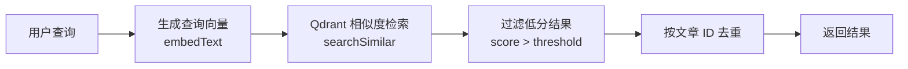

# 语义搜索系统

> **状态**: ✅ 已实施
> **创建日期**: 2026-01-17
> **相关文档**: [向量化总览](../vector/overview.md) | [RAG 聊天系统](../chat/rag-chat.md)

## 概述

语义搜索系统基于 Qdrant 向量数据库实现,提供基于语义相似度的文章检索能力。相比传统关键词搜索,语义搜索能够理解查询意图,返回更相关的结果。

### 核心特性

- **语义相似度检索**：基于向量相似度,而非关键词匹配
- **混合检索**：支持向量检索 + 关键词过滤
- **结果去重**：按文章 ID 去重,避免重复结果
- **相似度阈值**：可配置的最低相似度要求

## 文件位置

**实现文件**：
- `src/services/embedding/search.ts` - 搜索服务
- `src/services/embedding/vector-store.ts` - 向量存储操作

## 搜索流程



## 核心实现

### 1. 语义搜索

```typescript
// src/services/embedding/search.ts

/**
 * 语义搜索
 */
export async function semanticSearch(
  query: string,
  options: SearchOptions = {}
): Promise<SearchResult[]> {
  const {
    limit = 10,
    scoreThreshold = 0.7,
    filters = {},
  } = options;

  // 1. 生成查询向量
  const queryVector = await embedText(query);

  // 2. 执行向量检索
  const results = await searchSimilar(
    queryVector,
    limit * 2,  // 获取更多结果,用于去重
    scoreThreshold,
    filters
  );

  // 3. 按文章 ID 去重
  const uniqueResults = deduplicateByPostId(results);

  // 4. 限制返回数量
  return uniqueResults.slice(0, limit);
}
```

### 2. 结果去重

```typescript
/**
 * 按文章 ID 去重,保留最高分的结果
 */
function deduplicateByPostId(results: SearchResult[]): SearchResult[] {
  const map = new Map<number, SearchResult>();

  for (const result of results) {
    const existing = map.get(result.postId);
    if (!existing || result.score > existing.score) {
      map.set(result.postId, result);
    }
  }

  return Array.from(map.values()).sort((a, b) => b.score - a.score);
}
```

### 3. 向量检索

```typescript
// src/services/embedding/vector-store.ts

/**
 * 相似度检索
 */
export async function searchSimilar(
  queryVector: number[],
  limit: number = 10,
  scoreThreshold: number = 0.7,
  filters?: Record<string, unknown>
): Promise<SearchResult[]> {
  const filter = filters ? buildFilter(filters) : undefined;

  const response = await qdrantClient.search(COLLECTION_NAME, {
    vector: queryVector,
    limit,
    score_threshold: scoreThreshold,
    filter,
  });

  return response.map((point) => ({
    postId: point.payload.post_id as number,
    chunkIndex: point.payload.chunk_index as number,
    content: point.payload.chunk_text as string,
    title: point.payload.title as string,
    score: point.score,
  }));
}
```

## 数据结构

### 搜索选项

```typescript
interface SearchOptions {
  limit?: number;              // 返回结果数量（默认 10）
  scoreThreshold?: number;     // 相似度阈值（默认 0.7）
  filters?: {
    hide?: string;             // 是否隐藏（'0' 或 '1'）
    categoryId?: number;       // 分类 ID
    tagIds?: number[];         // 标签 ID 列表
  };
}
```

### 搜索结果

```typescript
interface SearchResult {
  postId: number;      // 文章 ID
  chunkIndex: number;  // 块索引
  content: string;     // 匹配的文本片段
  title: string;       // 文章标题
  score: number;       // 相似度分数 (0-1)
}
```

## 使用示例

### 基础搜索

```typescript
import { semanticSearch } from '@/services/embedding/search';

const results = await semanticSearch('Next.js App Router', {
  limit: 5,
  scoreThreshold: 0.7,
});

results.forEach((result) => {
  console.log(`${result.title} (${result.score})`);
  console.log(result.content);
});
```

### 带过滤的搜索

```typescript
const results = await semanticSearch('React Hooks', {
  filters: {
    hide: '0',        // 只搜索公开文章
    categoryId: 1,    // 指定分类
  },
});
```

### 在 API 中使用

```typescript
// src/app/api/search/route.ts

import { semanticSearch } from '@/services/embedding/search';
import { NextRequest, NextResponse } from 'next/server';

export async function GET(request: NextRequest) {
  const { searchParams } = new URL(request.url);
  const query = searchParams.get('q');

  if (!query) {
    return NextResponse.json({
      status: false,
      message: '缺少查询参数',
    });
  }

  const results = await semanticSearch(query, {
    limit: 10,
    scoreThreshold: 0.7,
    filters: { hide: '0' },
  });

  return NextResponse.json({
    status: true,
    data: results,
  });
}
```

## 性能优化

### 1. 查询缓存

```typescript
import LRU from 'lru-cache';

const searchCache = new LRU<string, SearchResult[]>({
  max: 100,
  ttl: 1000 * 60 * 5,  // 5 分钟
});

export async function semanticSearch(
  query: string,
  options: SearchOptions = {}
): Promise<SearchResult[]> {
  const cacheKey = `${query}-${JSON.stringify(options)}`;

  // 检查缓存
  const cached = searchCache.get(cacheKey);
  if (cached) {
    return cached;
  }

  // 执行搜索
  const results = await performSearch(query, options);

  // 缓存结果
  searchCache.set(cacheKey, results);

  return results;
}
```

### 2. 批量查询

```typescript
/**
 * 批量搜索
 */
export async function batchSemanticSearch(
  queries: string[],
  options: SearchOptions = {}
): Promise<SearchResult[][]> {
  // 批量生成查询向量
  const queryVectors = await embedTexts(queries);

  // 并发执行搜索
  const results = await Promise.all(
    queryVectors.map((vector) =>
      searchSimilar(vector, options.limit, options.scoreThreshold, options.filters)
    )
  );

  // 去重并返回
  return results.map((r) => deduplicateByPostId(r));
}
```

## 相似度阈值

### 推荐设置

| 场景 | 阈值 | 说明 |
|------|------|------|
| 严格匹配 | 0.85 | 只返回高度相关的结果 |
| 标准搜索 | 0.7 | 平衡相关性和召回率 |
| 宽松搜索 | 0.5 | 提高召回率，返回更多结果 |
| 探索性搜索 | 0.3 | 发现潜在相关的内容 |

### 调优建议

1. **初始值**：从 0.7 开始，根据实际效果调整
2. **A/B 测试**：对比不同阈值的效果
3. **用户反馈**：根据点击率、停留时间等指标优化

## 混合检索

### 向量 + 关键词

```typescript
/**
 * 混合检索（向量 + 关键词）
 */
export async function hybridSearch(
  query: string,
  options: SearchOptions = {}
): Promise<SearchResult[]> {
  // 1. 语义搜索
  const semanticResults = await semanticSearch(query, options);

  // 2. 关键词搜索（使用 Prisma 全文搜索）
  const keywordResults = await prisma.tbPost.findMany({
    where: {
      AND: [
        { content: { contains: query } },
        { hide: options.filters?.hide || '0' },
      ],
    },
    take: options.limit,
  });

  // 3. 合并结果
  const combined = combineResults(semanticResults, keywordResults);

  return combined;
}
```

## 监控指标

- **平均查询延迟**：目标 < 500ms
- **命中率**：返回结果的比例
- **零结果率**：无结果的查询比例
- **用户满意度**：点击率、停留时间

## 故障排查

### 查询无结果

1. 检查相似度阈值是否过高
2. 检查向量数据库是否有数据
3. 检查查询向量是否正常生成

```bash
# 检查 Qdrant 集合信息
curl http://localhost:6333/collections/blog_posts

# 查看向量数量
```

### 查询延迟高

1. 检查 Qdrant 索引配置
2. 检查网络延迟
3. 考虑增加缓存

## 参考资料

- [Qdrant 搜索文档](https://qdrant.tech/documentation/concepts/search/)
- [向量化总览](../vector/overview.md)
- [RAG 聊天系统](../chat/rag-chat.md)

---

**文档版本**：v2.0
**创建日期**：2026-01-17
**最后更新**：2026-03-12
**状态**：✅ 已实现
