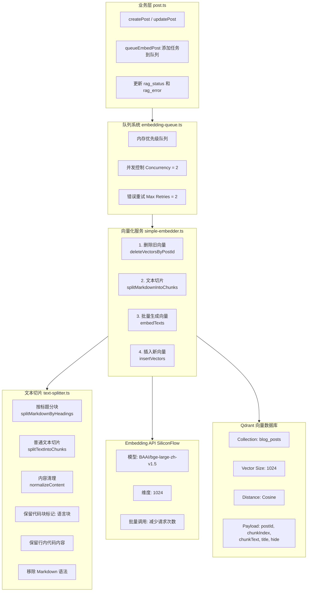

# 向量化系统总览

> **本文档定位**: 技术设计文档 - 说明向量化系统的设计原理和架构决策
>
> **状态**: ✅ 已实施
> **创建日期**: 2026-01-17
> **相关文档**: [文本切片](./chunking.md) | [向量存储](./storage.md) | [队列系统](./queue.md)
>
> **开发实施规范**详见: [向量检索与向量化系统](../../rules/vector-search.md)

## 概述

本项目的向量化系统将博客文章内容转换为高维向量,存储到 Qdrant 向量数据库中,用于语义搜索、相似文章推荐和 RAG(检索增强生成)等场景。

### 核心特性

- **智能文本切片**：按 Markdown 结构语义分块，保留代码块和行内代码
- **批量向量化**：使用 BAAI/bge-large-zh-v1.5 模型生成 1024 维向量
- **异步队列**：通过内存队列管理向量化任务，不阻塞主流程
- **全量更新策略**：每次重新生成向量，保证数据一致性
- **错误重试机制**：自动重试失败任务，提高可靠性

## 架构设计

### 整体架构



### 核心组件

| 组件 | 路径 | 职责 | 详细文档 |
|------|------|------|----------|
| **队列系统** | `src/services/embedding/embedding-queue.ts` | 任务队列、并发控制、错误重试 | [队列系统](./queue.md) |
| **向量化服务** | `src/services/embedding/simple-embedder.ts` | 全量向量化流程编排 | - |
| **文本切片** | `src/services/embedding/text-splitter.ts` | Markdown 分块、内容清理 | [文本切片](./chunking.md) |
| **Embedding API** | `src/services/embedding/embedding.ts` | 向量生成、批量处理 | - |
| **向量存储** | `src/services/embedding/vector-store.ts` | Qdrant CRUD 操作 | [向量存储](./storage.md) |
| **初始化脚本** | `src/instrumentation.ts` | 应用启动时创建 Qdrant 集合 | [向量存储](./storage.md) |

## 环境变量配置

```env
# Embedding API 配置
BLOG_EMBEDDING_API_KEY=sk-xxx
BLOG_EMBEDDING_BASE_URL=https://api.siliconflow.cn/v1
BLOG_EMBEDDING_MODEL=BAAI/bge-large-zh-v1.5

# Qdrant 配置
QDRANT_URL=http://localhost:6333
QDRANT_API_KEY=your-api-key  # 可选，如果启用了鉴权
```

## 数据结构

### Qdrant Collection 配置

```typescript
// src/lib/qdrant.ts

export const QDRANT_COLLECTION_CONFIG = {
  NAME: 'blog_posts',
  DIMENSION: 1024,        // BAAI/bge-large-zh-v1.5 向量维度
  DISTANCE: 'Cosine',     // 余弦相似度
};

export interface VectorDataItem {
  postId: number;
  chunkIndex: number;
  chunkText: string;
  title: string;
  hide?: string;
  embedding: number[];
  createdAt: number;
}
```

### 文章状态字段

```prisma
// prisma/schema.prisma

model TbPost {
  // ... 其他字段

  rag_status     String?  @default("pending")  // 向量化状态
  rag_error      String?  @db.Text             // 错误信息
}
```

## 向量化流程

```typescript
// src/services/embedding/simple-embedder.ts

export async function simpleEmbedPost(
  params: SimpleEmbedParams
): Promise<SimpleEmbedResult> {
  const { postId, title, content, hide = '0' } = params;

  // 1. 删除旧向量
  await deleteVectorsByPostId(postId);

  // 2. 文本切片
  const chunks = splitMarkdownIntoChunks(content, {
    chunkSize: 500,      // 每个片段的最大字符数
    chunkOverlap: 100,   // 片段之间的重叠字符数
    minChunkSize: 100,   // 最小片段字符数
  });

  // 3. 批量生成向量
  const texts = chunks.map((c) => c.text);
  const embeddings = await embedTexts(texts);

  // 4. 准备向量数据
  const vectorItems: VectorDataItem[] = chunks.map((chunk, index) => ({
    postId,
    chunkIndex: index,
    chunkText: chunk.text,  // 保留完整内容（不过度清理）
    title,
    hide,
    embedding: embeddings[index],
    createdAt: Date.now(),
  }));

  // 5. 插入向量
  const insertedCount = await insertVectors(vectorItems);

  return { insertedCount, chunkCount: chunks.length };
}
```

## API 端点

| 端点 | 方法 | 说明 |
|------|------|------|
| `/api/post/[id]/embed` | POST | 手动触发向量化 |
| `/api/post/embed/batch` | POST | 批量向量化 |
| `/api/embedding/queue/status` | GET | 获取队列状态 |

## Qdrant 部署

### 方式一：Docker

```bash
docker run -p 6333:6333 -p 6334:6334 \
  -v $(pwd)/qdrant_storage:/qdrant/storage \
  -e QDRANT__SERVICE__API_KEY=your-api-key \
  qdrant/qdrant:latest
```

### 方式二：Docker Compose

```yaml
version: '3.8'
services:
  qdrant:
    image: qdrant/qdrant:latest
    ports:
      - "6333:6333"
      - "6334:6334"
    volumes:
      - ./qdrant_storage:/qdrant/storage
    environment:
      - QDRANT__SERVICE__API_KEY=your-api-key
```

## 性能指标

- 平均向量化时间（目标 < 5 秒）
- Embedding API 调用次数
- Qdrant 操作成功率
- 队列长度和处理速度
- 向量化失败率

## 安全考虑

### 安全措施

1. **API 密钥管理**
   - 使用环境变量存储密钥
   - 不在代码中硬编码密钥
   - 定期轮换密钥

2. **权限验证**
   - 向量化 API 需要管理员权限
   - 手动触发端点需要身份验证

3. **输入验证**
   - 文章内容长度限制
   - 防止恶意向量化（如大量垃圾数据）

## 扩展性

### 未来改进方向

1. **持久化队列**
   - 使用 Redis / BullMQ
   - 支持任务持久化
   - 支持分布式部署

2. **智能切片**
   - 代码块单独切片
   - 提取代码注释和变量名

3. **多模型支持**
   - 支持多种 Embedding 模型
   - 支持本地模型（如 Ollama）

4. **向量优化**
   - 量化向量（Float32 → Int8）
   - 减少 Qdrant 存储空间

## 参考资料

### Embedding 模型

- **BAAI/bge-large-zh-v1.5**: https://huggingface.co/BAAI/bge-large-zh-v1.5
- **SiliconFlow**: https://docs.siliconflow.cn/

### 向量数据库

- **Qdrant 文档**: https://qdrant.tech/documentation/
- **Qdrant Cloud**: https://cloud.qdrant.io/

### 项目相关

- [语义搜索](../search/semantic-search.md)
- [RAG 聊天系统](../chat/rag-chat.md)
- [队列调试指南](../../reference/QUEUE-DEBUG-GUIDE.md)

---

**文档版本**：v2.0
**创建日期**：2026-01-17
**最后更新**：2026-03-12
**状态**：✅ 已实现
