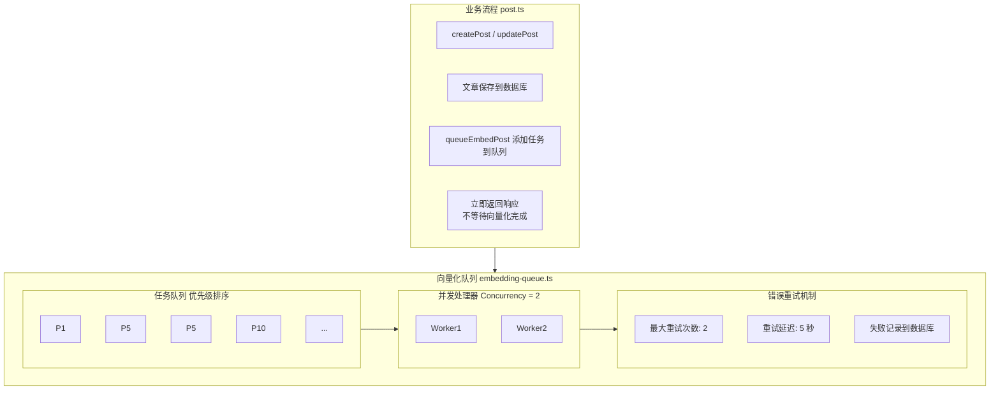

# 向量化队列系统

> **状态**: ✅ 已实施
> **创建日期**: 2026-01-17
> **相关文档**: [向量化总览](./overview.md) | [队列调试指南](../../../reference/QUEUE-DEBUG-GUIDE.md)

## 概述

向量化队列系统是一个基于内存的异步任务队列，用于管理文章向量化任务。该系统将耗时的向量化操作从主请求流程中分离，提高 API 响应速度，同时保证任务的可靠执行。

### 核心特性

- **异步执行**：不阻塞主流程，API 响应时间 < 100ms
- **优先级队列**：支持任务优先级，新文章优先于更新文章
- **并发控制**：限制并发数量，避免资源耗尽
- **错误重试**：自动重试失败任务，提高可靠性
- **状态管理**：实时追踪任务状态（待处理、处理中、已完成、失败）

## 文件位置

**实现文件**：`src/services/embedding/embedding-queue.ts`

## 架构设计

### 整体架构



## 数据结构

### 任务定义

```typescript
/**
 * 向量化任务
 */
export interface EmbedTask {
  postId: number;      // 文章 ID
  title: string;       // 文章标题
  content: string;     // 文章内容（Markdown）
  hide?: string;       // 是否隐藏（'0' 或 '1'）
  priority: number;    // 优先级（数字越小越优先）
  addTime: number;     // 添加时间（时间戳）
}

/**
 * 向量化状态
 */
export enum EmbedStatus {
  PENDING = 'pending',       // 待处理
  PROCESSING = 'processing', // 处理中
  COMPLETED = 'completed',   // 已完成
  FAILED = 'failed',         // 失败
}
```

### 队列配置

```typescript
const QUEUE_CONFIG = {
  concurrency: 2,      // 并发处理数量
  maxRetries: 2,       // 任务重试次数
  retryDelay: 5000,    // 重试延迟（毫秒）
  checkInterval: 1000, // 队列检查间隔（毫秒）
};
```

## 核心流程

### 1. 队列启动和调度

```typescript
class EmbeddingQueue {
  private queue: EmbedTask[] = [];
  private processing = new Set<number>();
  private isRunning = false;

  /**
   * 启动队列
   */
  start() {
    if (this.isRunning) return;

    console.log('🚀 启动向量化队列');
    this.isRunning = true;
    this.schedule();
  }

  /**
   * 调度下一个任务
   */
  private schedule() {
    if (!this.isRunning) return;

    // 如果队列中有任务且未达到并发限制
    while (
      this.queue.length > 0 &&
      this.processing.size < QUEUE_CONFIG.concurrency
    ) {
      const task = this.queue.shift();
      if (!task) break;

      this.processTask(task);
    }

    // 定期检查队列
    this.timer = setTimeout(() => this.schedule(), QUEUE_CONFIG.checkInterval);
  }
}
```

### 2. 任务添加

```typescript
/**
 * 添加任务到队列
 */
add(task: EmbedTask): void {
  // 检查重复
  const exists = this.queue.some(t => t.postId === task.postId);
  if (exists) {
    console.log(`⚠️ 文章 ${task.postId} 已在队列中`);
    return;
  }

  // 检查是否正在处理
  if (this.processing.has(task.postId)) {
    console.log(`⚠️ 文章 ${task.postId} 正在处理中`);
    return;
  }

  // 添加到队列并排序
  this.queue.push(task);
  this.queue.sort((a, b) => {
    if (a.priority !== b.priority) {
      return a.priority - b.priority; // 按优先级升序
    }
    return a.addTime - b.addTime; // 同优先级按时间升序
  });

  console.log(`📥 文章 ${task.postId} 已添加到队列`);

  // 自动启动队列
  if (!this.isRunning) {
    this.start();
  }
}
```

### 3. 业务集成

```typescript
// src/services/post.ts

import { queueEmbedPost } from '@/services/embedding';

/**
 * 创建文章
 */
export async function createPost(data: CreatePostInput) {
  // 1. 保存到数据库
  const result = await prisma.tbPost.create({
    data: {
      ...data,
      rag_status: 'pending',
      rag_error: null,
    },
  });

  // 2. 异步添加到向量化队列（不阻塞响应）
  if (result.content) {
    (async () => {
      try {
        await queueEmbedPost({
          postId: result.id,
          title: result.title || '',
          content: result.content,
          hide: result.hide || '0',
          priority: 5, // 新文章优先级
        });
      } catch (error) {
        console.error(`❌ 添加文章 ${result.id} 到向量化队列失败:`, error);
      }
    })();
  }

  return serializePost(result);
}
```

## 优先级策略

| 优先级值 | 场景 | 说明 |
|----------|------|------|
| 1 | 手动触发 | 用户手动重新向量化 |
| 5 | 正常业务 | 新建/更新文章 |
| 10 | 批量处理 | 批量重新向量化 |

## API 端点

### 获取队列状态

```bash
GET /api/embedding/queue/status
```

**响应示例**：
```json
{
  "status": true,
  "data": {
    "queueLength": 5,
    "processingCount": 2,
    "queueTasks": [
      { "postId": 123, "priority": 5, "addTime": 1641234567890 }
    ],
    "processingTasks": [
      { "postId": 456, "startTime": 1641234567890 }
    ]
  }
}
```

### 手动触发向量化

```bash
POST /api/post/[id]/embed
```

**功能**：将文章添加到队列，优先级设为 1（最高）

### 批量向量化

```bash
POST /api/post/embed/batch
```

**功能**：批量添加文章到队列，优先级设为 10（最低）

## 错误处理

### 重试机制

```typescript
private async processTask(task: EmbedTask) {
  this.processing.add(task.postId);

  try {
    // 更新数据库状态为处理中
    await this.updateTaskStatus(task.postId, EmbedStatus.PROCESSING);

    // 执行向量化
    await simpleEmbedPost({
      postId: task.postId,
      title: task.title,
      content: task.content,
      hide: task.hide,
    });

    // 更新数据库状态为已完成
    await this.updateTaskStatus(task.postId, EmbedStatus.COMPLETED);

    console.log(`✅ 文章 ${task.postId} 向量化完成`);
  } catch (error) {
    console.error(`❌ 文章 ${task.postId} 向量化失败:`, error);

    // 重试逻辑
    const retryCount = await this.getRetryCount(task.postId);
    if (retryCount < QUEUE_CONFIG.maxRetries) {
      console.log(`🔄 重试文章 ${task.postId} (第 ${retryCount + 1} 次)`);
      await this.incrementRetryCount(task.postId);

      // 延迟后重新加入队列
      setTimeout(() => {
        this.add({ ...task, priority: task.priority + 1 }); // 降低优先级
      }, QUEUE_CONFIG.retryDelay);
    } else {
      // 标记为失败
      await this.updateTaskStatus(
        task.postId,
        EmbedStatus.FAILED,
        error.message
      );
    }
  } finally {
    this.processing.delete(task.postId);
  }
}
```

## 性能考虑

### 优化策略

1. **并发控制**
   - 限制并发数量（2），避免 Embedding API 限流
   - 根据服务器性能和 API 限制调整并发数

2. **优先级队列**
   - 新文章优先于批量处理
   - 手动触发优先于自动触发

3. **错误重试**
   - 指数退避策略（5 秒延迟）
   - 最大重试 2 次，避免无限重试

### 监控指标

- 队列长度（待处理任务数）
- 处理中任务数
- 平均处理时间
- 失败率
- Embedding API 调用次数

## 潜在风险

| 风险 | 影响 | 缓解措施 |
|------|------|----------|
| 任务丢失 | 服务重启任务丢失 | 持久化队列（未来） |
| API 限流 | 任务堆积 | 并发控制、重试延迟 |
| 内存溢出 | 队列过长 | 队列长度限制 |

## 未来改进

### 持久化队列

使用 Redis / BullMQ 替代内存队列：

```typescript
import { Queue, Worker } from 'bullmq';

const embeddingQueue = new Queue('embedding', {
  connection: { host: 'localhost', port: 6379 },
});

const worker = new Worker('embedding', async (job) => {
  await simpleEmbedPost(job.data);
});
```

### 进度反馈

使用 WebSocket 实时推送进度：

```typescript
// 向前端推送向量化进度
ws.send({
  type: 'embedding_progress',
  postId: 123,
  progress: 50,
  status: 'processing',
});
```

## 调试指南

详细的调试指南请参考：[队列调试指南](../../../reference/QUEUE-DEBUG-GUIDE.md)

### 常用调试命令

```bash
# 查看队列状态
curl http://localhost:3000/api/embedding/queue/status

# 手动触发向量化
curl -X POST http://localhost:3000/api/post/123/embed

# 查看数据库中的向量化状态
mysql -e "SELECT id, title, rag_status, rag_error FROM tb_post WHERE rag_status != 'completed'"
```

## 参考资料

- [BullMQ 文档](https://docs.bullmq.io/)
- [Redis 队列](https://python-rq.org/)
- [向量化总览](./overview.md)

---

**文档版本**：v1.0
**创建日期**：2026-01-17
**最后更新**：2026-03-12
**状态**：✅ 已实现
