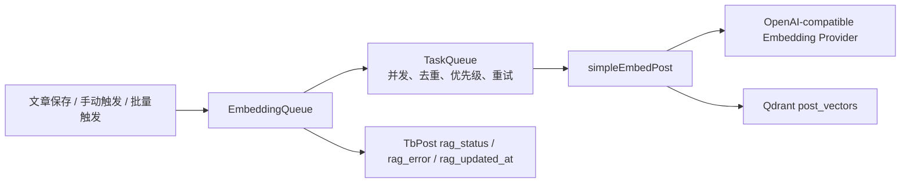

# 向量化队列系统

> 状态：已实施
> 实现：`src/services/embedding/embedding-queue.ts`
> 通用队列：`src/services/queue/task-queue.ts`

## 当前架构

向量化队列不是独立调度器。`EmbeddingQueue` 是通用 `TaskQueue` 的业务适配器，负责将文章任务转换为 `QueueTask<'embedding', EmbedTask>`，并在处理前后更新 `TbPost` 的 RAG 状态。


```mermaid
flowchart LR
    API["文章保存 / 手动触发 / 批量触发"] --> Adapter["EmbeddingQueue"]
    Adapter --> Queue["TaskQueue<br/>并发、去重、优先级、重试"]
    Queue --> Embedder["simpleEmbedPost"]
    Embedder --> Provider["OpenAI-compatible Embedding Provider"]
    Embedder --> Qdrant["Qdrant post_vectors"]
    Adapter --> Status["TbPost rag_status / rag_error / rag_updated_at"]
```

## 任务与配置

任务载荷：

```typescript
interface EmbedTask {
  postId: number;
  title: string;
  content: string;
  hide?: string;
  priority: number;
  addTime: number;
}
```

当前固定配置：

| 配置 | 值 |
|---|---:|
| concurrency | 2 |
| maxRetries | 2 |
| retryDelay | 5000 ms |
| checkInterval | 1000 ms |

数字越小优先级越高；同优先级按 `addTime` 排序。`TaskQueue` 用字符串化 `postId` 去重，已等待或处理中的文章不会重复入队。

## 状态流转

1. `queueEmbedPost` 读取文章并将 `rag_status` 置为 `pending`，同时清空 `rag_error`。
2. worker 开始时写入 `processing`。
3. `simpleEmbedPost` 完成后写入 `completed` 与 `rag_updated_at`。
4. 处理失败由通用队列重试；最终失败写入 `failed` 与错误信息。

队列在内存中，进程重启会丢失等待任务；数据库中的 `rag_status` 用于发现未完成文章，但当前向量适配器没有像图片/TTS 那样的启动恢复扫描。

## 入口与监控

| 端点 | 方法 | 说明 |
|---|---|---|
| `/api/post/[id]/embed` | POST | 单篇文章入队 |
| `/api/post/embed/batch` | POST | 批量入队 |
| `/api/post/embed/queue` | GET | 当前进程的向量队列快照 |
| `/c/vector-search` | 页面 | 向量搜索与向量化运维 |
| `/c/queue` | 页面 | 与图片生成、TTS 一起展示队列状态 |

队列快照包含 `queueLength`、`processingCount`、`queueTasks`、`processingTasks` 和 `isRunning`。

## 运维检查

```bash
curl http://localhost:3000/api/post/embed/queue
curl -X POST http://localhost:3000/api/post/123/embed
```

```sql
SELECT id, title, rag_status, rag_error, rag_updated_at
FROM tb_post
WHERE rag_status <> 'completed' OR rag_status IS NULL;
```

## 相关文档

- [向量化总览](./overview.md)
- [向量存储](./storage.md)
- [后台任务队列系统](../infra/task-queue.md)

最后更新：2026-07-28。
