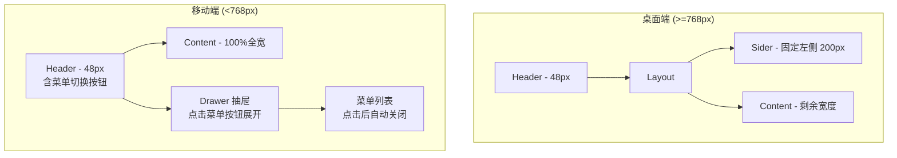

# 管理后台移动端适配优化

## 状态
✅ 已完成

## 问题分析

### 移动端体验报告

测试环境：Chromium 模拟 iPhone X (375×812) 和横屏 (812×375)

#### 1. 侧边栏（Sider）占用过大 — 🔴 严重

**现象**：侧边栏固定宽度 `200px`，在 375px 宽的屏幕上占比 **53.3%**，主内容区仅剩 **175px**，几乎无法阅读。

**数据**：
| 视口 | 侧边栏宽度 | 占比 | 主内容区宽度 |
|------|-----------|------|-------------|
| 375×812（竖屏） | 200px | 53.3% | 175px |
| 812×375（横屏） | 200px | 24.6% | 612px |

**根因**：`src/app/c/layout.tsx` 中 `<Sider width={200}>` 硬编码了固定宽度，没有任何响应式处理。

**影响**：
- 竖屏下文章表格宽度 825px，被挤压到 175px 内，完全不可读
- 8 个菜单项纵向排列，占满整屏高度，"管理后台"标题占 64px
- 用户只能通过横向滚动查看内容，体验极差

#### 2. 顶部 Header 占用过大 — 🟡 中等

**现象**：Header 高度固定 `3rem`（48px），在 812px 高的屏幕上占 5.9%。虽然比例不算极端，但在移动端这个空间很宝贵。

**问题细节**：
- Header 内元素布局未针对移动端优化：Logo、暗色模式按钮、用户名、汉堡菜单 4 个元素横排
- 移动端仍然显示用户名文字（"NNNNzs"），占用空间
- 没有利用 Header 高度做任何移动端专属优化（如折叠 Sider 触发器）

#### 3. 文章表格横向溢出 — 🔴 严重

**现象**：文章列表表格实际宽度 825px（scrollWidth 840px），在 175px 的主内容区内完全溢出。

**问题细节**：
- 8 列数据（ID / 标题 / 标签 / 状态 / 向量化状态 / 统计 / 日期 / 操作），在移动端不可能横排
- 每行 5 个操作按钮（查看 / 编辑 / 变更历史 / 更新向量 / 删除），在窄屏上密集拥挤
- 标签（Tag）多个并列，横向撑开表格

#### 4. 筛选栏溢出 — 🟡 中等

**现象**：搜索框 + 3 个下拉筛选器（我创建的 / 已删除文章 / 状态筛选）横排，在 175px 内完全溢出。

#### 5. 无移动端导航替代方案 — 🔴 严重

**现象**：桌面端的固定侧边栏在移动端没有变成抽屉（Drawer）或底部导航。用户无法收起菜单，Sider 永远占据一半屏幕。

### 截图参考

测试截图保存在 `~/.openclaw/media/browser/` 目录：
- `5ea2b6b5-3488-472d-bc9b-3033e776c934.png` — 竖屏文章列表页
- `af0153eb-c220-45b7-8094-d14a53c10e8a.png` — 竖屏全貌

## 解决方案

### 核心思路

移动端将 Sider 改为 **Ant Design Drawer 抽屉**，主内容区占满全宽。

### 架构图

### 详细设计

#### 1. Sider 改为响应式抽屉

修改 `src/app/c/layout.tsx`：

- 引入 `antd` 的 `Drawer` 组件
- 使用 `useEffect` + `window.matchMedia` 或 `useMediaQuery` 检测屏幕宽度
- **≥768px（md 断点）**：保持现有 Sider 布局
- **<768px**：
  - Sider 隐藏，内容区 `ml-0` 占满宽度
  - Header 中显示菜单图标按钮（汉堡菜单）
  - 点击汉堡菜单打开 Drawer，内含相同的菜单项
  - 选择菜单项后自动关闭 Drawer
  - Drawer 支持左右滑动关闭

#### 2. 文章表格移动端适配

修改 `src/app/c/post/page.tsx`：

- **移动端**：将表格改为卡片列表模式
  - 每篇文章一张卡片，纵向排列
  - 卡片内：标题 + 标签（换行） + 状态 + 操作按钮
  - 操作按钮精简：主操作（编辑）直接显示，次要操作（查看/历史/向量/删除）收入 `Dropdown` 或 `Popover`
- **桌面端**：保持现有表格不变

#### 3. 筛选栏移动端适配

- 搜索框全宽
- 筛选器改为 `flex-wrap` 自动换行，或用 `Dropdown` 折叠

#### 4. Header 优化（可选）

- 移动端隐藏 Logo 文字 "NNNNzs"，只保留图标
- 用户名改为头像图标，减少占用

## 实施步骤

1. [ ] 创建 `useBreakpoint` Hook，封装 `window.matchMedia('(min-width: 768px)')` 逻辑
2. [ ] 修改 `src/app/c/layout.tsx`，实现 Sider/Drawer 响应式切换
3. [ ] 移动端 Header 添加菜单切换按钮（复用已有的 Drawer 汉堡菜单逻辑）
4. [ ] 修改 `src/app/c/post/page.tsx`，移动端表格改卡片列表
5. [ ] 筛选栏响应式适配（flex-wrap 或折叠）
6. [ ] 操作按钮移动端精简（Dropdown 收纳）
7. [ ] 其他管理页面（评论/合集/配置等）检查并适配
8. [ ] 移动端测试验证

## 风险评估

| 风险 | 影响 | 应对 |
|------|------|------|
| Drawer 动画性能 | 低 | Ant Design Drawer 已做性能优化，影响不大 |
| 现有布局样式冲突 | 中 | 用断点隔离，不修改桌面端样式 |
| 其他管理页面未适配 | 中 | 优先适配文章管理页，其他页面后续迭代 |
| SSR 下媒体查询不可用 | 低 | 使用 `useEffect` 延迟检测，避免 hydration 不匹配 |

## 验证清单

- [ ] 竖屏（375×812）：Sider 隐藏，内容区占满全宽
- [ ] 竖屏：点击菜单按钮，Drawer 从左侧滑出
- [ ] 竖屏：选择菜单项后 Drawer 自动关闭
- [ ] 竖屏：文章列表以卡片形式展示，可读性好
- [ ] 横屏（812×375）：布局合理，内容区充足
- [ ] 桌面端（≥768px）：布局不变，无回归
- [ ] 其他管理页面在移动端不崩溃，至少可用

## 备注

- Ant Design 的 `Layout.Sider` 本身有 `breakpoint` + `collapsed` 功能，但它的折叠只是收窄为图标模式（80px），不能完全隐藏。需要用 Drawer 替代才能实现真正隐藏。
- 可以考虑 Ant Design 的 `Grid.useBreakpoint` 来检测屏幕尺寸，无需自建 Hook。
