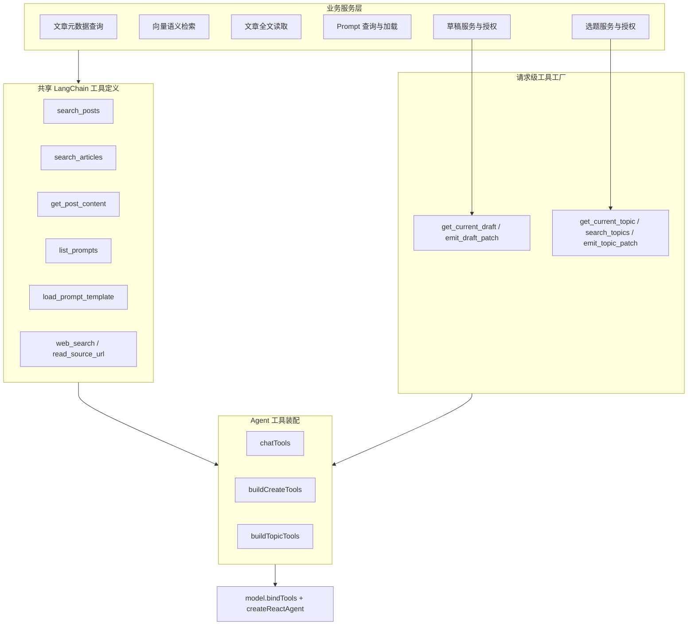

# AI Agent 工具定义与装配统一改造

> 状态：🔄 进行中（代码层已完成，待数据库模板同步与运行联调）
> 创建时间：2026-07-14
> 涉及范围：Chat Agent、Create Agent、Topic Agent、AI Template Prompts
> 关联文档：[草稿库创作 Agent 助手](./create-agent.md)、[选题库 Topic Agent](../designs/ai/topic-agent.md)、[AI Lab / LLM 学习实验台](../designs/ai/ai-lab.md)

## 一、背景与前因

项目的 Agent 工具经历了两轮演进：

1. 早期工具使用项目自定义的 `Tool` / `ToolResult` 接口，工具同时保存 name、description、参数描述和 `execute()`。
2. Chat Agent 迁移到 LangChain / LangGraph 后，在 `src/services/ai/tools/langchain-tools.ts` 中用 `tool()` 和 Zod schema 包装旧工具。
3. Create Agent 和 Topic Agent 为了注入 `draftId`、`topicId`、`userId`、`emitPatch` 等请求上下文，又各自建立 `buildCreateTools` / `buildTopicTools` 工厂。
4. 后续新增文章查询、网页搜索和 Prompt 工具时，一部分直接复用旧业务工具，一部分在各 Agent 文件中重新声明 LangChain wrapper，逐渐形成多套定义。

当前 `buildCreateTools` 和 `buildTopicTools` 同时承担了两类职责：

- 决定当前 Agent 可以使用哪些工具；
- 定义工具的 name、description、schema、执行适配和错误序列化。

这使“工具能力定义”和“Agent 权限装配”发生耦合。相同能力在多个文件重复声明，而一个文件中存在某个工具，也不代表该工具已经进入某个 Agent 的 `tools` / `bindTools()` 数组。

## 二、当前问题

### 2.1 同一工具存在多份 LangChain 定义

Prompt 查询和加载工具曾在 `src/services/ai/tools/langchain-tools.ts` 中定义为 LangChain `StructuredTool`，Create Agent 又重新包装一次。两套代码分别维护 Zod schema、description、错误格式和返回序列化，容易产生行为漂移；现已统一为 `list_prompts` 和 `load_prompt_template`。

### 2.2 共享文章工具归属和命名不清

- Create Agent 与 Topic Agent 分别定义 `wrapSearchPosts`，但都调用同一个 `searchPostsMetaTool.execute()`。
- Create Agent 与 Topic Agent 分别定义 `wrapGetPostContent`，但都调用同一个 `getPostContentTool.execute()`。
- `getPostContentTool` 位于 `create-tools/index.ts`，实际已被 Topic Agent 使用，目录所有权与真实复用范围不一致。
- Chat 使用 `search_posts_meta`，Create / Topic 使用 `search_posts`，底层能力相同但模型侧名称和参数集合不同。

`search_articles` 不属于上述重复：它是 embedding + Qdrant 的语义检索，返回相关正文片段；`search_posts` 是按关键词、标签、日期、热度等条件查询文章元数据。二者应作为不同能力保留。

### 2.3 Agent 工具清单与 Prompt 描述不一致

Topic Agent 的 system prompt 和 `compilePromptTemplate` 生成的 metadata 会提示调用 `load_prompt_template`，但早期 `buildTopicTools` 没有装配该工具。工具已经在其他文件中定义，并不等于 Topic Agent 可以调用它。

### 2.4 无状态工具和请求级工具没有明确边界

文章搜索、文章全文读取、Prompt 加载等工具不依赖当前请求状态，适合定义为可复用单例。

`get_draft`、`get_topic`、`search_topics`、`emit_draft_patch`、`emit_topic_patch` 依赖当前资源、用户范围或 SSE 回调，应由工厂注入模型不可控的请求上下文。

把 `draftId` 直接暴露为全局工具参数在技术上可行，但会把“读取当前草稿”扩大为“模型可选择读取任意草稿”。当前 `getContentDraft(id)` 只按主键查询，没有内建用户范围校验，因此不能在缺少授权过滤时直接改为任意 ID 查询。若未来确有跨草稿读取需求，应新增独立的 `get_draft_by_id` / `search_drafts`，并由服务端注入 actor 和数据范围。

### 2.5 Prompt 能力边界缺少统一约束

工具装配、模板 `@slug` 绑定、模板状态和 scope 当前没有形成同一套授权规则：

- Agent 是否拿到 `list_prompts` / `load_prompt_template` 由工具数组决定；
- Agent 启动时看到哪些 Prompt metadata 由 system prompt 中的 `@slug` 决定；
- 加载接口必须执行 `ACTIVE + Agent scope` 校验；
- mentions 应从原始模板解析，不能扫描 mustache 注入后的草稿、选题或用户资料内容。

## 三、改造目标

1. 每个模型侧工具只维护一份 name、description、Zod schema 和执行逻辑。
2. `buildCreateTools`、`buildTopicTools` 和 Chat 工具装配只负责选择工具与注入请求上下文。
3. 无状态能力使用共享 `StructuredTool` 单例；请求级能力使用统一工厂创建实例。
4. 共享业务查询从 Agent 专属目录上移，目录结构反映真实所有权。
5. Agent 工具清单成为明确的能力白名单，并与 system prompt、Prompt scope 保持一致。
6. 保留 `search_articles` 与 `search_posts` 的语义差异，合并真正重复的文章元数据和全文读取工具。
7. 不改变 `emit_draft_patch` / `emit_topic_patch` 的确认优先语义，不扩大模型的数据访问范围。

## 四、目标架构



## 五、目标目录

```text
src/services/ai/tools/
├── article-tools.ts              # search_posts / search_articles / get_post_content
├── prompt-template-tools.ts      # list_prompts / load_prompt_template
├── web-tools.ts                  # web_search / read_source_url
├── tool-result.ts                # 必要时保留统一结果序列化帮助函数
├── chat-tools.ts                 # Chat Agent 能力白名单
├── create-tools/
│   ├── agent-tools.ts            # 请求级 get_current_draft / emit_draft_patch
│   ├── build-tools.ts            # buildCreateTools，只做装配
│   └── draft-patch.ts
└── topic-tools/
    ├── agent-tools.ts            # 请求级 get_current_topic / search_topics / emit_topic_patch
    └── build-tools.ts            # buildTopicTools，只做装配
```

最终文件名可以在迁移时按现有 import 规模调整，但必须保持“共享定义、请求级工厂、Agent 装配”三个层次，不再以某个 Agent 的目录承载跨 Agent 通用工具。

## 六、工具复用与装配规则

### 6.1 共享无状态工具

下列工具定义一次后可被多个 Agent 直接复用：

- `search_posts`：统一文章元数据查询；参数使用完整可选集合，默认值在工具内部处理。
- `search_articles`：向量语义检索，保持独立工具名和返回结构。
- `get_post_content`：按文章 ID 读取 Markdown 全文。
- `list_prompts`：列出当前 Agent 可发现的 Prompt metadata。
- `load_prompt_template`：加载当前 Agent 已获授权的 Prompt 正文。
- `web_search`：统一 Tavily 搜索默认值、超时和错误格式。
- `read_source_url`：统一 URL 协议校验、正文截断和错误格式。

共享工具的 description 只描述客观能力，不写“用于提炼选题”“作为创作素材”等 Agent 专属流程。使用时机和业务步骤放在各 Agent 的 system prompt 中。

### 6.2 请求级工具工厂

下列工具保留工厂，但工厂只定义一次：

- `createGetCurrentDraftTool({ draftId, actorUserId })`
- `createEmitDraftPatchTool({ draftId, actorUserId, emitPatch })`
- `createGetCurrentTopicTool({ topicId, actorUserId, scopeUserId })`
- `createSearchTopicsTool({ scopeUserId })`
- `createEmitTopicPatchTool({ topicId, actorUserId, emitPatch })`

资源 ID、actor、scope 和回调由服务端闭包注入，不作为模型可伪造的参数。只有明确需要模型选择资源时才新增 `*_by_id` 工具，并在服务层执行授权检查。

### 6.3 Agent 装配层

装配层只返回工具引用，不重新声明 schema 或 description。初步能力矩阵如下，最终以设计文档确认结果为准：

| 工具 | Chat | Create | Topic |
|------|------|--------|-------|
| `search_articles` | 是 | 可选 | 可选 |
| `search_posts` | 是 | 是 | 是 |
| `get_post_content` | 可选 | 是 | 是 |
| `list_prompts` | 按 scope 决定 | 是 | 可选 |
| `load_prompt_template` | 按 scope 决定 | 是 | 是 |
| `web_search` | 按产品边界决定 | 是 | 是 |
| `read_source_url` | 否 | 可选 | 是 |
| `get_current_draft` | 否 | 是 | 否 |
| `emit_draft_patch` | 否 | 是 | 否 |
| `get_current_topic` / `search_topics` | 否 | 否 | 是 |
| `emit_topic_patch` | 否 | 否 | 是 |

“可选”项不能由代码偶然 import 决定，需要在对应 Agent 设计文档和能力白名单中明确确认。

## 七、实施阶段

### 阶段 0：建立行为基线

- [x] 枚举所有 `tool()`、自定义 `Tool`、`build*Tools` 和 `bindTools()` 调用点。
- [x] 生成当前工具矩阵，记录每个 Agent 实际绑定的 name、schema 和 description。
- [x] 为 Prompt、文章元数据、文章全文和请求级资源工具补充最小特征测试。
- [x] Chat 保留 Prompt 探索能力，但仅允许 `system/chat` scope。

### 阶段 1：建立共享 LangChain 工具定义

- [x] 新建共享 `article-tools.ts`，迁移 `search_posts`、`search_articles` 和 `get_post_content`。
- [x] 统一 `search_posts_meta` / `search_posts` 的模型侧名称、参数和返回结构。
- [x] 新建 `prompt-template-tools.ts`，只保留一份 list/load schema、description 和执行逻辑。
- [x] 新建 `web-tools.ts`，统一 Create / Topic 的 Tavily 搜索实现和默认参数。
- [x] 提取统一的成功/失败 JSON 序列化帮助函数，避免每个 wrapper 自行处理。

### 阶段 2：收敛请求级工具工厂

- [x] 将 `get_draft` 明确命名为 `get_current_draft`，继续隐藏 draft ID。
- [x] 将 `get_topic` 明确命名为 `get_current_topic`，继续隐藏 topic ID。
- [x] 工厂上下文包含 actor / scope，但不向模型 schema 暴露身份参数。
- [x] 检查 `getContentDraft`、`getContentTopic` 与 API 路由的数据范围；当前资源继续由路由先执行资源归属校验，Topic 列表由 `scopeUserId` 过滤。
- [x] 保持 `emit_*_patch` confirm-first 和 `returnDirect` 行为不变。

### 阶段 3：简化 Agent 装配

- [x] `chatTools` 只引用共享工具单例。
- [x] `buildCreateTools` 只组合共享工具和 Create 请求级工具。
- [x] `buildTopicTools` 只组合共享工具和 Topic 请求级工具，并补齐 Prompt list/load 能力。
- [x] 三个 Agent 的 `model.bindTools(tools)` 与 `createReactAgent({ tools })` 使用同一个数组实例。
- [x] 增加重复工具名检测，禁止同一 Agent 装配两个同名不同 schema 的工具。

### 阶段 4：清理旧接口和目录

- [x] 删除已经没有直接消费者的重复 wrapper。
- [x] 评估自定义 `Tool` / `ToolResult`：文章向量、元数据、合集和 GitHub 业务实现仍在使用，暂保留为业务层兼容契约，不直接暴露给模型。
- [x] 把跨 Agent 工具移出 `create-tools` 目录，修正 import 和注释。
- [x] 更新 `docs/designs/ai/create-agent.md`、`topic-agent.md`、`ai-lab.md` 中的工具清单和能力边界。

### 阶段 5：收紧 Prompt 与动态上下文边界

- [x] 从原始 system prompt 模板解析 `@slug`，再执行 mustache 渲染，避免运行时业务数据注入 mentions。
- [x] mention 解析和 Prompt 加载统一校验 `ACTIVE + Agent scope/allowlist`。
- [x] Chat、Create、Topic 的 Prompt 可见范围与实际工具白名单保持一致。
- [x] 未授权或 ARCHIVED 模板返回稳定且可观测的拒绝结果。

## 八、风险与控制

### 8.1 工具名称变化影响模型行为

将 `search_posts_meta` 收敛为 `search_posts`、将 `get_draft` 改为 `get_current_draft` 会影响 system prompt、调试日志和历史测试。代码已同步内置模板，并在数据库模板完成新版本同步前通过 `normalizeLegacyAgentToolNames` 做严格的完整工具名兼容转换。

### 8.2 Schema 收敛改变默认行为

Create 与 Topic 当前对 `limit`、`searchDepth` 的默认值和必填规则不同。共享前必须以现有业务预期确定统一默认值，并用特征测试锁定返回结构。

### 8.3 权限范围意外扩大

不得为了实现工具单例，把 `draftId`、`topicId`、`userId` 或 `scopeUserId` 全部交给模型。模型可选择的业务参数和服务端可信上下文必须分离。

### 8.4 一次性迁移范围过大

按 Prompt → 文章工具 → Web 工具 → 请求级工厂的顺序小步迁移。每阶段保持类型检查、lint 和 Agent 冒烟测试通过，不同时重写底层查询业务。

## 九、验证清单

- [x] `pnpm typecheck` 通过。
- [x] `pnpm lint` 通过。
- [x] `pnpm build` 通过。
- [x] `pnpm verify:ai-tools` 验证 Chat、Create、Topic 实际工具矩阵。
- [x] 每个共享工具的 name、description 和 Zod schema 在源码中只有一个定义来源。
- [x] Create 与 Topic 共用同一个 `search_posts` 和 `get_post_content` 工具对象。
- [x] Topic Agent 已装配 `list_prompts` / `load_prompt_template`。
- [x] Chat Agent 的 Prompt 工具只允许 `system/chat` scope。
- [x] 草稿、选题、用户资料或文章内容中的 `@slug` 不会改变 Agent 的 Prompt 绑定。
- [x] ARCHIVED 或未授权 scope 模板不能通过 Prompt 工具加载。
- [x] `get_current_draft` 无模型参数，只能读取当前路由绑定的草稿。
- [x] 未新增 `get_draft_by_id`，没有扩大模型可选择的草稿范围。
- [x] `emit_draft_patch` / `emit_topic_patch` 仍只发送待确认建议，不直接写草稿或选题。
- [x] `assembleAgentTools` 在运行前拒绝同一 Agent 的重复工具名。

尚待运行环境验收：同步数据库中的内置 system prompt 新版本，并在 Chat、Create、Topic 各执行一次真实模型工具调用与 SSE/日志检查。

## 十、完成后处理

本计划涉及长期工具架构决策。实施完成后，将稳定的分层原则、工具能力矩阵和安全边界整理到 `docs/designs/ai/`，一次性迁移步骤和临时兼容说明从计划目录清理。
