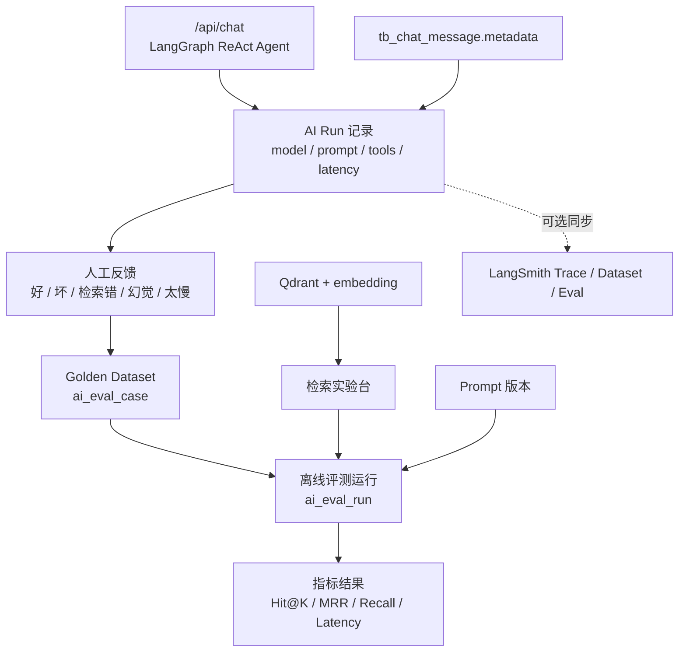

# AI Lab / LLM 学习实验台建设计划

> **状态**：🚧 执行中
> **创建时间**：2026-07-04
> **最近更新**：2026-07-12
> **合集**：大模型学习
> **长期设计**：[AI Lab / LLM 学习实验台设计](../designs/ai/ai-lab.md)

---

## 一、问题分析

当前站点已经具备 LangGraph ReAct Agent、RAG 检索、Qdrant 向量库、聊天记录持久化、工具耗时 metadata、AI Provider 场景绑定等能力，但这些能力仍主要服务于“能聊天”和“能排障”。

下一阶段的学习价值不在继续堆一个新的聊天框，而在把真实博客内容、真实用户问题、真实工具调用、真实部署环境沉淀成一个可观测、可评测、可复盘的 LLM 学习实验系统。

现状能力：

- `/chat` 已经通过 LangGraph ReAct Agent 进行多步工具调用。
- `search_articles` 已经接入 Qdrant 语义检索。
- `tb_chat_message.metadata` 已经保存 `thoughts`、`reactLoops`、`reactTimeline`、`toolName`、`durationMs` 等运行过程。
- `/c/chat-logs` 已经能查看历史对话。
- `/c/vector-search` 已经有向量检索运维入口。
- `/c/config` 已经支持按 `chat`、`embedding`、`image_gen` 等场景配置 AI Provider 绑定。

主要缺口：

- 缺少面向学习和迭代的 `/c/ai-lab` 统一后台入口。
- 缺少 Run 级别的结构化记录，无法稳定统计模型、prompt、检索配置、token、成本、trace。
- 缺少 Golden Dataset 和离线评测，RAG 质量仍依赖主观体验。
- 缺少检索实验台，无法对比 dense、metadata、hybrid、rerank、topK 等策略。
- 缺少 Prompt 版本与 Replay，提示词改动后很难证明变好或变坏。
- LangSmith 还没有作为 trace / dataset / eval 的外部观测层接入。

## 二、目标

建设后台 `/c/ai-lab`，把博客变成个人 LLMOps / RAGOps / AgentOps 实验场。

第一目标是最小闭环：

1. 能看到每次 Agent 运行发生了什么。
2. 能把失败对话沉淀成评测用例。
3. 能批量重放评测集并计算基础指标。
4. 能对比不同检索参数和提示词版本。
5. 能为后续 LangSmith、hybrid search、多模态和 Agent 工具扩展留下清晰接口。

非目标：

- 不把第一阶段做成完整企业级 APM。
- 不在第一阶段强依赖 LangSmith 可用性；本地数据库记录必须可以独立工作。
- 不在第一阶段引入复杂自动调优系统。
- 不自动启动开发服务，验证以类型检查、lint、Prisma 校验和用户手动运行后的接口检查为主。

## 三、解决方案

新增 AI Lab 模块，优先复用现有聊天、向量检索、AI 配置和后台权限体系。

### 模块拆分

| 模块 | 后台路径 | 学习点 | 第一阶段范围 |
|------|----------|--------|--------------|
| Run 观测 | `/c/ai-lab/runs` | Agent trace、工具耗时、模型行为 | 基于现有聊天 metadata 做结构化展示 |
| 检索实验台 | `/c/ai-lab/retrieval-playground` | RAG 召回、topK、过滤、噪声 | 先做 dense + metadata 对比，预留 hybrid |
| 评测集 | `/c/ai-lab/eval-cases` | Golden Dataset、失败样本沉淀 | 手工维护 + 从聊天记录转入 |
| 评测运行 | `/c/ai-lab/eval-runs` | Hit@K、MRR、Recall、延迟趋势 | 同一批 case 批量跑配置 |
| Prompt 实验 | `/c/ai-lab/prompts` | prompt diff、replay、rollback | 先登记版本和当前模板快照 |
| AI 配置管理 | `/c/config` | AI 供应商、场景绑定、单项配置 | 统一承载 Provider + Binding + Config 三类配置 |
| 生成实验 | `/c/ai-lab/image-gen`、`/c/ai-lab/tts` | 多模态生成、TTS、实验资产 | 先迁移入口，后续纳入 Run 和 Eval |
| LangSmith | 配置与外链 | trace、dataset、online/offline eval | 先写 trace id / run url 字段，后续接入 |

## 四、实施步骤

### 阶段 0：文档和边界确认

1. [x] 新增计划文档 `docs/plans/ai-lab-llm-learning.md`。
2. [x] 新增长期设计文档 `docs/designs/ai/ai-lab.md`。
3. [x] 更新 `docs/plans/README.md`、`docs/designs/README.md`、`CLAUDE.md` 索引。
4. [x] 根据设计文档确认第一阶段只做 AI Lab MVP，不引入复杂 rerank / hybrid / 多模态。

### 阶段 0.5：后台信息架构拆分

1. [x] 主后台 `/c` 侧栏收敛为内容、队列、AI Lab、单项配置、用户/RBAC、接口等一级入口。
2. [x] 从主侧栏移除 AI 分散入口：聊天记录、向量检索、图片生成、语音合成。
3. [x] 新增 `/c/ai-lab` 总览页和二级导航。
4. [x] 为已存在页面建立 AI Lab 过渡路由：`retrieval-playground`、`config`、`image-gen`、`tts`。
5. [x] 为 `eval-cases`、`eval-runs`、`prompts` 建立规划占位页，避免设计入口落到 404。
6. [x] 将模型检查台还原到主后台侧栏，归入 Three.js / 3D 资产检查方向，不放入 AI Lab。
7. [ ] 后续把过渡路由逐步改造成真正的 Eval / Prompt 页面。

### 阶段 1：Run 观测最小闭环

1. [x] 新增 `TbAiLabRun` Run 索引表，记录 `scenario`、`model`、`promptVersion`、`retrieverVersion`、`latencyMs`、`toolCalls`。
2. [x] 在 `/api/chat` 的异步落库链路中写入 Run 记录或 Run 快照。
3. [x] 新增 `/api/admin/ai-lab/runs` 查询接口和详情接口。
4. [x] 新增 `/c/ai-lab/runs` 页面，展示最近运行、工具时间线、错误和慢查询。
5. [ ] 从 `/c/chat-logs` 或 Run 详情入口支持“转为评测用例”。

### 阶段 2：评测集和基础指标

1. [ ] 新增 `ai_eval_case`、`ai_eval_run`、`ai_eval_result` 数据结构。
2. [ ] 新增 `/api/admin/ai-lab/eval-cases` CRUD。
3. [ ] 新增 `/c/ai-lab/eval-cases` 页面，支持问题、期望文章、期望关键词、标签、难度。
4. [ ] 支持手动创建 30 条 Golden Case，覆盖技术文章、个人经历、合集、专有名词和不存在内容。
5. [ ] 实现基础指标：Hit@1、Hit@3、Hit@5、Recall@K、MRR、latencyMs。

### 阶段 3：检索实验台

1. [ ] 新增 `/api/admin/ai-lab/retrieval-playground`。
2. [ ] 支持输入 query、topK、过滤条件、是否聚合文章。
3. [ ] 展示 Qdrant chunk、score、postId、title、耗时。
4. [ ] 加入 metadata 搜索对照，先形成 dense vs metadata 的可视化。
5. [ ] 预留 hybrid、sparse、rerank 和 query rewrite 的策略接口。

### 阶段 4：Prompt 版本和 Replay

1. [x] 新增系统级 `TbAiTemplate` / `TbAiTemplateVersion`，承载 Prompt / Skill 模板和版本正文。
2. [x] `/c/ai-lab/prompts` 从规划占位改为真实管理页，使用 AntD `Mentions` 支持 `@` 引用模板。
3. [x] 模板变量统一使用 LangChain `mustache`：`{{变量}}`。
4. [x] 新增 Prompt Skill 工具：`list_prompt_skills` 返回 metadata，`load_prompt_skill_template` 按 slug 加载完整正文。
5. [x] Create Agent、Topic Agent、Chat Agent 统一从 AI Lab 读取系统 Prompt；Skill 采用“先 metadata、再按需加载正文”的运行时协议。
6. [x] Create Agent 支持页面实时上下文注入，并由草稿 `type` 与 Skill `description` 决定小红书图文或知乎 Markdown 风格。
7. [ ] 记录每次 Run 使用的 `promptVersion` 和实际加载过的 skill 版本。
8. [ ] 支持从 eval case 批量 replay 当前 prompt。
9. [ ] 支持 day/night 风格分别评测，避免夜间表达增强影响事实约束。

### 阶段 5：LangSmith 接入

1. [ ] 增加 LangSmith 环境变量文档：`LANGSMITH_TRACING`、`LANGSMITH_API_KEY`、`LANGSMITH_PROJECT`。
2. [ ] 给 Agent run 注入 metadata：`sessionId`、`messageId`、`promptVersion`、`retrieverVersion`、`commitSha`、`styleVariant`。
3. [ ] 在本地 Run 记录中保存 `langsmithTraceId` 和 `langsmithRunUrl`。
4. [ ] 支持把失败 Run 手工加入 LangSmith dataset。
5. [ ] 评估 CI 中运行小规模 offline eval 的门槛。

### 阶段 6：高级实验

1. [ ] Hybrid Search：dense + keyword / sparse + RRF。
2. [ ] Rerank：对 topN chunk 二次排序。
3. [ ] 多模态：图片 caption + OCR + COS URL 入库。
4. [ ] Agent 工具扩展：文章编辑 Copilot、内链建议、合集缺口分析。
5. [ ] LangGraph `createAgent` 迁移实验，是否迁移以官方文档和本仓库版本验证为准。

## 五、数据模型草案

最终字段以设计文档和 Prisma 实施为准，计划阶段先明确数据边界。

### `ai_run`

用于把一次 LLM / Agent / 检索运行结构化索引出来。聊天消息仍保留在 `tb_chat_message`，Run 表是实验分析视角。

关键字段：

- `source`：`chat` / `eval` / `retrieval_playground`
- `sessionId` / `messageId`
- `question` / `answer`
- `scenario` / `model`
- `promptVersion` / `retrieverVersion`
- `latencyMs` / `inputTokens` / `outputTokens` / `cost`
- `toolCalls` / `retrievalResults`
- `langsmithTraceId` / `langsmithRunUrl`
- `feedback` / `error`

### `ai_eval_case`

用于保存 Golden Dataset。

关键字段：

- `question`
- `expectedPostIds`
- `expectedChunkKeywords`
- `expectedAnswer`
- `tags`
- `difficulty`
- `source`
- `sourceRunId`

### `ai_eval_run`

用于保存一次批量评测的配置快照。

关键字段：

- `runName`
- `commitSha`
- `model`
- `embeddingModel`
- `promptVersion`
- `retrieverVersion`
- `topK`
- `strategy`
- `startedAt` / `finishedAt`

### `ai_eval_result`

用于保存单条 case 在某次 run 下的结果。

关键字段：

- `caseId`
- `runId`
- `hitAt1` / `hitAt3` / `hitAt5`
- `recallAtK`
- `mrr`
- `latencyMs`
- `retrievedPostIds`
- `retrievedChunks`
- `answer`
- `error`

## 六、权限与入口

建议新增权限码：

| 权限码 | 说明 |
|--------|------|
| `ai_lab:view` | 查看 AI Lab 页面、Run、评测结果 |
| `ai_lab:manage` | 管理评测用例、Prompt 版本 |
| `ai_lab:run` | 执行检索实验和批量评测 |

后台入口拆分：

| 主后台保留 | AI Lab 拆入 |
|------------|-------------|
| 文章管理、评论管理、合集管理 | `/c/ai-lab/runs`：Run 观测 |
| 队列监控 | `/c/ai-lab/retrieval-playground`：原向量检索能力 |
| `/c/config` 单项配置 | `/c/config`：AI 配置管理入口 |
| 用户、角色、权限、接口管理 | `/c/ai-lab/image-gen`：AI 图片生成 |
| 模型检查台（Three.js / 3D 方向） | `/c/ai-lab/tts`：语音合成 |
| 个人中心 | `/c/ai-lab/eval-cases`、`/eval-runs`、`/prompts`：规划入口 |

## 七、风险评估

| 风险 | 影响 | 应对 |
|------|------|------|
| Run 记录过大 | `metadata` 和检索 chunk 导致数据库膨胀 | 只保存摘要和 topK，完整 trace 交给 LangSmith 或按需归档 |
| 评测调用成本高 | 批量 replay 消耗 token | 默认小批量、手动触发、显示预估 case 数和模型 |
| LangSmith 网络不稳定 | 国内访问和外部服务依赖可能影响主流程 | LangSmith 只做可选增强，本地 Run 记录必须完整 |
| 指标被误用 | Hit@K 好不代表答案好 | UI 同时展示召回、延迟、人工反馈和样例，不只看总分 |
| Prompt Replay 影响线上配置 | 实验配置误切到生产 | Eval 使用显式配置快照，不自动修改 `/c/config` active binding |
| 检索实验暴露隐藏文章 | 数据安全风险 | 所有检索默认沿用 `hide='0'` 和现有权限过滤 |

## 八、验证清单

### 文档阶段

- [x] 计划文档包含问题、方案、阶段、风险和验证清单。
- [x] 设计文档包含架构、数据模型、页面/API、指标和扩展路线。
- [x] 所有图表使用 Mermaid。
- [x] README 和 `CLAUDE.md` 索引已同步。

### 实施阶段

- [ ] `./node_modules/.bin/tsc --noEmit` 通过。
- [ ] 针对新增/修改文件运行 ESLint。
- [ ] `./node_modules/.bin/prisma validate` 通过。
- [ ] 新增 API 返回 `Cache-Control: no-store`。
- [ ] 不启动后台服务，由用户手动运行后验证页面。
- [ ] 使用至少 5 条 case 手动验证 Hit@K/MRR 计算。
- [ ] 从真实聊天记录转 eval case 的链路可用。

## 九、第一批 Golden Case 建议

先手写 30 条，分布如下：

| 类型 | 数量 | 示例 |
|------|------|------|
| 技术专有名词 | 8 | “new-api 和本地嵌入模型遇到过什么问题？” |
| RAG / LangChain 学习 | 6 | “我这个站点的 RAG 检索链路是怎么做的？” |
| 小破站建设 | 6 | “首页 3D 房间改造目前完成了哪些？” |
| 合集查询 | 4 | “大模型学习合集里有哪些文章？” |
| 模糊语义 | 4 | “我之前折腾模型配置切换做了什么？” |
| 不存在内容 | 2 | “我有没有写过 Kubernetes GPU 调度教程？” |

## 十、备注

AI Lab 的建设节奏应优先服务学习闭环：真实问题进入 Run，失败 Run 进入 Eval Case，Eval Case 反过来验证检索、Prompt、模型和 Agent 工具改动。

不要一开始追求完整大平台。第一阶段只要把“看得见、可转用例、可重放、可算基础指标”跑通，就已经能显著提高后续 LangChain、LangGraph、RAG、Prompt 和 LangSmith 学习效率。
