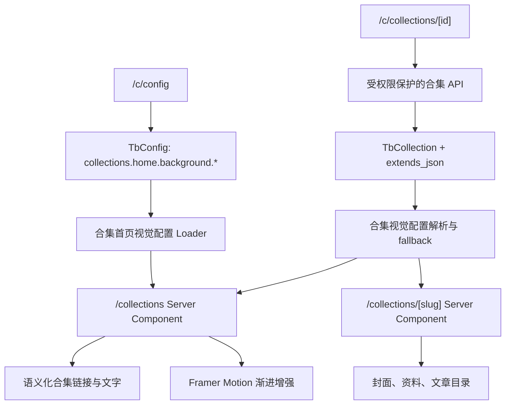

# 合集昼夜双主题与档案盒交互改造计划

## 状态

🚧 进行中

## 目标

在保留服务端渲染、语义化链接和现有合集数据的前提下，将合集首页改造成“多合集档案盒陈列 → 选择当前合集 → 展开资料页”的渐进增强交互，并将合集详情页改造成“竖长封面 + 合集资料 + 档案目录”的阅读入口。

本计划同时完成：

- 9 个现有合集的日间/夜间竖长封面生成与 CDN 托管。
- 合集首页日间/夜间背景图生成与配置管理。
- 合集级竖长封面图、竖长封面视频、页面背景图和焦点位置的可配置化。
- 合集前台列表页、详情页和后台管理页面的迁移。
- SEO、无 JavaScript、低性能设备和移动端的可靠降级。

## 设计基准

### 合集首页


资源链接：

- `https://static.nnnnzs.cn/upload/image-gen/b7fed8d5-18c9-49ca-a3f6-c4c44318a43b.png`

交互重点：左侧保持多个合集的档案盒陈列；选择一个合集后，当前档案盒展开为竖长封面和资料页；用户再次确认后进入详情页。

### 合集详情页


资源链接：

- `https://static.nnnnzs.cn/upload/image-gen/ce43949d-23ea-4074-bc40-d6f87d9c9d4b.png`

交互重点：竖长封面承接首页被展开的档案；配置竖长视频时在同一 9:16 槽位静音循环播放；右侧由标题、描述、统计、阅读线索和语义化文章目录构成。

## 当前问题

1. `TbCollection` 只有单份 `cover`、`background` 和 `color`，无法表达昼夜两套竖长封面图、竖长封面视频和页面背景图。
2. 9 个现有合集的 `description` 均为空，展开后的资料页缺少策展文案。
3. 合集首页当前是普通四列卡片网格，详情页是全屏 Banner + 独立统计栏 + 普通文章卡片，无法形成连续的“选择并展开档案”体验。
4. 后台编辑页只支持单份 16:9 封面和背景，且通过拉取最多 100 条合集后在客户端查找当前记录。
5. 公开合集接口允许访客传入 `status=all`，可能返回隐藏合集；数字 ID 详情分支与 slug 分支的可见性过滤不一致。
6. 配置更新不会清理合集首页视觉缓存。

## 总体架构



## 数据模型

### `TbCollection.extends_json`

在 `prisma/schema/blog.prisma` 的 `TbCollection` 中增加：

```prisma
extends_json Json? // 合集展示扩展配置，固定使用版本化 JSON
```

建议使用原生 `Json?`，避免业务层反复手工序列化字符串。所有读写必须经过明确类型、Zod schema 和归一化函数，前端不得直接消费 `Prisma.JsonValue`。

第一版 JSON 结构：

```json
{
  "version": 1,
  "presentation": {
    "day": {
      "coverImageUrl": "https://static.nnnnzs.cn/...png",
      "coverVideoUrl": "https://static.nnnnzs.cn/...mp4",
      "backgroundImageUrl": "https://static.nnnnzs.cn/...png",
      "objectPosition": "50% 50%",
      "accentColor": "#7A9EAB"
    },
    "night": {
      "coverImageUrl": "https://static.nnnnzs.cn/...png",
      "coverVideoUrl": "https://static.nnnnzs.cn/...mp4",
      "backgroundImageUrl": "https://static.nnnnzs.cn/...png",
      "objectPosition": "50% 50%",
      "accentColor": "#57D8E8"
    }
  },
  "readingPath": ["架构", "发布", "缓存", "观测", "持续演化"]
}
```

约束：

- `coverImageUrl` 是档案盒展开后的 9:16 竖长封面。
- `coverVideoUrl` 与竖长封面共用 9:16 槽位，选中合集后静音、循环、自动播放。
- `backgroundImageUrl` 是详情页首屏的 16:9 静态空间背景，不承载视频。
- 不设置独立视频 poster 字段；减少动态或视频失败时可回到同主题 `coverImageUrl`。
- `objectPosition` 用于解决不同素材的安全裁切。
- `readingPath` 是可选的短阅读线索，不用于数据库排序。

### 兼容策略

迁移期间保留现有 `cover`、`background`、`color` 字段，不立即删除。后台读取旧合集时，将旧字段归一化到日间视觉：

| 旧字段 | 日间视觉目标 |
|---|---|
| `cover` | `presentation.day.coverImageUrl` |
| 图片类型 `background` | `presentation.day.backgroundImageUrl` |
| 视频类型 `background` | `presentation.day.coverVideoUrl` |
| `color` | `presentation.day.accentColor` |

当 `extends_json` 缺失或无效时，运行时才使用上述旧字段兼容映射；一旦存在有效的新配置，就不再读取旧字段，避免用户显式清空资源后又被旧值补回。图片可在当前主题缺失时回退到另一主题，封面视频严格使用当前主题配置。旧横版视频只用于尚未迁移记录的过渡兼容，后台应尽快换成 9:16 竖版视频；再次保存合集时，归一化结果会写入 `extends_json`。

### 合集首页背景配置

在现有 `TbConfig` 中创建两个配置项，值只保存稳定 HTTPS CDN URL：

| 配置 key | 用途 |
|---|---|
| `collections.home.background.day` | 合集首页日间背景图 |
| `collections.home.background.night` | 合集首页夜间背景图 |

新增合集专用服务端 loader：只读取白名单 key、只接受启用配置、校验 HTTPS URL，并使用独立缓存标签 `collections-home-visual`。前台不通过通用 `/api/config/key/[key]` 读取配置。

## 资源生成与 CDN 回填

### Agent 资源任务

安排一个独立 Agent 负责资源生成与清单维护，不修改页面代码：

1. 读取 9 个有效合集的标题、slug、文章数量和前 3 篇文章摘要。
2. 为每个合集编写日间/夜间两份封面提示词。
3. 生成 `9 × 2 = 18` 张 9:16 竖长封面，统一使用 `collection-cover-day`、`collection-cover-night` 分组。
4. 生成合集首页日间/夜间两张背景图，使用 `collections-home-background` 分组。
5. 逐张检查比例、文字污染、品牌/IP、标题安全区和昼夜一致性。
6. 输出资源清单：合集 ID、slug、主题、用途、生成任务 ID、CDN URL、审核状态。
7. 人工确认后，才把 CDN URL 回填到 `extends_json` 和 `TbConfig`。

所有生成资源必须使用 `https://static.nnnnzs.cn/...` 的最终 CDN URL，不使用临时链接、本地路径或模型返回的短期地址。

### 当前合集资源基线

2026-07-29 通过 Prisma 只读查询确认以下 9 个未删除合集；`article_count` 与实际关联文章数一致，description 均为空。资源 Agent 以此表作为批次输入，不按名称猜测或手工漏项：

| ID | 合集 | slug | 文章数 | description | 本批封面产物 |
|---:|---|---|---:|---|---:|
| 1 | 全屋智能之路 | `ha` | 5 | 待补充 | 日间 1 + 夜间 1 |
| 2 | 大模型学习 | `llm` | 8 | 待补充 | 日间 1 + 夜间 1 |
| 3 | 小破站建设 | `building` | 27 | 待补充 | 日间 1 + 夜间 1 |
| 4 | 前端开发 | `front` | 29 | 待补充 | 日间 1 + 夜间 1 |
| 5 | 算法题解 | `algorithm` | 11 | 待补充 | 日间 1 + 夜间 1 |
| 6 | 工具开发 | `tools` | 16 | 待补充 | 日间 1 + 夜间 1 |
| 7 | 运维实践 | `devops` | 14 | 待补充 | 日间 1 + 夜间 1 |
| 8 | 生活感悟 | `think` | 30 | 待补充 | 日间 1 + 夜间 1 |
| 9 | 旅行游记 | `travel` | 9 | 待补充 | 日间 1 + 夜间 1 |

资源 Agent 每完成一个合集，必须同时交付：两张 9:16 PNG/AVIF 封面、两份生成提示词、两份审核记录和对应 CDN URL。18 张封面全部审核后，再生成两张首页 16:9 背景图，避免首页视觉先于合集封面定调。

### 已生成封面资源清单

2026-07-29 通过 `TbAiJob` 只读查询确认下列 18 个任务均为 `SUCCESS`，任务来源为 `MCP`，资源分组分别为 `collection-cover-day` 与 `collection-cover-night`。夜间版本以同一合集的日间 CDN 图片为唯一编辑输入，因此构图和主体保持一致。

| 合集 | slug | 日间任务 ID | 日间 CDN | 夜间任务 ID | 夜间 CDN |
|---|---|---|---|---|---|
| 全屋智能之路 | `ha` | `6cec8eb3-558c-484c-afe2-86ede5370a77` | [日间封面](https://static.nnnnzs.cn/upload/image-gen/6cec8eb3-558c-484c-afe2-86ede5370a77.png) | `973a038b-c489-49ae-b46c-bc104169d4eb` | [夜间封面](https://static.nnnnzs.cn/upload/image-gen/973a038b-c489-49ae-b46c-bc104169d4eb.png) |
| 大模型学习 | `llm` | `33d6cbf6-a4d9-411a-aa00-a4168dc0e669` | [日间封面](https://static.nnnnzs.cn/upload/image-gen/33d6cbf6-a4d9-411a-aa00-a4168dc0e669.png) | `1a939782-4918-4245-92e4-3c0c5590e834` | [夜间封面](https://static.nnnnzs.cn/upload/image-gen/1a939782-4918-4245-92e4-3c0c5590e834.png) |
| 小破站建设 | `building` | `7eadb264-4bda-4ef4-9178-da85e361c873` | [日间封面](https://static.nnnnzs.cn/upload/image-gen/7eadb264-4bda-4ef4-9178-da85e361c873.png) | `18209fd9-8f9d-4d99-a5b9-63ca4e7b027c` | [夜间封面](https://static.nnnnzs.cn/upload/image-gen/18209fd9-8f9d-4d99-a5b9-63ca4e7b027c.png) |
| 前端开发 | `front` | `24f0c75c-fb3f-46cf-8a59-f8837e10cb0b` | [日间封面](https://static.nnnnzs.cn/upload/image-gen/24f0c75c-fb3f-46cf-8a59-f8837e10cb0b.png) | `aee637ea-b4f6-4ad0-902e-dc1dd94dacee` | [夜间封面](https://static.nnnnzs.cn/upload/image-gen/aee637ea-b4f6-4ad0-902e-dc1dd94dacee.png) |
| 算法题解 | `algorithm` | `fdd1e304-b5e4-42db-9604-e31a5260e7d3` | [日间封面](https://static.nnnnzs.cn/upload/image-gen/fdd1e304-b5e4-42db-9604-e31a5260e7d3.png) | `ad82a26f-cd35-43cf-affb-9d11699a736d` | [夜间封面](https://static.nnnnzs.cn/upload/image-gen/ad82a26f-cd35-43cf-affb-9d11699a736d.png) |
| 工具开发 | `tools` | `fd93f007-ee6e-4795-943d-abe77b530f4c` | [日间封面](https://static.nnnnzs.cn/upload/image-gen/fd93f007-ee6e-4795-943d-abe77b530f4c.png) | `23540328-e820-47dc-bd00-b37e3db6d1ba` | [夜间封面](https://static.nnnnzs.cn/upload/image-gen/23540328-e820-47dc-bd00-b37e3db6d1ba.png) |
| 运维实践 | `devops` | `345afe17-1773-4977-bdf5-837420d680ca` | [日间封面](https://static.nnnnzs.cn/upload/image-gen/345afe17-1773-4977-bdf5-837420d680ca.png) | `2ad50b8a-60ed-4c87-a2a0-6235099ac381` | [夜间封面](https://static.nnnnzs.cn/upload/image-gen/2ad50b8a-60ed-4c87-a2a0-6235099ac381.png) |
| 生活感悟 | `think` | `385fad4f-9c1b-42dc-a7b2-6fc6be0b2b0c` | [日间封面](https://static.nnnnzs.cn/upload/image-gen/385fad4f-9c1b-42dc-a7b2-6fc6be0b2b0c.png) | `16e8a215-f6c0-42e9-8c8c-739b5a7c926e` | [夜间封面](https://static.nnnnzs.cn/upload/image-gen/16e8a215-f6c0-42e9-8c8c-739b5a7c926e.png) |
| 旅行游记 | `travel` | `06d70529-323b-4bee-a4a4-e6b5465e868a` | [日间封面](https://static.nnnnzs.cn/upload/image-gen/06d70529-323b-4bee-a4a4-e6b5465e868a.png) | `ba240a11-0e9c-422d-a8ff-08e51dccb699` | [夜间封面](https://static.nnnnzs.cn/upload/image-gen/ba240a11-0e9c-422d-a8ff-08e51dccb699.png) |

这些 CDN URL 已回填到 `TbCollection.extends_json.presentation.day/night.coverImageUrl`，是页面和文档引用封面的唯一来源；仓库不保留生成资源的本地副本。

### 已生成合集首页背景

2026-07-29 通过 MyBlog MCP 生成日间背景，再以日间图为唯一编辑输入生成夜间版本。两张图均为 `1672 × 941`、接近严格 16:9，中央和下方中央保留低细节安全区，未出现文字、人物、Logo、UI 或抢占交互焦点的主体物。

| 主题 | 任务 ID | CDN | 质检结论 |
|---|---|---|---|
| 日间 | `e56cecfe-e641-457f-ba5d-5c43259cba7c` | [日间首页背景](https://static.nnnnzs.cn/upload/image-gen/e56cecfe-e641-457f-ba5d-5c43259cba7c.png) | 暖白墙面与浅木格栅，中央留白充足，适合叠加档案盒和中文 UI |
| 夜间 | `e8b4374f-8fc9-4ee3-b28c-31459b4c40ee` | [夜间首页背景](https://static.nnnnzs.cn/upload/image-gen/e8b4374f-8fc9-4ee3-b28c-31459b4c40ee.png) | 保持相同构图，以蓝黑环境光和克制冷青反光完成夜间转换，暗部仍有材质层次 |

这两个 CDN URL 分别用于 `TbConfig` 的 `collections.home.background.day` 与 `collections.home.background.night`，不写入单个合集的 `extends_json`。

### 视频配置

本轮只要求视频“可配置”，不强制一次性生成 18 个视频。视频由对应日间/夜间封面延展生成，完整规范与通用提示词见 [合集视觉资源生成指南](../reference/collection-visual-generation-guide.md)，核心约束如下：

- 9:16，6–10 秒，静音、无缝循环、固定镜头。
- 保持输入竖长封面的主体、构图、色彩和焦点位置，不横向扩图。
- 运动只发生在光线、粒子、雨滴、树影、指示灯等局部元素。
- 不出现文字、Logo、人物特写、镜头推拉摇移或播放器 UI。

## 前台改造

### `/collections` 合集首页

已落地组件：

```text
src/components/collections/
├── CollectionCoverMedia.tsx
├── CollectionsShowcase.tsx
├── collection-motion.ts
└── detail/
    ├── CollectionAmbientMedia.tsx
    ├── CollectionArticleIndex.tsx
    └── CollectionHero.tsx
```

实现要求：

- `src/app/collections/page.tsx` 继续作为 Server Component 获取合集和首页背景配置。
- 服务端 HTML 必须包含所有合集的真实 `<a>`、标题、描述、文章数量和封面 `alt`。
- 使用项目已有 `framer-motion` 的 `layoutId`、`AnimatePresence` 实现选择、展开和收起；第一期不新增 GSAP。
- 当前项展开后显示竖长封面、描述、统计和“进入合集”链接。
- 键盘可通过 Tab/Enter/Space 操作，焦点在展开和关闭后正确恢复。
- `prefers-reduced-motion` 下禁用位移和缩放，仅使用即时切换或淡入。
- 列表使用无原生滚动条的受控轮播；向下选择时让后续项进入视区，向上选择时让前序项进入视区。
- 小屏使用横向受控轮播，不依赖用户拖动原生滚动条。
- 新增合集按服务端排序自然加入列表，动效不依赖固定合集数量。

### `/collections/[slug]` 合集详情页

计划新增组件：

```text
src/components/collections/detail/
├── CollectionHero.tsx
├── CollectionAmbientMedia.tsx
├── CollectionReadingPath.tsx
├── CollectionArticleIndex.tsx
└── CollectionArticleRow.tsx
```

实现要求：

- 移除合集详情页对通用 `Banner` 的依赖，避免影响其他页面。
- 首屏使用竖长封面 + 资料页结构，文章目录紧接首屏并保留服务端渲染。
- 视频只在当前主题存在竖长封面视频 URL 且用户未开启减少动态时加载。
- 视频位于 9:16 竖长封面槽，使用 `muted`、`playsInline`、`loop`、`autoPlay`、无 controls、无独立 poster。
- 详情页的 16:9 空间背景只使用 `backgroundImageUrl`，不播放背景视频。
- 目录使用真实文章链接、顺序、摘要和日期；阅读时长缺失时不显示虚构值。
- `generateMetadata` 使用合集标题和补充后的 description；增加 `CollectionPage`/`ItemList` JSON-LD。
- 保留点赞和浏览统计，但重新放入资料区，不单独占用普通统计卡片。

### 昼夜语义

在 `src/config/site-copy/collections.ts` 增加：

- 日间：`主题书架`、`走进合集`、`档案目录`、`从第一篇开始`。
- 夜间：`归档矩阵`、`接入档案`、`日志目录`、`读取首篇日志`。

组件通过现有 `useStyleVariant()` 获取 `day/night`，不得散落 `isDark ? ... : ...` 文案。

## 后台与 API 改造

### `/c/collections`

- 列表增加日间/夜间资源完整度状态：竖长封面图、竖长封面视频、页面背景图。
- 缩略图默认展示当前后台主题对应封面，并可快速切换预览。
- 新建、编辑、删除按钮分别按 `COLLECTION_CREATE/EDIT/DELETE` 权限显示。
- 后台列表不再依赖公开 `/api/collections?status=all`，改用受权限保护的管理接口。

### `/c/collections/[id]`

- 基础信息、日间视觉、夜间视觉、前台预览分为 Tabs。
- 日间/夜间各自提供：9:16 封面图、9:16 封面视频、16:9 页面背景图、焦点位置、主题色。
- 复用 `MediaUpload`；封面图和封面视频固定使用 `9 / 16`，页面背景图使用 `16 / 9`。
- 旧字段编辑卡片不再暴露；加载管理详情时自动映射到日间视觉字段。
- 增加 JSON 解析错误提示、资源缺失提示和昼夜并排预览。
- 编辑页改为调用受 `COLLECTION_VIEW` 保护的 `GET /api/collection/[id]`，不再拉取 100 条列表再查找。
- 修正 API slug 校验上限为数据库实际的 191。

### API 与安全修复

- 为合集创建/更新 API 增加严格的 `extends_json` Zod schema。
- 公开 `/api/collections` 不再允许未授权访客通过 `status=all` 获取隐藏合集。
- 统一数字 ID 与 slug 详情分支的 `status/is_delete` 和文章 `hide/is_delete` 过滤。
- 管理 GET 响应使用 `Cache-Control: no-store`。
- 合集和首页背景配置更新后清理 `collection`、`collection-list`、`collections-home-visual` 相关缓存。
- 修正 `src/config/entity-field-configs.ts` 中合集审计字段与真实 schema 不一致的问题。

## 实施阶段与所有权

### 所有权

| 角色 | 负责范围 | 禁止越界 |
|---|---|---|
| 资源 Agent | 合集语义提取、日夜提示词、20 张图片生成、质检、CDN 清单 | 不改页面代码，不写数据库或配置表 |
| 主实现 Agent | schema、解析层、API、后台、前台、缓存、SEO 和测试 | 未确认前不执行迁移与数据回填 |
| 人工验收 | 资源取舍、description 定稿、数据库写入确认、日夜视觉验收 | 不以未审核的临时资源作为正式配置 |

### 阶段 0：设计和资源基线

- [x] 将本计划和两张效果图链接作为实现基准。
- [x] 为 9 个合集补充策展 description。
- [x] 资源 Agent 生成 18 张竖长封面与 2 张首页背景图，并记录后台任务 ID 与 CDN URL。
- [ ] 人工审核并冻结资源清单。

### 阶段 1：数据与解析层

- [x] 增加 `TbCollection.extends_json Json?`、同步数据库并重新生成 Prisma Client。
- [x] 增加 `CollectionVisualConfig` 类型、Zod schema、解析和 fallback。
- [x] 增加首页背景配置 loader 和缓存标签。
- [x] 在用户明确确认后完成一次性数据回填：更新 9 个合集并创建 2 个首页背景配置；Prisma 只读复核通过，临时回填脚本已删除。

### 阶段 2：后台与管理 API

- [x] 增加受保护的合集管理 GET 接口。
- [x] 改造合集列表资源完整度展示和权限控制。
- [x] 改造合集编辑页昼夜 Tabs、上传、预览和校验。
- [x] 修复公开接口可见性和变更审计字段。

### 阶段 3：合集首页

- [x] Server Component 接入首页背景配置和规范化合集视觉配置。
- [x] 实现档案盒陈列、选择、展开和进入合集交互。
- [x] 完成键盘、减少动态、移动端和无 JavaScript 降级。
- [ ] 验证新增第 10、11、12 个合集时布局自然扩展。

### 阶段 4：合集详情页

- [x] 实现竖长封面、资料页、阅读线索和档案目录。
- [x] 首页和详情页接入 9:16 竖长封面视频，移除背景视频与独立 poster。
- [x] 增加结构化数据和 metadata。
- [ ] 文章页补充所属合集的上一篇/下一篇导航，作为后续可选子阶段。

### 阶段 5：联调与上线

- [x] `pnpm build` 生产构建通过，`/collections` 静态 HTML 包含 9 个合集标题、真实链接和首页背景 CDN。
- [x] 18 张合集封面与 2 张首页背景 CDN 均返回 HTTP 200。
- [ ] 在日间/夜间、桌面/移动、Chrome/Safari 下完成视觉验收。
- [ ] 验证 CDN 资源加载、视频失败降级和缓存刷新。
- [ ] 对无 JavaScript页面、爬虫 HTML 和 Lighthouse SEO/Accessibility 做验收。
- [ ] 分批上线：先后台和数据，再首页，最后详情页和视频。

## 预计改动文件

```text
prisma/schema/blog.prisma
src/dto/collection.dto.ts
src/lib/collection-visual.ts
src/lib/collection-visual.test.ts
src/services/collection.ts
src/services/collection-home-visual.ts
src/app/api/collection/create/route.ts
src/app/api/collection/[id]/route.ts
src/app/api/collections/route.ts
src/app/api/collections/[identifier]/route.ts
src/app/api/config/route.ts
src/app/api/config/[id]/route.ts
src/app/collections/page.tsx
src/app/collections/[slug]/page.tsx
src/app/c/collections/page.tsx
src/app/c/collections/[id]/page.tsx
src/components/collections/**
src/config/site-copy/collections.ts
src/config/entity-field-configs.ts
docs/designs/features/collection-design.md
docs/reference/collection-visual-generation-guide.md
```

## 风险评估

| 风险 | 应对 |
|---|---|
| 资源生成数量多、质量不一致 | 先生成小样、统一提示词骨架、人工审核后回填 |
| JSON 字段失去类型约束 | 版本号 + Zod schema + 服务层归一化，前端不解析原始 JSON |
| 动效影响 SEO | 所有内容和链接服务端渲染，Framer Motion 仅渐进增强 |
| 视频影响首屏性能 | `preload=metadata`、减少动态时禁用、失败回到同主题封面图 |
| 昼夜资源缺失 | 明确 fallback 链，不阻塞页面渲染 |
| 新合集破坏布局 | 使用数据驱动流式布局，不依赖固定 9 个合集 |
| 隐藏合集泄露 | 拆分公开/管理读取，统一状态与文章可见性过滤 |
| 配置更新后页面不刷新 | 专用缓存标签并在配置写接口精准失效 |

## 验证清单

- [x] 9 个合集均有日间和夜间竖长封面 CDN URL。
- [x] 首页日间和夜间背景图可在 `/c/config` 修改并即时生效。
- [x] 每个合集的日间/夜间封面图、封面视频和页面背景图均可独立配置。
- [x] 旧合集在 `extends_json` 为空时仍能正常显示。
- [x] 新增合集无需改代码即可加入首页陈列。
- [x] 服务端 HTML 包含完整合集标题、描述、链接和文章目录。
- [ ] 键盘、触摸、减少动态、视频加载失败均有可用路径。
- [x] 隐藏合集和隐藏文章不会通过公开 API 泄露。
- [x] 后台按钮、API 和路由访问符合合集权限定义。
- [x] 资源只引用稳定 CDN 地址，文档中的效果图链接可访问。

## 实施边界

- 数据库迁移、配置创建和 9 条合集回填均已在列出影响范围并获得用户明确确认后完成。
- 后续任何数据库写入仍必须列出完整 Prisma 表达式、涉及表和预计行数，并获得明确确认。
- 本计划不要求第一期引入 Blender、GSAP 或新的 Three.js 场景。
- 现有 `cover/background/color` 的删除另立清理计划。

## 完成后处理

实施并验收完成后，将稳定的数据结构、资源规范、组件职责和 SEO 约束合并回 `docs/designs/features/collection-design.md`，再删除本计划文档并更新 `docs/plans/README.md`。
