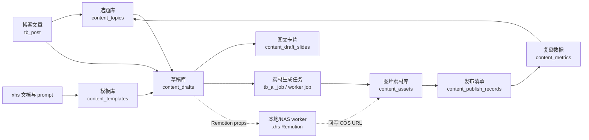

# 内容创作中台建设计划

> **状态**：🔄 进行中
> **创建时间**：2026-07-07
> **最近更新**：2026-07-07
> **目标入口**：`/create`
> **关联本地项目**：`/Users/nnnnzs/project/xhs`

---

## 一、问题分析

当前博客项目已经具备文章管理、权限系统、MCP、AI 图片生成、图片编辑、TTS、后台队列、COS 上传和 AI 配置等基础设施。本地 `xhs` 项目已经沉淀了账号定位、选题池、博客转小红书提示词、短视频提示词、MiMo TTS 工作流、Remotion 模板和草稿目录。

现有问题不是能力缺失，而是能力分散：

- 博客后台 `/c` 主要服务 CMS 管理，信息架构偏文章、用户、配置和运维。
- `xhs` 项目主要服务本地创作，内容以 Markdown、prompt、脚本和文件夹组织。
- 小红书图文、短视频、图片素材、发布清单和复盘数据还没有统一入库。
- 如果把创作能力直接塞进 `/c`，会混淆“博客管理后台”和“内容创作中台”的使用心智。
- 如果把所有新模型直接追加到 `prisma/schema.prisma`，schema 会继续变长，内容中台边界不清晰。

因此本计划的核心判断是：内容创作中台应该作为博客项目内的独立后台入口建设，但在产品、路由、导航、数据模型文件组织上与博客 CMS 明确分层。

## 二、目标

建设独立入口 `/create`，把博客文章和 `xhs` 本地工作流整合成线上内容创作中台。

第一阶段目标：

1. `/create` 使用独立 layout 和导航，不挂在 `/c` 菜单下。
2. 复用当前登录态、AI 配置、联网搜索、队列、图片生成、TTS 和 COS 能力；当前 `/create` 已使用内容访问和创建权限。
3. Prisma schema 采用分文件组织，内容中台模型集中到独立 schema 文件中。
4. 从选题按平台生成结构化草稿；第一批支持小红书图文、知乎 Markdown、抖音短视频脚本和博客长文。
5. 图片素材先通过生成、编辑和上传进入素材库；TTS、Remotion 渲染后续单独设计，不急于自动发布。
6. `xhs` 项目保留为本地模板、Remotion worker、历史草稿和实验工作区。

当前执行优先级：

1. 选题库：支持用户提供文章、网站、博客或想法，由 AI 整理、去重并保存创作意图。
2. 多平台草稿：同一个选题可以按平台生成小红书图文、知乎 Markdown、抖音短视频脚本和博客文章。
3. 草稿库：承载不同平台的内容编辑和人工确认。
4. 素材库：只做图片素材，统一承接生成图、编辑图和上传图。
5. 发布日历、复盘数据、模板管理后置。
6. Remotion 和视频相关能力优先级很低，第一阶段只保留轻量字段和低优先级资产类型。

非目标：

- 不把 `xhs` 仓库直接合并进博客仓库。
- 不在第一阶段做小红书自动发布。
- 不把 `/create` 做成营销页或落地页，它是登录后的生产工具。
- 不在第一阶段强行拆出第二个数据库或微服务。
- 不在第一阶段重写现有图片生成、TTS 和队列能力。

## 三、解决方案

### 3.1 路由与后台边界

`/c` 保持博客 CMS 后台定位，`/create` 作为内容创作中台定位。

| 后台 | 入口 | 职责 | 导航 |
|------|------|------|------|
| 博客管理后台 | `/c` | 文章、合集、评论、配置、用户、队列、接口、AI Lab | 现有 CMS 侧边栏 |
| 内容创作中台 | `/create` | 选题、草稿、图卡、短视频、素材、发布、复盘 | 新建创作侧边栏 |

`/create` 建议页面：

| 页面 | 路由 | 第一阶段职责 |
|------|------|--------------|
| 工作台 | `/create` 或 `/create/dashboard` | 本周选题、待生成素材、待发布、最近复盘 |
| 草稿库 | `/create/drafts` | 草稿列表、简化新建、状态筛选和删除 |
| 素材库 | `/create/assets` | 图片生成、图片编辑、上传图片、收藏、分组、母图复用 |
| 选题库 | `/create/topics` | 记录来源、原始想法、核心角度、去重信息和使用状态 |
| 草稿详情 | `/create/drafts/[id]` | 编辑标题、正文、类型、状态、选用图片、图片备注、图片排序和打包下载 |
| 发布日历 | `/create/calendar` | 周计划、发布时间、平台、发布状态 |
| 复盘数据 | `/create/review` | 收藏、点赞、评论、私信、博客回流 |
| 模板管理 | `/create/templates` | prompt、视觉模板、账号定位、发布 checklist |

当前实现状态：

- `/create` 已搭建独立 layout、独立侧边栏和占位页。
- 入口已放入 `src/components/HeaderUserMenu.tsx`，位于“管理后台”下方，并以新标签页打开。
- `/create` 使用 `CONTENT_VIEW` 访问权限；创建选题和 AI 生成选题使用 `CONTENT_CREATE`。
- `/create/drafts`、`/create/assets`、`/create/topics` 已切换为真实列表页，并接入 `/api/create/*`。
- `/create/drafts/[id]` 已支持草稿图片备注、拖拽排序和一键打包下载；图片使用记录仍保存为草稿内快照。
- `/create/templates` 已切换为真实模板管理页，支持模板 CRUD、筛选和导入 `xhs/prompts`；`content_templates` schema 与 Prisma Client 已生成，数据库结构同步待执行。
- `/create/topics` 已支持输入博客文章 ID，让 AI 基于博客内容生成并入库选题；后续扩展文章 URL、网站和手动想法入口。

### 3.2 整体流程



### 3.3 与 `xhs` 的关系

`xhs` 不是被废弃，而是逐步从“本地内容生产主系统”退化为“模板实验区 + 本地 worker + 历史素材仓库”。

| `xhs` 资产 | 线上化方式 |
|------------|------------|
| `docs/content-system.md` | 迁为模板库中的内容策略和栏目规则 |
| `docs/brand-positioning.md` | 迁为账号配置和视觉资产配置 |
| `content/topic-bank.md` | 导入为 `content_topics` 初始选题 |
| `content/calendar/*.md` | 导入为发布日历初始数据 |
| `content/drafts/*/README.md` | 可选导入为历史草稿 |
| `prompts/blog-to-xhs-note.md` | 迁为图文生成模板 |
| `prompts/blog-to-short-video.md` | 迁为短视频脚本模板 |
| `prompts/mimo-tts-style.md` | 迁为 TTS 风格模板 |
| `scripts/mimo-tts.ts` | 保留为本地 fallback；线上优先复用博客 TTS API |
| `render-props/*.json` | 由线上草稿生成 props，再交给 worker 渲染 |
| Remotion 模板 | 第一阶段保留在 `xhs`，后续决定是否抽成 worker 包 |

## 四、Prisma 拆分策略

### 4.1 推荐方案：schema 文件夹拆分，仍使用一个 Prisma Client

当前项目使用 Prisma 7.8.0，本地已验证 `./node_modules/.bin/prisma validate --schema prisma/schema` 可以按目录读取 schema。第一阶段推荐把 Prisma schema 从单文件逐步拆成文件夹组织：

```text
prisma/
├── schema/
│   ├── base.prisma          # generator / datasource
│   ├── blog.prisma          # TbPost / TbCollection 等博客模型
│   ├── rbac.prisma          # TbUser / TbRole / TbPermission 等权限模型
│   ├── ai.prisma            # TbAiJob / AI 任务相关模型
│   └── content.prisma       # content_* 内容创作中台模型
├── migrations/
└── seed-rbac.ts
```

`prisma.config.ts` 改为：

```typescript
export default defineConfig({
  schema: 'prisma/schema',
  migrations: {
    path: 'prisma/migrations',
  },
  datasource: {
    url: env('DATABASE_URL'),
  },
});
```

这个方案的优点：

- 内容中台模型不会继续堆进主 `schema.prisma`。
- 仍然只有一个 Prisma Client，构建、迁移、类型生成和部署最简单。
- 仍然可以共用事务、数据库连接和现有 Prisma 工具链。
- 后续如果发现边界需要更强隔离，再迁移到独立 client 也不晚。

注意事项：

- 第一阶段内容模型统一使用 `content_` 表前缀。
- 内容模型中可以保存 `source_post_id`、`created_by` 等外部 id，但先不强制声明跨模块 Prisma relation，减少反向 relation 对博客模型的污染。
- 需要先完成一次“schema 文件夹迁移”小步改造，确保 `prisma validate`、`prisma generate`、`pnpm build` 都通过，再新增内容表。

### 4.2 备选方案：独立 Content Prisma Client

如果后续希望更强隔离，可以新增：

```text
prisma-content/
├── schema.prisma
└── migrations/
```

并生成到：

```text
src/generated/content-prisma-client
```

这个方案适合以下情况：

- 内容中台未来要迁到独立数据库。
- 内容中台要独立部署或独立 worker 消费。
- 内容表增长很快，和博客主业务生命周期明显不同。

第一阶段不推荐直接采用，因为会引入两套迁移、两套 client、跨 client 查询和事务边界问题。

## 五、数据模型草案

字段以实施设计为准，计划阶段先确定边界。

### `content_topics`

选题库是草稿库的创作意图来源，不是发布排期表。它承接用户主动发现的文章、网站、博客和个人想法，并在入库前辅助去重。

- `id`
- `title`
- `source_type`
- `source_url`
- `source_post_id`
- `original_idea`
- `core_angle`
- `key_points`
- `dedup_key`
- `status`：`IDEA` / `USED` / `ARCHIVED`
- `created_by`
- `created_at`
- `updated_at`

`pillar`、`series`、`priority` 等字段不是第一阶段必需字段，可以作为后续可选标签。平台的内容形式、产出要求和图片要求不放在选题表中，由模板和草稿生成配置负责。

### `content_drafts`

创作草稿，承载小红书图文、短视频脚本和工具清单。

- `id`
- `topic_id`
- `source_post_id`
- `platform`：`xhs` / `zhihu` / `douyin` / `blog`
- `type`：`note` / `markdown` / `short_video` / `article`
- `title`
- `hook`
- `body`
- `tags_json`
- `status`：`DRAFT` / `ASSET_PENDING` / `READY` / `PUBLISHED` / `ARCHIVED`
- `template_id`：平台输出模板版本
- `generation_snapshot_json`
- `generation_snapshot_json.draftImages`：草稿选用图片列表，只保存素材使用快照，不回写素材归属；单项包含 `assetId`、`imageUrl`、`title`、`group`、`sortOrder`、`remark` 和 `addedAt`
- `created_by`
- `created_at`
- `updated_at`

### `content_draft_slides`

小红书图文卡片结构化内容。

- `id`
- `draft_id`
- `sort_order`
- `title`
- `bullets_json`
- `prompt`
- `asset_id`
- `created_at`
- `updated_at`

### `content_assets`

图片素材资产。当前素材库只展示和管理图片，音频、视频和 Remotion 产物后续独立设计，不进入当前素材库主流程。

- `id`
- `draft_id`
- `topic_id`
- `type`：当前固定为 `image`
- `usage`：当前作为图片分组名使用，如 `cover` / `slide` / `reference`
- `title`
- `cdn_url`
- `cos_key`
- `local_path`
- `ai_job_id`
- `metadata_json`
- `metadata_json.source`：`generated` / `uploaded`
- `metadata_json.isFavorite`：是否收藏
- `metadata_json.jobId`：生成图片任务 ID
- `metadata_json.referenceAssetIds`：图文编辑使用的母图素材 ID
- `created_by`
- `created_at`

草稿使用图片时，不修改 `content_assets.draft_id`。素材库中的图片可以被多个草稿重复添加，草稿内的使用记录保存在 `content_drafts.generation_snapshot_json.draftImages`。草稿图片的拖拽顺序写入 `sortOrder`，备注写入 `remark`；打包下载接口按 `sortOrder` 输出图片，并附带 `manifest.json` 保存素材 ID、URL、分组和备注。

### `content_templates`

prompt、视觉模板、账号定位、TTS 风格、Agent 上下文和发布 checklist。

- `id`
- `name`
- `type`：`prompt` / `visual` / `checklist` / `voice_style` / `context`
- `scenario`：`blog_to_xhs_note` / `blog_to_short_video` / `tts` / `image_card` / `content_agent`
- `content`
- `variables_json`
- `output_schema_json`
- `version`
- `status`
- `source_path`
- `created_by`
- `created_at`
- `updated_at`

当前支持从 `xhs/prompts/blog-to-xhs-note.md`、`xhs/prompts/blog-to-short-video.md`、`xhs/prompts/mimo-tts-style.md` 导入模板。导入后的线上模板作为生产主版本，`source_path` 只用于追踪来源和重新同步。

### `content_publish_records`

发布计划和发布状态。

- `id`
- `draft_id`
- `platform`
- `planned_at`
- `published_at`
- `status`：`TODO` / `READY` / `PUBLISHED` / `SKIPPED`
- `publish_url`
- `publish_note`
- `checklist_json`
- `created_at`
- `updated_at`

### `content_metrics`

发布后的手动复盘数据。

- `id`
- `publish_record_id`
- `captured_at`
- `views`
- `likes`
- `collects`
- `comments`
- `shares`
- `follows`
- `blog_clicks`
- `notes`

## 六、页面设计原则

内容创作中台是高频生产工具，不做营销式首页。

设计原则：

- 第一屏就是工作台，不做 hero landing。
- 视觉保持安静、紧凑、可扫描，优先表格、列表、状态列、任务面板。
- 不把所有功能堆成大卡片，重复实体才用卡片，例如草稿卡、素材卡。
- `/create/drafts/[id]` 采用编辑工作台：主栏编辑正文，右栏管理草稿选用图片。
- 图标按钮用于生成、重试、下载、复制、预览；清晰命令才用文字按钮。
- 移动端能查看和轻量编辑，但主要生产体验优先桌面。

## 七、实施步骤

### 阶段 0：计划和长期设计

1. [x] 新增本计划文档。
2. [x] 新增长期设计文档 `docs/designs/features/content-creation-platform.md`。
3. [x] 更新 `docs/plans/README.md` 和 `CLAUDE.md` 索引。
4. [x] 明确 `/create` 不挂在 `/c` 菜单下。

### 阶段 1：Prisma schema 文件夹化

1. [x] 将 `prisma/schema.prisma` 拆分为 `prisma/schema/*.prisma`。
2. [x] 更新 `prisma.config.ts` 的 schema 路径为 `prisma/schema`。
3. [x] 运行 `prisma validate --schema prisma/schema` 和 `prisma generate`。
4. [x] 保持生成 client 路径不变，避免一次性影响业务代码。

### 阶段 2：`/create` 独立后台壳

1. [x] 新增 `/create` layout，复用登录态但使用独立导航。
2. [x] 暂不接入内容中台权限码，登录用户可访问 `/create`。
3. [x] 新增工作台、选题库、草稿库、素材库、日历和复盘的占位页面。
4. [x] 增加登录守卫，未登录访问 `/create` 会跳转登录。

### 阶段 3：草稿库、素材库和选题库 MVP

1. [x] 新增 `content_topics`、`content_drafts`、`content_draft_slides`。
2. [x] 支持 AI 从博客文章生成选题并入库。
3. [x] 支持简化创建草稿，只填写标题、类型和状态。
4. [ ] 支持从选题选择平台并生成对应草稿。
5. [x] 支持在草稿编辑页编辑标题、正文、类型和状态。
6. [x] 支持删除草稿。
7. [x] 支持草稿从素材库追加图片，素材本身可重复使用。
8. [x] 草稿库、素材库、选题库列表页接入真实 API。
9. [ ] 支持导入 `xhs/content/topic-bank.md` 的初始选题。

### 阶段 4：选题到多平台草稿生成

1. [ ] 导入小红书图文、知乎 Markdown、抖音短视频等模板记录。
2. [ ] 新增“从选题生成平台草稿”接口。
3. [ ] 根据平台结构保存到 `content_drafts` 和 `content_draft_slides`。
4. [ ] 记录选题内容快照、模板版本、模型和输入来源。
5. [ ] 支持同一选题创建多个平台草稿。
6. [ ] 支持失败重试和人工覆盖。

### 阶段 5：素材任务与现有 AI 能力打通

1. [x] 新增 `content_assets`。
2. [x] 素材库改为图片卡片库，不再支持手动登记素材。
3. [x] 素材库可复用现有图片生成/图片编辑队列接口，提交后创建等待中的图片卡片。
4. [x] 素材库支持上传图片，并区分 `generated` / `uploaded`。
5. [x] 图片素材支持收藏、分组和改名，改名不修改 `cdn_url`。
6. [x] 已完成图片可作为图文编辑母图。
7. [x] 素材库可把已完成图片追加到 `DRAFT` 状态草稿，且不改变素材归属。
8. [ ] 将图片生成、图片编辑结果自动放入指定草稿工作流。
9. [ ] 将 TTS 结果关联到图文/口播草稿。
10. [x] 复用现有 `tb_ai_job` 和队列，不新增重复任务系统。
11. [x] 草稿详情右侧展示草稿选用图片。

### 阶段 6：Remotion worker 协议

1. [ ] 线上生成 Remotion 渲染参数，并保存到后续独立渲染产物表或扩展后的素材模型。
2. [ ] 设计本地/NAS worker 拉取任务或读取导出 JSON 的协议。
3. [ ] `xhs` 负责实际 Remotion 渲染。
4. [ ] worker 完成后上传 COS，并回写素材 URL。
5. [ ] 第一阶段不要求 worker 常驻线上部署。

### 阶段 7：发布清单和复盘

1. [ ] 新增 `content_publish_records`。
2. [ ] 草稿 ready 后生成发布 checklist。
3. [ ] 支持手动标记发布时间、发布链接和平台状态。
4. [ ] 新增 `content_metrics`，录入收藏、评论、私信和博客回流。
5. [ ] 工作台根据复盘数据提示下一轮选题。

## 八、风险评估

| 风险 | 影响 | 应对 |
|------|------|------|
| `/create` 和 `/c` 入口边界混乱 | 后台使用心智变差 | 独立 layout、独立导航；内容权限模块后置 |
| Prisma 文件夹化影响生成 | 构建失败 | 先单独拆 schema 并验证，再新增内容模型 |
| 内容模型过度设计 | 第一阶段落地变慢 | MVP 只做选题、草稿、slides 和图片使用 |
| AI 生成任务阻塞页面 | 体验差、接口超时 | 继续沿用现有异步任务和轮询模式 |
| Remotion 线上渲染复杂 | 部署依赖变重 | 第一阶段保留本地/NAS worker |
| 小红书自动发布触发风控 | 账号风险 | 中台只做发布准备和复盘，发布由用户手动完成 |
| `xhs` 与线上模板漂移 | 规则不一致 | 迁移后以线上模板为主，`xhs` 只做实验和 worker |

## 九、验证清单

文档阶段：

- [x] `docs/plans/README.md` 已加入本计划。
- [x] `CLAUDE.md` 已加入当前计划索引。
- [x] 文档中的 Mermaid 图使用标准 `flowchart` / `sequenceDiagram` 语法。

Prisma 阶段：

- [x] `./node_modules/.bin/prisma validate --schema prisma/schema` 通过。
- [x] `./node_modules/.bin/prisma generate` 通过。
- [x] `./node_modules/.bin/tsc --noEmit` 通过。
- [x] `global.prisma` 旧 client 缓存导致内容中台 delegate 缺失的问题已在 `src/lib/prisma.ts` 加自检兜底。

功能阶段：

- [x] `/create` layout 中已实现登录守卫。
- [ ] 未登录访问 `/create` 会跳转登录的浏览器验证。
- [x] `/create` 页面和内容 API 使用内容权限检查。
- [x] 可以通过 AI 从博客文章创建选题。
- [ ] 可以通过文章 URL、网站或手动想法创建选题。
- [ ] 选题入库前可以检查并提示重复内容。
- [x] 可以简化创建草稿，不填写选题 ID 和来源博客。
- [x] 可以在草稿编辑页编辑正文、类型和状态。
- [x] 草稿支持删除。
- [x] 可以生成图片、上传图片，并在素材库以卡片形式展示。
- [x] 可以收藏、分组和改名图片素材。
- [x] 已完成图片可以作为图文编辑母图。
- [x] 素材库图片可以添加到 `DRAFT` 状态草稿，且素材可以重复使用。
- [ ] 可以从选题选择平台并创建对应草稿。
- [ ] 同一个选题可以创建小红书、知乎、抖音和博客等多个平台草稿。
- [ ] 可以生成并保存 slides。
- [x] 草稿详情可以展示并移除已选图片。
- [ ] 发布记录和复盘数据能在工作台汇总。

## 十、备注

阶段 0 到阶段 2 已完成，阶段 3 已先落地数据模型、核心 API、三页列表、草稿编辑页、图片素材库和 AI 从博客选题。下一步优先做“从选题/博客一键生成小红书图文草稿”，再把图片生成结果定向放入草稿工作流；TTS 和 Remotion 另行设计。当前 schema 和 Prisma Client 已生成，实际数据库表需要在目标环境执行 `pnpm prisma:push` 后可用；如果 push/generate 后仍出现 `prisma.contentDraft` 为 `undefined`，原因通常是 dev server 还缓存旧 `global.prisma`，当前代码已做内容中台 delegate 自检，必要时重启 dev server 可彻底清掉旧实例。
