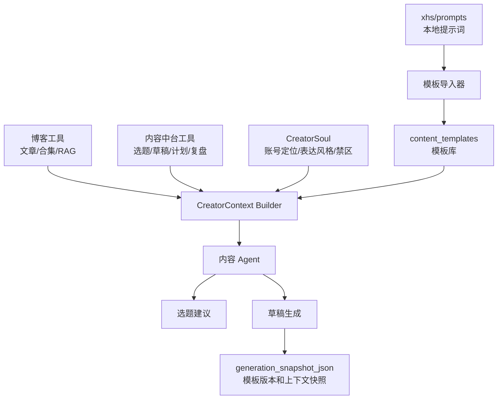
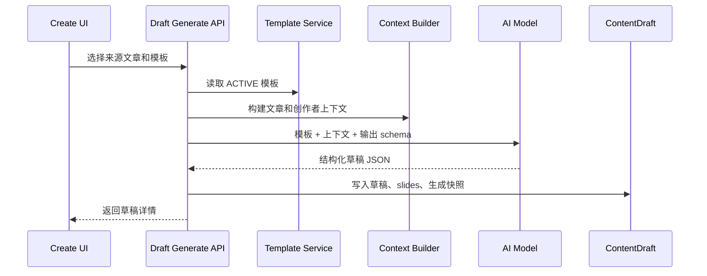

# 模板管理与内容 Agent 建设计划

## 状态

🚧 进行中

> 创建时间：2026-07-07
> 关联入口：`/create/templates`
> 关联项目：`/Users/nnnnzs/project/xhs`
> 关联设计：[内容创作中台设计](../designs/features/content-creation-platform.md)

## 问题分析

内容创作中台已经有草稿库、素材库、选题库的基础能力，但模板管理和自动化内容 Agent 还没有落地。

当前状态：

- `/create/templates` 仍是占位页，没有真实模板模型、API 和编辑页面。
- `docs/designs/features/content-creation-platform.md` 中规划了 `ContentTemplate`；当前已在 `prisma/schema/content.prisma` 新增 `content_templates` 模型，并完成 Prisma Client 生成，数据库结构同步待执行。
- `xhs/prompts` 下已有 3 份核心提示词：`blog-to-xhs-note.md`、`blog-to-short-video.md`、`mimo-tts-style.md`，它们仍以本地 Markdown 文件作为 source of truth。
- 现有 AI 文章工具已经能读取博客上下文：`search_articles`、`search_posts_meta`、`search_collection`。
- 内容中台还缺少面向选题、草稿、发布计划、复盘数据的 Agent 工具层。

目标不是一次性做全自动发布系统，而是先把模板、上下文和生成链路结构化，让后续 Agent 可以基于真实内容进展生成选题和草稿。

## 目标

第一阶段目标：

1. 在内容中台落地真实模板管理能力。
2. 迁移 `xhs/prompts` 下的核心提示词到 `content_templates`。
3. 让草稿生成从“代码内硬编码 prompt”切换为“选择模板 + 组装上下文 + 结构化输出”。
4. 为后续内容 Agent 定义稳定的上下文包和工具边界。

长期目标：

1. Agent 可以读取博客文章、合集、账号定位、已发布内容、发布计划、复盘数据和现有草稿。
2. Agent 可以根据内容进展自动建议选题，避免重复选题。
3. Agent 可以基于确认后的选题生成草稿、图卡结构、封面提示词和素材建议。
4. Agent 的每次生成都保存输入上下文、模板版本和输出快照，方便复盘和迭代。

非目标：

- 不做平台自动发布。
- 不绕过小红书、抖音、视频号等平台的登录、验证码或风控。
- 不在第一阶段做完整多 Agent 调度框架。
- 不把本地 `xhs` 仓库直接合并到博客仓库。
- 不让 Agent 默认自动创建大量草稿；批量创建前必须有人工确认。

## 解决方案

### 1. 总体架构



核心思路：

- 模板管理负责保存可编辑、可版本化的 prompt 和输出 schema。
- 上下文构建器负责把文章、账号定位、已发布、计划、复盘、草稿等资料整理为结构化输入。
- Agent 只在稳定工具和模板之上工作，不直接散落查询逻辑或硬编码 prompt。

### 2. 模板模型

新增 `ContentTemplate`，表名 `content_templates`。

建议字段：

| 字段 | 类型 | 说明 |
|------|------|------|
| `id` | Int | 主键 |
| `name` | String | 模板名称 |
| `type` | String | `prompt` / `voice_style` / `visual` / `checklist` / `context` |
| `scenario` | String | `blog_to_xhs_note` / `blog_to_short_video` / `tts` / `image_card` / `content_agent` |
| `content` | LongText | 模板正文 |
| `variables_json` | Json | 变量定义、默认值、导入来源、TTS 变体等 |
| `output_schema_json` | Json | 期望输出结构，用于解析和校验 AI 返回 |
| `version` | Int | 版本号，编辑时递增或复制新版本 |
| `status` | String | `ACTIVE` / `DRAFT` / `ARCHIVED` |
| `source_path` | String? | 本地迁移来源，如 `xhs/prompts/blog-to-xhs-note.md` |
| `created_by` | Int? | 创建人 |
| `created_at` | DateTime | 创建时间 |
| `updated_at` | DateTime | 更新时间 |

索引建议：

- `@@index([type, scenario, status])`
- `@@index([source_path])`
- `@@index([updated_at])`

### 3. xhs 提示词迁移映射

| 本地文件 | 线上模板 | 类型 | 场景 | 迁移重点 |
|----------|----------|------|------|----------|
| `xhs/prompts/blog-to-xhs-note.md` | 博客转小红书图文 | `prompt` | `blog_to_xhs_note` | 保留 JSON 输出结构、封面图 prompt 规范、`{{BLOG_CONTENT}}` 变量 |
| `xhs/prompts/blog-to-short-video.md` | 博客转短视频脚本 | `prompt` | `blog_to_short_video` | 保留 30-60 秒脚本结构、开头 3 秒痛点、发布文案和 tags |
| `xhs/prompts/mimo-tts-style.md` | MiMo TTS 风格 | `voice_style` | `tts` | 主风格进入 `content`，变体写入 `variables_json.variants` |

迁移策略：

1. 首次导入时按 `source_path` 去重。
2. 如果线上已有同 `source_path` 模板，提供“重新同步”能力，而不是静默覆盖。
3. 重新同步时保留旧版本，创建新版本或递增 `version`。
4. 模板内容迁移后，线上模板成为生产主版本；本地 `xhs/prompts` 保留为实验和备份来源。

### 4. 模板管理页面

`/create/templates` 从占位页改为真实管理页。

页面结构：

| 区域 | 功能 |
|------|------|
| 顶部工具栏 | 搜索、类型筛选、场景筛选、状态筛选、导入按钮 |
| 左侧列表 | 模板名称、类型、场景、状态、版本、更新时间 |
| 右侧编辑区 | 名称、类型、场景、状态、模板正文、变量 JSON、输出 Schema JSON |
| 底部操作 | 保存、启用、归档、复制版本、重新同步来源 |

第一阶段先做普通 textarea/JSON 编辑，不引入复杂 Markdown/Monaco 编辑器。等模板数量和字段稳定后，再补预览、diff 和变量测试。

### 5. 模板 API

建议新增接口：

| 接口 | 方法 | 用途 |
|------|------|------|
| `/api/create/templates` | GET | 模板列表 |
| `/api/create/templates` | POST | 新建模板 |
| `/api/create/templates/[id]` | GET | 模板详情 |
| `/api/create/templates/[id]` | PATCH | 更新模板 |
| `/api/create/templates/[id]` | DELETE | 归档或删除模板，优先归档 |
| `/api/create/templates/import-xhs` | POST | 从 `xhs/prompts` 导入核心模板 |

权限策略延续当前内容中台 MVP：先要求登录，不接入细粒度 `content:template:manage`。后续多人协作时再补内容中台权限码。

### 6. 模板驱动草稿生成

草稿生成服务不要直接写死 prompt，改成下面的流程：



生成快照建议写入 `ContentDraft.generation_snapshot_json`：

```json
{
  "template": {
    "id": 1,
    "name": "博客转小红书图文",
    "scenario": "blog_to_xhs_note",
    "version": 1
  },
  "source": {
    "postId": 123,
    "collection": "小破站建设"
  },
  "context": {
    "articleTitle": "文章标题",
    "creatorSoulVersion": 1,
    "relatedTopicIds": [1, 2],
    "publishedRecordIds": []
  },
  "rawOutput": {}
}
```

### 7. 内容 Agent 上下文

定义 `CreatorContext`，让 Agent 每次生成前先拿到结构化上下文。

```typescript
interface CreatorContext {
  contentMemory: {
    recentPosts: unknown[];
    relatedPosts: unknown[];
    collections: unknown[];
  };
  creatorSoul: {
    positioning: string;
    audience: string[];
    tone: string[];
    constraints: string[];
    tabooWords: string[];
  };
  progressState: {
    existingTopics: unknown[];
    drafts: unknown[];
    publishPlans: unknown[];
    publishedRecords: unknown[];
    metrics: unknown[];
  };
  templatePack: {
    topicTemplate?: unknown;
    draftTemplate?: unknown;
    voiceTemplate?: unknown;
  };
}
```

上下文来源分层：

| 上下文 | 来源 | 第一阶段 |
|--------|------|----------|
| 我的文章 | `search_posts_meta`、`search_articles`、`search_collection` | 复用已有工具 |
| 我的 soul | `content_templates` 中 `type=context` 或后续 `content_creator_profiles` | 先用模板保存 |
| 我的已发布 | `content_publish_records` | 表尚未落地，先预留工具设计 |
| 我的计划 | 发布日历、选题状态、草稿状态 | 先读 `content_topics` 和 `content_drafts` |
| 我的复盘 | `content_metrics` | 后续随复盘模块落地 |

### 8. Agent 工具边界

已有博客工具：

| 工具 | 用途 |
|------|------|
| `search_articles` | RAG 检索相关文章片段 |
| `search_posts_meta` | 按时间、标签、分类、热度查询文章列表 |
| `search_collection` | 在指定合集内查找文章 |

需要新增内容中台工具：

| 工具 | 用途 |
|------|------|
| `list_content_templates` | 查询可用模板 |
| `list_content_topics` | 查询已有选题，辅助去重 |
| `list_content_drafts` | 查询草稿进展，避免重复生成 |
| `suggest_content_topics` | 基于上下文生成选题建议，只返回建议不入库 |
| `create_content_topics` | 用户确认后批量创建选题 |
| `generate_content_draft` | 基于选题或文章生成草稿 |
| `list_publish_plans` | 查询发布计划，后续接发布日历 |
| `list_content_metrics` | 查询复盘表现，后续接复盘数据 |

安全边界：

- 只读工具可以由 Agent 主动调用。
- 写入工具必须经过用户确认或显式按钮触发。
- 批量写入要限制数量，例如一次最多创建 8 个选题、3 个草稿。
- 每次写入都记录模板版本和上下文摘要。

## 实施步骤

### 阶段 1：模板模型和迁移

1. [x] 在 `prisma/schema/content.prisma` 新增 `ContentTemplate`。
2. [x] 运行 Prisma schema validate 和 Prisma Client 生成。
3. [ ] 执行数据库结构同步。
4. [x] 在 `src/services/content-creation.ts` 增加模板 CRUD service。
5. [x] 新增 `/api/create/templates` 相关接口。
6. [x] 新增 `import-xhs` 导入接口，迁移 3 份 `xhs/prompts`。
7. [x] 更新内容创作中台设计文档中的模板模型说明。

### 阶段 2：模板管理页面

1. [x] 将 `/create/templates` 从占位页改成真实列表/编辑页。
2. [x] 支持搜索、类型、场景、状态筛选。
3. [x] 支持新建、编辑、保存、归档模板。
4. [x] 支持一键导入或重新同步 `xhs/prompts`。
5. [x] 支持编辑 `variables_json` 和 `output_schema_json`。
6. [x] 添加基础空状态和错误提示。

### 阶段 3：模板驱动草稿生成

1. [x] 模板读取和变量渲染 helper 已升级为系统级 `src/services/ai-template`，统一使用 LangChain `mustache`。
2. [ ] 增加博客文章到图文草稿生成接口。
3. [ ] 增加博客文章到短视频脚本生成接口。
4. [ ] 输出 JSON 使用 zod schema 校验。
5. [ ] 生成后写入 `content_drafts`、`content_draft_slides` 和 `generation_snapshot_json`。
6. [ ] 在草稿库或草稿详情页增加“用模板生成”入口。

### 阶段 4：CreatorSoul 与上下文包

1. [x] 账号定位、读者画像、表达风格和禁区迁移到 AI Lab 系统级 Prompt / Skill Template，不再绑定内容中台专属 `content_templates`。
2. [ ] 增加 `CreatorContext Builder`，聚合文章、选题、草稿、模板上下文。
3. [ ] 支持按合集、标签、近期时间窗口构建上下文。
4. [ ] 在生成快照中保存上下文摘要。
5. [ ] 后续视复杂度决定是否拆出 `content_creator_profiles`。

### 阶段 5：内容 Agent

1. [ ] 增加内容中台只读工具：模板、选题、草稿、计划、复盘查询。
2. [ ] 增加受控写入工具：创建选题、生成草稿。
3. [ ] 增加 Agent 入口，第一版只做“生成建议”，不自动写入。
4. [ ] 支持用户勾选建议后创建选题。
5. [ ] 支持基于已确认选题生成草稿。
6. [ ] 记录 Agent 每次工具调用、上下文和输出，供 AI Lab 或内容中台复盘。

## 风险评估

| 风险 | 影响 | 应对 |
|------|------|------|
| 模板字段过早复杂化 | 增加页面和 API 负担 | 第一阶段只做必要字段，复杂版本管理后置 |
| prompt 输出 JSON 不稳定 | 草稿写入失败或结构混乱 | 使用 zod schema 校验，失败时保留 raw output |
| Agent 重复生成已有内容 | 选题库和草稿库污染 | 生成前检索已有选题、草稿、已发布内容并做去重 |
| Agent 写入过多 | 需要人工清理 | 写入动作必须确认，限制单次创建数量 |
| 本地 xhs 与线上模板分叉 | 不知道哪个是主版本 | 导入后以线上模板为生产主版本，`source_path` 仅保留追溯 |
| 上下文过长 | 成本高、生成发散 | Context Builder 做摘要和截断，优先近期、相关、表现好的内容 |

## 验证清单

- [x] Prisma schema validate 通过。
- [x] Prisma Client 生成通过。
- [x] `pnpm typecheck` 通过。
- [x] `pnpm lint` 通过。
- [ ] `/create/templates` 可查看、新建、编辑、归档模板。
- [ ] `xhs/prompts` 三份提示词可导入，重复导入不产生脏数据。
- [ ] 使用图文模板可以从指定博客文章生成草稿。
- [ ] 使用短视频模板可以从指定博客文章生成脚本草稿。
- [ ] 生成草稿保存模板版本和上下文快照。
- [ ] Agent 第一版只生成选题建议，不自动写入。

## 后续文档同步

实施时需要同步更新：

- `docs/designs/features/content-creation-platform.md`
- `docs/plans/content-creation-platform.md`
- `docs/plans/README.md`
- 如果新增 Agent 工具，更新 `src/services/ai/tools/README.md`
