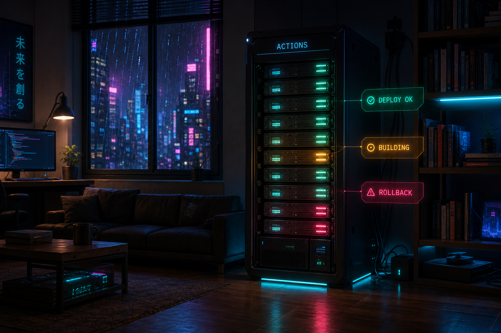
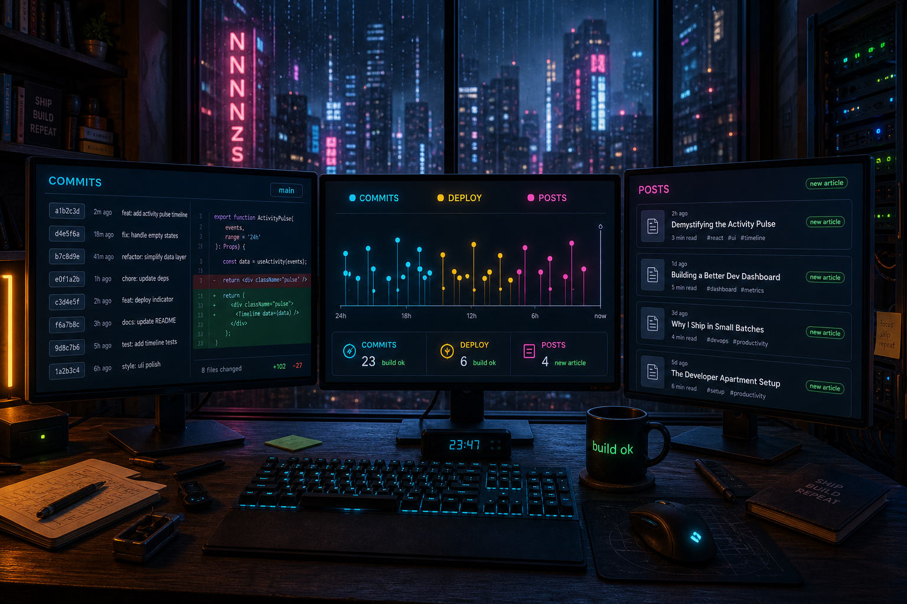
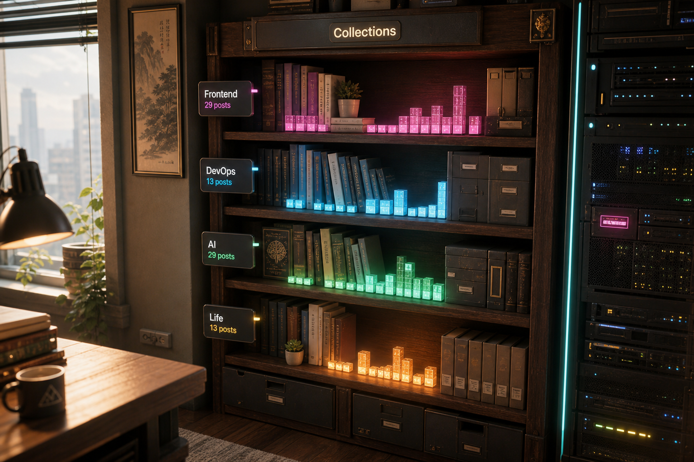

# 昼夜双主题 3D 首页改造计划

> **状态**：🔄 进行中（阶段一：程序化 3D 房间已接入，转向昼夜双主题）
> **创建时间**：2025-05-18
> **最近更新**：2026-05-20
> **合集**：小破站建设

---

## 一、愿景

把 `NNNNzs` 首页改造成一个**同一空间、昼夜双主题的 3D 数字房间**。

核心理念：**同一个私人数字空间，在日间呈现温暖、文艺、适合阅读的房间；在夜间切换为霓虹、雨夜、终端与边缘城市感的赛博朋克房间**。

品牌解释：

```txt
NNNNzs = Neon Nomad Navigating Night Zones
```

这不是两个割裂的首页，而是同一个空间的昼夜状态：

- 日间：温馨、美好、文艺、明亮、安静、可阅读。
- 夜间：赛博朋克、霓虹、雨夜、终端、孤独、锋利。

最终形态（远期目标）：全沉浸式 3D 世界，用户在其中探索你的博客内容——
- 合集 = 建筑群
- 文章 = 可交互的数据终端 / 全息面板
- 标签 = 功能区域
- 博客成长 = 世界扩张

**现阶段目标调整为：同一 3D Banner 同时支持日间与夜间主题**，为后续全沉浸式打好地基。

---

## 〇、当前实现快照（2026-05-20）

当前代码已经从“计划验证”进入“可见的阶段一实现”：

- 首页已接入 `src/components/cyberpunk/CyberpunkBanner.tsx`，首屏可使用 R3F `Canvas` 渲染 3D 房间。
- 已有程序化房间：地板、墙体、天花板、落地窗、城市夜景纹理、窗框、管线、灯带。
- 已有程序化家具：床、床头柜、工作桌、三显示器、键盘、鼠标、椅子、书架、服务器机柜、线缆、咖啡杯、发光植物、机器人宠物、霓虹招牌。
- 已有氛围系统：雨滴粒子、Bloom、Vignette、灯光呼吸、鼠标视差、滚动淡出、低端设备降级。
- 开发环境已有 Leva 调参入口：`src/components/cyberpunk/useSceneStore.ts`、`DevControls.tsx`。
- 2026-05-20 新增首屏 HUD、诊断面板、暗色日志流文章区、湿润地面反光、悬浮内容终端和 `NNNNzs` 霓虹标识。
- 2026-05-20 方向调整：不再让日间模式使用赛博朋克视觉，后续应改成同一 3D 房间的日间温暖文艺主题。
- 2026-05-20 已开始昼夜双主题实现：新增 `HomepageSceneVariant` 与 theme preset，首页日间/夜间都走同一个 3D Banner，日间关闭雨滴并降低 Bloom。
- 2026-05-24 新增活动数据家具原型方向：保留服务器机柜部署状态灯、三联显示器活动纹理、书架数据核心三个概念，用于把 Git commit、GitHub Actions 部署记录和文章发表历史接入同一 3D 房间。

### 当前主要问题

- 场景虽然元素完整，但目前偏夜间赛博朋克；日间主题缺少对应的温暖、文艺、明亮空间表达。
- “空间叙事”和博客内容之间的连接还不够强，需要把合集、文章、标签逐步接入 3D 物件。
- 文章列表需要与日夜主题保持同构布局：日间清爽阅读，夜间数据日志，但不能改变信息结构。
- 低端设备降级目前是视觉回退，不是真正的静态截图，需要后续生成一张高质量 fallback 海报。
- 程序化模型能快速落地，但局部物件仍偏“方块感”，后续可用 GLB 模型替换关键焦点物件。

### 下一步优先级

1. **阶段一重构**：把 `CyberpunkBanner` 抽象为 `Homepage3DBanner`，支持 `variant="day" | "night"`。
2. **日间主题落地**：同一房间结构下切换暖光、蓝天/窗景、低 Bloom、温暖材质、轻 HUD。
3. **夜间主题保留**：保留霓虹、雨夜、Bloom、终端、HUD，但控制性能和滚动体验。
4. **阶段一点五**：让书架的数据核心映射真实合集，至少展示合集名称、文章数和点击跳转。
5. **阶段二**：把最近文章映射到悬浮内容终端，形成“3D 场景入口 + HTML 列表”的双通道浏览。
6. **活动数据家具化**：优先接入服务器机柜部署灯、三联显示器 commit/post 活动纹理、书架发表历史光点，不新增脱离房间的大型 dashboard。

---

## 二、博客内容 → 昼夜空间元素映射

### 合集映射（9 个合集 → 9 个空间物件/区域）

| 合集 | 文章数 | 日间映射 | 夜间映射 |
|------|--------|----------|----------|
| 生活感悟 | 29 | 窗边扶手椅、便签、相框、阳光植物 | 雨夜阳台、霓虹灯、全息相框 |
| 前端开发 | 27 | 明亮工作台、浏览器草图、代码笔记 | 多屏工作台、代码雨投影、React/Three.js 徽标 |
| 运维实践 | 12 | 整洁设备柜、状态看板 | 服务器机架、闪烁指示灯、网线管道、温度显示屏 |
| 工具开发 | 12 | 木质工坊桌、工具托盘、蓝图纸 | 机械臂、焊接火花、工具墙、蓝图桌 |
| 算法题解 | 11 | 白板、手写公式、棋盘/积木 | 晶体矩阵、二进制瀑布、逻辑电路墙 |
| 小破站建设 | 13 | 站点规划板、便签墙、房间草图 | 施工现场/指挥中心、脚手架、全息规划图 |
| 旅行游记 | 9 | 纸质地图、车票、明信片 | 全息地图、悬浮列车、旅行票据墙 |
| 大模型学习 | 6 | 阅读灯、论文、对话卡片 | 全息 AI 头像、神经网络可视化、对话终端 |
| 全屋智能之路 | 5 | 家居控制面板、柔和灯光 | IoT 控制室、传感器墙、灯光控制台 |

### 标签映射（主要标签分类）

| 标签类别 | 日间元素 | 夜间元素 |
|---------|----------|----------|
| 前端（Vue/React/Next.js/TypeScript） | 代码笔记、明亮 IDE、浏览器草图 | 代码雨、全息 IDE、浏览器窗口 |
| AI/LLM/MCP/LangChain/Agent | 对话卡片、论文、柔和节点图 | 全息 AI 头像、神经网络节点、对话气泡 |
| 运维/Docker/NAS/DevOps | 整洁设备柜、状态灯 | 服务器机架、网线、监控屏幕 |
| 智能家居/Home Assistant/蓝牙 | 家居面板、柔和灯具 | IoT 设备墙、传感器、灯光面板 |
| 生活/旅游/忧伤感怀 | 相片、明信片、窗边植物 | 雨夜天台、霓虹街道、旅行全息照片 |
| 调试/踩坑记录 | 便签、标注、修复清单 | 警报灯、故障面板、修复机器人 |
| 架构设计 | 蓝图纸、白板、模型 | 蓝图桌、城市鸟瞰模型 |

---

## 三、技术方案

### 技术栈

- **Three.js** — 3D 渲染引擎
- **React Three Fiber (R3F)** — React 渲染器，与现有 Next.js 无缝集成
- **@react-three/drei** — 常用 3D 组件（OrbitControls、Environment、Text3D 等）
- **@react-three/postprocessing** — 后处理效果（Bloom 霓虹发光、Vignette 等）
- **@use-gesture/react** — 手势交互（可选）

### 主题架构

首页 3D 场景必须共用一套房间结构，不创建两套互相独立的首页。

```ts
type HomepageSceneVariant = 'day' | 'night';
```

建议将当前 `src/components/cyberpunk` 逐步重构为更中性的目录和组件命名：

| 当前命名 | 建议命名 | 说明 |
|---------|----------|------|
| `CyberpunkBanner` | `Homepage3DBanner` | 首页 3D Banner 容器 |
| `CyberpunkLights` | `SceneLights` | 根据主题选择日间/夜间灯光 |
| `Room` | `Room` | 保留，内部接收主题参数 |
| `Furniture` | `Furniture` | 保留，内部接收主题参数 |
| `RainEffect` | `WeatherEffect` | 夜间雨滴，日间可为空或轻微尘埃 |

主题差异由 preset 驱动：

```ts
interface HomepageThemePreset {
  variant: 'day' | 'night';
  sky: 'warm-window' | 'rainy-neon-city';
  lights: {
    ambient: string;
    key: string;
    accent: string;
    bloom: number;
  };
  materials: {
    wall: string;
    floor: string;
    emissiveScale: number;
    metalnessScale: number;
  };
  overlay: 'minimal' | 'hud';
}
```

### 模型来源策略

**不需要自己建模。** 优先级：

1. **免费模型库**（首选）
   - Sketchfab（sketchfab.com）— 搜 cyberpunk keyboard / monitor / neon sign 下载 GLB
   - Poly Pizza（poly.pizza）— 免费可商用
   - Poly Haven（polyhaven.com）— 免费材质/HDR

2. **AI 生成**（找不到时）
   - Meshy API — 文字/图片生成 3D 模型

3. **代码生成**（简单几何体）
   - 地板、墙壁、桌子 → Three.js 基础几何体
   - 粒子系统 → 代码实现

> **2026-05-20 更新**：素材已准备完成。14 个 GLB 模型 + 1 张 AI 生成城市天际线贴图，全部上传至 Cloudflare R2 `cyberpunk/` 目录。
> 完整素材清单见 `docs/reference/3d-assets-manifest.json`，包含每个模型的 R2 下载地址、Sketchfab 来源、体积、场景位置等信息。
> 本地备份位于 NAS `/root/home/3d-models/`。

#### 已准备素材总览

| 元素 | 文件 | 来源 | 体积 | 场景区位 |
|------|------|------|------|----------|
| 床 | `cyberpunk/床.glb` | Sketchfab (Neon Bedroom) | 6.3MB | 睡眠区 |
| 桌子 | `cyberpunk/桌子.glb` | Sketchfab (Lumen hologram Table) | 1.7MB | 工作区 |
| 双显示器 | `cyberpunk/双显示器.glb` | Sketchfab (Gaming Desk) | 0.2MB | 工作区桌上 |
| 书架 | `cyberpunk/书架.glb` | Sketchfab (Wooden Bookcases) | 3.0MB | 存储/服务器区 |
| 服务器机架 | `cyberpunk/服务器机架.glb` | Sketchfab (Server Racking) | 13MB | 存储/服务器区 |
| 赛博朋克键盘 | `cyberpunk/赛博朋克键盘.glb` | Sketchfab (NZXT miniTKL) | 18MB | 工作区桌上 |
| 霓虹灯牌 | `cyberpunk/霓虹灯牌.glb` | Sketchfab (Japanese LED Neon Sign) | 8.0MB | 墙面装饰 |
| 电竞椅 | `cyberpunk/电竞椅.glb` | Sketchfab (Cyberpunk Gaming Chair) | 3.8MB | 工作区 |
| 咖啡杯 | `cyberpunk/咖啡杯.glb` | Sketchfab (Coffee Mug) | 8.6MB | 工作区桌上 |
| 盆栽 | `cyberpunk/盆栽.glb` | Sketchfab (Potted Plant) | 38MB⚠️ | 生活细节 |
| 机器猫 | `cyberpunk/机器猫.glb` | Sketchfab (Sox Lightyear) | 16MB | 生活细节 |
| 复古电脑 | `cyberpunk/复古电脑.glb` | Sketchfab (Retro Computer) | 2.4MB | 工作区 |
| 床头柜 | `cyberpunk/床头柜.glb` | Sketchfab (Dormitory Assets) | 11MB | 睡眠区 |
| 外套 | `cyberpunk/外套.glb` | Sketchfab (Clothes) | 18MB⚠️ | 椅背上 |
| 城市天际线贴图 | `cyberpunk/城市天际线.png` | GPT Image 2 生成 | 2.7MB | 落地窗背景 |

⚠️ **体积警告**：盆栽(38MB)和外套(18MB)体积过大，集成前建议 Draco 压缩或寻找更轻量替代品。

**代码生成物件**（不需要下载模型）：地板、墙壁、天花板、落地窗窗框、天花板管道、散落线缆、NNNNzs 标识牌、全息时钟。

**存储信息**：
- R2 目录：`threejs/cyberpunk/`（Worker: `r2-file-manager.nnnnzs.workers.dev`）
- 下载地址：`/api/download/cyberpunk/{文件名}`
- 本地备份：NAS `/root/home/3d-models/`
- 管理脚本：`threejs-learn/scripts/batch-download-upload.py`

### 性能策略

- 3D 场景仅占首屏，不阻塞文章列表加载
- 使用 Suspense + lazy 加载 3D 组件
- 模型使用 Draco 压缩（GLTFLoader + DRACOLoader）
- 低端设备自动降级（检测 WebGL 支持后回退为静态 Banner）
- 控制多边形数：单模型 < 50k 面，总场景 < 200k 面
- 日夜切换只切换 preset，不同时挂载两个 Canvas
- 禁止首页外层使用强制滚动吸附影响普通滚动
- 日间主题默认关闭雨滴和高强度 Bloom

---

## 四、分阶段实施路线

### 🟢 阶段一：昼夜双主题 3D Banner（当前目标）

**目标**：把首页首屏统一为 3D 房间。日间和夜间使用同一布局、同一房间、同一内容入口，只切换情绪、材质、灯光、窗外和覆盖层。

#### 夜间场景描述（已确认）

一个赛博朋克风格的**完整小公寓房间**，有人住着的生活感，不只是一个工位。广角展示整个空间。

**提示词参考**（用于 AI 生成效果图）：
> Interior of a small cyberpunk apartment room at night, wide shot showing the full space with depth and multiple areas. Left side: a bed pushed against the wall with a glowing neon poster above it, a small bedside table with a holographic clock. Center: a desk area with glowing keyboard and dual monitors, but not the main focus — just one part of the room. Right side: a tall bookshelf filled with glowing data cores and old books, a small server rack humming in the corner with blinking LED indicators. Back wall: a large window from floor to ceiling, rain streaking down the glass, revealing a sprawling neon-lit cyberpunk city skyline with flying vehicles. Floor: scattered cables, a robot pet sitting idle, a coffee mug on the desk, a jacket draped over a chair, a potted plant with bioluminescent leaves. Ceiling: exposed pipes and ducts with faintly glowing neon strips. A neon sign "NNNNzs" hangs above the window. Atmospheric fog near the floor, neon light bleeding through the window, bloom and glow on emissive surfaces. Color palette: deep navy, dark purple shadows, neon cyan #00f0ff and magenta #ff0066 accents throughout. Cozy but tech-heavy, lived-in feel, like someone actually inhabits this space. Photorealistic 3D render, Unreal Engine 5, 8K, cinematic, no people.

#### 日间场景描述（新增）

一个温馨、明亮、文艺的个人数字房间。房间结构与夜间一致，但窗外是柔和天空和城市远景，雨滴关闭，Bloom 降低。书架、床、桌面、设备仍存在，只是材质从冷硬霓虹转为木质、布料、纸张、暖光与轻量屏幕。

**提示词参考**：
> Interior of a cozy creative developer apartment room during daytime, wide shot showing the full space with depth and multiple areas. Left side: a neatly used bed with soft linen, warm sunlight on the wall, framed prints and handwritten notes. Center: a desk area with a laptop, dual monitors, notebooks, coffee cup, small speakers, and a warm desk lamp. Right side: a tall bookshelf filled with books, journals, small archive boxes, and a few subtle glowing data objects. Back wall: a large floor-to-ceiling window with soft daylight, pale blue sky, distant city buildings, and light curtains. Floor: warm wood, a few tidy cables, a small robot pet resting near the desk, a jacket on the chair, potted green plants. Ceiling: quiet industrial pipes softened by daylight. A clean sign "NNNNzs" sits above the window. Calm, literary, thoughtful, warm, lived-in, no people.

**房间分区与元素：**

| 区域 | 位置 | 元素 |
|------|------|------|
| 睡眠区 | 左侧 | 床、墙上发光海报、床头柜+全息时钟 |
| 工作区 | 中央偏右 | 桌子、发光键盘、双显示器 |
| 存储/服务器区 | 右侧 | 书架（发光数据核心+旧书）、服务器机架+LED 指示灯 |
| 窗户区 | 后墙 | 日间：柔光天空/城市远景；夜间：雨水、赛博朋克城市天际线 |
| 生活细节 | 地面/各处 | 散落线缆、机器人宠物、咖啡杯、外套搭椅上、生物发光盆栽 |
| 天花板 | 顶部 | 暴露管道、微弱霓虹灯条 |
| 标识 | 窗户上方 | 标识牌/霓虹灯牌 `NNNNzs` |

#### 需要的模型清单

| 元素 | 来源 | 优先级 |
|------|------|--------|
| 床 | Sketchfab 下载 / 代码几何体 | P0 |
| 书架 | Sketchfab 下载 | P0 |
| 服务器机架（小型） | Sketchfab / Meshy | P0 |
| 桌子 | 代码生成几何体 | P0 |
| 地板/墙壁/天花板 | 代码生成 | P0 |
| 落地窗（带城市天际线贴图） | 代码几何体 + 贴图 | P0 |
| 赛博朋克键盘 | Sketchfab 下载 | P1 |
| 显示器/屏幕 | Sketchfab 下载 | P1 |
| 标识牌/霓虹灯牌 `NNNNzs` | 代码生成 + emissive | P1 |
| 咖啡杯/小物件 | Sketchfab | P2 |
| 机器人宠物 | Sketchfab / Meshy | P2 |
| 椅子 + 外套 | Sketchfab | P2 |
| 生物发光盆栽 | Sketchfab | P2 |
| 床头柜 + 全息时钟 | 代码组合 | P2 |

#### 技术任务

- [x] 安装依赖：`three` `@react-three/fiber` `@react-three/drei` `@react-three/postprocessing`
- [x] 创建 `CyberpunkBanner` 组件（替换现有 Banner）
- [x] 搭建基础场景：房间几何体（地板/墙/天花）+ 相机 + 灯光
- [x] 配置 Bloom 后处理管线
- [x] 使用程序化模型实现第一版家具（桌子、显示器、服务器、床、书架等）
- [x] 实现雨滴效果（粒子系统）
- [x] 实现鼠标视差
- [x] 实现滚动过渡（3D → 文章列表）
- [x] 增加首屏 HUD、诊断面板和内容终端，强化博客空间叙事
- [x] 优化文章列表视觉，使其承接首屏赛博朋克风格
- [x] 抽象 `HomepageSceneVariant` 和主题 preset
- [x] 增加日间 theme preset（暖光、低 Bloom、日间窗景、轻 HUD）
- [x] 增加夜间 theme preset（霓虹、雨夜、Bloom、HUD）
- [x] 确保日夜切换只更新单个 Canvas，不重复挂载两个 3D 场景
- [ ] 将 `CyberpunkBanner` 等组件重命名为中性命名 `Homepage3DBanner` / `SceneLights`
- [ ] 生成日间/夜间静态 fallback 海报，用于低端设备和 WebGL 不可用场景
- [ ] 移动端适配截图检查（375px / 390px / 430px）
- [ ] 性能验证：首屏帧率、bundle 体积、低端设备降级阈值
- [ ] 加载 GLB 模型替换焦点物件（键盘、椅子、服务器或机器人宠物）— ✅ 素材已就绪，见 `docs/reference/3d-assets-manifest.json`

---

### 🔵 阶段二：书架与合集入口（下一步）

**目标**：在 3D 场景中加入书架，书架上的"书"对应博客合集，点击可跳转。

- 当前已有程序化书架和发光数据核心，下一步把它改为数据驱动。
- 每个合集 = 书架上一排发光的书/数据模块。
- hover 显示合集名称 + 文章数。
- 点击跳转到合集页。
- 移动端不做精细 hover，改为点击后显示轻量浮层或直接跳转。

### 🟢 阶段二点一：活动数据家具化（新增原型方向）

**目标**：把 Git commit、GitHub Actions 部署记录、文章发表历史变成房间中已有家具的状态，而不是在首屏叠加大型 dashboard。3D 负责氛围和入口，HTML 区域继续负责可读性、SEO 和完整列表。

#### 原型图记录

| 原型 | 用途 | 本地图片地址 |
|------|------|--------------|
| 服务器机柜部署状态灯 | 映射 GitHub Actions 部署记录，成功/失败/运行中使用不同 LED 状态。 | `docs/plans/images/cyberpunk-homepage-activity/server-rack-deploy-status.png` |
| 三联显示器活动纹理 | 映射 Git commit、部署状态、最近文章发表，作为工作区屏幕纹理。 | `docs/plans/images/cyberpunk-homepage-activity/triple-monitor-activity-texture.png` |
| Activity Console 参考图 | 仅作为右侧 HUD/Recent Logs 的参考，不作为当前核心家具方向。 | `docs/plans/images/cyberpunk-homepage-activity/activity-console-reference.png` |
| 书架数据核心 | 映射合集、文章数和发表历史光点，一天多次发表聚合为同层多个亮点。 | `docs/plans/images/cyberpunk-homepage-activity/bookshelf-data-cores.png` |







#### 设计原则

- **不新增主视觉大屏**：所有活动数据优先附着在已有家具上，保持“私人数字房间”的叙事。
- **昼夜同构**：白天表现为创作记录、设备状态、书架整理；夜晚表现为霓虹日志、部署脉冲、数据核心。
- **短期只展示近期状态**：首屏只承担 3-7 天或最近 N 条活动提示，完整历史放到下方 HTML 区域或独立归档页。
- **移动端降级**：移动端不做复杂 hover，保留简化光点、状态数字和点击跳转。

#### 家具映射

| 数据来源 | 3D 家具 | 夜间表现 | 日间表现 | 交互 |
|---------|---------|----------|----------|------|
| GitHub Actions 部署记录 | 服务器机柜 | 青绿成功灯、粉红失败灯、琥珀运行中呼吸灯。 | 整洁设备柜状态灯、轻量状态牌。 | 点击/hover 显示最近部署、分支、状态、时间。 |
| Git commit 记录 | 三联显示器左/中屏 | 代码流、commit hash、diff 脉冲节点。 | IDE 最近修改、代码笔记、低亮度屏幕。 | 点击跳转到代码活动详情或 GitHub commit。 |
| 文章发表历史 | 三联显示器右屏 + 书架数据核心 | 广播卡片、发表节点、同日多次亮点聚合。 | 书脊/便签/归档盒上的轻量标记。 | 点击跳转文章或按日期展开。 |
| 合集与长期文章积累 | 书架 | 每个合集一层数据核心，文章越多越亮。 | 书、归档盒、纸质标签和少量柔光数据块。 | hover 显示合集名和文章数，点击进合集页。 |

#### 实施切片

1. **服务器机柜部署灯**：先用静态/mock 数据驱动 LED 数组，验证视觉和性能，再接 GitHub Actions 数据。
2. **三联显示器纹理升级**：扩展当前 `createScreenTexture`，按数据类型生成 commit/deploy/post 三类屏幕纹理。
3. **书架数据核心数据化**：把现有固定发光方块改为合集数组渲染，支持合集名、文章数、slug。
4. **数据获取边界**：Git commit 可从本地构建脚本或 GitHub API 同步，GitHub Actions 从 workflow run 记录同步，文章发表历史复用现有 `posts` 数据。
5. **完整历史入口**：首屏只做状态摘要；如果后续需要全年热力图，放到文章列表后方或独立 timeline/archives 页面。

### 🟦 阶段一点五：最近文章内容终端（阶段一和阶段二之间）

**目标**：先不把全部文章列表 3D 化，只把“最近文章”映射到工作桌旁的悬浮终端。

- 从首页已有 `posts` 数据中抽取最近 3-5 篇。
- 终端默认显示标题短线和状态灯，HTML HUD 中显示可读文本。
- 点击终端或 HUD 条目跳转文章详情。
- 与下方 HTML 文章列表保持互补：3D 负责入口和氛围，列表负责效率和 SEO。

---

### 🟣 阶段三：文章列表 3D 化

**目标**：文章列表融入 3D 世界。

- 文章 = 墙上的全息面板 / 数据终端
- 最近文章显示在主屏幕上
- hover → 面板展开，显示标题/摘要
- 点击 → 进入文章页

---

### 🔴 阶段四：全沉浸式 + 世界成长（远期）

**目标**：整个首页变成可自由探索的 3D 空间。

- 多个房间/区域对应不同合集
- 标签 = 区域标识灯
- 博客数据驱动场景变化（新文章 → 新建筑亮灯）
- 天气系统（雨/晴）、昼夜循环
- 背景音乐
- 用户在空间中"漫步"浏览博客

---

## 五、场景设计参考

### 视觉参考

- 赛博朋克雨夜室内
- 霓虹灯 + Bloom 后处理
- 赛博朋克 3D 桌面（Awwwards 上的 cyberpunk interactive 3D desk）
- 赛博朋克工作站

### 色调

- 主色：深蓝 / 暗紫（背景）
- 强调色：霓虹蓝（#00f0ff）、霓虹粉（#ff0066）、霓虹绿（#00ff88）
- 暗部：纯黑 / 深灰（墙壁、地板）

---

## 六、风险与注意事项

1. **性能**：3D 场景可能影响首屏加载速度 → 使用 Suspense + 降级方案
2. **SEO**：3D Canvas 内容不可被搜索引擎索引 → 保持 HTML 文字标题层
3. **移动端**：手机 GPU 性能有限 → 简化模型/粒子数，或使用静态截图
4. **可维护性**：模型文件需要版本管理 → 放在 public/models/ 目录
5. **渐进增强**：每个阶段独立可用，不依赖下一阶段完成
