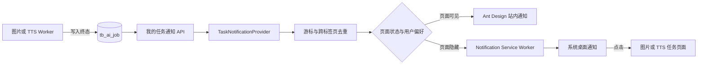
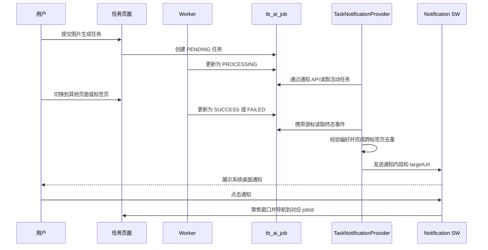
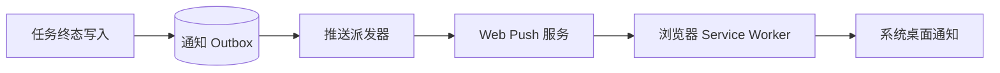

# 后台任务桌面通知模块

## 状态

🚧 进行中（模块代码、静态检查和任务深链验收已完成，待数据库索引同步与用户授权后的真实终态通知验收）

## 目标

为当前登录用户的异步 AI 任务提供统一通知能力。首期接入图片生成和 TTS，在任务由 `PENDING` / `PROCESSING` 进入 `SUCCESS` 或 `FAILED` 时，即使用户已经离开具体任务页面，只要站点仍在浏览器中运行，也能收到桌面通知。

模块需要满足以下目标：

- 通知范围严格限定为当前登录用户自己的任务。
- 图片生成、图片编辑、TTS 复用同一套观察、去重和通知机制。
- 页面切换、刷新和多标签页场景下不漏掉当前会话任务，且同一终态只提醒一次。
- 用户主动开启浏览器通知权限，不在页面加载时自动弹权限框。
- 成功与失败都可通知，点击通知能够回到对应业务页面并定位任务。
- 设计上兼容未来的 `text-gen` 等 `tb_ai_job` 任务类型。

## 非目标

首期不包含以下能力：

- 浏览器完全退出、设备休眠或站点长期未打开时的离线 Web Push。
- 邮件、短信、企业微信等站外渠道。
- 向量化任务通知。当前向量化状态保存在 `tb_post.rag_status`，没有复用 `tb_ai_job`，也不是同一套用户归属模型，后续应通过独立适配器接入。
- 用通知模块替换 `/c/queue` 的运维监控能力。

## 当前实现分析

当前 AI 异步任务已具备统一的数据基础，但前端观察仍是页面级的：

| 环节 | 当前实现 | 对通知模块的影响 |
| --- | --- | --- |
| 任务持久化 | `prisma/schema/ai.prisma` 的 `TbAiJob` | 可统一按 `user_id`、`type`、`status` 查询 |
| 图片 worker | `src/services/image-gen-job.ts` | 在 worker 内写入 `PROCESSING`、`SUCCESS`、`FAILED` |
| TTS worker | `src/services/tts-job.ts` | 与图片任务使用相同终态语义 |
| 图片状态观察 | `src/components/ImageGen/ImageGenJobImage.tsx` | 组件卸载后停止轮询 |
| TTS 状态观察 | `src/app/c/tts/page.tsx` | 离开页面后停止轮询 |
| 全局挂载点 | `src/app/layout.tsx` 的 `AuthProvider` | 适合挂载登录态感知的全局通知 Provider |
| 浏览器通知基础 | 当前没有 Notification API、Service Worker 或通知偏好实现 | 需要新增完整的客户端通知层 |

现有页面里的 Ant Design `message.success` / `message.error` 继续负责当前页面的即时反馈。桌面通知模块负责跨页面和后台标签页提醒，两者职责不混合。

## 方案概览



### 1. 服务端任务通知查询

新增通用查询服务和接口：

- `src/services/ai-job-notification.ts`
- `src/app/api/ai-jobs/notifications/route.ts`

接口只返回当前登录用户有权查看的任务，不接受客户端传入 `userId`。任务类型还需经过现有 `image:view`、`tts:view` 权限过滤，不使用 `queue:view`，因为这是个人任务通知，不是全局队列监控。

建议接口：

```http
GET /api/ai-jobs/notifications?cursor=<opaque-cursor>
```

返回结构：

```typescript
interface AiJobNotificationSnapshot {
  cursor: string;
  activeJobs: Array<{
    jobId: string;
    type: 'image-gen' | 'tts' | 'text-gen';
    status: 'PENDING' | 'PROCESSING';
    title: string;
    createdAt: string;
  }>;
  terminalEvents: Array<{
    eventId: string;
    jobId: string;
    type: 'image-gen' | 'tts' | 'text-gen';
    status: 'SUCCESS' | 'FAILED';
    title: string;
    errorMessage: string | null;
    resourceUrl: string | null;
    finishedAt: string;
    targetUrl: string;
  }>;
}
```

游标使用 `(finished_at, id)` 组合生成不透明字符串，不能只用时间戳，避免同一毫秒完成多个任务时漏读。首次无游标请求只建立基线并返回当前活动任务，不补发历史终态通知；后续请求才返回游标之后的终态事件。活动任务与终态游标基线必须在同一个一致性事务快照中读取，避免任务恰好在初始化请求期间完成时既不在活动列表、又被新游标跳过。

查询必须包含以下约束：

- `user_id = currentUser.id`。
- `status IN ('PENDING', 'PROCESSING')` 用于活动任务快照。
- 终态事件按 `(finished_at, id)` 正序分页，设置单次上限并通过游标继续拉取。
- `title` 只返回截断后的安全摘要；失败详情只返回适合用户展示的错误消息，不直接把图片 worker 中的完整上下文 JSON 当通知正文。
- 响应使用 `Cache-Control: no-store`。

首期采用轻量轮询，不在 `tb_ai_job` 增加通知业务字段。原因是通知送达状态与浏览器、标签页和设备相关，单一 `notified_at` 无法正确表达多设备状态。为控制持续轮询的数据库成本，应通过 `EXPLAIN` 验证查询；若现有索引不能稳定命中，则只增加 `(user_id, status, finished_at, id)` 复合索引。

### 2. 全局任务观察器

新增以下客户端模块：

- `src/contexts/TaskNotificationContext.tsx`
- `src/contexts/TaskNotificationContext.tsx` 导出的 `useTaskNotifications`
- `src/lib/task-notification-storage.ts`
- `src/lib/task-notification-coordinator.ts`
- `src/lib/task-notification-service-worker.ts`

`TaskNotificationProvider` 挂在根布局的 `AuthProvider` 内部，确保登录后在任意站内路由都能工作，退出登录时立即停止轮询并清理当前用户的内存状态。

观察策略：

- 有活动任务时每 3 秒查询一次。
- 没有活动任务时每 15 秒查询一次，以捕获由 MCP 或其他页面创建的同账号任务。
- 页面从隐藏恢复可见、浏览器恢复联网时立即查询一次。
- 请求未完成时不并发发起下一次请求；失败使用指数退避，上限 60 秒。
- `401` / `403` 时停止本轮观察，等待 AuthContext 状态变化后再恢复。
- 快速任务即使在两次轮询之间完成，也通过终态事件游标被捕获，而不是只比较活动任务列表。

Provider 对外暴露：

```typescript
interface TaskNotificationContextValue {
  supported: boolean;
  permission: NotificationPermission | 'unsupported';
  enabled: boolean;
  activeCount: number;
  requestPermission: () => Promise<NotificationPermission>;
  updatePreferences: (patch: Partial<TaskNotificationPreferences>) => void;
}
```

### 3. 浏览器权限与用户偏好

新增 `TaskNotificationSettings`，入口放在登录用户的头部菜单中，名称为“任务通知”。权限只能在用户点击“开启桌面通知”后调用 `Notification.requestPermission()`。

首期偏好保存在当前浏览器的 `localStorage`，并按用户 ID 隔离：

```typescript
interface TaskNotificationPreferences {
  enabled: boolean;
  notifySuccess: boolean;
  notifyFailure: boolean;
  types: Array<'image-gen' | 'tts' | 'text-gen'>;
  desktopWhenHidden: boolean;
}
```

默认策略：

- 未授权前 `enabled = false`。
- 用户授权后成功、失败均提醒。
- 页面可见时使用 Ant Design 站内通知，页面隐藏时使用系统桌面通知。
- 浏览器返回 `denied` 时展示如何在站点设置中重新开启，不重复请求权限。
- 不提供自定义提示音，避免浏览器自动播放限制和重复打扰。

### 4. Service Worker 与桌面通知

新增专用通知 Service Worker，例如 `public/task-notification-sw.js`，由 Provider 注册。首期由页面将终态事件发送给 Service Worker，再调用 `registration.showNotification()`。

通知内容约定：

| 任务类型 | 成功标题 | 失败标题 | 点击目标 |
| --- | --- | --- | --- |
| 图片生成 | 图片生成完成 | 图片生成失败 | `/c/image-gen?jobId={jobId}` |
| TTS | 语音合成完成 | 语音合成失败 | `/c/tts?jobId={jobId}` |
| text-gen | 文本任务完成 | 文本任务失败 | 由后续适配器提供 |

通知使用稳定的 `tag = ai-job:{jobId}:{status}`，并在 `data` 中携带站内目标 URL。`notificationclick` 时优先聚焦已有同源窗口并导航，没有窗口时再 `clients.openWindow()`。

首期 Service Worker 只能在站点页面仍有运行机会时展示通知，不等于离线 Web Push。文案和设置页需要明确说明这一边界。

### 5. 多标签页去重与恢复

去重分为三层：

1. 事件级：`eventId = jobId + status + finishedAt`，防止相同游标页重复消费。
2. 浏览器级：已通知事件保存在按用户隔离的 `localStorage`，仅保留最近 200 条或 7 天，避免无限增长。
3. 标签页级：使用 `BroadcastChannel('ai-job-notifications')` 同步游标和已消费事件；不支持时监听 `storage` 事件降级。

为避免多个标签页同时轮询和同时弹通知，优先使用 Web Locks API 选举一个观察者标签页；不支持 Web Locks 时使用带过期时间的 `localStorage` 租约。非主标签页只接收 BroadcastChannel 状态，不请求通知接口。

刷新后从本地游标继续读取。若本地没有游标，则按首次加载规则建立基线，不弹出历史任务完成通知。

### 6. 页面深链与现有反馈协作

图片和 TTS 页面需要支持从 `jobId` 查询参数恢复任务：

- 校验 UUID 后调用现有 `/api/image-gen/jobs/[jobId]` 或 `/api/tts/jobs/[jobId]`。
- 恢复结果预览、任务状态、耗时和错误信息。
- 无权限或任务不存在时显示明确提示，并移除无效查询参数。

页面现有 `message.success` / `message.error` 可以保留。Provider 在页面可见时如果发现当前路径正在展示同一个 `jobId`，不再额外弹站内通知；页面隐藏时仍按用户设置发桌面通知。

## 关键时序



## 实施步骤

### 阶段一：通用任务事件查询

1. [x] 新增 `ai-job-notification` 服务，统一任务标题、错误摘要和目标 URL 适配。
2. [x] 新增“我的任务通知”接口，实现用户归属、类型权限和游标查询。
3. [x] 在 Prisma Schema 增加 `(user_id, status, finished_at, id)` 通知查询复合索引；待同步数据库后用 `EXPLAIN` 复核。
4. [ ] 为同时间终态、多页游标、初始化竞态、越权访问和首次基线补充服务测试。

### 阶段二：全局观察与权限设置

1. [x] 新增 `TaskNotificationProvider`、Hook 和本地偏好存储。
2. [x] 在 `src/app/layout.tsx` 的登录态范围内挂载 Provider。
3. [x] 在 `HeaderUserMenu` 增加“任务通知”设置入口和权限状态说明。
4. [x] 实现动态轮询、断网恢复、退避和登录用户切换清理。

### 阶段三：桌面展示与去重

1. [x] 新增通知 Service Worker 和注册逻辑。
2. [x] 实现成功、失败通知模板及 `notificationclick` 跳转。
3. [x] 实现 Web Locks 主标签页选举、BroadcastChannel 同步和降级租约。
4. [x] 实现本地事件去重、数量或时间清理策略。

### 阶段四：业务页面联动

1. [x] 图片生成页支持 `jobId` 深链恢复。
2. [x] TTS 页支持 `jobId` 深链恢复。
3. [x] 避免当前页面反馈与全局站内通知重复。
4. [x] 在头部用户菜单的任务通知设置中展示权限和当前活动任务数。

### 阶段五：文档与验收

1. [x] 更新 `docs/designs/infra/task-queue.md`，修正当前 `tb_ai_job`、TTS 接入情况并补充通知消费者。
2. [x] 更新 `docs/rules/directory-structure.md` 和 `CLAUDE.md` 的模块索引。
3. [ ] 类型检查、目标 Lint 和 Prisma 校验已通过；待补服务测试与浏览器手动验收。
4. [ ] 实施完成后将本计划整理为长期设计文档并从计划目录清理。

## 验证清单

### 功能

- [ ] 用户点击开启后，权限为 `granted`，刷新页面仍保持偏好。
- [ ] 图片生成成功时，切到后台标签页能收到一次桌面通知。
- [ ] 图片生成失败时，通知正文是可读摘要，不泄露完整错误上下文。
- [ ] TTS 成功和失败遵循同一行为。
- [ ] 任务由 MCP 创建时，只要归属当前账号，也能被观察到。
- [ ] 点击通知能聚焦已有窗口，并打开对应任务结果。
- [ ] 当前页面正在展示该任务时，不重复出现两条站内成功提示。

### 状态恢复与去重

- [ ] 任务在页面切换后完成，不会因原页面卸载而漏通知。
- [ ] 任务在两次轮询之间快速完成，仍能通过终态游标通知。
- [ ] 同时打开两个或更多标签页，同一终态只弹一次。
- [ ] 刷新页面不会重放已经通知过的终态。
- [ ] 首次启用通知不会批量补发历史成功或失败任务。
- [ ] 断网后恢复，游标范围内的终态事件能够补拉。
- [ ] 退出账号再登录另一账号，不会串用任务、游标或偏好。

### 权限与兼容性

- [ ] 无 `image:view` 时接口不返回图片任务，无 `tts:view` 时不返回 TTS 任务。
- [ ] 普通用户不能读取其他用户任务，管理员也只收到自己的任务通知。
- [ ] 浏览器不支持 Notification、Service Worker、Web Locks 或 BroadcastChannel 时有明确降级行为。
- [ ] 权限为 `denied` 时不重复弹授权请求。
- [ ] `pnpm typecheck`、目标 Lint 和测试通过。

## 风险评估

| 风险 | 影响 | 应对 |
| --- | --- | --- |
| 浏览器限制权限申请 | 自动申请会被拒绝或打扰用户 | 仅从明确点击动作申请，并展示权限状态 |
| 浏览器节流后台定时器 | 通知可能延迟 | 可见性恢复时立即补拉，以游标保证不漏事件 |
| 多标签页重复通知 | 同一任务弹多次 | 主标签页选举、BroadcastChannel 和本地事件去重三层处理 |
| 轮询增加数据库压力 | 登录用户多时查询频繁 | 活跃 3 秒、空闲 15 秒，自适应退避并利用现有索引；上线后观察查询量 |
| `finished_at` 为空或旧数据不规范 | 终态事件无法进入游标 | worker 终态写入必须保证 `finished_at`，服务端对异常旧数据只展示不通知 |
| Service Worker 作用域冲突 | 影响未来 PWA 或其他 SW | 使用独立文件和消息协议，实施前检查是否已有注册，后续统一到单一站点 SW |
| 错误消息包含内部上下文 | 桌面锁屏通知泄露信息 | 服务端生成用户可读摘要，通知正文限制长度，不展示 prompt 全文和 URL |

## 后续增强：浏览器关闭后的离线通知

若后续明确要求浏览器完全关闭后也能通知，则进入第二阶段架构，不在首期轮询方案上硬补：



该阶段需要新增 Push Subscription 持久化、VAPID 密钥、订阅注销、发送重试、失效订阅清理和通知 Outbox。终态写入与 Outbox 应在同一数据库事务内，避免任务已完成但推送事件丢失。部署环境还需确认反向代理、HTTPS 和中国大陆主要浏览器的 Push 可用性，再决定是否启用。

## 方案结论

首期采用“`tb_ai_job` 终态游标接口 + 根布局全局观察器 + Service Worker 桌面展示”的组合。除查询性能确有需要时增加复合索引外，它不引入通知业务表或任务字段，能覆盖当前图片生成和 TTS 的主要使用场景，同时把多标签页去重、用户权限、快速任务和页面深链作为模块本身的必要能力，而不是散落到各业务页面中。
