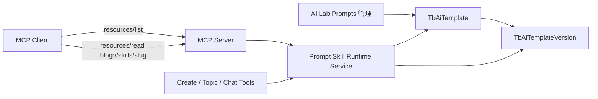

# MCP Prompt Skills 动态资源改造

## 状态

🚧 进行中

## 背景与目标

当前 MCP 在 `src/app/api/mcp/route.ts` 中通过 `src/lib/docs-resources.ts` 读取 `docs/reference/writing-style-guide.md`，并固定注册为 `blog://writing_style`。这条链路将写作规范绑定在文件系统、固定函数和固定 URI 上，无法复用 AI Lab 已有的 Prompt / Skill 管理、版本、状态和 slug 能力。

AI Lab 已经具备以下基础能力：

- `TbAiTemplate` / `TbAiTemplateVersion` 管理模板身份、版本和正文。
- `type=skill` 区分可按需加载的 Skill。
- `status=ACTIVE` 和当前版本状态控制运行时可用性。
- `listAiTemplates`、`loadAgentPromptSkillTemplate` 等服务支持列表和按 slug 加载。
- 新的博客写作规范已录入，slug 为 `blog-writing-style-guide`。

本次改造目标是让 MCP 自动暴露提示词管理模块中的全部可用 Skill，移除 `docs-resources.ts` 和文件系统写作指南的运行时依赖，并保留按需加载能力。

## 核心决策

### 1. Skill 使用 MCP Resource，不使用 MCP Prompt

Prompt Skill 本质是模型按任务需要读取的参考资料或方法论，适合映射为 MCP Resource。MCP Prompt 更适合用户主动选择的工作流入口，例如“按博客规范创建文章”，不适合作为 Skill 存储层的通用映射。

第一阶段只实现 Resource。后续如果需要固定创作流程，可以单独增加 MCP Prompt，但 Prompt 仍通过 Skill 服务加载正文，不保存另一份内容。

### 2. 全量可发现，正文按需加载

“加载所有 Skills”定义为：所有符合条件的 Skill 都能通过 MCP `resources/list` 被客户端发现，而不是在 MCP Server 初始化时读取并拼接所有正文。

原因：

- 避免 Skill 数量增长后占用大量 token。
- 避免每次 MCP 请求都读取全部 LongText 正文。
- 保持与 Create / Topic / Chat Agent 当前“metadata 发现 + slug 懒加载”的模式一致。
- Skill 在后台激活、归档或切换版本后，无需修改 MCP 代码。

### 3. MCP 可见性规则

第一阶段的默认规则：

- 模板 `type` 必须为 `skill`。
- 模板 `status` 必须为 `ACTIVE`。
- `current_version` 对应版本必须存在且状态为 `ACTIVE`。
- 默认允许全部合法 scope：`system`、`chat`、`create_agent`、`topic_agent`、`content`。
- MCP 请求仍必须通过现有 Bearer Token / OAuth 认证。

如果未来存在不应暴露给 MCP 客户端的内部 Skill，再引入 `metadata_json.mcp.exposed=false` 作为显式关闭开关。当前阶段不使用默认关闭，避免每新增一个 Skill 都重复配置发布标记。

## 资源模型

### Skill 索引资源

固定资源：

```text
blog://skills
```

返回 `application/json`，只包含 metadata，不包含正文。建议结构：

```json
{
  "skills": [
    {
      "slug": "blog-writing-style-guide",
      "name": "博客写作风格指南",
      "description": "创建或修改博客文章前加载，用于约束真实、口语化的博客写作风格。",
      "scope": "content",
      "version": 1,
      "uri": "blog://skills/blog-writing-style-guide"
    }
  ]
}
```

### Skill 正文资源模板

动态资源模板：

```text
blog://skills/{slug}
```

通过 `ResourceTemplate` 的 `list` 回调枚举所有 ACTIVE Skill，使客户端执行 `resources/list` 时可以直接看到每个具体 Skill URI。读取时按 slug 查询当前激活版本，并返回 `text/markdown`。

`blog-writing-style-guide` 对应：

```text
blog://skills/blog-writing-style-guide
```

### 旧资源兼容

旧 URI：

```text
blog://writing_style
```

本次实施已确认直接删除旧资源，不保留兼容层。数据库 Prompt 版本和仓库代码均未发现仍引用该 URI 的调用方。

## 推荐架构



## 服务层设计

不建议让 MCP Route 直接组合 Prisma 查询，也不建议直接复用面向后台分页列表的 `listAiTemplates`。应在 `src/services/ai-template/` 中补充统一的运行时 Skill 查询能力，并让 MCP 与 Agent 工具共享。

建议增加：

```typescript
interface PromptSkillRuntimePolicy {
  allowedScopes: readonly AiTemplateScope[];
  allowedSlugs?: readonly string[];
}

async function listActivePromptSkills(
  policy: PromptSkillRuntimePolicy,
): Promise<PromptSkillSummary[]>

async function loadActivePromptSkill(
  slug: string,
  policy: PromptSkillRuntimePolicy,
): Promise<LoadedPromptSkill>
```

设计要求：

- `listActivePromptSkills` 不使用后台接口的 `MAX_PAGE_SIZE=100` 限制，必须能返回全部可用 Skill。
- 列表只选择必要字段和当前激活版本 metadata，不读取全部正文。
- `loadActivePromptSkill` 统一校验 type、模板状态、scope、当前版本和版本状态。
- `loadAgentPromptSkillTemplate` 可以改为调用这套基础能力，避免 MCP 与 Agent 的可用性判断发生漂移。
- slug 必须经过现有 `normalizeTemplateSlug` 处理，但 URI 变量仍需先安全解码。

建议新增独立策略：

```typescript
export const MCP_PROMPT_SKILL_POLICY = {
  allowedScopes: AI_TEMPLATE_SCOPES,
} satisfies PromptSkillRuntimePolicy;
```

## MCP 注册设计

建议把 Skill 资源注册从体积较大的 `src/app/api/mcp/route.ts` 中拆出：

```text
src/services/mcp/
├── register-prompt-skill-resources.ts
└── prompt-skill-policy.ts
```

入口只保留：

```typescript
registerPromptSkillResources(server, ensureAuth);
```

注册器负责：

1. 注册 `blog://skills` 索引资源。
2. 注册 `blog://skills/{slug}` 资源模板。
3. 在模板 `list` 回调中返回所有 Skill 的具体 URI 和 metadata。
4. 在 read 回调中认证、解析 slug、加载当前激活正文。
5. 不注册旧 `blog://writing_style` 兼容资源。

## 创作工具联动

只把 Skill 暴露为 Resource，并不能保证所有 MCP 客户端都会在创建文章前主动读取。为提高命中率，建议同步调整文章创建和更新工具的 description：

- 创建或大幅改写文章前，先读取 `blog://skills`。
- 根据 Skill description 选择相关 Skill。
- 博客文章默认读取 `blog://skills/blog-writing-style-guide`。
- 不要把完整 Skill 正文硬编码到工具 description。

这部分只增加引导，不改变文章 API 参数和权限模型。

## `blog-writing-style-guide` 数据约定

建议后台记录满足：

| 字段 | 推荐值 |
|------|--------|
| `slug` | `blog-writing-style-guide` |
| `type` | `skill` |
| `scope` | `content` |
| `status` | `ACTIVE` |
| 当前版本状态 | `ACTIVE` |
| `description` | 明确写出“创建或修改博客文章前加载，用于博客文章写作风格约束” |
| 正文格式 | Markdown；如无运行时变量，不使用 mustache 变量 |

`description` 会进入 Skill 列表，是模型判断是否读取该 Skill 的主要依据，因此不能只写“写作规范”这类过短描述。

## 缓存与一致性

第一阶段不建议给 Skill 列表和正文增加 Next.js 长缓存。AI Lab 激活版本后，MCP 应在下一次 `resources/list` 或 `resources/read` 时直接生效。

如果后续数据库压力明显，再增加短 TTL 缓存，并在以下操作后主动失效：

- 创建或更新 Skill metadata。
- 创建并激活新版本。
- 切换当前版本。
- 修改 ACTIVE / DRAFT / ARCHIVED 状态。

## 错误处理

- slug 不存在：返回资源不存在错误，不回退到默认文件内容。
- 模板不是 `skill`：拒绝读取。
- 模板或当前版本非 ACTIVE：拒绝读取。
- URI slug 非法：拒绝读取，不进行模糊匹配。
- 数据库异常：记录 MCP request id 和 slug，不记录正文。

移除默认写作指南 fallback 是本次迁移的重要目标。后台数据缺失应成为可观测的配置错误，而不是静默使用代码中的旧内容。

## 文件变更范围

预计涉及：

- 修改 `src/services/ai-template/index.ts`，抽取统一运行时 Skill 列表和加载服务。
- 新增 `src/services/mcp/register-prompt-skill-resources.ts`。
- 修改 `src/app/api/mcp/route.ts`，使用动态 Skill 注册器。
- 修改文章创建、更新相关 MCP 工具 description，引导读取 Skill。
- 删除 `src/lib/docs-resources.ts`。
- 确认无引用后删除或归档 `docs/reference/writing-style-guide.md`。
- 更新 `docs/designs/ai/ai-lab.md` 的 MCP 暴露说明。
- 更新 `docs/reference/mcp-collections-guide.md` 或拆出独立 MCP 资源指南。
- 更新 `docs/designs/infra/rbac-migration-inventory.md` 中 `writing_style` 资源记录。

## 实施步骤

1. [x] 校验 `blog-writing-style-guide` 的 type、scope、模板状态和当前版本状态。
2. [x] 抽取 `listActivePromptSkills` / `loadActivePromptSkill` 统一服务。
3. [x] 让现有 Agent Prompt Skill 工具复用统一服务并通过现有检查。
4. [x] 注册 `blog://skills` 索引和 `blog://skills/{slug}` 资源模板。
5. [x] 确认删除 `blog://writing_style`，不保留兼容资源。
6. [x] 更新文章创建、更新工具 description。
7. [x] 删除 `docs-resources.ts` 及旧文件系统 fallback。
8. [x] 更新相关设计、参考和 RBAC 盘点文档。
9. [x] 完成 MCP SDK 内存传输协议级测试。
10. [ ] 使用部署后的真实 MCP 客户端完成认证链路联调。

## 验证清单

- [ ] `resources/list` 能返回全部符合规则的 ACTIVE Skill，数量超过 100 时也不截断。
- [ ] 列表包含 `blog://skills/blog-writing-style-guide`。
- [ ] `resources/read` 能返回该 Skill 当前激活版本的 Markdown 正文。
- [ ] AI Lab 激活新版本后，下一次读取立即返回新版本。
- [ ] DRAFT / ARCHIVED Skill 不出现在列表中，也不能通过 URI 直接读取。
- [ ] 非 `skill` 模板不能通过 Skill URI 读取。
- [ ] 未认证请求仍返回现有 OAuth / Bearer 认证错误。
- [ ] Create / Topic / Chat Agent 的 `list_prompt_skills` 和 `load_prompt_skill_template` 行为不回退。
- [ ] 删除 `docs-resources.ts` 后全仓库无残留 import。
- [ ] 若保留兼容 URI，`blog://writing_style` 与新 slug 返回相同正文。
- [ ] `pnpm typecheck`、相关测试和 `pnpm build` 通过。

## 风险评估

### MCP 客户端不会主动读取 Resource

通过资源 description 和文章工具 description 提示读取。若真实客户端仍不稳定，再增加面向用户的 MCP Prompt 工作流，而不是把 Skill 正文硬编码进工具。

### 暴露内部 Skill

当前设计会向已认证 MCP 用户暴露所有 ACTIVE Skill。若后台未来出现敏感内部 Skill，应增加 `metadata_json.mcp.exposed=false` 或收窄 MCP scope 策略。

### Agent 与 MCP 规则漂移

列表与加载校验必须下沉到共享服务，MCP Route 和 Agent Tool 只传策略，不能各自实现一套状态判断。

### 旧客户端依赖固定 URI

通过短期兼容资源平滑迁移；如果确认没有使用方，则直接删除旧 URI，避免长期维护别名。

## 推荐验收结果

改造完成后，在 AI Lab 新增并激活任意 `type=skill` 模板，MCP 无需发布新代码即可通过 `resources/list` 发现，并通过 `blog://skills/{slug}` 读取当前版本正文。`blog-writing-style-guide` 成为博客写作风格的唯一数据源，文件系统读取工具和默认 fallback 被彻底移除。
