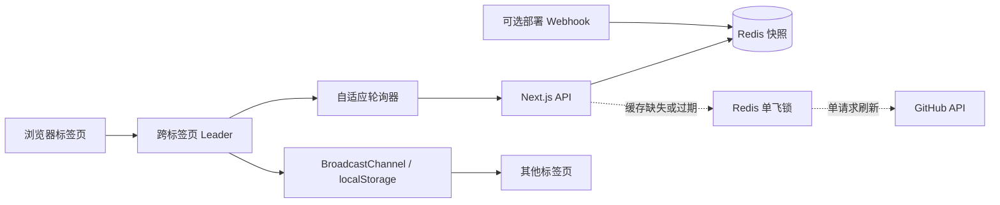

# 博客轮询削峰与缓存防击穿改造

## 状态

🚧 进行中（代码改造与静态验证已完成，待浏览器多标签页及生产缓存联调）

## 问题分析

首页部署历史、提交活动、部署状态、站内通知和 AI 任务通知原先使用多套固定轮询。固定周期会造成慢请求重叠、多标签页重复请求、Redis 缓存失效时集中回源 GitHub，以及空闲任务状态频繁查询数据库。

## 解决方案

- 首页装饰数据首次加载，恢复可见且超过新鲜度阈值后才刷新。
- 部署状态、通知摘要和任务通知使用自适应频率、随机抖动、失败退避与单请求锁。
- 同一浏览器通过 Web Locks 选主，并使用 localStorage 租约作为降级方案。
- 部署历史和提交活动由页面接口分别按 5 分钟、10 分钟新鲜度懒加载，不依赖部署方式初始化。
- 部署 webhook 仅维护实时状态和本次部署增量，查询时与 GitHub 完整历史按 runId 合并。
- Redis 快照缺失或过期时使用带所有权令牌的短期锁进行单次 GitHub 回源。

## 实施步骤

1. [x] 实现通用自适应轮询与跨标签页选主协调器。
2. [x] 改造首页、部署状态、通知摘要和任务通知频率。
3. [x] 实现 Redis 单飞缓存、部署历史原子增量和 GitHub 历史合并。
4. [x] 为部署历史、提交活动增加页面请求触发的 TTL 刷新和缓存响应头。
5. [x] 增加并发缓存、抖动、退避、租约和历史合并测试。
6. [ ] 浏览器验证匿名首页、登录双标签页和任务完成通知。
7. [ ] 生产环境验证 Redis 清空、TTL 过期和 GitHub 不可用降级路径。

## 风险评估

- 本地应急部署没有 webhook 时，首次页面请求仍会从 GitHub 懒加载完整历史；该应急部署事件本身只有主动上报时才会出现在部署记录中。
- Web Locks 不可用时依赖 12 秒 localStorage 租约，leader 异常退出后最多延迟一个租约周期接管。
- 公共缓存可能带来秒级部署状态延迟，部署中仍保持 10 秒应用层检查并允许 15 秒共享缓存。

## 验证清单

- [x] `pnpm test:polling`
- [x] `pnpm typecheck`
- [x] `pnpm lint`
- [x] `pnpm build`
- [ ] 匿名首页 10 分钟网络请求验收
- [ ] 登录双标签页 leader 接管验收
- [ ] AI 任务空闲、运行中和完成状态验收
- [ ] Redis 清空后页面懒加载及 GitHub stale 降级联调

## 完成后处理

生产联调完成后，将稳定的自适应轮询、跨标签页协调和 Redis 单飞缓存约定整理到 `docs/designs/infra/`，再从计划索引移除本文档。
