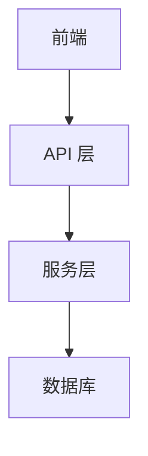
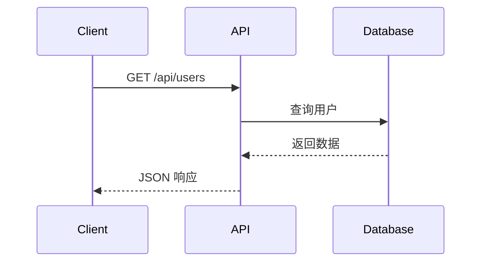
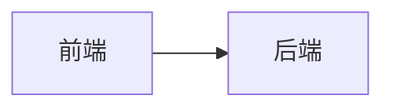

# 代码风格规范

## 命名规范

### 文件命名
- **组件文件**：PascalCase
  - ✅ `Header.tsx`, `UserProfile.tsx`
  - ❌ `header.tsx`, `userProfile.tsx`
- **工具函数文件**：kebab-case
  - ✅ `auth.ts`, `format-date.ts`
  - ❌ `Auth.ts`, `formatDate.ts`
- **路由文件**：Next.js 约定
  - ✅ `page.tsx`, `layout.tsx`, `route.ts`, `loading.tsx`
- **类型定义文件**：kebab-case 或 camelCase
  - ✅ `user.dto.ts`, `apiTypes.ts`

### 变量和函数命名
- **变量/函数**：camelCase
  - ✅ `getUserInfo`, `isLoading`, `userData`
  - ❌ `getUser_Info`, `is_loading`, `user_data`
- **常量**：UPPER_SNAKE_CASE
  - ✅ `API_BASE_URL`, `MAX_RETRY_COUNT`
  - ❌ `apiBaseUrl`, `max-retry-count`
- **类/接口/类型**：PascalCase
  - ✅ `User`, `ApiResponse`, `UserService`
  - ❌ `user`, `apiResponse`, `userService`
- **布尔值**：使用清晰前缀
  - ✅ `isLoading`, `hasPermission`, `canEdit`, `shouldUpdate`
  - ❌ `loading`, `permission`, `editable`, `update`
- **私有属性**：前缀下划线（可选）
  - ✅ `_privateMethod`, `_internalState`
  - ✅ 使用 `#` 私有字段（ES2022）

### 命名语义
- **函数名使用动词开头**：
  - ✅ `getUser()`, `validateInput()`, `calculateTotal()`
  - ❌ `user()`, `inputValidation()`, `total()`
- **布尔值使用 is/has/can/should 前缀**：
  - ✅ `isActive`, `hasError`, `canDelete`, `shouldFetch`
- **避免缩写**：
  - ✅ `message`, `error`, `response`
  - ❌ `msg`, `err`, `resp`
- **事件处理器使用 on 前缀**：
  - ✅ `onClick`, `onSubmit`, `onSuccess`

## TypeScript 规范

### 严格模式
项目已启用 TypeScript 严格模式：
- 禁止使用 `any`
- 必须明确类型定义
- 使用 `unknown` 代替 `any` 处理未知类型

### 禁止使用 any
**项目严格要求禁止使用 `any` 类型**。所有类型必须明确定义。

#### 错误处理类型定义
使用正确的类型替代 `any`：

```typescript
// ✅ 正确：使用 AxiosError 类型
import axios, { type AxiosError } from 'axios';

try {
  await axios.put('/api/post/fav', data);
} catch (error) {
  const axiosError = error as AxiosError<{ message?: string }>;
  const errorMsg = axiosError.response?.data?.message || '操作失败';
}

// ❌ 错误：使用 any 类型
try {
  await axios.put('/api/post/fav', data);
} catch (error) {
  const errorMsg = (error as any)?.response?.data?.message || '操作失败';
}
```

#### 未知类型处理
使用 `unknown` 代替 `any`：

```typescript
// ✅ 正确：使用 unknown
function processData(data: unknown) {
  if (typeof data === 'string') {
    return data.toUpperCase();
  }
  throw new Error('Invalid data type');
}

// ❌ 错误：使用 any
function processData(data: any) {
  return data.toUpperCase();
}
```

#### 第三方库类型
为第三方库定义类型：

```typescript
// ✅ 正确：定义接口类型
interface ExternalApiResponse {
  id: number;
  name: string;
}

const data = await fetch('/api/external').then(r => r.json() as ExternalApiResponse);

// ❌ 错误：使用 any
const data = await fetch('/api/external').then(r => r.json() as any);
```

### 类型导入优先
优先使用 `type` 导入类型：
```typescript
// ✅ 推荐
import type { User, Post } from '@/types'
import { getUser } from '@/services/user'

// ❌ 避免
import { User, Post, getUser } from '@/services/user'
```

### 类型定义位置
- **简单类型**：内联定义
```typescript
interface ButtonProps {
  text: string
  onClick: () => void
}
```
- **共享类型**：放在 `src/dto/` 或 `src/types/`
```typescript
// src/dto/user.dto.ts
export interface UserDTO {
  id: string
  name: string
  email: string
}
```

### 泛型命名
- 单个类型参数：`T`
- 多个类型参数：`T`, `U`, `V` 或有意义的前缀
  - ✅ `TOptions`, `TResponse`, `TData`
  - ❌ `Type1`, `Type2`

## 导入顺序

按照以下顺序组织导入：

```typescript
// 1. React 和 Next.js 核心
import React, { useState, useEffect } from 'react'
import { useRouter, useParams } from 'next/navigation'

// 2. 第三方库
import axios from 'axios'
import dayjs from 'dayjs'
import { debounce } from 'lodash-es'

// 3. UI 组件库
import { Button, Form, Input } from 'antd'
import { UserOutlined } from '@ant-design/icons'

// 4. 项目内部模块（按路径层级）
import { getUserInfo } from '@/services/user'
import { formatDate } from '@/lib/date'
import { useAuth } from '@/hooks/useAuth'

// 5. 类型定义
import type { User, ApiResponse } from '@/types'

// 6. 样式文件
import styles from './UserProfile.module.css'
```

## 路径别名

### 使用 @ 别名
- 使用 `@/*` 指向 `./src/*`
- 禁止使用相对路径引用跨目录模块

```typescript
// ✅ 正确
import { User } from '@/types'
import { getUserById } from '@/services/user'
import { Button } from '@/components/Button'

// ❌ 错误
import { User } from '../../types'
import { getUserById } from '../../../services/user'
import { Button } from '../../../../components/Button'
```

### 同目录导入
同目录下的文件可以使用相对路径：
```typescript
// ✅ 可接受
import { HelperComponent } from './HelperComponent'
import { sharedUtils } from '../shared/utils'
```

## 注释规范

### JSDoc 注释
所有函数、类、组件必须包含 JSDoc 注释：

```typescript
/**
 * 获取用户信息
 * @param userId 用户ID
 * @returns 用户信息对象
 * @throws {Error} 当用户不存在时抛出错误
 */
async function getUserInfo(userId: string): Promise<User> {
  const user = await prisma.tbUser.findUnique({ where: { id: userId } })
  if (!user) {
    throw new Error('用户不存在')
  }
  return user
}
```

### 组件注释
```typescript
/**
 * 用户资料卡片组件
 * @param user - 用户数据
 * @param onEdit - 编辑回调函数
 */
interface UserProfileProps {
  user: User
  onEdit?: (user: User) => void
}

export function UserProfile({ user, onEdit }: UserProfileProps) {
  // ...
}
```

### 行内注释
- 使用 `//` 进行行内注释
- 复杂逻辑必须添加说明
- 注释说明"为什么"而不是"是什么"

```typescript
// ✅ 好的注释
// 使用 Redis 缓存用户信息，减少数据库查询
const cachedUser = await redis.get(`user:${userId}`)

// ✅ 好的注释（解释原因）
// 使用防抖避免频繁调用 API
const debouncedSearch = debounce(handleSearch, 300)

// ❌ 不好的注释（重复代码信息）
// 获取用户信息
const user = await getUserInfo(userId)
```

### TODO 注释
使用 `TODO:` 标记待办事项：
```typescript
// TODO: 添加错误处理
// TODO(laoer): 优化性能，考虑使用缓存
// FIXME: 修复在 Safari 上的兼容性问题
```

## 代码格式

### 缩进
- 使用 2 空格缩进
- 不使用 Tab

### 分号
- 不使用分号（ESLint 配置）

### 引号
- 优先使用单引号
- JSX 中使用双引号

```typescript
// ✅ 正确
const message = 'Hello World'
const element = <div className="container">Content</div>

// ❌ 错误
const message = "Hello World"
const element = <div className='container'>Content</div>
```

### 行宽
- 建议最大行宽：100 字符
- 超长行考虑拆分

## 代码组织

### 文件内部顺序
```typescript
// 1. 导入
import ...

// 2. 类型定义
interface Props ...
type State ...

// 3. 常量
const CONSTANT_VALUE = ...

// 4. 组件/函数
function Component() {
  // 4.1 Hooks（按顺序）
  const [state, setState] = useState()
  const ref = useRef()
  const router = useRouter()

  // 4.2 派生状态
  const derivedValue = useMemo(() => ..., [])

  // 4.3 事件处理器
  const handleClick = () => ...

  // 4.4 副作用
  useEffect(() => ..., [])

  // 4.5 渲染
  return ...
}

// 5. 导出
export default Component
```

## 错误处理

### Try-Catch
所有可能抛出错误的异步操作必须包含 try-catch：

```typescript
// ✅ 正确
try {
  const result = await someAsyncOperation()
  return result
} catch (error) {
  console.error('操作失败:', error)
  throw new Error('处理数据时发生错误')
}

// ❌ 错误
const result = await someAsyncOperation()
return result
```

### 错误日志
- 使用 `console.error` 记录错误
- 包含上下文信息

## 性能优化建议

### 避免不必要的重新渲染
```typescript
// ✅ 使用 useCallback 稳定函数引用
const handleClick = useCallback(() => {
  doSomething(value)
}, [value])

// ✅ 使用 useMemo 缓存计算结果
const expensiveValue = useMemo(() => {
  return computeExpensiveValue(data)
}, [data])
```

### 列表渲染
```typescript
// ✅ 始终提供 key
{items.map(item => (
  <Item key={item.id} data={item} />
))}
```

## 文档图表规范

### 使用 Mermaid 图表

项目所有文档中的图表必须使用 **Mermaid** 格式，禁止使用 ASCII 艺术图或图片。

#### 优势
- ✅ **可维护性强** - 文本格式易于修改和版本控制
- ✅ **跨平台渲染** - GitHub、GitLab、VSCode 原生支持
- ✅ **自动布局** - 无需手动调整节点位置
- ✅ **专业美观** - 自动样式和主题支持

#### 支持的图表类型

| 图表类型 | Mermaid 关键字 | 使用场景 |
|---------|---------------|---------|
| 流程图 | `flowchart` | 业务流程、架构图、算法流程 |
| 时序图 | `sequenceDiagram` | API 调用、组件交互 |
| 状态图 | `stateDiagram` | 状态机、生命周期 |
| 类图 | `classDiagram` | 类结构、接口关系 |
| 实体关系图 | `erDiagram` | 数据库关系 |
| 甘特图 | `gantt` | 项目计划、时间线 |
| 饼图 | `pie` | 数据占比 |
| 用户旅程图 | `journey` | 用户体验流程 |

#### 使用示例

```markdown
## 系统架构



## API 调用流程


```

#### 编写规范

1. **图表类型选择**
   - 架构图：使用 `flowchart TB`（从上到下）
   - 横向流程：使用 `flowchart LR`（从左到右）
   - 交互流程：使用 `sequenceDiagram`
   - 数据关系：使用 `erDiagram`

2. **节点命名**
   ```mermaid
   flowchart TB
       A[用户登录] --> B{验证成功?}
       B -->|是| C[进入系统]
       B -->|否| D[显示错误]
   ```

3. **子图分组**
   ```mermaid
   flowchart TB
       subgraph 前端层
           A[React 组件]
           B[状态管理]
       end

       subgraph 后端层
           C[API 路由]
           D[服务层]
       end

       A --> C
   ```

4. **样式定制**
   ```mermaid
   flowchart TB
       A[开始] --> B[结束]

       style A fill:#e1f5e1,stroke:#2ecc71
       style B fill:#ffe1e1,stroke:#e74c3c
   ```

#### 禁止使用的图表格式

```markdown
❌ ASCII 艺术图
+----------+     +----------+
|  前端    | --> |  后端    |
+----------+     +----------+

❌ 图片格式


✅ Mermaid 格式

```

#### 最佳实践

- **保持简洁**：每个图表只展示一个核心概念
- **添加标题**：图表前添加描述性标题
- **使用中文**：节点名称使用中文便于理解
- **层级清晰**：使用子图分组相关组件
- **颜色辅助**：关键节点使用颜色突出

#### 在线编辑器

使用 [Mermaid Live Editor](https://mermaid.live) 进行可视化编辑和预览。
